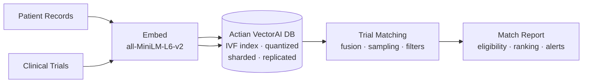

Clinical trials depend on recruiting the right patients. For example, a Phase III oncology trial needs patients with a specific cancer type, stage, biomarker profile, and treatment history. A cardiovascular study requires participants within a certain age range, with specific comorbidities, and without contraindicated medications. Today, matching is mostly manual — clinical research coordinators sift through patient registries, electronic health records, and referral networks using rigid keyword queries.

Medical language is highly variable. For example, "HER2-positive metastatic breast carcinoma with prior trastuzumab therapy" describes the same condition as "advanced HER2+ breast cancer, previously treated with Herceptin." Rule-based systems need explicit mappings for every synonym and abbreviation. Semantic search handles this naturally because both descriptions produce nearby vectors in embedding space.

This tutorial shows how to build an AI clinical trial patient-matching agent using Actian VectorAI DB to rank candidates by medical profile similarity — even when patient records use different terminology for the same condition.

The agent covers the following topics:

- Comparing Euclidean and Manhattan distance metrics for medical text similarity and understanding when to use each.
- Applying scalar quantization at the collection level for memory-efficient storage of large patient registries.
- Using IVF indexing (`IndexType.INDEX_TYPE_IVF_FLAT`) with `IvfConfigDiff` as an alternative to HNSW for high-volume datasets.
- Configuring `VectorParams` with `datatype` and `on_disk` for storage optimization.
- Running server-side fusion using the `Fusion` enum to merge results from multiple prefetch stages without client-side code.
- Using random sampling via the `Sample` enum to retrieve random patient profiles for exploratory sampling.
- Applying selective payload retrieval with `WithPayloadSelector` to return only specific fields (for example, exclude PHI).
- Applying selective vector retrieval with `WithVectorsSelector` for named vector subsets.
- Creating UUID payload indexes with `UuidIndexParams` for patient and trial identifier lookups.
- Configuring sharding, replication, and on-disk payload for production-grade deployments.
- Tuning search with `indexed_only` and `ivf_nprobe` in `SearchParams`.

---

## Architecture Overview

Patient records and trial eligibility criteria are embedded into the same vector space, enabling semantic matching across collections. The pipeline supports multi-metric search, scalar quantization for performance, and production sharding for scale.



---

## Environment Setup

Install the required packages before running any of the tutorial code.

### Install Python Dependencies

The following command installs the SDK and the embedding model library. Running it confirms that both packages are available before any other step in this tutorial.

```bash
pip install actian-vectorai sentence-transformers
```

### What This Installs

The two packages cover database operations and text embedding generation.

- `actian-vectorai` — Official Python SDK for Actian VectorAI DB (IVF indexing, scalar quantization, server-side fusion, sharding, gRPC transport).
- `sentence-transformers` — For generating text embeddings with `all-MiniLM-L6-v2`.

---

## Implementation

This section walks through the full pipeline from collection setup to trial matching, covering each step in order.

### Step 1: Import Dependencies and Configure

The following block imports every module used in this tutorial — including quantization types, IVF config, distance metrics, `Fusion` and `Sample` enums, selective retrieval selectors, UUID index params, and sharding types — then sets the connection and collection constants and loads the embedding model.

```python
import asyncio
import uuid

# Core SDK: client, distance metrics, filtering, index param types, and data structures
from actian_vectorai import (
    AsyncVectorAIClient,
    Distance,
    Field,
    FieldType,
    FilterBuilder,
    DatetimeIndexParams,
    IntegerIndexParams,
    UuidIndexParams,
    PointStruct,
    PrefetchQuery,
    SearchParams,
    VectorParams,
)

# Collection-level config: HNSW tuning, scalar quantization for memory compression
from actian_vectorai.models.collections import (
    HnswConfigDiff,
    ScalarQuantization,
    QuantizationConfig,
)

# Selective retrieval: control which payload fields and vectors are returned
from actian_vectorai.models.points import (
    ScoredPoint,
    WithPayloadSelector,
    WithVectorsSelector,
)

# Enums for vector precision, fusion strategy, index type, quantization, and sharding
from actian_vectorai.models.enums import (
    Datatype,
    Fusion,
    IndexType,
    QuantizationType,
    Sample,
    ShardingMethod,
)
from actian_vectorai.models.vde import IvfConfigDiff
from sentence_transformers import SentenceTransformer

# Connection and collection settings
SERVER = "localhost:50051"
PATIENT_COLLECTION = "Clinical-Patients"
TRIAL_COLLECTION = "Clinical-Trials"
EMBED_MODEL = "all-MiniLM-L6-v2"
EMBED_DIM = 384

model = SentenceTransformer(EMBED_MODEL)

print(f"VectorAI Server: {SERVER}")
print(f"Patient collection: {PATIENT_COLLECTION}")
print(f"Trial collection: {TRIAL_COLLECTION}")
print(f"Embedding model: {EMBED_MODEL} ({EMBED_DIM}-dim)")
```
This tutorial introduces several imports not seen in previous tutorials:

- `ScalarQuantization`, `QuantizationConfig` — Collection-level vector compression.
- `WithPayloadSelector`, `WithVectorsSelector` — Fine-grained control over returned fields.
- `Datatype` — Vector storage precision (`Float32`, `Float16`, `Uint8`).
- `Fusion`, `Sample` — Server-side fusion and random sampling enums.
- `IndexType` — Alternative index algorithms (IVF, FLAT, HNSW).
- `IvfConfigDiff` — IVF index tuning parameters.
- `UuidIndexParams` — UUID field indexing.
- `ShardingMethod` — Collection sharding strategy.

#### Expected Output

Running this block sets the server address, collection names, and embedding dimension as constants, then initializes the `all-MiniLM-L6-v2` model. All four `print` statements confirm the active configuration values before any collection or data operation is performed.

```text
VectorAI server: localhost:50051
Patient collection: Clinical-Patients
Trial collection: Clinical-Trials
Embedding model: all-MiniLM-L6-v2 (384-dim)
```

### Step 2: Define Embedding Helpers

The following two functions wrap the `SentenceTransformer` model. The rest of the pipeline calls these helpers instead of using the model directly, keeping embedding logic in one place.

```python
def embed_text(text: str) -> list[float]:
    """Generate a 384-dimensional embedding for a text string."""
    return model.encode(text).tolist()

def embed_texts(texts: list[str]) -> list[list[float]]:
    """Batch-embed multiple text strings."""
    return model.encode(texts).tolist()
```

### Step 3: Create the Patient Collection

The following `create_patient_collection` function creates a collection with Euclidean distance, Int8 scalar quantization, explicit Float32 vector precision, and two-shard automatic distribution. Running `asyncio.run(create_patient_collection())` provisions the collection with all of these settings and prints a confirmation summary.

```python
async def create_patient_collection():
    async with AsyncVectorAIClient(url=SERVER) as client:
        await client.collections.get_or_create(
            name=PATIENT_COLLECTION,
            # Euclidean distance with explicit Float32 precision, stored in RAM
            vectors_config=VectorParams(
                size=EMBED_DIM,
                distance=Distance.Euclid,
                on_disk=False,
                datatype=Datatype.Float32,
            ),
            hnsw_config=HnswConfigDiff(m=16, ef_construct=128),
            # Int8 scalar quantization: 4x memory reduction with 99th-percentile calibration
            quantization_config=QuantizationConfig(
                scalar=ScalarQuantization(
                    type=QuantizationType.Int8,
                    quantile=0.99,
                    always_ram=True,
                ),
            ),
            # Production sharding: 2 shards with automatic distribution
            shard_number=2,
            replication_factor=1,
            write_consistency_factor=1,
            on_disk_payload=False,
            sharding_method=ShardingMethod.Auto,
        )
    print(f"Collection '{PATIENT_COLLECTION}' ready.")
    print(f"  Distance: Euclidean")
    print(f"  Quantization: Int8 scalar (quantile=0.99, always_ram=True)")
    print(f"  Shards: 2, Replication: 1")
    print(f"  Datatype: Float32, On-disk vectors: False")

asyncio.run(create_patient_collection())
```

This collection creation combines several production-ready features: scalar quantization, explicit vector precision, sharding, and replication.

#### Scalar Quantization

`ScalarQuantization` compresses 32-bit float vectors to 8-bit integers. The table below describes each parameter and its effect.

| Parameter | Effect |
|-----------|--------|
| `type=QuantizationType.Int8` | Compress each float to 8 bits (4x memory reduction). |
| `quantile=0.99` | Use the 99th percentile for calibration (handles outliers). |
| `always_ram=True` | Keep quantized vectors in RAM even if `on_disk=True`. |

The next subsection covers the vector precision and storage options set through `VectorParams`.

#### VectorParams Fields

`datatype=Datatype.Float32` explicitly sets vector precision, and `on_disk=False` keeps vectors in memory. The table below lists the available datatypes.

| Datatype | Bits per Dimension | Use Case |
|----------|-------------------|----------|
| `Float32` | 32 | Full precision (default). |
| `Float16` | 16 | Half precision, 2x memory savings. |
| `Uint8` | 8 | Smallest, for pre-quantized vectors. |

The next subsection covers the sharding and replication parameters that make this collection production-ready.

#### Sharding and Replication

The table below describes the production deployment parameters passed to `get_or_create`.

| Parameter | Effect |
|-----------|--------|
| `shard_number=2` | Split data across 2 shards for parallelism. |
| `replication_factor=1` | Number of data copies (1 = no replication). |
| `write_consistency_factor=1` | Minimum replicas that must acknowledge a write. |
| `on_disk_payload=False` | Keep payload in memory for fast filtered search. |
| `sharding_method=ShardingMethod.Auto` | Automatic shard distribution. |

#### Expected Output

Running `create_patient_collection()` creates the collection with all of these settings applied — Euclidean distance, Int8 scalar quantization calibrated to the 99th percentile, two shards with automatic distribution, and Float32 vector precision held in RAM — then prints a summary confirming each parameter.

```text
Collection 'Clinical-Patients' ready.
  Distance: Euclidean
  Quantization: Int8 scalar (quantile=0.99, always_ram=True)
  Shards: 2, Replication: 1
  Datatype: Float32, On-disk vectors: False
```

### Step 4: Create the Trial Collection

The following `create_trial_collection` function creates a collection that uses Manhattan distance and an IVF-Flat index instead of HNSW. Running `asyncio.run(create_trial_collection())` creates the collection and prints the distance metric and index configuration.

```python
async def create_trial_collection():
    async with AsyncVectorAIClient(url=SERVER) as client:
        await client.collections.get_or_create(
            name=TRIAL_COLLECTION,
            # Manhattan (L1) distance: more robust to outlier dimensions than Euclidean
            vectors_config=VectorParams(
                size=EMBED_DIM,
                distance=Distance.Manhattan,
                on_disk=False,
            ),
            # IVF-Flat index: partitions vectors into clusters for fast approximate search
            index_type=IndexType.INDEX_TYPE_IVF_FLAT,
            ivf_config=IvfConfigDiff(
                nlist=16,
                nprobe=4,
                training_sample_size=1000,
            ),
        )
    print(f"Collection '{TRIAL_COLLECTION}' ready.")
    print(f"  Distance: Manhattan (L1 norm)")
    print(f"  Index: IVF-Flat (nlist=16, nprobe=4)")

asyncio.run(create_trial_collection())
```

This step introduces two features not covered in previous tutorials: an alternative distance metric and a different index type.

#### Manhattan Distance (L1 Norm)

Manhattan distance computes similarity as the sum of absolute differences. The table below compares the two metrics used in this tutorial. Cosine and dot product are supported but not demonstrated in this example — they are included for reference only.

| Metric | Formula | Behavior |
|--------|---------|----------|
| Euclidean (L2) | `sqrt(sum((a-b)^2))` | Penalizes large differences heavily. |
| Manhattan (L1) | `sum(abs(a-b))` | Penalizes all differences equally. |
| Cosine *(reference)* | `dot(a,b) / (norm(a)*norm(b))` | Direction only, ignores magnitude. |
| Dot *(reference)* | `dot(a,b)` | Direction and magnitude. |

Manhattan distance is more robust to outlier dimensions, which can be beneficial for medical text where some embedding dimensions may carry disproportionate noise.

#### IVF Indexing

IVF (inverted file index) is an alternative to HNSW. The table below describes each parameter.

| Parameter | Effect |
|-----------|--------|
| `IndexType.INDEX_TYPE_IVF_FLAT` | Partitions vectors into `nlist` clusters; searches `nprobe` clusters at query time. |
| `nlist=16` | Number of Voronoi partitions. |
| `nprobe=4` | Number of partitions to search (higher = more accurate, slower). |
| `training_sample_size=1000` | Number of vectors used to train cluster centroids. |

IVF is preferable to HNSW when:

- You need predictable memory usage (IVF has lower overhead than HNSW graphs).
- The dataset is large and you want fast approximate search with tunable accuracy.
- You plan to rebuild the index periodically.

#### Expected Output

Running `create_trial_collection()` provisions the `Clinical-Trials` collection with Manhattan distance and an IVF-Flat index configured with 16 Voronoi partitions and a default probe count of 4. The print statements confirm the selected distance metric and index settings upon successful creation.

```text
Collection 'Clinical-Trials' ready.
  Distance: Manhattan (L1 norm)
  Index: IVF-Flat (nlist=16, nprobe=4)
```

### Step 5: Create Payload Indexes

The following `create_indexes` function adds payload indexes across both collections — including UUID indexes, keyword filters, integer range indexes, and a datetime index. Running `asyncio.run(create_indexes())` creates all indexes and prints a confirmation for each group.

```python
async def create_indexes():
    async with AsyncVectorAIClient(url=SERVER) as client:
        # UUID index for patient identifiers (standard mode)
        await client.points.create_field_index(
            PATIENT_COLLECTION,
            field_name="patient_uuid",
            field_type=FieldType.FieldTypeUuid,
            field_index_params=UuidIndexParams(is_tenant=False, on_disk=False),
        )
        print("Index: patient_uuid (UUID)")

        # Patient payload indexes: keyword filter, integer range, and datetime ordering
        await client.points.create_field_index(
            PATIENT_COLLECTION,
            field_name="primary_condition",
            field_type=FieldType.FieldTypeKeyword,
        )
        await client.points.create_field_index(
            PATIENT_COLLECTION,
            field_name="age",
            field_type=FieldType.FieldTypeInteger,
            field_index_params=IntegerIndexParams(lookup=True, range=True),
        )
        await client.points.create_field_index(
            PATIENT_COLLECTION,
            field_name="enrolled_date",
            field_type=FieldType.FieldTypeDatetime,
            field_index_params=DatetimeIndexParams(is_principal=True),
        )
        print("Patient indexes created: primary_condition, age, enrolled_date")

        # UUID index for trial identifiers (tenant-optimized for multi-tenant filtering)
        await client.points.create_field_index(
            TRIAL_COLLECTION,
            field_name="trial_uuid",
            field_type=FieldType.FieldTypeUuid,
            field_index_params=UuidIndexParams(is_tenant=True, on_disk=False),
        )
        print("Index: trial_uuid (UUID, tenant-optimized)")

        # Trial payload indexes: keyword filters and integer range for enrollment targets
        await client.points.create_field_index(
            TRIAL_COLLECTION,
            field_name="phase",
            field_type=FieldType.FieldTypeKeyword,
        )
        await client.points.create_field_index(
            TRIAL_COLLECTION,
            field_name="therapeutic_area",
            field_type=FieldType.FieldTypeKeyword,
        )
        await client.points.create_field_index(
            TRIAL_COLLECTION,
            field_name="enrollment_target",
            field_type=FieldType.FieldTypeInteger,
            field_index_params=IntegerIndexParams(lookup=True, range=True),
        )
        print("Trial indexes created: phase, therapeutic_area, enrollment_target")

asyncio.run(create_indexes())
```

`UuidIndexParams` is a dedicated index type for UUID-formatted string fields. The table below describes its two modes.

| Parameter | Effect |
|-----------|--------|
| `is_tenant=False` | Standard UUID index, optimized for general lookups. |
| `is_tenant=True` | Tenant-optimized index, suited for multi-tenant filtering where UUIDs partition data. |

UUIDs are common in healthcare systems for patient IDs, trial IDs, and encounter IDs. A dedicated UUID index is more efficient than a generic keyword index for UUID-formatted strings.

#### Expected Output

Running `create_indexes()` registers all six payload indexes — one UUID index, one keyword index, one integer range index, and one datetime index on the patient collection, plus one tenant-optimized UUID index, two keyword indexes, and one integer range index on the trial collection — then prints a confirmation line for each group created.

```text
Index: patient_uuid (UUID)
Patient indexes created: primary_condition, age, enrolled_date
Index: trial_uuid (UUID, tenant-optimized)
Trial indexes created: phase, therapeutic_area, enrollment_target
```

### Step 6: Prepare Sample Patient and Trial Data

The following block defines the patient records and clinical trials that will be ingested in Step 7. Running it loads the data into memory and prints a count of both collections.

```python
patient_records = [
    {
        "patient_uuid": str(uuid.uuid4()),
        "profile_text": "58-year-old female with HER2-positive metastatic breast cancer, Stage IV. Prior treatment with trastuzumab and pertuzumab. Partial response to first-line therapy. ECOG performance status 1. No cardiac history.",
        "primary_condition": "breast_cancer",
        "age": 58,
        "sex": "female",
        "biomarkers": ["HER2+", "ER-", "PR-"],
        "prior_treatments": ["trastuzumab", "pertuzumab", "paclitaxel"],
        "ecog_status": 1,
        "enrolled_date": "2026-02-15T00:00:00Z",
        "site": "Memorial Cancer Center",
    },
    {
        "patient_uuid": str(uuid.uuid4()),
        "profile_text": "72-year-old male with non-small cell lung cancer, EGFR mutation positive (exon 19 deletion). Failed second-line osimertinib. Progressed to brain metastases. ECOG 2.",
        "primary_condition": "lung_cancer",
        "age": 72,
        "sex": "male",
        "biomarkers": ["EGFR+", "ALK-", "PD-L1 low"],
        "prior_treatments": ["osimertinib", "carboplatin", "pemetrexed"],
        "ecog_status": 2,
        "enrolled_date": "2026-01-20T00:00:00Z",
        "site": "University Medical Center",
    },
    {
        "patient_uuid": str(uuid.uuid4()),
        "profile_text": "45-year-old male with Type 2 diabetes, HbA1c 8.2%, BMI 34. Currently on metformin and GLP-1 receptor agonist. History of mild chronic kidney disease stage 2. No cardiovascular events.",
        "primary_condition": "type2_diabetes",
        "age": 45,
        "sex": "male",
        "biomarkers": ["HbA1c 8.2%", "eGFR 75"],
        "prior_treatments": ["metformin", "semaglutide"],
        "ecog_status": 0,
        "enrolled_date": "2026-03-01T00:00:00Z",
        "site": "City General Hospital",
    },
    {
        "patient_uuid": str(uuid.uuid4()),
        "profile_text": "34-year-old female with relapsing-remitting multiple sclerosis. Two relapses in past year despite fingolimod. MRI shows new T2 lesions. Considering escalation to anti-CD20 therapy.",
        "primary_condition": "multiple_sclerosis",
        "age": 34,
        "sex": "female",
        "biomarkers": ["oligoclonal bands+", "JCV antibody-"],
        "prior_treatments": ["fingolimod", "interferon-beta"],
        "ecog_status": 1,
        "enrolled_date": "2026-02-28T00:00:00Z",
        "site": "Neuroscience Institute",
    },
    {
        "patient_uuid": str(uuid.uuid4()),
        "profile_text": "65-year-old male with heart failure, ejection fraction 30%, NYHA Class III. Implantable cardioverter-defibrillator in place. On guideline-directed medical therapy including sacubitril-valsartan.",
        "primary_condition": "heart_failure",
        "age": 65,
        "sex": "male",
        "biomarkers": ["BNP elevated", "troponin normal"],
        "prior_treatments": ["sacubitril-valsartan", "carvedilol", "spironolactone"],
        "ecog_status": 2,
        "enrolled_date": "2026-01-10T00:00:00Z",
        "site": "Cardiac Research Center",
    },
    {
        "patient_uuid": str(uuid.uuid4()),
        "profile_text": "51-year-old female with advanced HER2-positive breast cancer. Failed T-DM1 and tucatinib combination. Brain metastases stable on stereotactic radiosurgery. ECOG 1.",
        "primary_condition": "breast_cancer",
        "age": 51,
        "sex": "female",
        "biomarkers": ["HER2+", "ER+", "PR-"],
        "prior_treatments": ["T-DM1", "tucatinib", "capecitabine"],
        "ecog_status": 1,
        "enrolled_date": "2026-03-10T00:00:00Z",
        "site": "Memorial Cancer Center",
    },
]

clinical_trials = [
    {
        "trial_uuid": str(uuid.uuid4()),
        "criteria_text": "Phase III trial for HER2-positive metastatic breast cancer patients who have failed at least two prior HER2-targeted therapies. Must have ECOG 0-2. Excludes patients with symptomatic brain metastases or cardiac ejection fraction below 50%.",
        "trial_name": "BEACON-HER2 Phase III",
        "phase": "Phase III",
        "therapeutic_area": "oncology",
        "condition": "breast_cancer",
        "enrollment_target": 450,
        "sites": ["Memorial Cancer Center", "University Medical Center"],
        "start_date": "2026-01-01T00:00:00Z",
        "status": "recruiting",
    },
    {
        "trial_uuid": str(uuid.uuid4()),
        "criteria_text": "Phase II study of novel EGFR-targeted therapy for NSCLC patients with EGFR exon 19 deletion or L858R mutation who have progressed on osimertinib. Allows brain metastases if stable. ECOG 0-2.",
        "trial_name": "EAGLE-LUNG Phase II",
        "phase": "Phase II",
        "therapeutic_area": "oncology",
        "condition": "lung_cancer",
        "enrollment_target": 200,
        "sites": ["University Medical Center"],
        "start_date": "2025-11-15T00:00:00Z",
        "status": "recruiting",
    },
    {
        "trial_uuid": str(uuid.uuid4()),
        "criteria_text": "Phase III trial comparing novel GLP-1/GIP dual agonist versus placebo in Type 2 diabetes patients with HbA1c 7.5-10% and BMI above 30. Must have been on stable metformin for at least 3 months. Excludes CKD stage 3 or worse.",
        "trial_name": "DUAL-GLYC Phase III",
        "phase": "Phase III",
        "therapeutic_area": "endocrinology",
        "condition": "type2_diabetes",
        "enrollment_target": 800,
        "sites": ["City General Hospital", "Regional Diabetes Center"],
        "start_date": "2026-02-01T00:00:00Z",
        "status": "recruiting",
    },
    {
        "trial_uuid": str(uuid.uuid4()),
        "criteria_text": "Phase II study of anti-CD20 monoclonal antibody in relapsing-remitting multiple sclerosis patients with inadequate response to at least one disease-modifying therapy. JCV antibody negative required. Must have had at least one relapse in past 12 months.",
        "trial_name": "CLEAR-MS Phase II",
        "phase": "Phase II",
        "therapeutic_area": "neurology",
        "condition": "multiple_sclerosis",
        "enrollment_target": 150,
        "sites": ["Neuroscience Institute"],
        "start_date": "2026-03-01T00:00:00Z",
        "status": "recruiting",
    },
]

print(f"{len(patient_records)} patients and {len(clinical_trials)} trials loaded.")
```
#### Expected Output

This block defines six patient records and four clinical trial entries as Python dictionaries, with each patient carrying a free-text `profile_text` field alongside structured payload fields such as `primary_condition`, `age`, `biomarkers`, and `prior_treatments`. The final `print` statement confirms how many records of each type are held in memory before ingestion begins.

```text
6 patients and 4 trials loaded.
```

### Step 7: Ingest Data into Both Collections

The following `ingest_data` function batch-embeds patient profiles and trial criteria, upserts both sets of points into their respective collections, flushes the data to disk, and prints the final vector counts. Running `asyncio.run(ingest_data())` stores all records and confirms the totals.

```python
async def ingest_data():
    async with AsyncVectorAIClient(url=SERVER) as client:
        # Batch-embed patient profiles and build point structs with full payload
        patient_texts = [p["profile_text"] for p in patient_records]
        patient_vectors = embed_texts(patient_texts)
        patient_points = [
            PointStruct(
                id=i,
                vector=patient_vectors[i],
                payload={k: v for k, v in p.items() if k != "profile_text"} | {"profile_text": p["profile_text"]},
            )
            for i, p in enumerate(patient_records)
        ]
        await client.points.upsert(PATIENT_COLLECTION, points=patient_points)
        await client.vde.flush(PATIENT_COLLECTION)

        # Batch-embed trial criteria and upsert into the trial collection
        trial_texts = [t["criteria_text"] for t in clinical_trials]
        trial_vectors = embed_texts(trial_texts)
        trial_points = [
            PointStruct(
                id=i,
                vector=trial_vectors[i],
                payload={k: v for k, v in t.items() if k != "criteria_text"} | {"criteria_text": t["criteria_text"]},
            )
            for i, t in enumerate(clinical_trials)
        ]
        await client.points.upsert(TRIAL_COLLECTION, points=trial_points)
        await client.vde.flush(TRIAL_COLLECTION)

        p_count = await client.vde.get_vector_count(PATIENT_COLLECTION)
        t_count = await client.vde.get_vector_count(TRIAL_COLLECTION)

    print(f"Ingested {p_count} patients and {t_count} trials.")

asyncio.run(ingest_data())
```

#### Expected Output

Running `ingest_data()` batch-embeds all patient profile texts and trial criteria texts using `embed_texts`, constructs `PointStruct` objects with full payloads, upserts each set into its respective collection, and flushes both to disk. The final `get_vector_count` calls verify that all vectors have been persisted, and the print statement confirms the ingested totals for patients and trials.

```text
Ingested 6 patients and 4 trials.
```

### Step 8: Selective Payload Retrieval with WithPayloadSelector

`WithPayloadSelector` controls exactly which payload fields are returned in a search result. This is useful in healthcare contexts where query results should limit exposure of sensitive fields such as patient identifiers or free-text profiles. Note that selective payload retrieval reduces data exposure at the query level; it is not a substitute for a comprehensive data governance or compliance program.

The following two functions demonstrate the two selector modes. `search_patients_phi_safe` returns only the de-identified clinical attributes listed in the `include` selector. `search_patients_exclude_fields` returns all fields except those listed in the `exclude` selector. Running both functions with the same query and printing the payload keys shows the difference in what each mode returns.

```python
async def search_patients_phi_safe(query: str, top_k: int = 5):
    """Search patients returning only de-identified clinical attributes."""
    query_vector = embed_text(query)

    # Include-only selector: return these fields, exclude everything else
    include_selector = WithPayloadSelector(
        include=["primary_condition", "age", "sex", "biomarkers", "ecog_status", "site"],
    )

    async with AsyncVectorAIClient(url=SERVER) as client:
        results = await client.points.search(
            PATIENT_COLLECTION,
            vector=query_vector,
            limit=top_k,
            with_payload=include_selector,
        ) or []

    return results

async def search_patients_exclude_fields(query: str, top_k: int = 5):
    """Search patients excluding specific sensitive fields."""
    query_vector = embed_text(query)

    # Exclude selector: return everything except patient_uuid, profile_text, enrolled_date
    exclude_selector = WithPayloadSelector(
        exclude=["patient_uuid", "profile_text", "enrolled_date"],
    )

    async with AsyncVectorAIClient(url=SERVER) as client:
        results = await client.points.search(
            PATIENT_COLLECTION,
            vector=query_vector,
            limit=top_k,
            with_payload=exclude_selector,
        ) or []

    return results

query = "HER2 positive breast cancer patient for clinical trial matching"

include_results = asyncio.run(search_patients_phi_safe(query))
print("=== Include-Only Payload (sensitive fields excluded) ===")
for r in include_results:
    print(f"  id={r.id}  score={r.score:.4f}  keys={list(r.payload.keys())}")
    print(f"    condition={r.payload.get('primary_condition')}  age={r.payload.get('age')}  biomarkers={r.payload.get('biomarkers')}")

exclude_results = asyncio.run(search_patients_exclude_fields(query))
print("\n=== Exclude-Specific Fields ===")
for r in exclude_results:
    print(f"  id={r.id}  score={r.score:.4f}  keys={list(r.payload.keys())}")
```

The table below summarizes the three selector modes available with `WithPayloadSelector`.

| Mode | Effect |
|------|--------|
| `WithPayloadSelector(include=["field1", "field2"])` | Return only these fields. |
| `WithPayloadSelector(exclude=["field3", "field4"])` | Return everything except these fields. |
| `WithPayloadSelector(enable=False)` | Equivalent to `with_payload=False`. |

Selective payload retrieval is useful in healthcare for the following scenarios:

- Research queries — Include only de-identified clinical attributes (condition, age, biomarkers).
- Admin queries — Include everything.
- External API responses — Exclude `patient_uuid`, `enrolled_date`, and free-text profiles.

#### Expected Output

Running both search functions with the query `"HER2 positive breast cancer patient for clinical trial matching"` retrieves the top matching patients. The include-only run returns only the six de-identified fields listed in the selector, omitting `patient_uuid`, `profile_text`, and `enrolled_date`. The exclude run returns all fields except those three, so `prior_treatments` reappears in the key list. The two result sets show the same patients and scores but different sets of payload keys.

```text
=== Include-Only Payload (sensitive fields excluded) ===
  id=0  score=5.2341  keys=['primary_condition', 'age', 'sex', 'biomarkers', 'ecog_status', 'site']
    condition=breast_cancer  age=58  biomarkers=['HER2+', 'ER-', 'PR-']
  id=5  score=5.8923  keys=['primary_condition', 'age', 'sex', 'biomarkers', 'ecog_status', 'site']
    condition=breast_cancer  age=51  biomarkers=['HER2+', 'ER+', 'PR-']

=== Exclude-Specific Fields ===
  id=0  score=5.2341  keys=['primary_condition', 'age', 'sex', 'biomarkers', 'prior_treatments', 'ecog_status', 'site']
  id=5  score=5.8923  keys=['primary_condition', 'age', 'sex', 'biomarkers', 'prior_treatments', 'ecog_status', 'site']
```

### Step 9: Selective Vector Retrieval with WithVectorsSelector

`WithVectorsSelector` controls which vectors are returned with each result point — useful when working with named vector collections or when you want to reduce response payload size.

The following code retrieves the same set of patient points twice: once with full vectors included and once without. The output shows the difference in `vector_dim` between the two calls, which illustrates the bandwidth savings from omitting vectors when they are not needed.

```python
async def get_patients_with_vector_control(patient_ids: list[int]):
    async with AsyncVectorAIClient(url=SERVER) as client:
        # Retrieve points with full vectors included
        with_all_vectors = await client.points.get(
            PATIENT_COLLECTION,
            ids=patient_ids,
            with_payload=WithPayloadSelector(include=["primary_condition"]),
            with_vectors=WithVectorsSelector(enable=True),
        )

        # Retrieve the same points without vectors to save bandwidth
        without_vectors = await client.points.get(
            PATIENT_COLLECTION,
            ids=patient_ids,
            with_payload=WithPayloadSelector(include=["primary_condition"]),
            with_vectors=WithVectorsSelector(enable=False),
        )

    return with_all_vectors, without_vectors

with_vec, without_vec = asyncio.run(get_patients_with_vector_control([0, 1, 2]))

print("=== With Vectors ===")
for p in with_vec:
    vec = p.vector if isinstance(p.vector, list) else []
    print(f"  id={p.id}  condition={p.payload.get('primary_condition')}  vector_dim={len(vec)}")

print("\n=== Without Vectors ===")
for p in without_vec:
    vec = p.vector if isinstance(p.vector, list) else []
    print(f"  id={p.id}  condition={p.payload.get('primary_condition')}  vector_dim={len(vec)}")
```

`WithVectorsSelector` supports three modes. For collections with named vectors, `include` lets you retrieve a subset, saving bandwidth when only one vector is needed for a downstream task.

| Mode | Effect |
|------|--------|
| `WithVectorsSelector(enable=True)` | Return all vectors (same as `with_vectors=True`). |
| `WithVectorsSelector(enable=False)` | Return no vectors. |
| `WithVectorsSelector(include=["narrative"])` | Return only the specified named vectors. |

#### Expected Output

The code fetches patient points 0, 1, and 2 from the `Clinical-Patients` collection twice: once with `WithVectorsSelector(enable=True)` to include the full 384-dimensional embedding, and once with `WithVectorsSelector(enable=False)` to suppress vector retrieval entirely. Both calls include only the `primary_condition` payload field. The output below shows that the `enable=True` call returns 384-dimensional vectors while the `enable=False` call returns none, confirming the bandwidth savings when vectors are not needed downstream.

```text
=== With Vectors ===
  id=0  condition=breast_cancer  vector_dim=384
  id=1  condition=lung_cancer  vector_dim=384
  id=2  condition=type2_diabetes  vector_dim=384

=== Without Vectors ===
  id=0  condition=breast_cancer  vector_dim=0
  id=1  condition=lung_cancer  vector_dim=0
  id=2  condition=type2_diabetes  vector_dim=0
```

### Step 10: Search with IVF-Specific Parameters

When using IVF indexes, `SearchParams` supports `ivf_nprobe` and `indexed_only` for fine-grained control over accuracy and coverage. The following function overrides the collection's default `nprobe` value and restricts the search to fully indexed segments. Running `asyncio.run(search_trials_ivf_tuned(...))` returns trials ranked by Manhattan distance using those overridden parameters.

```python
async def search_trials_ivf_tuned(query: str, top_k: int = 5):
    query_vector = embed_text(query)

    # Override IVF defaults: search 8 partitions instead of 4, skip unindexed segments
    params = SearchParams(
        ivf_nprobe=8,
        indexed_only=True,
    )

    async with AsyncVectorAIClient(url=SERVER) as client:
        results = await client.points.search(
            TRIAL_COLLECTION,
            vector=query_vector,
            limit=top_k,
            with_payload=True,
            params=params,
        ) or []

    return results

results = asyncio.run(search_trials_ivf_tuned(
    "Clinical trial for EGFR mutant lung cancer after osimertinib progression"
))

print("=== IVF-Tuned Trial Search (nprobe=8, indexed_only=True) ===")
for r in results:
    print(f"  id={r.id}  score={r.score:.4f}  trial={r.payload.get('trial_name')}  phase={r.payload.get('phase')}")
```

The table below describes the IVF-specific `SearchParams` fields used here.

| Parameter | Default | Effect |
|-----------|---------|--------|
| `ivf_nprobe` | Collection default | Override the number of IVF partitions to search at query time. |
| `indexed_only` | `False` | If `True`, skip unindexed segments (vectors not yet assigned to IVF clusters). |

`ivf_nprobe=8` searches twice as many partitions as the collection default (`nprobe=4`), improving recall at the cost of latency. `indexed_only=True` ensures only properly indexed vectors are searched — useful during bulk ingestion when some vectors have not yet been assigned to clusters.

#### Expected Output

The function embeds the query `"Clinical trial for EGFR mutant lung cancer after osimertinib progression"`, searches the `Clinical-Trials` collection with `nprobe=8` and `indexed_only=True`, and returns the top trials ranked by Manhattan distance. The EAGLE-LUNG trial scores lowest (most similar) because its criteria text closely matches the EGFR progression query, while BEACON-HER2 ranks second despite being an oncology trial for a different condition.

```text
=== IVF-Tuned Trial Search (nprobe=8, indexed_only=True) ===
  id=1  score=4.1234  trial=EAGLE-LUNG Phase II  phase=Phase II
  id=0  score=6.8921  trial=BEACON-HER2 Phase III  phase=Phase III
```

### Step 11: Server-Side Fusion with the Fusion Enum

Instead of merging results in client code, the `query` endpoint supports server-side fusion via the `Fusion` enum. The fusion strategy is passed directly in the `query` parameter — for example, `query={"fusion": Fusion.RRF}` — while the `prefetch` list supplies the individual result sets to merge. The following function issues two prefetch stages — one filtered to breast cancer patients and one unfiltered — and merges them on the server using RRF. Running `asyncio.run(server_side_fusion_search(...))` returns patients ranked by their fused RRF score without any client-side merge code.

```python
async def server_side_fusion_search(query: str, top_k: int = 5):
    query_vector = embed_text(query)

    # Two prefetch stages: one filtered to oncology, one unfiltered
    filter_oncology = FilterBuilder().must(Field("primary_condition").eq("breast_cancer")).build()
    filter_all = None

    async with AsyncVectorAIClient(url=SERVER) as client:
        # Server-side RRF merges both prefetch result sets without client-side code
        results = await client.points.query(
            PATIENT_COLLECTION,
            query={"fusion": Fusion.RRF},
            prefetch=[
                PrefetchQuery(
                    query=query_vector,
                    filter=filter_oncology,
                    limit=20,
                ),
                PrefetchQuery(
                    query=query_vector,
                    filter=filter_all,
                    limit=20,
                ),
            ],
            limit=top_k,
            with_payload=WithPayloadSelector(include=["primary_condition", "age", "biomarkers", "ecog_status"]),
        )

    return results

results = asyncio.run(server_side_fusion_search(
    "HER2 positive breast cancer patient failed prior targeted therapy"
))

print("=== Server-Side Fusion (RRF) ===")
for r in results:
    print(f"  id={r.id}  score={r.score:.4f}  condition={r.payload.get('primary_condition')}  age={r.payload.get('age')}")
```

The table below contrasts client-side and server-side fusion approaches.

| Approach | Where Fusion Happens | API |
|----------|---------------------|-----|
| Client-side | Python SDK | `reciprocal_rank_fusion([results_a, results_b])` |
| Server-side | VectorAI DB server | `query(query={"fusion": Fusion.RRF}, prefetch=[...])` |

Server-side fusion is more efficient because:

- Results never leave the server until after fusion, reducing network overhead.
- The server can optimize the merge internally.
- The approach works with any number of prefetch stages.

The `Fusion` enum has two values: `Fusion.RRF` (reciprocal rank fusion) and `Fusion.DBSF` (distribution-based score fusion).

Breast cancer patients score highest in the output because they appear in both the filtered and unfiltered prefetch stages.

#### Expected Output

The function searches the `Clinical-Patients` collection with the query `"HER2 positive breast cancer patient failed prior targeted therapy"`. The first prefetch stage is filtered to `primary_condition == breast_cancer`, and the second is unfiltered. Server-side RRF merges both result sets by rank position without any client-side code. Breast cancer patients receive boosted RRF scores because they rank highly in both stages, placing them at the top of the fused results. Only `primary_condition`, `age`, `biomarkers`, and `ecog_status` are returned in the payload.

```text
=== Server-Side Fusion (RRF) ===
  id=0  score=0.0323  condition=breast_cancer  age=58
  id=5  score=0.0294  condition=breast_cancer  age=51
  id=1  score=0.0189  condition=lung_cancer  age=72
```

### Step 12: Random Sampling with the Sample Enum

The `Sample` enum enables random point retrieval — useful for selecting audit samples or spot-checking data quality. Random sampling retrieves points without any vector similarity scoring, so the results are non-deterministic and differ on each call. The following code calls `random_patient_sample` twice with the same parameters. Because each call returns a different random set, the two outputs together confirm that sampling is non-deterministic.

```python
async def random_patient_sample(sample_size: int = 3):
    """Retrieve random patients without vector similarity ranking."""
    async with AsyncVectorAIClient(url=SERVER) as client:
        # Sample.Random returns random points, useful for audits and data validation
        results = await client.points.query(
            PATIENT_COLLECTION,
            query={"sample": Sample.Random},
            limit=sample_size,
            with_payload=WithPayloadSelector(
                include=["primary_condition", "age", "sex", "site"],
            ),
        )

    return results

# Run twice to demonstrate that each call returns a different random set
print("=== Random patient sample (run 1) ===")
sample1 = asyncio.run(random_patient_sample(3))
for r in sample1:
    print(f"  id={r.id}  condition={r.payload.get('primary_condition')}  age={r.payload.get('age')}  site={r.payload.get('site')}")

print("\n=== Random patient sample (run 2) ===")
sample2 = asyncio.run(random_patient_sample(3))
for r in sample2:
    print(f"  id={r.id}  condition={r.payload.get('primary_condition')}  age={r.payload.get('age')}  site={r.payload.get('site')}")
```

`Sample.Random` retrieves random points from the collection without any vector similarity scoring. The table below shows how it differs from the other query modes.

| Mode | Behavior |
|------|----------|
| `search(vector=...)` | Returns points ranked by vector similarity. |
| `query(query={"order_by": ...})` | Returns points sorted by a payload field. |
| `query(query={"sample": Sample.Random})` | Returns random points with no ranking. |

Random sampling is useful in clinical research for the following purposes:

- Quality audits — Randomly sample records for review.
- Data validation — Spot-check random entries for data integrity.
- Exploratory analysis — Retrieve a random subset without any bias from similarity ranking.

#### Expected Output

Running the sample function twice retrieves three patients at random from the `Clinical-Patients` collection on each call, applying no vector similarity scoring. The payload selector returns only `primary_condition`, `age`, `sex`, and `site` for each result. Because `Sample.Random` bypasses any ranking, the two calls return completely different patient sets, and neither order reflects medical relevance or record insertion order.

```text
=== Random patient sample (run 1) ===
  id=3  condition=multiple_sclerosis  age=34  site=Neuroscience Institute
  id=0  condition=breast_cancer  age=58  site=Memorial Cancer Center
  id=4  condition=heart_failure  age=65  site=Cardiac Research Center

=== Random patient sample (run 2) ===
  id=1  condition=lung_cancer  age=72  site=University Medical Center
  id=5  condition=breast_cancer  age=51  site=Memorial Cancer Center
  id=2  condition=type2_diabetes  age=45  site=City General Hospital
```

### Step 13: Compare Distance Metrics — Euclidean vs Manhattan

Different distance metrics produce different similarity rankings for the same query. The following function runs the same query against the patient collection (Euclidean) and the trial collection (Manhattan) and returns both result sets so the score ranges can be compared directly.

```python
async def compare_distance_metrics(query: str, top_k: int = 5):
    """Run the same query against Euclidean (patients) and Manhattan (trials) collections."""
    query_vector = embed_text(query)

    async with AsyncVectorAIClient(url=SERVER) as client:
        # Patient collection uses Euclidean (L2) distance
        euclid_results = await client.points.search(
            PATIENT_COLLECTION,
            vector=query_vector,
            limit=top_k,
            with_payload=WithPayloadSelector(include=["primary_condition", "age"]),
        ) or []

        # Trial collection uses Manhattan (L1) distance
        manhattan_results = await client.points.search(
            TRIAL_COLLECTION,
            vector=query_vector,
            limit=top_k,
            with_payload=WithPayloadSelector(include=["trial_name", "phase"]),
        ) or []

    return euclid_results, manhattan_results

query = "Advanced breast cancer with HER2 targeted therapy"
euclid, manhattan = asyncio.run(compare_distance_metrics(query))

print("=== Euclidean distance (patient collection) ===")
for r in euclid:
    print(f"  id={r.id}  score={r.score:.4f}  condition={r.payload.get('primary_condition')}  age={r.payload.get('age')}")

print("\n=== Manhattan distance (trial collection) ===")
for r in manhattan:
    print(f"  id={r.id}  score={r.score:.4f}  trial={r.payload.get('trial_name')}  phase={r.payload.get('phase')}")
```

For the same query and embeddings, the metrics differ as follows:

- Euclidean — Absolute distance in vector space. Lower scores mean more similar. Sensitive to magnitude differences.
- Manhattan — Sum of absolute differences. Lower scores mean more similar. Less sensitive to outlier dimensions than Euclidean.

The two collections use different distance metrics and contain different data (patients vs trials), so the score ranges are not directly comparable. The purpose of this step is to observe how each metric's formula produces a different numeric scale for the same underlying query vector.

#### Expected Output

The function embeds the query `"Advanced breast cancer with HER2 targeted therapy"` once and uses the resulting vector to search both collections. The patient collection uses Euclidean distance and returns patients ranked by L2 norm, while the trial collection uses Manhattan distance and returns trials ranked by L1 norm. The output shows Euclidean scores in the 5–8 range and Manhattan scores in the 40–60 range — the same query vector produces numeric scales that differ by roughly an order of magnitude because each formula accumulates distance differently across 384 dimensions.

```text
=== Euclidean distance (patient collection) ===
  id=0  score=5.2341  condition=breast_cancer  age=58
  id=5  score=5.8923  condition=breast_cancer  age=51
  id=1  score=8.1234  condition=lung_cancer  age=72

=== Manhattan distance (trial collection) ===
  id=0  score=42.1234  trial=BEACON-HER2 Phase III  phase=Phase III
  id=1  score=58.9012  trial=EAGLE-LUNG Phase II  phase=Phase II
```

### Step 14: Build the Trial Matching Engine

The following `evaluate_eligibility` function applies four rule-based checks to each trial returned by semantic search: condition match, ECOG status, site availability, and trial recruiting status. It computes a match score as the percentage of checks passed, then sorts results with eligible trials first.

Note that this eligibility engine is a simplified demonstration. Real clinical trial inclusion and exclusion criteria cover many additional factors — biomarker profiles, prior treatment sequences, organ function thresholds, geographic constraints, and more. This example should not be used as a substitute for a clinically validated matching workflow.

```python
def evaluate_eligibility(patient: dict, trial_results: list[ScoredPoint]) -> list[dict]:
    """Evaluate patient eligibility against retrieved clinical trials."""
    matches = []

    for trial in trial_results:
        tp = trial.payload or {}
        score = float(trial.score or 0.0)

        eligibility = {
            "trial_name": tp.get("trial_name"),
            "trial_uuid": tp.get("trial_uuid"),
            "phase": tp.get("phase"),
            "therapeutic_area": tp.get("therapeutic_area"),
            "similarity_score": round(score, 4),
            "checks": [],
            "eligible": True,
        }

        # Check 1: Does the patient's condition match the trial's target condition?
        condition_match = patient.get("primary_condition") == tp.get("condition")
        eligibility["checks"].append({
            "criterion": "condition_match",
            "passed": condition_match,
            "detail": f"Patient: {patient.get('primary_condition')}, Trial: {tp.get('condition')}",
        })
        if not condition_match:
            eligibility["eligible"] = False

        # Check 2: Is the patient's ECOG performance status within the required range?
        ecog = patient.get("ecog_status", 99)
        ecog_ok = ecog <= 2
        eligibility["checks"].append({
            "criterion": "ecog_status",
            "passed": ecog_ok,
            "detail": f"Patient ECOG: {ecog}, Required: 0-2",
        })
        if not ecog_ok:
            eligibility["eligible"] = False

        # Check 3: Is the trial available at the patient's site?
        trial_sites = tp.get("sites", [])
        patient_site = patient.get("site", "")
        site_match = patient_site in trial_sites
        eligibility["checks"].append({
            "criterion": "site_availability",
            "passed": site_match,
            "detail": f"Patient site: {patient_site}, Trial sites: {trial_sites}",
        })

        # Check 4: Is the trial currently recruiting?
        status = tp.get("status")
        recruiting = status == "recruiting"
        eligibility["checks"].append({
            "criterion": "trial_recruiting",
            "passed": recruiting,
            "detail": f"Trial status: {status}",
        })
        if not recruiting:
            eligibility["eligible"] = False

        # Compute match score as percentage of passed checks
        passed = sum(1 for c in eligibility["checks"] if c["passed"])
        total = len(eligibility["checks"])
        eligibility["match_score"] = round(passed / total * 100, 1)

        matches.append(eligibility)

    matches.sort(key=lambda m: (m["eligible"], m["match_score"]), reverse=True)
    return matches
```

### Step 15: Run the End-to-End Trial Matching Pipeline

The following `match_patient_to_trials` function wires the matching engine from Step 14 into a complete pipeline. For each patient, it embeds the profile text, retrieves the most similar trials via semantic search, passes those results to `evaluate_eligibility`, and prints a formatted report showing which trials the patient qualifies for and which eligibility checks passed or failed. Running the function for `patient_records[0]` and `patient_records[1]` produces one report per patient.

```python
async def match_patient_to_trials(patient: dict):
    """Embed a patient profile, retrieve similar trials, and evaluate eligibility."""
    query_vector = embed_text(patient["profile_text"])

    # Semantic search: find trials whose criteria are most similar to the patient profile
    async with AsyncVectorAIClient(url=SERVER) as client:
        trial_results = await client.points.search(
            TRIAL_COLLECTION,
            vector=query_vector,
            limit=5,
            with_payload=True,
        ) or []

    # Rule-based eligibility checks on top of semantic ranking
    matches = evaluate_eligibility(patient, trial_results)

    print(f"\n{'='*60}")
    print(f"CLINICAL TRIAL MATCHING REPORT")
    print(f"{'='*60}")
    print(f"Patient: {patient.get('primary_condition')} | Age {patient.get('age')} | {patient.get('sex')}")
    print(f"Site: {patient.get('site')}")
    print(f"Biomarkers: {patient.get('biomarkers')}")
    print(f"Prior treatments: {patient.get('prior_treatments')}")
    print(f"\nMatching Trials ({len(matches)}):\n")

    for m in matches:
        status = "ELIGIBLE" if m["eligible"] else "NOT ELIGIBLE"
        print(f"  [{status}] {m['trial_name']} ({m['phase']})")
        print(f"    Match: {m['match_score']}%  Similarity: {m['similarity_score']}")
        for c in m["checks"]:
            icon = "PASS" if c["passed"] else "FAIL"
            print(f"      [{icon}] {c['criterion']}: {c['detail']}")
        print()

asyncio.run(match_patient_to_trials(patient_records[0]))
asyncio.run(match_patient_to_trials(patient_records[1]))
```

#### Expected Output

Running the pipeline for the first two patients produces a matching report for each, showing which trials they qualify for and which eligibility checks passed or failed.

The function embeds each patient's `profile_text`, retrieves the top five semantically similar trials from `Clinical-Trials`, then passes those results to `evaluate_eligibility` for rule-based scoring. For `patient_records[0]` (a 58-year-old female with HER2-positive breast cancer at Memorial Cancer Center), BEACON-HER2 passes all four eligibility checks and receives a 100% match score, while EAGLE-LUNG fails on condition and site checks. For `patient_records[1]` (a 72-year-old male with EGFR-mutant NSCLC at University Medical Center), EAGLE-LUNG passes all four checks and is marked eligible.
```text
