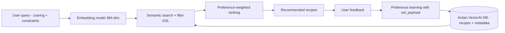

Recipe recommendation is a deceptively hard search problem. A user who says "I want something warm and comforting with chicken" is expressing a feeling, not a set of keywords. Traditional keyword search fails for four reasons:

- "Warm and comforting" is a semantic concept — it maps to soups, stews, casseroles, and curries, but none of those words appear in the query.
- Dietary restrictions create hard constraints — a gluten-free user must never see recipes with wheat flour, regardless of semantic relevance.
- Available ingredients create soft preferences — "I have chicken, garlic, and tomatoes" should boost recipes using those ingredients without excluding others.
- User taste evolves — someone who keeps rating Thai dishes highly should see more Thai cuisine in future recommendations.

This article builds an AI recipe recommendation agent where Actian VectorAI DB handles all four dimensions: semantic understanding through embeddings, hard constraints through payload filters, soft preferences through `should`/`min_should` logic, and preference learning through payload updates.

## Prerequisites

Before starting this tutorial, make sure the following are in place:

- Python 3.10 or later is installed.
- An Actian VectorAI DB instance is running locally or accessible at a network address.
- Basic familiarity with Python async/await syntax is assumed.

## Architecture overview

The system takes a natural-language craving, converts it into an embedding, and searches Actian VectorAI DB with structured filters. Results are ranked by a combination of semantic similarity and stored preferences, and feedback loops back into the database to refine future recommendations.

The diagram below shows the end-to-end data flow from the user query through embedding, search, ranking, and preference learning.



## Environment setup

Before running any code, install the Actian VectorAI Python client and the `sentence-transformers` library. The following command installs both packages into the active Python environment.

```bash
pip install actian-vectorai sentence-transformers
```

## Implementation

The following steps walk through each layer of the recommendation agent — from initial setup and data ingestion to semantic search, constraint filtering, preference learning, and administration.

### Step 1: Import dependencies and configure

The block below imports all required modules, sets the server address and collection name, loads the embedding model once so every call reuses it, and defines two helper functions for single and batch embedding. Running this block prints the active configuration and confirms the environment is ready before any further steps.

```python
import asyncio
from datetime import datetime, timezone
from sentence_transformers import SentenceTransformer

# Core Actian VectorAI client, distance metric, filter DSL, index param types, and point structures
from actian_vectorai import (
    AsyncVectorAIClient,
    Distance,
    Field,
    FieldType,
    FilterBuilder,
    IntegerIndexParams,
    TextIndexParams,
    BoolIndexParams,
    FloatIndexParams,
    PointStruct,
    PrefetchQuery,
    SearchParams,
    VectorParams,
)
# HNSW graph configuration for tuning the approximate nearest-neighbor index
from actian_vectorai.models.collections import HnswConfigDiff
# Fusion strategy (RRF) for multi-signal ranking and word-tokenizer type for text indexes
from actian_vectorai.models.enums import Fusion, TokenizerType

# Server address and collection name used throughout this guide
SERVER = "localhost:50051"
COLLECTION = "Recipe-Recommendations"
EMBED_DIM = 384  # Output dimension of all-MiniLM-L6-v2

# Load the model once at module level so it is reused on every call
model = SentenceTransformer("all-MiniLM-L6-v2")

def embed_text(text: str) -> list[float]:
    """Embed a single string and return a flat list of floats."""
    return model.encode(text).tolist()

def embed_texts(texts: list[str]) -> list[list[float]]:
    """Embed a list of strings in a single forward pass for efficiency."""
    return model.encode(texts).tolist()

print(f"Server:     {SERVER}")
print(f"Collection: {COLLECTION}")
print(f"Embedding:  all-MiniLM-L6-v2 ({EMBED_DIM}-dim)")
```

#### Expected output

Running the block above prints the server address, collection name, and embedding model name to confirm the configuration loaded correctly.

```text
Server:     localhost:50051
Collection: Recipe-Recommendations
Embedding:  all-MiniLM-L6-v2 (384-dim)
```

### Step 2: Create the recipe collection with payload indexes

Each recipe has structured metadata covering cuisine, dietary tags, ingredients, cook time, difficulty, and rating. The function below creates the vector collection with cosine similarity and a tuned HNSW graph, then registers eight payload indexes — one for each filter pattern used later in this guide. Running this function creates the collection if it does not already exist, attaches all eight indexes, and prints a confirmation message.

```python
async def create_collection():
    async with AsyncVectorAIClient(url=SERVER) as client:
        # Create the collection with cosine similarity and tuned HNSW graph parameters
        await client.collections.get_or_create(
            name=COLLECTION,
            vectors_config=VectorParams(size=EMBED_DIM, distance=Distance.Cosine),
            hnsw_config=HnswConfigDiff(m=16, ef_construct=128),
        )

        # Keyword indexes support exact-match and multi-value filters on string fields
        await client.points.create_field_index(
            COLLECTION, field_name="cuisine",
            field_type=FieldType.FieldTypeKeyword,
        )
        await client.points.create_field_index(
            COLLECTION, field_name="diet_tags",
            field_type=FieldType.FieldTypeKeyword,
        )
        await client.points.create_field_index(
            COLLECTION, field_name="meal_type",
            field_type=FieldType.FieldTypeKeyword,
        )

        # Word-tokenized text index enables ingredient keyword search (e.g. "garlic")
        await client.points.create_field_index(
            COLLECTION, field_name="ingredients_text",
            field_type=FieldType.FieldTypeText,
            field_index_params=TextIndexParams(
                tokenizer=TokenizerType.Word,
                lowercase=True,
                min_token_len=2,
            ),
        )

        # Range-enabled integer index supports numeric comparisons such as lte(30)
        await client.points.create_field_index(
            COLLECTION, field_name="cook_time_min",
            field_type=FieldType.FieldTypeInteger,
            field_index_params=IntegerIndexParams(range=True, is_principal=True),
        )

        # Principal float index supports rating threshold filters such as gte(4.0)
        await client.points.create_field_index(
            COLLECTION, field_name="rating",
            field_type=FieldType.FieldTypeFloat,
            field_index_params=FloatIndexParams(is_principal=True),
        )

        # Boolean index enables strict vegetarian-only filtering
        await client.points.create_field_index(
            COLLECTION, field_name="is_vegetarian",
            field_type=FieldType.FieldTypeBool,
            field_index_params=BoolIndexParams(),
        )
        await client.points.create_field_index(
            COLLECTION, field_name="difficulty",
            field_type=FieldType.FieldTypeKeyword,
        )

    print(f"Collection '{COLLECTION}' ready with 8 payload indexes.")

asyncio.run(create_collection())
```

The table below shows each field, the index type chosen, and the filter operation it enables.

| `Field` | Index type | Filter pattern |
|-------|-----------|---------------|
| `cuisine` | Keyword | `eq("thai")`, `any_of(["thai", "indian"])` |
| `diet_tags` | Keyword | `any_of(["gluten-free", "dairy-free"])` |
| `meal_type` | Keyword | `eq("dinner")`, `any_of(["lunch", "dinner"])` |
| `ingredients_text` | Text (word tokenizer) | `text("chicken")` — full-text substring search |
| `cook_time_min` | Integer (range) | `lte(30)`, `between(15, 45)` |
| `rating` | Float (principal) | `gte(4.0)` — ordering by rating |
| `is_vegetarian` | Bool | `eq(True)` — boolean constraint |
| `difficulty` | Keyword | `eq("easy")`, `except_of(["hard"])` |

The `TextIndexParams` configuration with the `Word` tokenizer and `lowercase=True` enables ingredient keyword search. Calling `Field("ingredients_text").text("garlic")` finds any recipe whose ingredients list contains the word "garlic", regardless of case.

### Step 3: Prepare the recipe dataset

The list below defines twelve recipes spanning multiple cuisines, meal types, and dietary profiles. Each recipe includes the structured metadata that the indexes from step 2 will filter against. Running this block loads the dataset into memory and prints a count confirming all twelve recipes are ready for ingestion.

```python
# Each dict represents one recipe with its description (used for embedding), structured metadata
# (used for payload filtering), and an ingredients list (joined into ingredients_text for text search)
recipes = [
    {
        "name": "Thai Green Curry with Chicken",
        "description": "Aromatic coconut-based curry with tender chicken, bamboo shoots, and Thai basil in a spicy green paste.",
        "cuisine": "thai",
        "meal_type": "dinner",
        "ingredients": ["chicken breast", "coconut milk", "green curry paste", "bamboo shoots", "thai basil", "fish sauce", "palm sugar", "kaffir lime leaves"],
        "diet_tags": ["gluten-free", "dairy-free"],
        "is_vegetarian": False,
        "cook_time_min": 35,
        "difficulty": "medium",
        "rating": 4.7,
        "servings": 4,
        "calories_per_serving": 380,
    },
    {
        "name": "Classic Italian Margherita Pizza",
        "description": "Thin-crust pizza with San Marzano tomato sauce, fresh mozzarella, and basil leaves baked in a hot oven.",
        "cuisine": "italian",
        "meal_type": "dinner",
        "ingredients": ["pizza dough", "san marzano tomatoes", "fresh mozzarella", "basil", "olive oil", "salt"],
        "diet_tags": ["vegetarian"],
        "is_vegetarian": True,
        "cook_time_min": 20,
        "difficulty": "medium",
        "rating": 4.5,
        "servings": 2,
        "calories_per_serving": 520,
    },
    {
        "name": "Japanese Miso Ramen",
        "description": "Rich miso-based broth with ramen noodles, soft-boiled egg, chashu pork, corn, and green onions.",
        "cuisine": "japanese",
        "meal_type": "dinner",
        "ingredients": ["ramen noodles", "miso paste", "pork belly", "soft-boiled egg", "corn", "green onions", "nori", "sesame oil"],
        "diet_tags": ["dairy-free"],
        "is_vegetarian": False,
        "cook_time_min": 60,
        "difficulty": "hard",
        "rating": 4.8,
        "servings": 2,
        "calories_per_serving": 620,
    },
    {
        "name": "Mexican Street Corn Salad",
        "description": "Grilled corn kernels tossed with lime, chili powder, cotija cheese, cilantro, and creamy mayo.",
        "cuisine": "mexican",
        "meal_type": "lunch",
        "ingredients": ["corn", "cotija cheese", "lime", "chili powder", "cilantro", "mayonnaise", "garlic"],
        "diet_tags": ["gluten-free", "vegetarian"],
        "is_vegetarian": True,
        "cook_time_min": 15,
        "difficulty": "easy",
        "rating": 4.3,
        "servings": 4,
        "calories_per_serving": 210,
    },
    {
        "name": "Indian Butter Chicken",
        "description": "Tender chicken pieces in a creamy tomato-based sauce with butter, cream, and aromatic spices like garam masala.",
        "cuisine": "indian",
        "meal_type": "dinner",
        "ingredients": ["chicken thighs", "tomato puree", "butter", "cream", "garam masala", "cumin", "garlic", "ginger", "fenugreek"],
        "diet_tags": ["gluten-free"],
        "is_vegetarian": False,
        "cook_time_min": 45,
        "difficulty": "medium",
        "rating": 4.9,
        "servings": 4,
        "calories_per_serving": 450,
    },
    {
        "name": "Mediterranean Quinoa Bowl",
        "description": "Protein-packed quinoa bowl with roasted vegetables, chickpeas, feta cheese, olives, and lemon tahini dressing.",
        "cuisine": "mediterranean",
        "meal_type": "lunch",
        "ingredients": ["quinoa", "chickpeas", "bell pepper", "cucumber", "feta cheese", "kalamata olives", "cherry tomatoes", "tahini", "lemon"],
        "diet_tags": ["vegetarian", "gluten-free"],
        "is_vegetarian": True,
        "cook_time_min": 25,
        "difficulty": "easy",
        "rating": 4.4,
        "servings": 2,
        "calories_per_serving": 340,
    },
    {
        "name": "Korean Bibimbap",
        "description": "Mixed rice bowl topped with sautéed vegetables, seasoned beef, a fried egg, and spicy gochujang sauce.",
        "cuisine": "korean",
        "meal_type": "dinner",
        "ingredients": ["rice", "beef", "spinach", "carrots", "zucchini", "bean sprouts", "egg", "gochujang", "sesame oil", "garlic"],
        "diet_tags": ["dairy-free"],
        "is_vegetarian": False,
        "cook_time_min": 40,
        "difficulty": "medium",
        "rating": 4.6,
        "servings": 2,
        "calories_per_serving": 480,
    },
    {
        "name": "French Onion Soup",
        "description": "Deeply caramelized onions simmered in rich beef broth, topped with crusty bread and melted Gruyère cheese.",
        "cuisine": "french",
        "meal_type": "dinner",
        "ingredients": ["onions", "beef broth", "butter", "gruyère cheese", "baguette", "thyme", "bay leaf", "white wine"],
        "diet_tags": [],
        "is_vegetarian": False,
        "cook_time_min": 75,
        "difficulty": "medium",
        "rating": 4.5,
        "servings": 4,
        "calories_per_serving": 310,
    },
    {
        "name": "Chickpea and Spinach Curry",
        "description": "Hearty vegan curry with chickpeas and spinach in a spiced coconut tomato sauce, served over basmati rice.",
        "cuisine": "indian",
        "meal_type": "dinner",
        "ingredients": ["chickpeas", "spinach", "coconut milk", "tomatoes", "onion", "garlic", "ginger", "cumin", "turmeric", "coriander"],
        "diet_tags": ["vegan", "gluten-free", "dairy-free", "vegetarian"],
        "is_vegetarian": True,
        "cook_time_min": 30,
        "difficulty": "easy",
        "rating": 4.6,
        "servings": 4,
        "calories_per_serving": 280,
    },
    {
        "name": "American BBQ Pulled Pork Sandwich",
        "description": "Slow-smoked pork shoulder shredded and tossed in tangy BBQ sauce, served on a brioche bun with coleslaw.",
        "cuisine": "american",
        "meal_type": "lunch",
        "ingredients": ["pork shoulder", "bbq sauce", "brioche bun", "cabbage", "apple cider vinegar", "paprika", "brown sugar", "garlic powder"],
        "diet_tags": ["dairy-free"],
        "is_vegetarian": False,
        "cook_time_min": 240,
        "difficulty": "hard",
        "rating": 4.7,
        "servings": 6,
        "calories_per_serving": 550,
    },
    {
        "name": "Greek Lemon Chicken Soup (Avgolemono)",
        "description": "Silky egg-lemon soup with tender chicken, orzo pasta, and fresh dill, a classic Greek comfort dish.",
        "cuisine": "greek",
        "meal_type": "dinner",
        "ingredients": ["chicken", "orzo", "eggs", "lemon", "chicken broth", "dill", "olive oil", "onion"],
        "diet_tags": ["dairy-free"],
        "is_vegetarian": False,
        "cook_time_min": 40,
        "difficulty": "medium",
        "rating": 4.4,
        "servings": 6,
        "calories_per_serving": 290,
    },
    {
        "name": "Vietnamese Pho Bo",
        "description": "Fragrant beef broth infused with star anise, cinnamon, and cloves, served with rice noodles, rare beef, and fresh herbs.",
        "cuisine": "vietnamese",
        "meal_type": "dinner",
        "ingredients": ["beef bones", "rice noodles", "rare beef", "star anise", "cinnamon", "cloves", "ginger", "fish sauce", "bean sprouts", "thai basil", "lime", "hoisin sauce"],
        "diet_tags": ["gluten-free", "dairy-free"],
        "is_vegetarian": False,
        "cook_time_min": 180,
        "difficulty": "hard",
        "rating": 4.9,
        "servings": 4,
        "calories_per_serving": 420,
    },
]

print(f"{len(recipes)} recipes loaded.")
```

### Step 4: Embed and ingest recipes

The function below batch-embeds all recipe descriptions in a single model forward pass, constructs one point per recipe by pairing its vector with its full metadata payload, and upserts all twelve points in one call. The ingredients list is joined into a space-separated string and stored as `ingredients_text` so the text index can match individual ingredient words. Running this function inserts all twelve recipes into the collection and prints the total stored count to confirm the write succeeded.

```python
async def ingest_recipes():
    # Embed all descriptions at once to avoid one model call per recipe
    descriptions = [r["description"] for r in recipes]
    vectors = embed_texts(descriptions)

    points = []
    for i, (recipe, vector) in enumerate(zip(recipes, vectors)):
        payload = {**recipe}
        # Convert the ingredients list to a space-separated string for the text index
        payload["ingredients_text"] = " ".join(recipe["ingredients"])

        points.append(PointStruct(id=i, vector=vector, payload=payload))

    async with AsyncVectorAIClient(url=SERVER) as client:
        await client.points.upsert(COLLECTION, points=points)
        # Flush writes to disk before reading the count to ensure accuracy
        await client.vde.flush(COLLECTION)
        count = await client.vde.get_vector_count(COLLECTION)

    print(f"Ingested {len(points)} recipes. Total in collection: {count}")

asyncio.run(ingest_recipes())
```

#### Expected output

The function batch-embeds all twelve recipe descriptions in a single model forward pass, converts each description into a 384-dimensional vector, and upserts all twelve points into the collection in one call. The `ingredients_text` field is constructed by joining each recipe's ingredient list into a space-separated string so the word-tokenized text index can match individual ingredient words. After writing, the collection is flushed to disk and the total point count is retrieved to confirm that all twelve records were stored successfully.

```text
Ingested 12 recipes. Total in collection: 12
```

### Step 5: Basic semantic search — "what am I craving?"

The simplest recommendation matches a craving to recipe descriptions by meaning alone, with no structural filters applied. The function below embeds the query string and searches the collection by cosine similarity, returning the top results ordered by score. Running this block with the query "I want something warm and comforting with a rich broth" returns broth-based recipes ranked by how closely their descriptions match the expressed feeling.

```python
async def search_by_craving(query: str, top_k: int = 5):
    """Return the top matching recipes for a natural-language craving, with no filters applied."""
    vec = embed_text(query)
    async with AsyncVectorAIClient(url=SERVER) as client:
        # Search by cosine similarity only — no payload filter is applied
        results = await client.points.search(
            COLLECTION, vector=vec, limit=top_k, with_payload=True,
        ) or []
    return results

query = "I want something warm and comforting with a rich broth"
results = asyncio.run(search_by_craving(query))

print(f"Query: {query}\n")
for r in results:
    p = r.payload
    print(f"  score={r.score:.4f}  {p['name']}  [{p['cuisine']}]  {p['cook_time_min']}min  ★{p['rating']}")
```

#### Expected output

The function embeds the natural-language craving "I want something warm and comforting with a rich broth" into a 384-dimensional vector and performs a cosine similarity search across all twelve recipes with no payload filters applied. Results are returned in descending score order, where each score reflects how closely a recipe's embedded description matches the semantic meaning of the query. Broth-based dishes such as soups, ramen, and pho rank highest because their descriptions carry similar semantic content to the expressed feeling.

```text
Query: I want something warm and comforting with a rich broth

  score=0.6812  Vietnamese Pho Bo  [vietnamese]  180min  ★4.9
  score=0.6534  French Onion Soup  [french]  75min  ★4.5
  score=0.6210  Greek Lemon Chicken Soup (Avgolemono)  [greek]  40min  ★4.4
  score=0.5890  Japanese Miso Ramen  [japanese]  60min  ★4.8
  score=0.4567  Chickpea and Spinach Curry  [indian]  30min  ★4.6
```

### Step 6: Dietary restrictions — hard constraints with `must`

Dietary restrictions are non-negotiable — a gluten-free user must never see a recipe containing gluten regardless of how high it scores semantically. The function below adds a `must` condition for each supplied diet tag, so only recipes that carry every tag are returned. Running this block with `diet_tags=["gluten-free", "dairy-free"]` returns only the recipes whose `diet_tags` array contains both labels.

```python
async def search_with_diet(query: str, diet_tags: list[str], top_k: int = 5):
    """Return semantically matched recipes that satisfy all supplied dietary constraints."""
    vec = embed_text(query)

    # Each diet tag becomes a separate must condition, enforcing AND logic across all tags
    fb = FilterBuilder()
    for tag in diet_tags:
        fb = fb.must(Field("diet_tags").any_of([tag]))
    filter_obj = fb.build()

    async with AsyncVectorAIClient(url=SERVER) as client:
        results = await client.points.search(
            COLLECTION, vector=vec, limit=top_k,
            filter=filter_obj, with_payload=True,
        ) or []
    return results

query = "spicy curry with coconut"
results = asyncio.run(search_with_diet(query, diet_tags=["gluten-free", "dairy-free"]))

print(f"Query: {query}")
print(f"Diet: gluten-free AND dairy-free\n")
for r in results:
    p = r.payload
    print(f"  score={r.score:.4f}  {p['name']}  tags={p['diet_tags']}")
```

#### Expected output

The function embeds the query "spicy curry with coconut" and applies two `must` conditions — one for `"gluten-free"` and one for `"dairy-free"` — so only recipes whose `diet_tags` array contains both labels are eligible. The filter `Field("diet_tags").any_of(["gluten-free"])` matches any recipe that carries the tag, and wrapping each tag in `must` enforces AND logic so every supplied restriction must be satisfied before a recipe can appear in the results. The scores reflect semantic closeness to the craving within the filtered candidate set.

```text
Query: spicy curry with coconut
Diet: gluten-free AND dairy-free

  score=0.7123  Thai Green Curry with Chicken  tags=['gluten-free', 'dairy-free']
  score=0.6234  Chickpea and Spinach Curry  tags=['vegan', 'gluten-free', 'dairy-free', 'vegetarian']
  score=0.4567  Vietnamese Pho Bo  tags=['gluten-free', 'dairy-free']
```

### Step 7: Available ingredients — soft preferences with `should` and `min_should`

Unlike dietary restrictions, ingredient availability is a soft preference. Recipes that use available ingredients should rank higher, but recipes that do not use them should not be excluded entirely. The function below adds a `should` condition for each ingredient and requires at least `min_match` of them to appear in the result. Running this block with `available=["chicken", "garlic", "tomatoes", "onion", "cream"]` and `min_match=2` returns recipes that contain at least two of those five ingredients, ranked by semantic similarity to the query.

```python
async def search_with_available_ingredients(
    query: str,
    available: list[str],
    min_match: int = 1,
    top_k: int = 5,
):
    """Return recipes that match the craving and contain at least min_match of the available ingredients."""
    vec = embed_text(query)

    # Each ingredient is a should condition — preferred but not required
    fb = FilterBuilder()
    for ingredient in available:
        fb = fb.should(Field("ingredients_text").text(ingredient))

    # Require at least min_match of the should conditions to be satisfied
    fb = fb.min_should(min_match)
    filter_obj = fb.build()

    async with AsyncVectorAIClient(url=SERVER) as client:
        results = await client.points.search(
            COLLECTION, vector=vec, limit=top_k,
            filter=filter_obj, with_payload=True,
        ) or []
    return results

query = "quick dinner tonight"
available = ["chicken", "garlic", "tomatoes", "onion", "cream"]

results = asyncio.run(search_with_available_ingredients(query, available, min_match=2))

print(f"Query: {query}")
print(f"Available: {available}  (at least 2 must match)\n")
for r in results:
    p = r.payload
    matched = [ing for ing in available if ing in p.get("ingredients_text", "").lower()]
    print(f"  score={r.score:.4f}  {p['name']}  matched={matched}")
```

The snippet below shows the relationship between `should` and `min_should`. Each `should` call adds one OR candidate; `min_should` sets the minimum number of those candidates that must match for a point to qualify.

```python
fb = FilterBuilder()
fb = fb.should(Field("ingredients_text").text("chicken"))   # OR candidate 1
fb = fb.should(Field("ingredients_text").text("garlic"))    # OR candidate 2
fb = fb.should(Field("ingredients_text").text("tomatoes"))  # OR candidate 3
fb = fb.min_should(2)  # The point must match at least 2 of the 3 candidates
```

The `min_should` value controls how strictly the result set matches the available pantry. The table below shows how each value changes the behavior.

| `min_should` | Behavior |
|-------------|----------|
| 1 (default) | At least one ingredient matches — very lenient. |
| 2 | At least two ingredients match — moderate. |
| 3 | All three ingredients match — strict. |

#### Expected output

The function embeds the query "quick dinner tonight" and applies a `should` condition for each of the five available ingredients — chicken, garlic, tomatoes, onion, and cream — with `min_should(2)` requiring that at least two of them appear in a recipe's `ingredients_text` field. Recipes are ranked by cosine similarity to the craving vector within the filtered candidate set, and each result shows which available ingredients it matched.

```text
Query: quick dinner tonight
Available: ['chicken', 'garlic', 'tomatoes', 'onion', 'cream']  (at least 2 must match)

  score=0.5432  Indian Butter Chicken  matched=['chicken', 'garlic', 'cream']
  score=0.4987  Chickpea and Spinach Curry  matched=['tomatoes', 'onion', 'garlic']
  score=0.4321  Greek Lemon Chicken Soup (Avgolemono)  matched=['chicken', 'onion']
```

### Step 8: Exclude allergens — `must_not` and `except_of`

Some ingredients must be strictly excluded because of allergies or strong dislikes. The function below adds a `must_not` condition for each ingredient to exclude, so no returned recipe contains any of them in its `ingredients_text` field. Running this block with `exclude=["pork", "fish sauce"]` returns only recipes whose ingredient lists contain neither ingredient, ranked by semantic similarity to the query.

```python
async def search_excluding_ingredients(
    query: str,
    exclude: list[str],
    top_k: int = 5,
):
    """Return semantically matched recipes that contain none of the excluded ingredients."""
    vec = embed_text(query)

    # Each must_not condition removes any recipe containing that ingredient
    fb = FilterBuilder()
    for ingredient in exclude:
        fb = fb.must_not(Field("ingredients_text").text(ingredient))
    filter_obj = fb.build()

    async with AsyncVectorAIClient(url=SERVER) as client:
        results = await client.points.search(
            COLLECTION, vector=vec, limit=top_k,
            filter=filter_obj, with_payload=True,
        ) or []
    return results

query = "creamy pasta or rice dish"
results = asyncio.run(search_excluding_ingredients(query, exclude=["pork", "fish sauce"]))

print(f"Query: {query}")
print(f"Excluding: pork, fish sauce\n")
for r in results:
    p = r.payload
    print(f"  score={r.score:.4f}  {p['name']}  [{p['cuisine']}]")
```

#### Expected output

The function embeds the query "creamy pasta or rice dish" and applies a `must_not` condition for each excluded ingredient — pork and fish sauce — so any recipe whose `ingredients_text` field contains either word is removed from the candidate set before scoring. The remaining recipes are ranked by cosine similarity to the craving vector, and each result shows the cuisine it belongs to. Dishes like Japanese Miso Ramen (pork belly) and Vietnamese Pho Bo (fish sauce) are absent from the results because they were eliminated by the exclusion filters.

```text
Query: creamy pasta or rice dish
Excluding: pork, fish sauce

  score=0.6012  Indian Butter Chicken  [indian]
  score=0.5781  Mediterranean Quinoa Bowl  [mediterranean]
  score=0.5432  Chickpea and Spinach Curry  [indian]
  score=0.4987  Korean Bibimbap  [korean]
  score=0.4321  Greek Lemon Chicken Soup (Avgolemono)  [greek]
```

### Step 9: Combined constraints — the full recommendation query

The function below combines all constraint types into a single search call: dietary filters, a cook-time ceiling, difficulty exclusions, a rating floor, cuisine preferences, and ingredient boosts. Running this block with `diet_tags=["gluten-free"]`, `max_cook_time=60`, `exclude_difficulty=["hard"]`, `min_rating=4.0`, and `preferred_ingredients=["chicken", "coconut milk"]` returns gluten-free dinner recipes that take no more than 60 minutes, are not hard difficulty, have a rating of at least 4.0, and preferably contain chicken or coconut milk.

```python
async def full_recommendation(
    craving: str,
    diet_tags: list[str] = None,
    max_cook_time: int = None,
    exclude_difficulty: list[str] = None,
    preferred_ingredients: list[str] = None,
    vegetarian_only: bool = False,
    min_rating: float = None,
    preferred_cuisines: list[str] = None,
    top_k: int = 5,
):
    """Return the top recommendations that satisfy all hard constraints and prefer the soft ones."""
    vec = embed_text(craving)
    fb = FilterBuilder()

    # Hard constraints — every must condition must be satisfied for a recipe to qualify
    if diet_tags:
        for tag in diet_tags:
            fb = fb.must(Field("diet_tags").any_of([tag]))

    if max_cook_time:
        fb = fb.must(Field("cook_time_min").lte(float(max_cook_time)))

    if exclude_difficulty:
        fb = fb.must_not(Field("difficulty").any_of(exclude_difficulty))

    if vegetarian_only:
        fb = fb.must(Field("is_vegetarian").eq(True))

    if min_rating:
        fb = fb.must(Field("rating").gte(min_rating))

    if preferred_cuisines:
        fb = fb.must(Field("cuisine").any_of(preferred_cuisines))

    # Soft preferences — boost recipes that match, but do not exclude those that do not
    if preferred_ingredients:
        for ing in preferred_ingredients:
            fb = fb.should(Field("ingredients_text").text(ing))
        fb = fb.min_should(1)

    filter_obj = fb.build()

    async with AsyncVectorAIClient(url=SERVER) as client:
        results = await client.points.search(
            COLLECTION, vector=vec, limit=top_k,
            filter=filter_obj, with_payload=True,
            # Higher hnsw_ef improves recall at the cost of slightly more compute
            params=SearchParams(hnsw_ef=128),
        ) or []

    return results

results = asyncio.run(full_recommendation(
    craving="something spicy and satisfying for dinner",
    diet_tags=["gluten-free"],
    max_cook_time=60,
    exclude_difficulty=["hard"],
    min_rating=4.0,
    preferred_ingredients=["chicken", "coconut milk"],
))

print("=== Full recommendation ===")
print("Craving: something spicy and satisfying")
print("Constraints: gluten-free, <=60min, not hard, rating>=4.0")
print("Preferences: chicken, coconut milk\n")

for r in results:
    p = r.payload
    print(
        f"  score={r.score:.4f}  {p['name']}  [{p['cuisine']}]  "
        f"{p['cook_time_min']}min  {p['difficulty']}  ★{p['rating']}  "
        f"tags={p['diet_tags']}"
    )
```

#### Expected output

The function runs a single search combining all constraint types. The craving "something spicy and satisfying for dinner" is embedded into a vector and used for cosine similarity scoring. Hard `must` conditions enforce that results are gluten-free, take no more than 60 minutes, exclude hard-difficulty recipes, and have a rating of at least 4.0. Soft `should` conditions boost recipes that contain chicken or coconut milk without excluding those that do not. The `hnsw_ef=128` parameter is passed to increase recall at query time. Each result shows the cuisine, cook time, difficulty, rating, and dietary tags.

```text
=== Full recommendation ===
Craving: something spicy and satisfying
Constraints: gluten-free, <=60min, not hard, rating>=4.0
Preferences: chicken, coconut milk

  score=0.6234  Thai Green Curry with Chicken  [thai]  35min  medium  ★4.7  tags=['gluten-free', 'dairy-free']
  score=0.5890  Indian Butter Chicken  [indian]  45min  medium  ★4.9  tags=['gluten-free']
  score=0.5432  Chickpea and Spinach Curry  [indian]  30min  easy  ★4.6  tags=['vegan', 'gluten-free', 'dairy-free', 'vegetarian']
```

### Step 10: Batch recommendations for meal planning

The `search_batch` method sends multiple queries to the server in a single network call instead of one call per meal. The function below builds one query per meal — each with its own craving vector, meal-type filter, cook-time limit, and optional vegetarian flag — then dispatches all queries at once. Running this block with the three meal requests defined below returns a ranked list for each meal and prints a summary of scores and cook times.

```python
async def meal_plan(meals: list[dict], top_k: int = 3):
    """Generate recommendations for multiple meals in one batch call to avoid per-query round-trips."""
    searches = []
    for meal in meals:
        vec = embed_text(meal["craving"])

        # Each meal gets its own filter: meal type, optional cook time, optional vegetarian flag
        fb = FilterBuilder()
        fb = fb.must(Field("meal_type").any_of([meal.get("meal_type", "dinner")]))
        if meal.get("max_cook_time"):
            fb = fb.must(Field("cook_time_min").lte(float(meal["max_cook_time"])))
        if meal.get("vegetarian"):
            fb = fb.must(Field("is_vegetarian").eq(True))

        searches.append({
            "vector": vec,
            "limit": top_k,
            "filter": fb.build(),
            "with_payload": True,
        })

    # All meal queries execute in a single gRPC round-trip
    async with AsyncVectorAIClient(url=SERVER) as client:
        batch_results = await client.points.search_batch(COLLECTION, searches=searches)

    return batch_results

meals = [
    {"craving": "light healthy lunch", "meal_type": "lunch", "max_cook_time": 30, "vegetarian": True},
    {"craving": "hearty warm dinner", "meal_type": "dinner", "max_cook_time": 60},
    {"craving": "quick Asian dinner", "meal_type": "dinner", "max_cook_time": 45},
]

all_results = asyncio.run(meal_plan(meals))

for i, (meal, results) in enumerate(zip(meals, all_results)):
    print(f"\nMeal {i+1}: '{meal['craving']}' ({meal['meal_type']}, <={meal['max_cook_time']}min)")
    for r in results:
        p = r.payload
        print(f"  score={r.score:.4f}  {p['name']}  {p['cook_time_min']}min  ★{p['rating']}")
```

#### Expected output

The function builds three independent search queries — one for a light vegetarian lunch under 30 minutes, one for a hearty dinner under 60 minutes, and one for a quick Asian dinner under 45 minutes — and dispatches all three in a single `search_batch` call. Each query uses its own craving vector and filter combination. Without batching, three meals require three separate network round-trips. With `search_batch`, all three queries execute in a single gRPC call, reducing latency from three round-trips to one. Each meal's results are printed with their similarity score, cook time, and rating.

```text
Meal 1: 'light healthy lunch' (lunch, <=30min)
  score=0.5678  Mediterranean Quinoa Bowl  25min  ★4.4
  score=0.4321  Mexican Street Corn Salad  15min  ★4.3

Meal 2: 'hearty warm dinner' (dinner, <=60min)
  score=0.6123  Indian Butter Chicken  45min  ★4.9
  score=0.5890  Thai Green Curry with Chicken  35min  ★4.7
  score=0.5432  Korean Bibimbap  40min  ★4.6

Meal 3: 'quick Asian dinner' (dinner, <=45min)
  score=0.5987  Thai Green Curry with Chicken  35min  ★4.7
  score=0.5654  Korean Bibimbap  40min  ★4.6
  score=0.4890  Chickpea and Spinach Curry  30min  ★4.6
```

### Step 11: User preference learning

When a user rates a recipe, its metadata can be updated to influence future recommendations without re-ingesting the entire dataset. The function below fetches the current payload for a recipe, merges the new user rating into the existing `user_ratings` map, recomputes the aggregate average across all stored ratings, and writes only the changed fields back using `set_payload`. Running this block records a rating of 5.0 from user-alice and 4.5 from user-bob for recipe 0 (Thai Green Curry), and a rating of 4.8 from user-alice for recipe 4 (Indian Butter Chicken).

```python
async def record_user_feedback(recipe_id: int, user_id: str, user_rating: float, liked: bool):
    """Merge a new user rating into the recipe's payload without overwriting unrelated fields."""
    async with AsyncVectorAIClient(url=SERVER) as client:
        # Fetch the current payload to read existing user_ratings before merging
        existing = await client.points.get(COLLECTION, ids=[recipe_id], with_payload=True)
        if not existing:
            print(f"Recipe {recipe_id} not found.")
            return

        payload = existing[0].payload or {}
        user_ratings = payload.get("user_ratings", {})
        user_ratings[user_id] = {
            "rating": user_rating,
            "liked": liked,
            "rated_at": datetime.now(timezone.utc).isoformat(),
        }

        # Recompute the aggregate average across all users after adding the new rating
        total_user_ratings = [v["rating"] for v in user_ratings.values()]
        avg_user_rating = sum(total_user_ratings) / len(total_user_ratings)

        # Write only the updated fields; all other payload fields remain unchanged
        await client.points.set_payload(
            COLLECTION,
            payload={
                "user_ratings": user_ratings,
                "avg_user_rating": avg_user_rating,
                "total_ratings": len(total_user_ratings),
            },
            ids=[recipe_id],
        )

    print(f"Recorded feedback for recipe {recipe_id}: user={user_id}, rating={user_rating}, liked={liked}")

asyncio.run(record_user_feedback(0, "user-alice", 5.0, True))
asyncio.run(record_user_feedback(0, "user-bob", 4.5, True))
asyncio.run(record_user_feedback(4, "user-alice", 4.8, True))
```

### Step 12: Personalized recommendations with preference boosting

After recording feedback, recommendations can be personalized by blending the current query vector with vectors from previously liked recipes. The function below collects the stored vectors for all recipes a user has liked, averages them into a taste-profile vector, then issues a two-stage prefetch query: one stage retrieves candidates by the current craving vector and the other by the taste-profile vector. Reciprocal Rank Fusion (RRF) then merges the two ranked lists into a single result. Running this block for "user-alice" — who liked Thai Green Curry and Butter Chicken — returns results that reflect both the current query and her recorded preferences.

```python
async def personalized_recommend(
    query: str,
    user_id: str,
    top_k: int = 5,
):
    """Blend the current craving with the user's taste history using prefetch and RRF fusion."""
    vec = embed_text(query)

    # Retrieve all recipe points, including their vectors, to find which ones this user liked
    async with AsyncVectorAIClient(url=SERVER) as client:
        all_count = await client.vde.get_vector_count(COLLECTION)
        all_points = await client.points.get(
            COLLECTION, ids=list(range(all_count)), with_payload=True, with_vectors=True,
        )

    # Collect the embedding vectors of every recipe this user has marked as liked
    liked_vectors = []
    for p in all_points:
        ur = (p.payload or {}).get("user_ratings", {})
        if user_id in ur and ur[user_id].get("liked"):
            if p.vectors:
                liked_vectors.append(p.vectors)

    # If no preference history exists, fall back to plain semantic search
    if not liked_vectors:
        async with AsyncVectorAIClient(url=SERVER) as client:
            return await client.points.search(
                COLLECTION, vector=vec, limit=top_k, with_payload=True,
            ) or []

    # Average the liked recipe vectors into a single taste-profile vector
    avg_liked = [sum(dim) / len(liked_vectors) for dim in zip(*liked_vectors)]

    # Run two prefetch queries and merge their ranked results with RRF
    async with AsyncVectorAIClient(url=SERVER) as client:
        results = await client.points.query(
            COLLECTION,
            query={"fusion": Fusion.RRF},
            prefetch=[
                PrefetchQuery(query=vec, limit=10),        # Candidates matching the current craving
                PrefetchQuery(query=avg_liked, limit=10),  # Candidates matching the historical taste profile
            ],
            limit=top_k,
            with_payload=True,
        )
    return results

results = asyncio.run(personalized_recommend("dinner tonight", user_id="user-alice"))

print("=== Personalized for user-alice ===")
print("(Alice liked Thai Green Curry and Butter Chicken)\n")
for r in results:
    p = r.payload
    print(f"  score={r.score:.4f}  {p['name']}  [{p['cuisine']}]  ★{p['rating']}")
```

The diagram below shows how the two prefetch stages combine into a single ranked result. Recipes that appear in both candidate lists — matching both the current craving and the historical taste profile — rank highest after fusion.

```text
Prefetch 1: Search by craving vector    → 10 candidates (what the user wants now)
Prefetch 2: Search by avg-liked vector  → 10 candidates (what the user has liked before)

RRF fusion: merge by rank  → top 5 (balances current craving with historical taste)
```

### Step 13: Delete user data — GDPR compliance

To honor a right-to-erasure request, all stored ratings and preference data for a specific user must be removed from every recipe in the collection. The function below iterates over all recipe points, removes the target user's entry from each `user_ratings` map using `set_payload`, recomputes the aggregate statistics from the remaining ratings, and writes the updated payload back. Running this block for "user-bob" removes his ratings from every recipe that stored them and prints the count of updated records.

```python
async def delete_user_data(user_id: str):
    """Remove all ratings and preference data for the given user from every recipe in the collection."""
    async with AsyncVectorAIClient(url=SERVER) as client:
        total = await client.vde.get_vector_count(COLLECTION)
        all_points = await client.points.get(
            COLLECTION, ids=list(range(total)), with_payload=True,
        )

        updated = 0
        for p in all_points:
            ur = (p.payload or {}).get("user_ratings", {})
            if user_id in ur:
                # Remove this user's entry, then recompute aggregates from the remaining ratings
                del ur[user_id]
                total_ratings = [v["rating"] for v in ur.values()]
                avg = sum(total_ratings) / len(total_ratings) if total_ratings else 0.0

                await client.points.set_payload(
                    COLLECTION,
                    payload={
                        "user_ratings": ur,
                        "avg_user_rating": avg,
                        "total_ratings": len(total_ratings),
                    },
                    ids=[p.id],
                )
                updated += 1

    print(f"Removed {user_id}'s data from {updated} recipes.")

asyncio.run(delete_user_data("user-bob"))
```

### Step 14: Collection administration

The function below queries four collection endpoints in sequence to gather health metrics — state, recipe count, segment count, storage bytes, and index memory usage — then flushes any pending writes to disk. Running this block after all previous steps prints a full snapshot of the collection state and confirms that buffered writes have been persisted.

```python
async def admin():
    """Print collection health metrics and flush pending writes to disk."""
    async with AsyncVectorAIClient(url=SERVER) as client:
        # Collect metadata from four separate endpoints in sequence
        count = await client.vde.get_vector_count(COLLECTION)
        state = await client.vde.get_state(COLLECTION)
        stats = await client.vde.get_stats(COLLECTION)
        info = await client.collections.get_info(COLLECTION)

        print(f"Collection: {COLLECTION}")
        print(f"  State:    {state}")
        print(f"  Recipes:  {count}")
        print(f"  Segments: {info.segments_count}")
        print(f"  Storage:  {stats.storage_bytes / 1024:.1f} KB")
        print(f"  Index:    {stats.index_memory_bytes / 1024:.1f} KB")

        # Persist any buffered writes to disk
        await client.vde.flush(COLLECTION)
        print("  Flushed to disk.")

        # Uncomment the line below to permanently remove the collection:
        # await client.collections.delete(COLLECTION)

asyncio.run(admin())
```

## Filter patterns used in this article

The table below summarizes every filter pattern used in the recommendation agent, the API call that implements it, and an example value.

| Pattern | API | Example |
|---------|-----|---------|
| Exact match | `Field("cuisine").eq("thai")` | Match one cuisine. |
| Multi-value match | `Field("cuisine").any_of(["thai", "indian"])` | Match any of several cuisines. |
| Exclusion | `Field("difficulty").except_of(["hard"])` | Exclude hard recipes. |
| Full-text ingredient search | `Field("ingredients_text").text("garlic")` | Keyword search in ingredient list. |
| Numeric range | `Field("cook_time_min").lte(30)` | Maximum cook time. |
| Float threshold | `Field("rating").gte(4.0)` | Minimum rating. |
| Boolean | `Field("is_vegetarian").eq(True)` | Vegetarian only. |
| AND logic | `FilterBuilder().must(...)` | All constraints must match. |
| OR logic | `FilterBuilder().should(...)` | Preferred but not required. |
| Minimum match | `FilterBuilder().min_should(2)` | At least N preferences match. |
| Exclusion logic | `FilterBuilder().must_not(...)` | Allergen or ingredient exclusion. |

## Actian VectorAI features used

The table below maps each Actian VectorAI feature to the API method and its role in the recommendation pipeline.

| Feature | API | Purpose |
|---------|-----|---------|
| Collection creation | `collections.get_or_create(hnsw_config=...)` | Recipe vector space. |
| Point upsert | `points.upsert()` | Store recipe embeddings with metadata. |
| Semantic search | `points.search(filter=..., params=...)` | Craving-to-recipe matching. |
| Search batch | `points.search_batch(searches=[...])` | Multi-meal planning in one call. |
| Server-side fusion | `query(query={"fusion": Fusion.RRF}, prefetch=[...])` | Personalized preference fusion. |
| Prefetch | `PrefetchQuery(query=..., limit=...)` | Multi-signal candidate retrieval. |
| Point retrieval | `points.get(with_vectors=True)` | Load liked recipe vectors. |
| Payload merge | `points.set_payload(payload=...)` | Record user ratings. |
| Keyword index | `FieldType.FieldTypeKeyword` | Cuisine, diet tags, meal type, difficulty. |
| Text index | `TextIndexParams(tokenizer=Word, lowercase=True)` | Full-text ingredient search. |
| Bool index | `BoolIndexParams()` | Vegetarian flag. |
| Integer index (range) | `IntegerIndexParams(range=True, is_principal=True)` | Cook time range queries. |
| Float index (principal) | `FloatIndexParams(is_principal=True)` | Rating threshold and ordering. |
| `any_of` filter | `Field("diet_tags").any_of([...])` | Multi-value dietary matching. |
| `except_of` filter | `Field("difficulty").except_of([...])` | Difficulty exclusion. |
| `text` filter | `Field("ingredients_text").text("garlic")` | Ingredient keyword search. |
| `should` / `min_should` | `FilterBuilder().should(...).min_should(2)` | Soft ingredient preferences. |
| `must_not` | `FilterBuilder().must_not(...)` | Allergen exclusion. |
| Vector count | `vde.get_vector_count()` | Collection statistics. |
| Collection stats | `vde.get_stats()` | Storage monitoring. |
| Flush | `vde.flush()` | Persist to disk. |

## Conclusion

Recipe recommendation is a microcosm of every real-world search problem: semantic understanding for vague queries, hard constraints for safety (allergies), soft preferences for personalization (pantry ingredients), and evolving taste. This system illustrates how each Actian VectorAI feature maps to a concrete product need:

- `text()` filters with the word tokenizer turn ingredient lists into searchable keyword fields without a separate text search engine.
- `should()` and `min_should()` express "at least 2 of these ingredients should match" — exactly the pantry-matching behavior expected from a recommendation system.
- `any_of()` and `except_of()` handle multi-value fields like dietary tags and difficulty levels naturally.
- `search_batch()` makes meal planning practical by eliminating per-query network overhead.
- Server-side RRF fusion with `prefetch` blends current cravings with historical preferences without client-side ranking logic.
- `set_payload()` enables incremental preference learning without re-ingesting the entire recipe dataset.

The result is a recommendation system where the vector database handles not just similarity search, but also filtering, fusion, and state management.

## Next steps

<CardGroup cols={2}>
 <Card title="Predicate filters deep dive" href="/academy/tutorials/predicate-filters">
 Master the full Filter DSL with all field types.
 </Card>
 <Card title="Re-ranking search results" href="/academy/tutorials/reranking-search-results">
 Improve relevance with multi-stage pipelines.
 </Card>
 <Card title="Building multi-modal systems" href="/academy/tutorials/building-multimodal-systems">
 Add recipe image search with named vectors.
 </Card>
 <Card title="Scalable agent memory" href="/academy/articles/scalable-agent-memory">
 Build persistent memory for AI agents.
 </Card>
</CardGroup>
