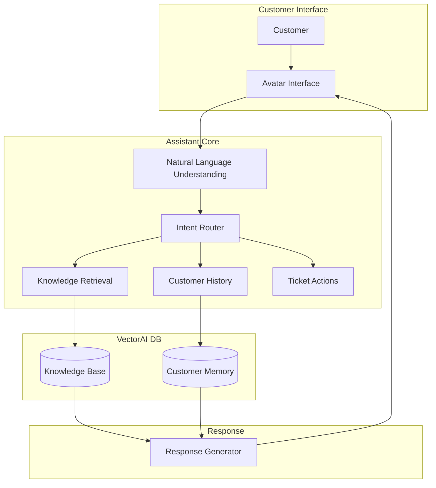

Building effective customer support systems requires more than a language model—it requires reliable access to structured knowledge and the ability to maintain conversational context over time.

An avatar-based assistant adds an interactive layer to this system, while a vector database enables fast, semantically relevant retrieval across support documentation, FAQs, and past interactions.

This guide walks through building a customer support assistant that uses VectorAI DB to power retrieval, context management, and personalized responses at scale.

---

## Prerequisites

Before starting, ensure the following are installed and configured:

- **Python 3.9+** with `pip`
- **VectorAI DB** running at `localhost:50051` (see [Docker installation](/docs/installation/docker) for setup)
- **OpenAI API key** — set as the `OPENAI_API_KEY` environment variable

Install the required Python packages:

```bash
pip install actian-vectorai openai fastapi uvicorn websockets
```

Set your OpenAI API key:

```bash
export OPENAI_API_KEY="your-api-key-here"
```

---

## System architecture

This diagram shows how the avatar assistant processes customer requests and retrieves knowledge:



---

## Concepts

Building an effective customer support assistant requires more than a chatbot interface—it depends on how knowledge, context, and decision-making are orchestrated behind the scenes.

<AccordionGroup>
  <Accordion title="Semantic knowledge retrieval">
    Instead of relying on keyword matching, the assistant retrieves information based on meaning. Support content—FAQs, documentation, and policies—is embedded and indexed in VectorAI DB, enabling the system to surface relevant answers even when queries are phrased differently.  
    This ensures users can ask questions naturally while still receiving precise, grounded responses.
  </Accordion>
  
  <Accordion title="Persistent customer context">
    Support interactions are rarely one-off. The system maintains a structured memory of each customer's history, including prior conversations, preferences, and unresolved issues.  
    By retrieving this context alongside knowledge base results, the assistant can generate responses that are personalized, consistent, and avoid redundant questioning.
  </Accordion>
  
  <Accordion title="Intent-aware routing">
    Not all queries should be handled the same way. The assistant classifies user intent and dynamically routes requests—whether to semantic search, transactional workflows (such as account actions), or human support.  
    This separation of concerns allows the system to scale while ensuring that complex or sensitive issues are handled appropriately.
  </Accordion>
</AccordionGroup>

---

## Implementation

This section details the implementation steps for building an avatar-based assistant for customer support.

### Step 1: Set up collections

Create separate collections for knowledge and customer context:

```python
import asyncio
import os
from actian_vectorai import AsyncVectorAIClient, VectorParams, Distance, PointStruct
import openai

openai.api_key = os.environ["OPENAI_API_KEY"]

async def setup_collections():
    """Initialize collections for the support assistant."""
    async with AsyncVectorAIClient("localhost:50051") as db:
        if not await db.collections.exists("support_knowledge"):
            await db.collections.create(
                "support_knowledge",
                vectors_config=VectorParams(
                    size=1536,
                    distance=Distance.Cosine
                )
            )
        
        if not await db.collections.exists("customer_memory"):
            await db.collections.create(
                "customer_memory",
                vectors_config=VectorParams(
                    size=1536,
                    distance=Distance.Cosine
                )
            )
        
        print("Collections initialized")

asyncio.run(setup_collections())
```

### Step 2: Build the knowledge base

Index support documentation and FAQs. Each document is a dictionary with the following schema:

| Field | Type | Description |
|-------|------|-------------|
| `title` | `str` | Short title for the article |
| `content` | `str` | Full text content |
| `category` | `str` | One of `"account"`, `"orders"`, or `"billing"` |
| `tags` | `List[str]` | Keywords for the article |

```python
from typing import Any, List, Dict, Optional
import uuid

client = openai.OpenAI()

def embed(texts: List[str]) -> List[List[float]]:
    """Generate embeddings for texts."""
    response = client.embeddings.create(
        input=texts,
        model="text-embedding-3-small"
    )
    return [d.embedding for d in response.data]

async def index_knowledge(documents: List[Dict[str, Any]]):
    """Index knowledge base documents.
    
    Args:
        documents: List of dicts with 'title', 'content', 'category', 'tags'
    """
    texts = [f"{d['title']}: {d['content']}" for d in documents]
    embeddings = embed(texts)
    
    points = [
        PointStruct(
            id=str(uuid.uuid4()),
            vector=emb,
            payload={
                "title": doc["title"],
                "content": doc["content"],
                "category": doc.get("category", "general"),
                "tags": doc.get("tags", []),
                "type": "knowledge"
            }
        )
        for doc, emb in zip(documents, embeddings)
    ]
    
    async with AsyncVectorAIClient("localhost:50051") as db:
        await db.points.upsert("support_knowledge", points=points)
    
    print(f"Indexed {len(points)} knowledge documents")

knowledge_base = [
    {
        "title": "How to reset your password",
        "content": (
            "To reset your password, click 'Forgot Password' on the login page, "
            "then enter your email address. Check your inbox for a reset link, "
            "click it, and set a new password."
        ),
        "category": "account",
        "tags": ["password", "login", "security"]
    },
    {
        "title": "Return policy",
        "content": (
            "Items can be returned within 30 days of purchase for a full refund. "
            "Items must be unused and in original packaging. "
            "Contact support to initiate a return and receive a shipping label."
        ),
        "category": "orders",
        "tags": ["returns", "refunds", "shipping"]
    },
    {
        "title": "Subscription billing",
        "content": (
            "Subscriptions are billed monthly on the date you signed up. "
            "View billing history under Account Settings > Billing. "
            "To cancel, navigate to Account Settings > Subscription > Cancel."
        ),
        "category": "billing",
        "tags": ["subscription", "payment", "cancel"]
    }
]

asyncio.run(index_knowledge(knowledge_base))
```

### Step 3: Implement customer memory

Track customer interactions for context:

```python
from datetime import datetime
from actian_vectorai import Filter, Conditions

async def store_interaction(
    customer_id: str,
    role: str,
    content: str,
    metadata: Optional[Dict[str, Any]] = None
):
    """Store a customer interaction.
    
    Args:
        customer_id: Customer identifier
        role: 'customer' or 'assistant'
        content: Message content
        metadata: Additional context such as intent or ticket info
    """
    embedding = embed([content])[0]
    
    point = PointStruct(
        id=str(uuid.uuid4()),
        vector=embedding,
        payload={
            "customer_id": customer_id,
            "role": role,
            "content": content,
            "timestamp": datetime.utcnow().isoformat(),
            **(metadata or {})
        }
    )
    
    async with AsyncVectorAIClient("localhost:50051") as db:
        await db.points.upsert("customer_memory", points=[point])

async def recall_customer_context(
    customer_id: str,
    query: str,
    limit: int = 5
) -> List[Dict[str, Any]]:
    """Retrieve relevant customer history.
    
    Args:
        customer_id: Customer identifier
        query: Current query for relevance
        limit: Max interactions to retrieve
    
    Returns:
        Relevant past interactions
    """
    query_vector = embed([query])[0]
    
    async with AsyncVectorAIClient("localhost:50051") as db:
        results = await db.points.search(
            "customer_memory",
            vector=query_vector,
            filter=Filter.all([
                Conditions.match("customer_id", customer_id)
            ]),
            limit=limit,
            with_payload=True
        )
    
    return [{"score": r.score, **r.payload} for r in results]
```

### Step 4: Build the support assistant

Combine knowledge retrieval, customer memory, and intent classification into a single assistant class.

The `classify_intent` method returns a JSON object with three fields:

- **`intent`** — one of `question`, `problem`, `action`, `feedback`, or `escalate`
- **`confidence`** — a float between 0.0 and 1.0
- **`category`** — maps to the knowledge base categories: `account`, `orders`, or `billing`. This value is used to filter the vector search so only relevant articles are retrieved.

```python
import json

class SupportAssistant:
    """AI-powered customer support assistant."""
    
    def __init__(self):
        self.llm = openai.OpenAI()
    
    async def search_knowledge(
        self,
        query: str,
        category: Optional[str] = None,
        limit: int = 3
    ) -> List[Dict[str, Any]]:
        """Search knowledge base for relevant information.
        
        Args:
            query: Customer's question
            category: Optional category filter (account, orders, or billing)
            limit: Max results
        
        Returns:
            Relevant knowledge articles
        """
        query_vector = embed([query])[0]
        
        conditions = []
        if category:
            conditions.append(Conditions.match("category", category))
        
        async with AsyncVectorAIClient("localhost:50051") as db:
            results = await db.points.search(
                "support_knowledge",
                vector=query_vector,
                filter=Filter.all(conditions) if conditions else None,
                limit=limit,
                with_payload=True
            )
        
        return [{"score": r.score, **r.payload} for r in results]
    
    async def classify_intent(self, message: str) -> Dict[str, Any]:
        """Classify customer intent.
        
        Args:
            message: Customer's message
        
        Returns:
            Intent classification with confidence
        """
        response = self.llm.chat.completions.create(
            model="gpt-4o-mini",
            messages=[{
                "role": "system",
                "content": """Classify the customer's intent into one of:
                - question: Asking for information
                - problem: Reporting an issue
                - action: Requesting an account action
                - feedback: Providing feedback
                - escalate: Needs human support
                
                For category, use one of: account, orders, billing.
                
                Respond with JSON: {"intent": "...", "confidence": 0.0-1.0, "category": "..."}"""
            }, {
                "role": "user",
                "content": message
            }],
            response_format={"type": "json_object"}
        )
        
        return json.loads(response.choices[0].message.content)
    
    async def should_escalate(
        self,
        message: str,
        intent: Dict[str, Any],
        knowledge_results: List[Dict[str, Any]]
    ) -> bool:
        """Determine if conversation should escalate to human.
        
        Args:
            message: Customer message
            intent: Classified intent
            knowledge_results: Retrieved knowledge
        
        Returns:
            True if should escalate
        """
        if intent["intent"] == "escalate":
            return True
        
        if intent["confidence"] < 0.5:
            return True
        
        if not knowledge_results or knowledge_results[0]["score"] < 0.6:
            return True
        
        sensitive_keywords = ["legal", "lawsuit", "complaint", "refund denied"]
        if any(kw in message.lower() for kw in sensitive_keywords):
            return True
        
        return False
    
    async def generate_response(
        self,
        customer_id: str,
        message: str
    ) -> str:
        """Generate a response to customer message.
        
        Args:
            customer_id: Customer identifier
            message: Customer's message
        
        Returns:
            Assistant's response
        """
        intent = await self.classify_intent(message)
        
        knowledge = await self.search_knowledge(
            message,
            category=intent.get("category")
        )
        
        # Check escalation before generating a response
        if await self.should_escalate(message, intent, knowledge):
            history = await recall_customer_context(customer_id, message)
            summary = f"Intent: {intent['intent']}, Message: {message}"
            ticket_id = await create_escalation_ticket(
                customer_id, summary, priority="high"
            )
            return (
                "I want to make sure you get the best help possible. "
                f"I've created support ticket {ticket_id} and a team member "
                "will follow up with you shortly."
            )
        
        history = await recall_customer_context(customer_id, message)
        
        context = "## Relevant Knowledge:\n"
        for k in knowledge:
            context += f"- {k['title']}: {k['content']}\n"
        
        context += "\n## Customer History:\n"
        for h in history:
            context += f"- [{h['role']}] {h['content']}\n"
        
        system_prompt = f"""You are a helpful customer support assistant.
        
Customer intent: {intent['intent']} (confidence: {intent['confidence']})

Use this context to help the customer:
{context}

Guidelines:
- Be friendly and professional
- Provide specific, actionable information
- If you can't help, offer to connect with a human agent
- Reference relevant policy or documentation when appropriate"""
        
        response = self.llm.chat.completions.create(
            model="gpt-4o-mini",
            messages=[
                {"role": "system", "content": system_prompt},
                {"role": "user", "content": message}
            ]
        )
        
        reply = response.choices[0].message.content
        
        await store_interaction(customer_id, "customer", message)
        await store_interaction(customer_id, "assistant", reply, {
            "intent": intent["intent"],
            "knowledge_used": [k["title"] for k in knowledge]
        })
        
        return reply
```

### Step 5: Add escalation handling

The `should_escalate` method defined in `SupportAssistant` above checks whether the conversation should be handed off. The following standalone function creates a tracking ticket when escalation is triggered. It is called from `generate_response` when escalation conditions are met.

```python
async def create_escalation_ticket(
    customer_id: str,
    conversation_summary: str,
    priority: str = "normal"
) -> str:
    """Create a ticket for human agent follow-up.
    
    Args:
        customer_id: Customer identifier
        conversation_summary: Summary of the conversation
        priority: Ticket priority
    
    Returns:
        Ticket ID
    """
    ticket_id = str(uuid.uuid4())[:8].upper()
    
    await store_interaction(
        customer_id,
        "system",
        f"Escalation ticket created: {ticket_id}",
        {
            "type": "escalation",
            "ticket_id": ticket_id,
            "priority": priority,
            "summary": conversation_summary
        }
    )
    
    return ticket_id
```

Test the assistant with a sample conversation:

```python
async def main():
    assistant = SupportAssistant()
    customer_id = "customer_123"
    
    queries = [
        "I forgot my password and can't log in",
        "How do I return the item I bought last week?",
        "When will I be charged for my subscription?"
    ]
    
    for query in queries:
        print(f"\nCustomer: {query}")
        response = await assistant.generate_response(customer_id, query)
        print(f"Assistant: {response}")

asyncio.run(main())
```

---

## Avatar integration

Connect the assistant to an avatar interface using FastAPI. The example below exposes both a REST endpoint and a WebSocket endpoint for real-time chat.

<Note>
This example omits production concerns such as authentication, rate limiting, and graceful shutdown. For a production deployment, add error handling around database and model calls, handle WebSocket disconnections with a `try/except WebSocketDisconnect` block, and implement request timeouts to avoid hanging connections.
</Note>

```python
from fastapi import FastAPI, WebSocket, WebSocketDisconnect
from pydantic import BaseModel

app = FastAPI()

class MessageRequest(BaseModel):
    customer_id: str
    message: str

assistant = SupportAssistant()

@app.post("/chat")
async def chat(request: MessageRequest):
    """REST endpoint for chat messages."""
    try:
        response = await assistant.generate_response(
            request.customer_id,
            request.message
        )
        return {"response": response}
    except Exception as e:
        return {"error": str(e)}, 500

@app.websocket("/ws/{customer_id}")
async def websocket_chat(websocket: WebSocket, customer_id: str):
    """WebSocket endpoint for real-time chat."""
    await websocket.accept()
    
    try:
        while True:
            message = await websocket.receive_text()
            response = await assistant.generate_response(customer_id, message)
            await websocket.send_text(response)
    except WebSocketDisconnect:
        pass
    except Exception as e:
        await websocket.send_text(f"An error occurred: {str(e)}")
        await websocket.close()
```

---

## Next steps

The following cards link to related articles and resources.

<CardGroup cols={2}>
    <Card title="Multi-agent systems" href="/academy/articles/building-a-reliable-multi-agent-system">
    Coordinate multiple support agents
  </Card>
    <Card title="Agent memory" href="/academy/articles/building-a-scalable-agent-memory-with-Actian-vector-AI-database">
    Scale memory for production
  </Card>
    <Card title="Similarity search" href="/academy/tutorials/similarity-search">
    Search patterns and techniques
  </Card>
  <Card title="Simple RAG pipeline" href="/academy/tutorials/simple-rag-pipeline">
    Retrieval-augmented generation
  </Card>
</CardGroup>
