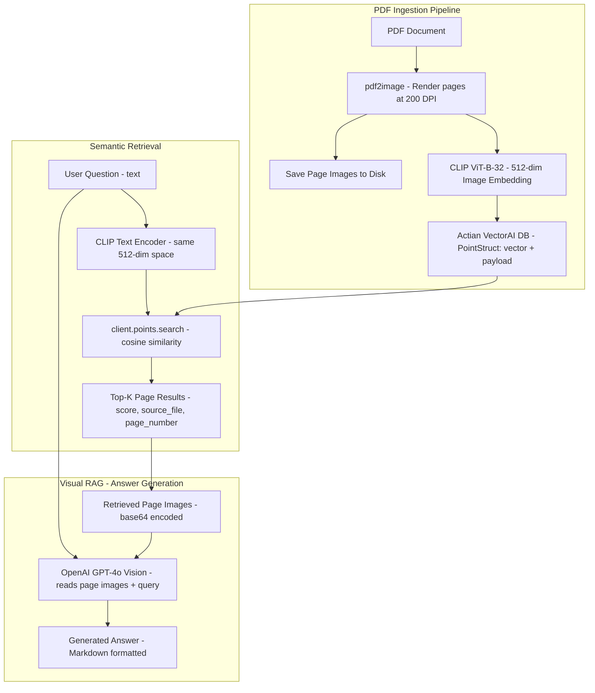

This article walks through building a visual RAG pipeline that treats each PDF page as an image, embeds it with CLIP, stores it in Actian VectorAI DB, and uses GPT-4o vision to answer questions directly from retrieved page images — no text extraction required.

Traditional document RAG systems extract text from PDFs, chunk it, embed the chunks, and then retrieve them for LLM-based answer generation. This approach works well for text-heavy documents, but fails when critical information lives in:

- Charts and graphs—revenue trends, system architecture diagrams
- Tables—financial statements, comparison matrices
- Images—product photos, screenshots, annotated figures
- Complex layouts—multi-column reports, slide decks, scanned documents

Text extraction loses this visual information entirely.

_Multivector Document Intelligence_ takes a different approach inspired by the ColPali architecture: instead of extracting text, it treats each PDF page as an image. Every page is embedded using a vision model (CLIP), stored as a vector, and retrieved based on visual and semantic similarity. A Vision-Language Model (GPT-4o) then reads the retrieved page images to generate answers.

As a result, the system can answer questions about charts, tables, diagrams, and layouts, not just plain text.

You will build the full pipeline using:

- `clip-ViT-B-32` for page-level image embeddings (512-dimensional dense vectors).
- `actian-vectorai` for vector storage and semantic retrieval.
- `openai` GPT-4o vision API for answer generation from retrieved page images.
- `pdf2image` for converting PDF pages to images.
 
## Architecture overview

The diagram below shows the three phases of the pipeline. During ingestion, each PDF page is rendered to a high-resolution image, embedded with CLIP, saved to disk, and stored as a vector in Actian VectorAI DB. During semantic retrieval, a user's text query is encoded into the same CLIP vector space and compared against stored page vectors using cosine similarity, returning the top-K most relevant pages. Finally, during visual RAG answer generation, the retrieved page images are base64-encoded and sent to GPT-4o vision alongside the original query, producing a Markdown-formatted answer grounded in the actual page content.



## Why visual document RAG

Standard text-based RAG pipelines lose critical information when documents contain visual content. This section explains where text extraction falls short and how the multivector approach addresses it.

### The problem with text extraction

Standard RAG pipelines use libraries like PyPDF2 or pdfplumber to extract text. But consider a financial report PDF:

- Page 3 has a revenue chart — text extraction produces nothing useful.
- Page 7 has a comparison table — extraction loses row/column alignment.
- Page 12 has an architecture diagram — extraction ignores it entirely.

### The multivector approach

Instead of extracting text, the pipeline:

1. Render each page as a high-resolution image (200 DPI).
2. Embed the image with CLIP — capturing visual layout, text, charts, and diagrams.
3. Store the embedding in Actian VectorAI DB with page metadata.
4. At query time, encode the text query with CLIP's text encoder (same vector space).
5. Retrieve the most visually relevant pages via cosine similarity.
6. Send the page images to GPT-4o vision to generate an answer.

With layout preserved as pixels, every element on the page — text, tables, charts, images — contributes to retrieval and answer generation.

## Environment setup

The pipeline depends on an Actian VectorAI DB instance, a Python environment, an OpenAI API key, and at least one PDF document. The sections below describe each requirement.

### Actian VectorAI DB instance

The pipeline stores and retrieves page-level CLIP vectors through a VectorAI DB server.

- A running Actian VectorAI DB server accessible over gRPC (default port `50051`)
- The server URL — for local development this is typically `http://localhost:50051`
- If you do not have an instance running yet, then follow the [installation guide](/docs/guides/index) to set one up before continuing

### Python environment

All dependencies are installed through `pip` into a standard Python environment.

- Python 3.9 or later
- `pip` for package installation

### OpenAI account

GPT-4o generates answers from the retrieved page images during the final RAG step.

- An OpenAI API key with access to `gpt-4o` (required for Step 6 answer generation)
- Set the key as an environment variable before running the tutorial (covered below)

### PDF documents

The tutorial references `annual_report.pdf` as a placeholder. Substitute any PDF you have available — the pipeline processes one or more files and renders every page as an image.

---

### Install Python packages

Install the required dependencies:

```bash
pip install actian-vectorai sentence-transformers pillow pdf2image openai
```

System dependency for PDF rendering:

```bash
# macOS
brew install poppler

# Ubuntu / Debian
sudo apt-get install -y poppler-utils
```

Set your OpenAI API key before running the answer-generation steps:

```bash
export OPENAI_API_KEY="sk-..."
```

The key is read at runtime via `os.getenv("OPENAI_API_KEY")` in Step 6. Without it, the GPT-4o vision call will raise an authentication error.

These provide:

- `actian-vectorai` — Actian VectorAI Python SDK (async client, gRPC transport)
- `sentence-transformers` — CLIP ViT-B-32 for image and text embeddings
- `pillow` — Image processing
- `pdf2image` — Converts PDF pages to PIL images (requires poppler)
- `openai` — GPT-4o vision API for answer generation

---

## Implementation

The following steps build the pipeline end-to-end, from importing dependencies to running a full RAG query against ingested documents.

### Step 1: Import dependencies and configure

Load all libraries, set the VectorAI server address and collection name, and initialize the CLIP model so every subsequent step can reference them.

```python
import base64
import hashlib
import io
import os

from openai import OpenAI
from pdf2image import convert_from_bytes
from PIL import Image
from sentence_transformers import SentenceTransformer

from actian_vectorai import (
    AsyncVectorAIClient,
    Distance,
    HnswConfigDiff,
    PointStruct,
    VectorParams,
)
from actian_vectorai.models.points import ScoredPoint

SERVER = "localhost:50051"
COLLECTION = "Multivector-DocIntel"
CLIP_DIM = 512

clip_model = SentenceTransformer("clip-ViT-B-32")

PAGE_IMAGES_DIR = "page_images"
os.makedirs(PAGE_IMAGES_DIR, exist_ok=True)

print(f"VectorAI Server: {SERVER}")
print(f"Collection: {COLLECTION}")
print(f"CLIP model loaded ({CLIP_DIM}-dim)")
```

#### Why this step matters
Every component is configured upfront. The key settings are listed below.

- `SERVER` — The Actian VectorAI gRPC endpoint (default `localhost:50051`).
- `COLLECTION` — The collection name for document page vectors.
- `clip_model` — The CLIP ViT-B-32 model that embeds both page images and text queries into the same 512-dimensional space.
- `PAGE_IMAGES_DIR` — The local directory where rendered page images are saved for later vision-language model (VLM) input.

#### Expected output

Running the configuration block prints the following to confirm each component loaded successfully:

```text
VectorAI Server: localhost:50051
Collection: Multivector-DocIntel
CLIP model loaded (512-dim)
```

### Step 2: Define embedding helpers

CLIP encodes both images and text into the same 512-dim vector space, so cosine similarity can compare a text query against page-image vectors. In practice, related text and visuals tend to sit closer together than unrelated pairs, but ranking is not guaranteed: results depend on query wording, the document set, and how strongly each page matches the query in CLIP's representation.

```python
def embed_image(image_bytes: bytes) -> list[float]:
    """Generate a 512-dim CLIP embedding for an image."""
    image = Image.open(io.BytesIO(image_bytes)).convert("RGB")
    return clip_model.encode(image).tolist()

def embed_text_clip(text: str) -> list[float]:
    """Encode text into the same 512-dim CLIP space used for page images."""
    return clip_model.encode(text).tolist()

def image_to_bytes(img: Image.Image, fmt: str = "PNG") -> bytes:
    """Convert a PIL image to bytes."""
    buf = io.BytesIO()
    img.save(buf, format=fmt)
    return buf.getvalue()

def pil_image_to_base64(img: Image.Image) -> str:
    """Convert a PIL image to a base64-encoded string for the vision API."""
    buf = io.BytesIO()
    img.save(buf, format="PNG")
    return base64.b64encode(buf.getvalue()).decode("utf-8")
```

#### Why this step matters

Each helper has a distinct role in the pipeline.

- `embed_image` — Converts a rendered page image into a CLIP vector for storage.
- `embed_text_clip` — Converts a user's text query into the same CLIP space for retrieval.
- `pil_image_to_base64` — Prepares page images for the GPT-4o vision API, which accepts base64-encoded images.

### Step 3: Initialize the VectorAI collection

Create the collection with 512-dim cosine distance and HNSW indexing.

`collections.get_or_create` takes the same `vectors_config` and optional `hnsw_config` arguments as `collections.create` in the [Create a collection](/docs/fundamentals/collections/create-collection-task) guide, including `hnsw_config=HnswConfigDiff(m=..., ef_construct=...)`. Match the `actian-vectorai` version you install to the docs or SDK release you are using.

```python
import asyncio

async def ensure_collection():
    async with AsyncVectorAIClient(url=SERVER) as client:
        await client.collections.get_or_create(
            name=COLLECTION,
            vectors_config=VectorParams(size=CLIP_DIM, distance=Distance.Cosine),
            hnsw_config=HnswConfigDiff(m=32, ef_construct=256),
        )
    print(f"Collection '{COLLECTION}' ready.")

asyncio.run(ensure_collection())
```

#### Why this step matters
The collection stores one vector per document page, configured with the following settings.

- `Distance.Cosine` — appropriate for normalized CLIP embeddings.
- `HnswConfigDiff(m=32, ef_construct=256)` — high-recall HNSW settings for accurate retrieval.

#### Expected output

If the collection already exists, then `get_or_create` is a no-op and prints the same confirmation:

```text
Collection 'Multivector-DocIntel' ready.
```

### Step 4: Ingest a PDF document

Ingestion runs end-to-end for each PDF: each page is rendered to an image, embedded with CLIP, saved to disk, and upserted into VectorAI.

```python
import hashlib

def page_point_id(filename: str, page_number: int) -> int:
    """Generate a stable, deterministic integer ID from filename + page number.

    Using a hash of filename + page_number means re-ingesting the same file
    always produces the same IDs, so upsert is idempotent and there are no
    collisions even if points are deleted or ingests run concurrently.
    """
    key = f"{filename}:{page_number}"
    return int(hashlib.md5(key.encode()).hexdigest()[:16], 16)

async def ingest_pdf(pdf_bytes: bytes, filename: str) -> int:
    """Convert PDF to page images, embed each with CLIP, store in VectorAI."""
    await ensure_collection()

    pages = convert_from_bytes(pdf_bytes, dpi=200)
    if not pages:
        return 0

    async with AsyncVectorAIClient(url=SERVER) as client:
        points = []
        for page_idx, page_img in enumerate(pages):
            page_number = page_idx + 1
            page_img_rgb = page_img.convert("RGB")
            img_bytes = image_to_bytes(page_img_rgb)

            vector = embed_image(img_bytes)

            image_filename = f"{filename}_page_{page_number}.png"
            save_path = os.path.join(PAGE_IMAGES_DIR, image_filename)
            page_img_rgb.save(save_path, "PNG")

            payload = {
                "source_file": filename,
                "page_number": page_number,
                "image_filename": image_filename,
            }

            points.append(
                PointStruct(
                    id=page_point_id(filename, page_number),
                    vector=vector,
                    payload=payload,
                )
            )

        await client.points.upsert(COLLECTION, points=points)
        await client.vde.flush(COLLECTION)
        total = await client.vde.get_vector_count(COLLECTION)

    print(f"Ingested {len(points)} pages from '{filename}'. Total: {total}")
    return len(points)
```

#### Why this step matters
The ingestion pipeline performs four operations per page.

1. **Render** — `convert_from_bytes(pdf_bytes, dpi=200)` produces high-resolution page images.
2. **Embed** — CLIP converts each page image into a 512-dim vector.
3. **Save** — The rendered image is saved to disk for later retrieval by the VLM.
4. **Store** — `client.points.upsert()` inserts the vector with metadata payload.

Each point's ID is derived from `page_point_id(filename, page_number)` — an MD5 hash of the filename and page number, truncated to a 64-bit integer. Using a deterministic hash means re-ingesting the same file always produces the same IDs, so the upsert is idempotent and there are no collisions from deletions, concurrent ingests, or re-runs. The `get_vector_count` call is no longer needed for ID generation.

The payload stores `source_file`, `page_number`, and `image_filename` so retrieved results can be traced back to their source.

#### Example usage

The following snippet reads a PDF from disk and passes it to `ingest_pdf`, which renders each page, embeds it, saves the image, and upserts the vector into the collection.

```python
with open("annual_report.pdf", "rb") as f:
    pdf_bytes = f.read()

pages_ingested = asyncio.run(ingest_pdf(pdf_bytes, "annual_report.pdf"))
```

#### Expected output

The output confirms how many pages were ingested and the running total in the collection:

```text
Ingested 24 pages from 'annual_report.pdf'. Total: 24
```

### Step 5: Semantic search for document pages

Search for pages that are visually and semantically similar to a text query.

Vector similarity search uses `AsyncVectorAIClient.points.search` with the query embedding as `vector`, a result cap as `limit`, and `with_payload=True` to return metadata. That matches the pattern and parameter table in [Similarity search basics](/academy/tutorials/similarity-search) (Step 4).

```python
async def search_pages(query_text: str, top_k: int = 5) -> list[dict]:
    """Semantic search for document pages similar to a text query."""
    query_vector = embed_text_clip(query_text)

    async with AsyncVectorAIClient(url=SERVER) as client:
        raw: list[ScoredPoint] = await client.points.search(
            COLLECTION,
            vector=query_vector,
            limit=top_k,
            with_payload=True,
        ) or []

    return [
        {
            "id": r.id,
            "score": float(r.score or 0.0),
            "source_file": (r.payload or {}).get("source_file", ""),
            "page_number": (r.payload or {}).get("page_number", 0),
            "image_filename": (r.payload or {}).get("image_filename", ""),
        }
        for r in raw
    ]
```

#### Why this step matters
The text query is encoded using CLIP's text encoder into the same 512-dim space as the page images. Actian VectorAI's `points.search` ranks pages by cosine similarity to the query vector—the mathematically nearest neighbors in that space, which approximate relevance but are not a formal guarantee of correctness.

Because CLIP was trained on image-text pairs, a query like "quarterly revenue breakdown" will often place relevant pages—those with charts or tables that match the intent—higher in the similarity list than unrelated pages. Treat top-K results as a best-effort shortlist: you may still need to tune `top_k`, rephrase queries, or add filters for production accuracy.

#### Example usage

The following snippet runs a semantic search for pages related to quarterly revenue and prints each result's page number, source file, and similarity score.

```python
results = asyncio.run(search_pages("What is the quarterly revenue?", top_k=3))
for r in results:
    print(f"  page {r['page_number']} of {r['source_file']}  score={r['score']:.4f}")
```

#### Expected output

Each result shows the page number, source file, and cosine similarity score:

```text
  page 5 of annual_report.pdf  score=0.2834
  page 3 of annual_report.pdf  score=0.2651
  page 12 of annual_report.pdf  score=0.2403
```

### Step 6: Generate answers with GPT-4o vision

The retrieved page images are sent to OpenAI's GPT-4o vision model along with the user's question.

```python
def generate_answer(query_text: str, image_filenames: list[str],
                    model: str = "gpt-4o") -> str:
    """Send retrieved page images + query to OpenAI GPT-4o vision API."""
    client = OpenAI(api_key=os.getenv("OPENAI_API_KEY"))

    messages = [
        {
            "role": "system",
            "content": (
                "You are a helpful assistant that answers questions based on "
                "the provided document page images. Read the images carefully "
                "and provide accurate answers based only on what is visible in "
                "the images. If the information is not present in the images, "
                "say so rather than guessing. Answer in Markdown and highlight "
                "the most important parts."
            ),
        },
    ]

    user_content = [{"type": "text", "text": query_text}]

    for img_filename in image_filenames[:10]:
        img_path = os.path.join(PAGE_IMAGES_DIR, img_filename)
        if not os.path.isfile(img_path):
            continue
        img = Image.open(img_path).convert("RGB")
        b64 = pil_image_to_base64(img)
        user_content.append({
            "type": "image_url",
            "image_url": {"url": f"data:image/png;base64,{b64}"},
        })

    messages.append({"role": "user", "content": user_content})

    response = client.chat.completions.create(
        model=model,
        messages=messages,
        max_tokens=1000,
    )

    return response.choices[0].message.content
```

#### Why this step matters
At answer time, the workflow becomes a true visual RAG pipeline. GPT-4o can perform the following tasks.

- Read text from page images (no separate OCR pipeline required)
- Interpret charts and graphs
- Parse tables and extract specific values
- Interpret diagrams and architecture drawings

The function sends up to 10 page images as base64-encoded PNGs to the vision API. The system prompt instructs the model to answer only from what is visible in the images and to state when information is not present, rather than inferring beyond the provided content.

### Step 7: End-to-end RAG pipeline

Connect search and answer generation into a single function.

```python
async def rag_query(query_text: str, top_k: int = 3) -> dict:
    """Full RAG pipeline: search similar pages, then generate answer via VLM."""
    results = await search_pages(query_text, top_k=top_k)
    if not results:
        return {
            "answer": "No relevant document pages found. Please upload documents first.",
            "sources": results,
            "query": query_text,
        }

    image_filenames = [r["image_filename"] for r in results if r.get("image_filename")]
    answer = generate_answer(query_text, image_filenames)

    return {
        "answer": answer,
        "sources": results,
        "query": query_text,
    }
```

#### Why this step matters
The RAG pipeline has three stages.

1. **Retrieve** — Find the top-K most relevant pages via CLIP similarity search on Actian VectorAI.
2. **Load** — Get the page image filenames from the search results payload.
3. **Generate** — Send images + query to GPT-4o vision for answer generation.

The response includes both the generated answer and the source pages, so users can verify the answer against the original document.

#### Example usage

The following snippet runs a complete RAG query, then prints a truncated preview of the generated answer alongside the source pages and their similarity scores.

```python
result = asyncio.run(rag_query("What were the key financial highlights?"))
print(f"Answer: {result['answer'][:200]}...")
print(f"Sources: {len(result['sources'])} pages")
for s in result["sources"]:
    print(f"  - page {s['page_number']} of {s['source_file']} (score={s['score']:.4f})")
```

#### Expected output

The `answer` field contains raw Markdown text returned by GPT-4o — it is not rendered here, so `**Revenue**` and list hyphens appear as literal characters rather than formatted output.

```text
Answer: Based on the financial report pages, the key highlights include:
- **Revenue** grew 15% year-over-year to $2.4B
- Operating margin improved to 22.3%
- Free cash flow increased by $180M...

Sources: 3 pages
  - page 5 of annual_report.pdf (score=0.2834)
  - page 3 of annual_report.pdf (score=0.2651)
  - page 12 of annual_report.pdf (score=0.2403)
```

### Step 8: Collection administration

Use the following operations to inspect the collection, list ingested documents, flush data to disk, or delete the collection entirely.

```python
async def admin_operations():
    async with AsyncVectorAIClient(url=SERVER) as client:
        count = await client.vde.get_vector_count(COLLECTION)
        print(f"Total indexed pages: {count}")

        # List all ingested documents by scrolling through all points
        doc_names = set()
        offset = None
        while True:
            result = await client.points.scroll(
                COLLECTION,
                limit=500,
                offset=offset,
                with_payload=True,
                with_vectors=False,
            )
            batch, next_offset = result
            for p in (batch or []):
                source = (p.payload or {}).get("source_file", "")
                if source:
                    doc_names.add(source)
            if next_offset is None:
                break
            offset = next_offset

        print(f"Ingested documents: {sorted(doc_names)}")

        # Flush to disk
        await client.vde.flush(COLLECTION)
        print("Collection flushed.")

        # To delete everything:
        # await client.collections.delete(COLLECTION)

asyncio.run(admin_operations())
```

#### Expected output

Running the admin operations prints the total vector count, a sorted list of ingested document names, and a flush confirmation:

```text
Total indexed pages: 24
Ingested documents: ['annual_report.pdf']
Collection flushed.
```

---

## How the visual RAG pipeline differs from text RAG

The table below compares the two approaches across each stage of the pipeline. It covers everything from input processing to answer generation, helping you decide which approach fits your documents.

| Aspect | Traditional text RAG | Visual document RAG |
|--------|---------------------|---------------------|
| **Input processing** | Extract text, chunk into passages | Render pages as images |
| **Embedding model** | Text embedder (such as text-embedding-3-small) | Vision model (CLIP ViT-B-32) |
| **What gets embedded** | Text chunks (500-1000 tokens) | Full page images (200 DPI) |
| **Charts and tables** | Lost during extraction | Preserved as visual content |
| **Retrieval unit** | Text chunk | Document page |
| **Answer generation** | LLM reads retrieved text | VLM reads retrieved page images |
| **OCR dependency** | Requires text extraction | No OCR needed — VLM reads images directly |

---

## Actian VectorAI features used

The following table summarises the SDK methods used in this article, mapping each feature to its API call and its role in the pipeline.

| Feature | API | Purpose |
|---------|-----|---------|
| **Collection creation** | `client.collections.get_or_create()` | Create 512-dim cosine vector space with HNSW |
| **Batch point upsert** | `client.points.upsert()` | Store CLIP page vectors with metadata payload |
| **Semantic search** | `client.points.search()` | Find visually similar pages by cosine similarity |
| **Point scroll** | `client.points.scroll()` | Page through all points for document listing |
| **Vector count** | `client.vde.get_vector_count()` | Track total indexed pages |
| **Flush** | `client.vde.flush()` | Persist vectors to disk after ingestion |
| **Delete collection** | `client.collections.delete()` | Clean up all data |

---

## The ColPali inspiration

This system is inspired by the ColPali architecture, which demonstrated that:

1. Treating document pages as images avoids lossy text extraction
2. Vision encoders capture layout, typography, and visual elements
3. Late interaction between query tokens and page patch embeddings improves retrieval

The implementation simplifies ColPali by using:

- CLIP instead of PaliGemma for embedding — simpler to deploy and widely available
- Single vector per page instead of multi-vector patch embeddings — compatible with standard vector databases without specialised infrastructure
- GPT-4o vision instead of a specialised reader model for answer generation — no custom training required

This trade-off produces a practical system that works with Actian VectorAI DB while preserving the core insight: visual document understanding beats text extraction for rich documents.

---

## When to use visual document RAG

Visual document RAG is not the right fit for every use case. The sections below outline where it excels and where text-based RAG remains the better option.

### Best suited for

This approach works best for documents where critical information is encoded visually rather than as plain text.

- Financial reports with charts and tables
- Slide decks and presentations
- Technical manuals with diagrams
- Scanned documents and forms
- Multi-column layouts and complex formatting

### Consider text RAG instead when

Text RAG is the better choice when documents are text-dominant and token-level precision matters more than visual fidelity.

- Documents are purely text-based (novels, articles)
- Token-level precision matters more than page-level retrieval
- You need to process thousands of pages per query (VLM calls add cost at scale)

---

## Next steps

Now that you have built a full visual RAG pipeline, explore these topics to extend and improve your system:

<CardGroup cols={2}>
 <Card title="Multimodal system patterns" href="/academy/tutorials/multimodel-system">
 Combine vector similarity with structured constraints
 </Card>
 <Card title="Similarity search basics" href="/academy/tutorials/similarity-search">
 Learn the core retrieval workflow
 </Card>
 <Card title="Filtering with predicates" href="/academy/tutorials/predicate-filters">
 Add `must`, `should`, and `must_not` conditions
 </Card>
 <Card title="Retrieval quality" href="/academy/tutorials/retrieval-quality">
 Measure and improve search result accuracy
 </Card>
</CardGroup>
