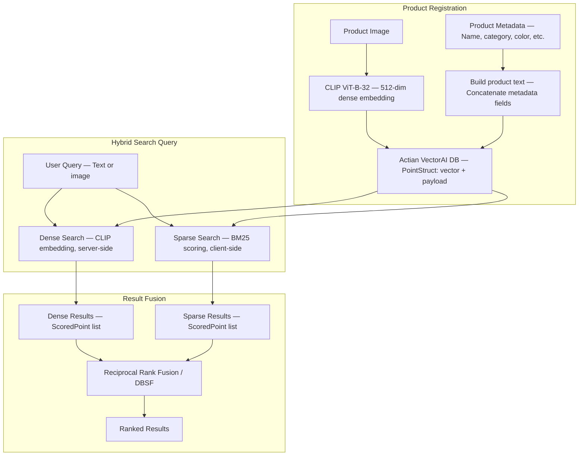

This tutorial builds a multimodal hybrid search system that combines dense semantic embeddings with sparse keyword scoring to retrieve product images by both meaning and exact terms. By the end, you have a working system that handles queries like "dark blue french connection jeans for men" — matching on brand, color, and semantic similarity at the same time.

Modern search systems struggle when queries combine semantic meaning and exact keywords. A user searching for "dark blue french connection jeans for men" expects results that satisfy all of the following:

- The exact terms: "jeans", "french connection", "blue".
- The semantic meaning of the query.
- Visual similarity with product images.

Traditional keyword search cannot understand meaning, while pure vector search may ignore exact tokens like brand names or product attributes. The solution is hybrid search — combining sparse keyword retrieval with dense semantic embeddings, fused using Reciprocal Rank Fusion (RRF) or Distribution-Based Score Fusion (DBSF).

This tutorial builds the system using the following components:

- CLIP ViT-B-32 embeddings (512-dim) for semantic understanding of images and text.
- BM25 sparse scoring for keyword relevance.
- Actian VectorAI DB for scalable vector storage and retrieval.
- Actian VectorAI SDK fusion algorithms (RRF and DBSF) for combining dense and sparse results.

By the end, the system retrieves product images using both semantic similarity and keyword relevance.

## Prerequisites

Before starting, make sure you have the following in place:

- A running Actian VectorAI instance reachable at `localhost:50051`.
- Python 3.10 or later.
- A set of product images and associated metadata (product name, category, color, gender, and so on). This tutorial uses a fashion product dataset as its example, but the same pipeline applies to any product catalog.

## Architecture overview

The system is structured around two pipelines. The product registration pipeline takes a product image and its metadata, generates a 512-dimensional CLIP embedding from the image, concatenates the metadata into a searchable text string for BM25, and stores both in Actian VectorAI DB as a single point. The hybrid search pipeline takes a user query — text or image — runs a dense CLIP search server-side and a sparse BM25 search client-side, then fuses the results using RRF or DBSF to produce a single ranked output.

The diagram below shows how these two pipelines connect, from product registration through to final ranked results:



## Why hybrid search matters

Real-world queries usually contain two types of signals — keyword signals and semantic signals. The sections below explain each type and describe how hybrid search combines them.

### Keyword signals

Sparse search targets exact tokens such as the brand name, color, and product type. For the query below, BM25 matches against three distinct tokens:

```text
french connection blue jeans
```

The tokens BM25 matches against are:

- French connection (brand).
- Blue (color).
- Jeans (product type).

Sparse retrieval methods like BM25 work well for these exact-match cases.

### Semantic signals

Dense embeddings from CLIP capture semantic meaning, allowing results to surface even when no exact tokens match. For the query below, the product description may not contain these exact words, but the system still returns similar items:

```text
casual dark denim for men
```

CLIP maps this query into the same vector space as product image embeddings, so semantically related products surface regardless of exact wording.

### How hybrid search combines both

Instead of choosing one method, this approach combines both using fusion. The Actian VectorAI SDK provides two built-in fusion algorithms:

- Reciprocal Rank Fusion (RRF) — Rank-based merging that ignores raw scores. Use this when dense and sparse scores are on different scales.
- Distribution-Based Score Fusion (DBSF) — Normalizes and averages scores using mean and standard deviation. Use this when you want score-aware blending.

The `alpha` parameter controls the weight balance in RRF. Higher values favor dense results; lower values favor sparse results:

```text
alpha = 1.0  →  100% dense (visual similarity)
alpha = 0.5  →  equal blend
alpha = 0.0  →  100% sparse (keyword matching)
```

## Environment setup

The following command installs the three packages required for image processing, CLIP embeddings, and the Actian VectorAI SDK. Run this before proceeding with the implementation:

```bash
pip install actian-vectorai sentence-transformers pillow
```

---

## Implementation

The following steps build the complete multimodal hybrid search system, from loading the CLIP model and initializing the collection through to running dense, sparse, and fused queries.

### Step 1: Import dependencies and configure

The block below imports all required libraries, sets the server address and collection name, and loads the CLIP model. Running it prints the configured server address, collection name, and CLIP model dimensionality, confirming everything is ready before any collections or vectors are created.

```python
# Standard library imports for I/O, math, unique IDs, and token counting
import io
import math
import uuid
from collections import Counter

# PIL for image decoding; SentenceTransformer loads the CLIP model
from PIL import Image
from sentence_transformers import SentenceTransformer

# Actian VectorAI SDK: async client, vector config, point types, and fusion functions
from actian_vectorai import (
    AsyncVectorAIClient,
    Distance,
    PointStruct,
    VectorParams,
    reciprocal_rank_fusion,
    distribution_based_score_fusion,
)
from actian_vectorai.models.collections import HnswConfigDiff
from actian_vectorai.models.points import ScoredPoint

# Server address, collection name, and vector dimensionality used throughout this tutorial
SERVER = "localhost:50051"
COLLECTION = "NextGen-Purchase"
DENSE_DIM = 512  # CLIP ViT-B-32 outputs 512-dimensional vectors

# Load CLIP once at module level — all embedding calls reuse this instance
clip_model = SentenceTransformer("clip-ViT-B-32")

print(f"VectorAI Server: {SERVER}")
print(f"Collection: {COLLECTION}")
print(f"CLIP model loaded ({DENSE_DIM}-dim)")
```

The CLIP model is loaded once at module level so that every subsequent call to `embed_image` or `embed_text_clip` reuses the same instance without reloading weights. On the first run, `SentenceTransformer("clip-ViT-B-32")` downloads the model weights before returning. Running this block confirms the configured server address, collection name, and CLIP model dimensionality, verifying that everything is ready before any collections or vectors are created.

#### Expected output

Running this block prints the server address, collection name, and the CLIP model dimensionality, confirming the configuration is valid before any collections or vectors are created.

```text
VectorAI Server: localhost:50051
Collection: NextGen-Purchase
CLIP model loaded (512-dim)
```

### Step 2: Define embedding helpers

CLIP maps images and text into the same 512-dimensional vector space. This shared space is what enables cross-modal search — a text query can retrieve products whose embeddings were generated from images, because both live in the same space. The two functions below handle each input type separately but produce vectors that are directly comparable.

```python
def embed_image(image_bytes: bytes) -> list[float]:
    """Return a 512-dim CLIP vector for a raw image."""
    # Decode bytes to a PIL image and convert to RGB before encoding
    image = Image.open(io.BytesIO(image_bytes)).convert("RGB")
    return clip_model.encode(image).tolist()

def embed_text_clip(text: str) -> list[float]:
    """Return a 512-dim CLIP vector for a text string."""
    # CLIP's shared embedding space allows direct comparison with image vectors
    return clip_model.encode(text).tolist()
```

Because both functions use the same CLIP model and vector space, an image of blue jeans and the text "blue jeans" produce nearby vectors, making text-to-image retrieval possible without storing images in the database.

### Step 3: Build the BM25 text representation

BM25 scoring operates on plain text rather than vectors. The function below concatenates all product metadata fields into a single lowercase string, which is stored in the point payload at registration time and scored against the query at search time.

```python
def build_product_text(metadata: dict) -> str:
    """Concatenate metadata fields into a single lowercase string for BM25 scoring."""
    # Pull all descriptive fields a user might search by keyword
    fields = [
        metadata.get("product_name", ""),
        metadata.get("gender", ""),
        metadata.get("category", ""),
        metadata.get("sub_category", ""),
        metadata.get("article_type", ""),
        metadata.get("color", ""),
        metadata.get("season", ""),
        metadata.get("usage", ""),
    ]
    # Drop empty strings, join with spaces, and lowercase for consistent tokenization
    return " ".join(f for f in fields if f).strip().lower()
```

The function pulls eight metadata fields — product name, gender, category, sub-category, article type, color, season, and usage — drops any empty values, joins them with spaces, and lowercases the result. This produces a single plain-text document per product that BM25 can tokenize and score at query time.

#### Expected output

For a denim product with complete metadata, the concatenated string looks like this. BM25 uses this string to match query tokens such as "french connection", "jeans", and "blue" at search time.

```text
dark blue french connection jeans men apparel bottomwear jeans blue winter casual
```

### Step 4: Implement client-side BM25 scoring

The BM25 function below takes a list of query tokens, the text of a single document, and corpus-level statistics (average document length, per-token document frequency, and total document count). It returns a float relevance score for that document. Scores of zero indicate no token overlap between the query and the document.

```python
def bm25_score(
    query_tokens: list[str],
    doc_text: str,
    avg_dl: float,
    doc_freq: dict[str, int],
    total_docs: int,
    k1: float = 1.5,
    b: float = 0.75,
) -> float:
    """Return the BM25 relevance score for a single document against a set of query tokens."""
    doc_tokens = doc_text.lower().split()
    dl = len(doc_tokens)
    tf_map = Counter(doc_tokens)
    score = 0.0
    for qt in query_tokens:
        tf = tf_map.get(qt, 0)
        if tf == 0:
            continue  # Token not present in this document — contributes nothing to score
        df = doc_freq.get(qt, 0)
        # IDF boosts tokens that are rare across the corpus
        idf = math.log((total_docs - df + 0.5) / (df + 0.5) + 1.0)
        numerator = tf * (k1 + 1)
        # Length normalization controlled by b penalizes unusually long documents
        denominator = tf + k1 * (1 - b + b * (dl / max(avg_dl, 1)))
        score += idf * (numerator / denominator)
    return score
```

The formula combines three signals to rank documents. Term frequency (TF) measures how often a query token appears in the document. Inverse document frequency (IDF) boosts tokens that are rare across the entire corpus, such as a brand name that appears in only a handful of products. Document length normalization prevents longer documents from receiving unfairly high scores simply because they contain more words. The defaults `k1=1.5` and `b=0.75` are standard BM25 values that work well across most text corpora.

### Step 5: Initialize the VectorAI collection

The function below creates the `NextGen-Purchase` collection if it does not already exist. `get_or_create` is idempotent, so calling it on every startup is safe — it returns immediately if the collection is present. Running the block prints a confirmation that the collection is ready to accept vectors.

```python
import asyncio

async def ensure_collection():
    async with AsyncVectorAIClient(url=SERVER) as client:
        # get_or_create returns immediately if the collection already exists
        await client.collections.get_or_create(
            name=COLLECTION,
            vectors_config=VectorParams(size=DENSE_DIM, distance=Distance.Cosine),
            # m=32 sets the number of HNSW graph connections per node
            # ef_construct=256 controls index build quality — higher means better recall
            hnsw_config=HnswConfigDiff(m=32, ef_construct=256),
        )
    print(f"Collection '{COLLECTION}' ready.")

asyncio.run(ensure_collection())
```

The block creates the `NextGen-Purchase` collection using 512-dimensional CLIP vectors with cosine distance. The HNSW parameters `m=32` and `ef_construct=256` balance recall quality against indexing speed. Because `get_or_create` is idempotent, this call is safe to repeat on every startup — it returns immediately when the collection already exists.

#### Expected output

Running this block prints a confirmation that the collection is ready. If the collection already exists, the message is identical — `get_or_create` does not raise an error on repeat calls.

```text
Collection 'NextGen-Purchase' ready.
```

### Step 6: Register a product

The function below registers a single product. It generates a 512-dim CLIP embedding from the product image, builds the BM25 text string from the metadata, and upserts both as a single point in the collection. After registration, it flushes the collection to disk and prints the product name alongside the updated total vector count.

```python
async def register_product(image_bytes: bytes, metadata: dict) -> str:
    """Register a product as a vector point with CLIP embedding and BM25 text payload."""
    # Encode the product image into a 512-dim CLIP vector
    dense_vector = embed_image(image_bytes)
    # Build a keyword-searchable string from all metadata fields
    product_text = build_product_text(metadata)

    # Generate a UUID for the payload — not used as the point ID in this implementation
    point_id = str(uuid.uuid4())
    payload = {
        "point_id": point_id,
        "product_text": product_text,  # Scored by BM25 at query time
        **metadata,                     # All metadata fields returned with search results
    }

    async with AsyncVectorAIClient(url=SERVER) as client:
        # Use current vector count as the integer point ID
        existing = await client.vde.get_vector_count(COLLECTION)
        point = PointStruct(
            id=existing,
            vector=dense_vector,
            payload=payload,
        )
        await client.points.upsert(COLLECTION, points=[point])
        # flush() persists buffered writes to disk before returning
        await client.vde.flush(COLLECTION)
        total = await client.vde.get_vector_count(COLLECTION)

    print(f"Registered '{metadata.get('product_name')}'. Total: {total}")
    return point_id
```

Each point stored in VectorAI DB contains three things:

- Vector — A 512-dim CLIP image embedding used for dense similarity search.
- payload.product_text — The concatenated metadata string scored by BM25 at query time.
- Additional payload fields — All original metadata fields, returned alongside each search result.

The `vde.flush()` call persists any buffered writes to disk before the function returns, ensuring the point is available for search immediately after registration.

### Step 7: Dense search (server-side)

The two functions below perform dense similarity searches using CLIP embeddings. Both encode the query into a 512-dim vector and send it to the Actian VectorAI server, which runs HNSW approximate nearest-neighbor search and returns a ranked list of `ScoredPoint` objects. The only difference between the two is the query input type.

```python
async def search_by_image(image_bytes: bytes, top_k: int = 10):
    """Search by visual similarity using a CLIP image embedding."""
    # Encode the query image into a CLIP vector for server-side search
    dense_vector = embed_image(image_bytes)
    async with AsyncVectorAIClient(url=SERVER) as client:
        results = await client.points.search(
            COLLECTION,
            vector=dense_vector,
            limit=top_k,
            with_payload=True,  # Include metadata in each returned result
        )
    return results or []

async def search_by_text_dense(query: str, top_k: int = 10):
    """Search by semantic meaning using a CLIP text embedding."""
    # CLIP maps this text into the same vector space as product image embeddings
    dense_vector = embed_text_clip(query)
    async with AsyncVectorAIClient(url=SERVER) as client:
        results = await client.points.search(
            COLLECTION,
            vector=dense_vector,
            limit=top_k,
            with_payload=True,
        )
    return results or []
```

Searching by image finds products that are visually similar to the query image. Searching by text finds products whose image embeddings are close to the text query in CLIP's shared vector space. Both return a list of `ScoredPoint` objects sorted by descending cosine similarity.

### Step 8: Sparse BM25 search (client-side)

Unlike dense search, BM25 runs entirely on the client. The function below fetches all points from the collection in batches of 500, computes BM25 scores locally by comparing query tokens against the `product_text` payload field of each point, and returns the top-K results sorted by descending score.

```python
async def bm25_search(query: str, top_k: int = 10) -> list[ScoredPoint]:
    """Score all collection points against the query using BM25, return top-K results."""
    async with AsyncVectorAIClient(url=SERVER) as client:
        total = await client.vde.get_vector_count(COLLECTION)
        if total == 0:
            return []

        # Retrieve all points in batches to avoid large single requests
        batch_size = 500
        all_points = []
        for start in range(0, total, batch_size):
            end = min(start + batch_size, total)
            batch = await client.points.get(
                COLLECTION,
                ids=list(range(start, end)),
                with_payload=True,  # product_text payload field is required for scoring
            )
            all_points.extend(batch or [])

    if not all_points:
        return []

    query_tokens = query.lower().split()
    texts = [p.payload.get("product_text", "") for p in all_points]
    total_docs = len(texts)
    avg_dl = sum(len(t.split()) for t in texts) / max(total_docs, 1)

    # Compute how many documents each token appears in — used for IDF calculation
    doc_freq: dict[str, int] = {}
    for t in texts:
        for tok in set(t.split()):
            doc_freq[tok] = doc_freq.get(tok, 0) + 1

    scored = []
    for p, text in zip(all_points, texts):
        s = bm25_score(query_tokens, text, avg_dl, doc_freq, total_docs)
        if s > 0:
            scored.append(ScoredPoint(
                id=p.id,
                version=getattr(p, "version", 0),
                score=s,
                payload=p.payload,
            ))

    # Sort by score descending and return only the top-K results
    scored.sort(key=lambda x: x.score or 0, reverse=True)
    return scored[:top_k]
```

BM25 catches keyword matches that dense embeddings miss. For a query like "french connection jeans", BM25 strongly scores products that contain the exact brand name in their metadata, even when the CLIP embedding does not distinguish brand names from other descriptive terms.

### Step 9: Hybrid search with fusion

The function below runs both dense and sparse searches in sequence and merges the results using either RRF or DBSF. It fetches `top_k * 5` candidates (up to 50) from each search before fusing, giving the fusion algorithm a broad enough input to rerank effectively before returning the final `top_k` results.

```python
async def hybrid_search(
    query_text: str | None = None,
    image_bytes: bytes | None = None,
    alpha: float = 0.5,
    top_k: int = 10,
    fusion_method: str = "rrf",
):
    """
    Run dense and sparse search, then fuse the results.

    alpha controls RRF weight balance:
      alpha=1.0 — Full weight on dense (visual similarity)
      alpha=0.0 — Full weight on sparse (keyword/BM25)

    Note: alpha applies to RRF only. DBSF uses score normalization
    and ignores the weights parameter in this implementation.
    """
    if not query_text and not image_bytes:
        return []

    # Fetch a wider candidate pool than top_k so fusion has enough items to rerank
    fetch_k = min(top_k * 5, 50)
    dense_results = []
    sparse_results = []

    # Stage 1 — Dense search: encode the query as a CLIP vector
    if image_bytes:
        dense_vector = embed_image(image_bytes)
    elif query_text:
        dense_vector = embed_text_clip(query_text)
    else:
        dense_vector = None

    if dense_vector is not None:
        async with AsyncVectorAIClient(url=SERVER) as client:
            dense_results = await client.points.search(
                COLLECTION,
                vector=dense_vector,
                limit=fetch_k,
                with_payload=True,
            ) or []

    # Stage 2 — Sparse BM25 search: score all points client-side
    if query_text:
        sparse_results = await bm25_search(query_text, top_k=fetch_k)

    # If only one source produced results, return those directly without fusion
    if not dense_results and not sparse_results:
        return []
    if not sparse_results:
        return dense_results[:top_k]
    if not dense_results:
        return sparse_results[:top_k]

    # Stage 3 — Fusion: merge both result lists into a single ranked output
    weights = [alpha, 1.0 - alpha]

    if fusion_method == "dbsf":
        # DBSF normalizes scores by distribution — alpha/weights are not used
        fused = distribution_based_score_fusion(
            [dense_results, sparse_results], limit=top_k
        )
    else:
        # RRF merges by rank position; weights shift influence toward dense or sparse
        fused = reciprocal_rank_fusion(
            [dense_results, sparse_results], limit=top_k, weights=weights
        )

    return fused
```

This function runs three stages in sequence. First, it encodes the query and runs a dense CLIP similarity search server-side against Actian VectorAI DB. Second, it runs a client-side BM25 search over the `product_text` payload field. Third, it passes both result lists to either `reciprocal_rank_fusion` or `distribution_based_score_fusion` from the Actian VectorAI SDK.

The `alpha` parameter shifts the weight between the two sources in RRF. The table below shows how different values change the balance:

| Alpha | Behavior |
|-------|----------|
| `1.0` | 100% dense — Pure visual/semantic similarity. |
| `0.7` | 70% dense, 30% sparse — Mostly semantic with keyword boost. |
| `0.5` | Equal blend — Balanced hybrid. |
| `0.3` | 30% dense, 70% sparse — Mostly keyword with semantic boost. |
| `0.0` | 100% sparse — Pure BM25 keyword matching. |

### Step 10: Run the end-to-end hybrid search

The block below runs the same query through all four search modes — dense-only, sparse-only, RRF-fused, and DBSF-fused — and prints a ranked result list for each. Running it lets you compare how each approach ranks "Dark Blue French Connection Jeans" against other products in the collection.

```python
async def run_hybrid_demo():
    query = "dark blue french connection jeans for men"

    # Dense-only: server-side CLIP similarity search
    dense_results = await search_by_text_dense(query, top_k=5)
    print("=== Dense Results (CLIP) ===")
    for r in dense_results:
        print(f"  score={r.score:.4f}  product={r.payload.get('product_name', '')}")

    # Sparse-only: client-side BM25 keyword scoring
    sparse_results = await bm25_search(query, top_k=5)
    print("\n=== Sparse Results (BM25) ===")
    for r in sparse_results:
        print(f"  score={r.score:.4f}  product={r.payload.get('product_name', '')}")

    # Hybrid RRF: rank-based fusion with equal weight between dense and sparse
    hybrid_results = await hybrid_search(
        query_text=query, alpha=0.5, top_k=5, fusion_method="rrf"
    )
    print("\n=== Hybrid Results (RRF, alpha=0.5) ===")
    for r in hybrid_results:
        print(f"  score={r.score:.4f}  product={r.payload.get('product_name', '')}")

    # Hybrid DBSF: score-normalized fusion (alpha is ignored for DBSF)
    hybrid_dbsf = await hybrid_search(
        query_text=query, alpha=0.7, top_k=5, fusion_method="dbsf"
    )
    print("\n=== Hybrid Results (DBSF) ===")
    for r in hybrid_dbsf:
        print(f"  score={r.score:.4f}  product={r.payload.get('product_name', '')}")

asyncio.run(run_hybrid_demo())
```

The block runs the query `"dark blue french connection jeans for men"` through all four search modes in sequence. Dense-only search encodes the query as a CLIP text vector and runs server-side cosine similarity against stored image embeddings. Sparse-only search scores every point's `product_text` payload field using client-side BM25, rewarding exact token matches for terms like "french connection" and "jeans". The RRF-fused mode combines both ranked lists with equal weight (`alpha=0.5`), merging by rank position regardless of raw score scale. The DBSF-fused mode normalizes scores by their distribution before averaging. Hybrid search ranks "Dark Blue French Connection Jeans" highest across both fusion methods because it satisfies both the CLIP semantic similarity and the BM25 exact-keyword match.

#### Expected output

Exact scores depend on the dataset and the products registered. The values below are illustrative. Notice that BM25 scores are on a different scale from CLIP cosine similarity scores — RRF handles this by merging on rank position rather than raw values.

```text
=== Dense Results (CLIP) ===
  score=0.8521  product=Dark Blue French Connection Jeans
  score=0.7834  product=Slim Fit Blue Denim
  score=0.7102  product=Navy Casual Trousers

=== Sparse Results (BM25) ===
  score=4.2310  product=Dark Blue French Connection Jeans
  score=3.1205  product=French Connection Formal Shirt
  score=2.8901  product=Blue Denim Jeans Men

=== Hybrid Results (RRF, alpha=0.5) ===
  score=0.0323  product=Dark Blue French Connection Jeans
  score=0.0294  product=Blue Denim Jeans Men
  score=0.0256  product=Slim Fit Blue Denim

=== Hybrid Results (DBSF) ===
  score=0.8100  product=Dark Blue French Connection Jeans
  score=0.6543  product=Slim Fit Blue Denim
  score=0.5982  product=Blue Denim Jeans Men
```

### Step 11: Collection administration

The block below demonstrates three VDE operations: retrieving the current vector count, flushing buffered writes to disk, and deleting the collection (shown as a comment). Running it prints the total number of stored product vectors and a confirmation that the flush completed successfully.

```python
async def admin_operations():
    async with AsyncVectorAIClient(url=SERVER) as client:
        # get_vector_count returns the total number of indexed points
        count = await client.vde.get_vector_count(COLLECTION)
        print(f"Total products in collection: {count}")

        # flush() persists any buffered in-memory writes to disk
        await client.vde.flush(COLLECTION)
        print("Collection flushed to disk.")

        # Uncomment to permanently delete the collection and all its vectors
        # await client.collections.delete(COLLECTION)

asyncio.run(admin_operations())
```

#### Expected output

Running this block prints the current vector count followed by a confirmation that the flush completed. The count reflects how many product points have been registered in the collection.

```text
Total products in collection: 42
Collection flushed to disk.
```

---

## How images are returned after retrieval

Vector databases store embeddings, not raw image files. A common question when building retrieval systems is how to get images back from search results.

The answer is payload metadata. When registering a product, store the `image_filename` in the payload alongside the embedding. The payload dictionary below shows what a complete point entry looks like:

```python
payload = {
    "point_id": point_id,
    "image_filename": "abc123.jpg",   # Path or key used to load the image from storage
    "product_text": "dark blue jeans men apparel",
    "product_name": "Dark Blue Jeans",
    ...
}
```

During retrieval, Actian VectorAI returns the full payload including `image_filename`. The application uses that value to load the image from disk or object storage and render it to the user. The vector database stores representations, not the raw images.

---

## Fusion methods compared

The hybrid search pipeline produces two separate ranked lists — one from dense CLIP search and one from sparse BM25 scoring. A fusion algorithm merges these lists into a single ranking. The table below compares the two built-in options provided by the Actian VectorAI SDK:

| Method | How it works | When to use |
|--------|-------------|-------------|
| RRF (Reciprocal Rank Fusion) | Merges by rank position, ignores raw scores. | When dense and sparse scores are on different scales. |
| DBSF (Distribution-Based Score Fusion) | Normalizes scores using mean and standard deviation, then averages. | When you want score-aware blending. |

Both functions accept the same input — a list of `ScoredPoint` lists — and return a single merged and ranked list. The example below shows how to call each one directly:

```python
from actian_vectorai import reciprocal_rank_fusion, distribution_based_score_fusion

# RRF: weights=[0.7, 0.3] gives 70% influence to dense results, 30% to sparse
fused = reciprocal_rank_fusion([dense_results, sparse_results], limit=10, weights=[0.7, 0.3])

# DBSF: no weights — scoring is based on score distribution across both lists
fused = distribution_based_score_fusion([dense_results, sparse_results], limit=10)
```

---

## Actian VectorAI features used

The system in this tutorial relies on the following Actian VectorAI SDK features. The table below lists each feature, the corresponding API call, and its role in the pipeline:

| Feature | API | Purpose |
|---------|-----|---------|
| Collection creation | `client.collections.get_or_create()` | Create vector space with HNSW config. |
| Point upsert | `client.points.upsert()` | Store CLIP vectors with product payload. |
| Dense search | `client.points.search()` | Server-side CLIP similarity search. |
| Point retrieval | `client.points.get()` | Fetch points by ID for BM25 scoring. |
| Vector count | `client.vde.get_vector_count()` | Return total number of indexed points. |
| Flush | `client.vde.flush()` | Persist buffered writes to disk. |
| Delete collection | `client.collections.delete()` | Remove collection and all its vectors. |
| RRF fusion | `reciprocal_rank_fusion()` | Rank-based result merging. |
| DBSF fusion | `distribution_based_score_fusion()` | Score-normalized result merging. |

---

## Benefits of hybrid search

Using dense and sparse retrieval together produces results that neither approach achieves alone. The three main advantages are outlined below.

### Better ranking

Hybrid search improves result ranking by combining two complementary signals. Semantic meaning allows CLIP to match "casual dark denim" against "jeans". Exact token matching allows BM25 to surface brand names like "French Connection" that CLIP embeddings may not distinguish from other text.

### Multimodal query support

The pipeline accepts three types of query input through a single `hybrid_search` call, making it straightforward to support different client interfaces without changing the search logic:

- Text queries, processed through the CLIP text encoder.
- Image queries, processed through the CLIP image encoder.
- Metadata keywords, scored by BM25 against stored product text.

### Tunable balance

The `alpha` parameter lets you shift the retrieval balance between visual similarity and keyword precision without changing any code — only the value passed to `hybrid_search` changes.

---

## Next steps

This tutorial covered a complete multimodal hybrid search pipeline — from CLIP embeddings and BM25 scoring through to RRF and DBSF fusion. The tutorials below cover additional retrieval patterns that can be layered on top of what was built here:

<CardGroup cols={2}>
  <Card title="Reranking search results" href="/academy/tutorials/re-ranking">
    Improve relevance with cross-encoder and reciprocal rank fusion re-ranking.
  </Card>
  <Card title="Similarity search" href="/academy/tutorials/similarity-search">
    Learn the core retrieval workflow.
  </Card>
  <Card title="Predicate filters" href="/academy/tutorials/predicate-filters">
    Combine vector search with structured payload constraints.
  </Card>
  <Card title="Retrieval quality" href="/academy/tutorials/retrieval-quality">
    Measure and optimize search accuracy using precision, recall, and MRR.
  </Card>
</CardGroup>
