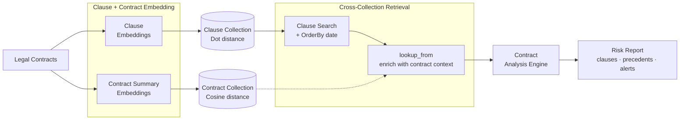

In this tutorial, you build an AI legal contract intelligence agent that uses Actian VectorAI DB. The agent maintains two collections — one for individual clauses and one for full contract summaries — and demonstrates a range of advanced database features: cross-collection lookup, payload-sorted retrieval, connection pooling, durability tuning, quantization-aware search, and strict deletion.

Legal teams deal with thousands of contracts — vendor agreements, NDAs, employment contracts, licensing terms, partnership deals — spread across business units, jurisdictions, and time periods. When a new contract arrives for review, the fundamental question is: how does this compare to what has been signed before?

A lawyer reviewing a new vendor agreement needs to find prior contracts with similar indemnification language, comparable liability caps, or matching force majeure clauses. They need to search across both a clause-level collection (granular) and a contract-level collection (holistic), rank results by recency, and compare the actual embeddings of similar clauses side by side.

Traditional contract management systems rely on manual tagging and folder hierarchies. They cannot surface semantically similar clauses across contracts that use different legal phrasing for the same concept. A clause stating "Party A shall indemnify and hold harmless Party B" should match "Vendor assumes full liability for third-party claims against Client" — but keyword search will miss this entirely.

<Warning>
This tutorial is a technical demonstration of vector database features using legal contract data as an example domain. The system built here is not a substitute for qualified legal advice. Do not use the output of this system to make real legal decisions. Always consult a licensed attorney for contract review and legal guidance.
</Warning>

---

## Architecture

The system splits contracts into two parallel embedding pipelines. Individual clauses are stored in a clause collection using Dot distance, while full contract summaries are stored in a contract collection using Cosine distance. At query time, clause search runs with OrderBy date ordering, and `lookup_from` enriches each result with context from the contract collection before the analysis engine generates a risk report.



---

## Environment setup

Before running any of the code in this tutorial, install the required Python packages. The setup uses two libraries: the Actian VectorAI SDK for database operations and Sentence Transformers for local embedding generation.

Run the following command to install both packages:

```bash
pip install actian-vectorai sentence-transformers
```

The two packages cover everything needed to connect to Actian VectorAI DB and produce embeddings locally:

- `actian-vectorai` — Official Python SDK for Actian VectorAI DB (connection pooling, cross-collection lookup, OrderBy retrieval, advanced rebuild management, gRPC transport).
- `sentence-transformers` — For generating text embeddings with `all-MiniLM-L6-v2`.

---

## Implementation

The following steps build the agent end-to-end: setting up collections with custom distance metrics and durability config, ingesting clause and contract data, running cross-collection lookups and payload-sorted queries, and operating a risk analysis engine over the results.

### Step 1: Import dependencies and configure

The first step imports all required types, including connection pooling types, WAL and optimizer configs, quantization search params, rebuild management types, `OrderBy`, and alternative distance metrics. It also sets the server address, collection names, and loads the embedding model. Running this block prints the active server address, collection names, and embedding model so the rest of the steps can be verified against a known configuration.

```python
import asyncio
import math
from datetime import datetime, timezone

from actian_vectorai import (
    AsyncVectorAIClient,
    ConnectionPool,       # production connection pool
    PoolConfig,           # pool configuration settings
    Distance,             # vector distance metrics (Cosine, Dot, Euclid, Manhattan)
    Field,
    FieldType,
    FilterBuilder,
    KeywordIndexParams,
    DatetimeIndexParams,
    FloatIndexParams,
    PointStruct,
    PrefetchQuery,
    SearchParams,
    QuantizationSearchParams,  # quantization-aware search control
    VectorParams,
    OrderBy,              # payload-field-sorted retrieval
    Direction,            # sort direction (Asc / Desc)
    is_null,
)
from actian_vectorai.models.collections import (
    HnswConfigDiff,
    WalConfigDiff,          # Write-Ahead Log durability tuning
    OptimizersConfigDiff,   # background optimization control
)
from actian_vectorai.models.points import ScoredPoint
from actian_vectorai.models.vde import (
    RebuildDataSourceConfig,  # source data for index rebuild
    RebuildTargetConfig,      # target index type for rebuild
    RebuildRunConfig,         # batch size and runtime settings
    CompactOptions,           # fine-grained compaction control
)
from actian_vectorai.models.enums import (
    RebuildDataSourceType,   # enum: current index, storage, snapshot
    RebuildTargetIndexType,  # enum: HNSW, flat, auto
)
from sentence_transformers import SentenceTransformer

# gRPC server address
SERVER = "localhost:6574"
# collection names for clause-level and contract-level data
CLAUSE_COLLECTION = "Legal-Clauses"
CONTRACT_COLLECTION = "Legal-Contracts"
EMBED_MODEL = "all-MiniLM-L6-v2"
EMBED_DIM = 384  # output dimension of all-MiniLM-L6-v2

model = SentenceTransformer(EMBED_MODEL)

print(f"VectorAI Server: {SERVER}")
print(f"Clause collection: {CLAUSE_COLLECTION}")
print(f"Contract collection: {CONTRACT_COLLECTION}")
print(f"Embedding model: {EMBED_MODEL} ({EMBED_DIM}-dim)")
```
This block imports all required SDK types — including connection pooling, WAL and optimizer configuration, quantization search parameters, rebuild management types, `OrderBy`, and alternative distance metrics — then sets the server address, collection names, and loads the `all-MiniLM-L6-v2` embedding model. The four `print` statements confirm the active configuration values so every subsequent step can be verified against a known baseline.
**Expected Output**
```text
VectorAI Server: localhost:6574
Clause collection: Legal-Clauses
Contract collection: Legal-Contracts
Embedding model: all-MiniLM-L6-v2 (384-dim)
```

### Step 2: Define embedding helpers

These two helper functions wrap the Sentence Transformers model to convert text into 384-dimensional vectors. The single-text version is used for queries, while the batch version is used during data ingestion. Defining these functions produces no output; they are called in later steps.

```python
def embed_text(text: str) -> list[float]:
    """Generate a 384-dimensional embedding for a text string."""
    return model.encode(text).tolist()

def embed_texts(texts: list[str]) -> list[list[float]]:
    """Batch-embed multiple text strings."""
    return model.encode(texts).tolist()
```

### Step 3: Create collections with alternative distance metrics, WAL, and optimizer config

Two collections are created using different distance metrics. The clause collection uses Dot product distance, while the contract collection uses Cosine distance. WAL and optimizer settings are configured on the clause collection for production workloads. Running this block creates both collections and prints a readiness message for each.

```python
async def create_collections():
    async with AsyncVectorAIClient(url=SERVER) as client:
        # Clause collection uses Dot distance for magnitude-sensitive similarity
        await client.collections.get_or_create(
            name=CLAUSE_COLLECTION,
            vectors_config=VectorParams(size=EMBED_DIM, distance=Distance.Dot),
            hnsw_config=HnswConfigDiff(m=16, ef_construct=200),
            # WAL durability: rotate segments at 64 MB, keep 2 ahead for crash recovery
            wal_config=WalConfigDiff(
                wal_capacity_mb=64,
                wal_segments_ahead=2,
            ),
            # Optimizer: delay HNSW build until 10k points, flush every 30 s
            optimizers_config=OptimizersConfigDiff(
                indexing_threshold=10000,
                flush_interval_sec=30,
                max_optimization_threads=2,
            ),
        )
        print(f"Collection '{CLAUSE_COLLECTION}' ready (Dot distance, WAL + optimizer tuned).")

        # Contract collection uses Cosine distance for direction-based summary similarity
        await client.collections.get_or_create(
            name=CONTRACT_COLLECTION,
            vectors_config=VectorParams(size=EMBED_DIM, distance=Distance.Cosine),
            hnsw_config=HnswConfigDiff(m=32, ef_construct=256),
        )
        print(f"Collection '{CONTRACT_COLLECTION}' ready (Cosine distance).")

asyncio.run(create_collections())
```
This block calls `get_or_create` twice — once for the clause collection using `Distance.Dot` with WAL durability and optimizer settings tuned for large ingest workloads, and once for the contract collection using `Distance.Cosine` with a higher HNSW `m` value for broader graph connectivity. Both collections use 384-dimensional vectors to match the embedding model configured in Step 1. Each call prints a readiness message confirming the distance metric and any additional configuration applied.
**Expected Output**
```text
Collection 'Legal-Clauses' ready (Dot distance, WAL + optimizer tuned).
Collection 'Legal-Contracts' ready (Cosine distance).
```

This step introduces two configuration objects not covered in previous tutorials. `WalConfigDiff` controls Write-Ahead Log durability. Setting `wal_capacity_mb=64` rotates WAL segments at 64 MB, and `wal_segments_ahead=2` keeps two segments ahead for crash recovery. `OptimizersConfigDiff` controls background optimization: `indexing_threshold=10000` delays HNSW index construction until 10,000 points are present, `flush_interval_sec=30` sets the automatic flush interval, and `max_optimization_threads=2` limits concurrent optimization threads.

Alternative distance metrics — previous tutorials used `Distance.Cosine`. Actian VectorAI DB supports four metrics:

| Metric | Value | Best for |
|--------|-------|----------|
| `Distance.Cosine` | 1 | Normalized embeddings, direction-based similarity. |
| `Distance.Dot` | 3 | Raw dot product, magnitude-sensitive. |
| `Distance.Euclid` | 2 | Absolute distance in embedding space. |
| `Distance.Manhattan` | 4 | L1 norm, robust to outliers. |

For legal clauses, Dot product is useful when embedding magnitude carries meaning — longer, more detailed clause descriptions produce higher-magnitude vectors, and Dot product preserves this signal.

### Step 4: Create payload indexes on both collections

Payload indexes accelerate filtered queries by creating lookup structures on specific fields. This step creates indexes on `contract_date` and `contract_type` on both collections, then adds `clause_type` and `risk_score` indexes on the clause collection to support type-filtered and risk-sorted retrieval. Running this block creates all indexes and prints a confirmation.

```python
async def create_indexes():
    async with AsyncVectorAIClient(url=SERVER) as client:
        for coll in [CLAUSE_COLLECTION, CONTRACT_COLLECTION]:
            await client.points.create_field_index(
                coll, field_name="contract_date",
                field_type=FieldType.FieldTypeDatetime,
                field_index_params=DatetimeIndexParams(on_disk=False, is_principal=True),
            )
            await client.points.create_field_index(
                coll, field_name="contract_type",
                field_type=FieldType.FieldTypeKeyword,
                field_index_params=KeywordIndexParams(is_tenant=False),
            )

        await client.points.create_field_index(
            CLAUSE_COLLECTION, field_name="clause_type",
            field_type=FieldType.FieldTypeKeyword,
        )
        await client.points.create_field_index(
            CLAUSE_COLLECTION, field_name="risk_score",
            field_type=FieldType.FieldTypeFloat,
            field_index_params=FloatIndexParams(is_principal=True),
        )

    print("Payload indexes created on both collections.")

asyncio.run(create_indexes())
```
This block iterates over both collections and creates a datetime index on `contract_date` (marked as principal for optimized `OrderBy` queries) and a keyword index on `contract_type`. It then creates two additional indexes on the clause collection only: a keyword index on `clause_type` for type-filtered retrieval, and a float index on `risk_score` (also marked as principal) to support fast range queries against numeric risk values. All six index operations run sequentially and a single confirmation message is printed once every index is in place.
**Expected Output**
```text
Payload indexes created on both collections.
```

### Step 5: Prepare sample contract and clause data

Two datasets are defined: contract-level summaries and clause-level extracts. Each clause references a contract by ID, which enables cross-collection lookup in later steps. Running this block loads the data into memory and prints a count of each dataset.

```python
contracts = [
    {
        "contract_id": "CTR-2025-001",
        "title": "Master Services Agreement with TechVendor Inc.",
        "summary": "Three-year master services agreement for cloud infrastructure and managed services. Includes SLA guarantees, data processing terms, and quarterly business reviews.",
        "contract_type": "vendor_agreement",
        "counterparty": "TechVendor Inc.",
        "jurisdiction": "Delaware",
        "contract_date": "2025-06-15T00:00:00Z",
        "expiry_date": "2028-06-14T00:00:00Z",
        "total_value": 2400000.00,
        "status": "active",
    },
    {
        "contract_id": "CTR-2025-002",
        "title": "Non-Disclosure Agreement with DataPartner Ltd.",
        "summary": "Mutual NDA covering proprietary algorithms, customer data, and business strategies. Two-year term with automatic renewal.",
        "contract_type": "nda",
        "counterparty": "DataPartner Ltd.",
        "jurisdiction": "California",
        "contract_date": "2025-09-01T00:00:00Z",
        "expiry_date": "2027-08-31T00:00:00Z",
        "total_value": 0.0,
        "status": "active",
    },
    {
        "contract_id": "CTR-2026-003",
        "title": "Software Licensing Agreement with CloudStack Corp.",
        "summary": "Enterprise license for AI/ML platform with unlimited seats. Includes source code escrow, uptime SLA, and priority support.",
        "contract_type": "license",
        "counterparty": "CloudStack Corp.",
        "jurisdiction": "New York",
        "contract_date": "2026-01-10T00:00:00Z",
        "expiry_date": "2029-01-09T00:00:00Z",
        "total_value": 850000.00,
        "status": "active",
    },
    {
        "contract_id": "CTR-2024-004",
        "title": "Employment Agreement — Senior Counsel",
        "summary": "Employment contract for senior legal counsel. Includes non-compete, IP assignment, and severance terms.",
        "contract_type": "employment",
        "counterparty": "Jane Doe",
        "jurisdiction": "Massachusetts",
        "contract_date": "2024-03-01T00:00:00Z",
        "expiry_date": None,
        "total_value": 280000.00,
        "status": "active",
    },
]

clauses = [
    {
        "clause_text": "Vendor shall indemnify, defend, and hold harmless Client from and against any third-party claims, damages, losses, and expenses arising from Vendor's breach of this Agreement or negligent acts.",
        "clause_type": "indemnification",
        "contract_id": "CTR-2025-001",
        "contract_type": "vendor_agreement",
        "contract_date": "2025-06-15T00:00:00Z",
        "section": "Section 8.1",
        "risk_score": 3.2,
    },
    {
        "clause_text": "Client's total aggregate liability under this Agreement shall not exceed the fees paid by Client during the twelve-month period preceding the claim.",
        "clause_type": "liability_cap",
        "contract_id": "CTR-2025-001",
        "contract_type": "vendor_agreement",
        "contract_date": "2025-06-15T00:00:00Z",
        "section": "Section 9.2",
        "risk_score": 5.8,
    },
    {
        "clause_text": "Neither party shall be liable for failure to perform obligations due to events beyond reasonable control, including natural disasters, acts of war, pandemics, government actions, or infrastructure failures lasting more than thirty days.",
        "clause_type": "force_majeure",
        "contract_id": "CTR-2025-001",
        "contract_type": "vendor_agreement",
        "contract_date": "2025-06-15T00:00:00Z",
        "section": "Section 12.3",
        "risk_score": 2.5,
    },
    {
        "clause_text": "Receiving Party shall not disclose, publish, or disseminate Confidential Information to any third party without prior written consent. All confidential materials must be returned or destroyed upon termination.",
        "clause_type": "confidentiality",
        "contract_id": "CTR-2025-002",
        "contract_type": "nda",
        "contract_date": "2025-09-01T00:00:00Z",
        "section": "Section 3.1",
        "risk_score": 1.5,
    },
    {
        "clause_text": "Licensee acknowledges that all intellectual property rights in the Software remain with Licensor. Licensee receives a non-exclusive, non-transferable, revocable license to use the Software.",
        "clause_type": "ip_rights",
        "contract_id": "CTR-2026-003",
        "contract_type": "license",
        "contract_date": "2026-01-10T00:00:00Z",
        "section": "Section 4.1",
        "risk_score": 4.0,
    },
    {
        "clause_text": "Licensor guarantees 99.9% uptime availability measured monthly. If uptime falls below the guaranteed level, Licensee receives service credits equal to 10% of monthly fees per percentage point below the SLA.",
        "clause_type": "sla",
        "contract_id": "CTR-2026-003",
        "contract_type": "license",
        "contract_date": "2026-01-10T00:00:00Z",
        "section": "Section 6.2",
        "risk_score": 3.8,
    },
    {
        "clause_text": "Employee agrees to a twelve-month non-compete restriction within a fifty-mile radius of Company headquarters. Employee shall not solicit Company clients or employees for twenty-four months following termination.",
        "clause_type": "non_compete",
        "contract_id": "CTR-2024-004",
        "contract_type": "employment",
        "contract_date": "2024-03-01T00:00:00Z",
        "section": "Section 7.1",
        "risk_score": 7.5,
    },
    {
        "clause_text": "All inventions, discoveries, and works of authorship created by Employee during employment and related to Company business shall be the exclusive property of Company. Employee assigns all rights therein.",
        "clause_type": "ip_assignment",
        "contract_id": "CTR-2024-004",
        "contract_type": "employment",
        "contract_date": "2024-03-01T00:00:00Z",
        "section": "Section 5.3",
        "risk_score": 6.0,
    },
]

print(f"{len(contracts)} contracts and {len(clauses)} clauses loaded.")
```
This block defines two in-memory Python lists: `contracts`, which contains four contract-level records spanning vendor agreements, an NDA, a software license, and an employment contract; and `clauses`, which contains eight clause-level extracts covering indemnification, liability cap, force majeure, confidentiality, IP rights, SLA, non-compete, and IP assignment clause types. Each clause includes a `contract_id` field that links it to its parent contract, enabling cross-collection enrichment in later steps. The final `print` statement reports how many records of each type were loaded.
**Expected Output**
```text
4 contracts and 8 clauses loaded.
```

### Step 6: Ingest data into both collections

This step embeds all contract summaries and clause texts, then upserts them into their respective collections. After upserting, it flushes both collections to disk and prints the final point counts. Running this block populates both collections and confirms the ingested totals.

```python
async def ingest_data():
    async with AsyncVectorAIClient(url=SERVER) as client:
        # Embed all contract summaries and upsert them into the contract collection
        contract_texts = [c["summary"] for c in contracts]
        contract_vectors = embed_texts(contract_texts)
        contract_points = [
            # Store all fields except "summary" as payload; keep the text as "summary_text"
            PointStruct(id=i, vector=contract_vectors[i], payload={k: v for k, v in c.items() if k != "summary"} | {"summary_text": c["summary"]})
            for i, c in enumerate(contracts)
        ]
        await client.points.upsert(CONTRACT_COLLECTION, points=contract_points)
        await client.vde.flush(CONTRACT_COLLECTION)  # persist to disk immediately

        # Embed all clause texts and upsert them into the clause collection
        clause_texts = [c["clause_text"] for c in clauses]
        clause_vectors = embed_texts(clause_texts)
        clause_points = [
            PointStruct(id=i, vector=clause_vectors[i], payload=c)
            for i, c in enumerate(clauses)
        ]
        await client.points.upsert(CLAUSE_COLLECTION, points=clause_points)
        await client.vde.flush(CLAUSE_COLLECTION)  # persist to disk immediately

        # Read back the ingested counts to confirm both writes succeeded
        clause_count = await client.vde.get_vector_count(CLAUSE_COLLECTION)
        contract_count = await client.vde.get_vector_count(CONTRACT_COLLECTION)

    print(f"Ingested {contract_count} contracts and {clause_count} clauses.")

asyncio.run(ingest_data())
```
This block batch-encodes all contract summaries and clause texts using the `embed_texts` helper, constructs `PointStruct` objects that pair each numeric ID with its vector and payload, and upserts them into the corresponding collections. After each upsert, `vde.flush` is called to persist the writes to disk immediately rather than waiting for the background flush interval. The final two `get_vector_count` calls read back the indexed totals from each collection to confirm all points were successfully written.
**Expected Output**
```text
Ingested 4 contracts and 8 clauses.
```

### Step 7: OrderBy — payload-sorted retrieval

The `query` endpoint supports `OrderBy` for sorting results by a payload field instead of vector similarity. The function below accepts a clause type, filters to matching clauses, and returns them sorted by `contract_date` descending so the most recent clauses appear first. Running this block queries for indemnification and IP rights clauses and prints their dates and contract IDs.

```python
async def get_recent_clauses(clause_type: str, limit: int = 5):
    filter_obj = FilterBuilder().must(Field("clause_type").eq(clause_type)).build()

    async with AsyncVectorAIClient(url=SERVER) as client:
        results = await client.points.query(
            CLAUSE_COLLECTION,
            query={"order_by": OrderBy(key="contract_date", direction=Direction.Desc)},
            filter=filter_obj,
            limit=limit,
            with_payload=True,
        )

    return results

results = asyncio.run(get_recent_clauses("indemnification"))
print("=== Most Recent Indemnification Clauses (OrderBy date DESC) ===")
for r in results:
    print(f"  id={r.id}  date={r.payload.get('contract_date')}  contract={r.payload.get('contract_id')}")
    print(f"    {r.payload.get('clause_text', '')[:100]}...")

results = asyncio.run(get_recent_clauses("ip_rights"))
print("\n=== Most Recent IP Rights Clauses ===")
for r in results:
    print(f"  id={r.id}  date={r.payload.get('contract_date')}  contract={r.payload.get('contract_id')}")
```
This block calls `get_recent_clauses` twice — first filtering for clauses where `clause_type` equals `"indemnification"`, then for `"ip_rights"`. Each call issues a `query` against the clause collection with an `OrderBy` directive on `contract_date` in descending order, so the most recently dated clause of each type is returned first. No vector is provided; the query relies entirely on payload filtering and date sorting. Each result is printed with its point ID, contract date, contract ID, and the first 100 characters of the clause text.
**Expected Output**
```text
=== Most Recent Indemnification Clauses (OrderBy date DESC) ===
  id=0  date=2025-06-15T00:00:00Z  contract=CTR-2025-001
    Vendor shall indemnify, defend, and hold harmless Client from and against any third-party claims,...

=== Most Recent IP Rights Clauses ===
  id=4  date=2026-01-10T00:00:00Z  contract=CTR-2026-003
```

`OrderBy` replaces vector similarity ranking with payload-field sorting. The `query` endpoint accepts it through a dict: `{"order_by": OrderBy(key="contract_date", direction=Direction.Desc)}`. `Direction.Desc` sorts newest first; `Direction.Asc` sorts oldest first. The `is_principal=True` flag set on the datetime index in step 4 optimizes this ordering. This retrieval mode is essential for legal workflows where recency matters — the most recent version of an indemnification clause is more relevant than one from five years ago.

### Step 8: Cross-collection lookup with lookup_from

The `lookup_from` parameter on `query` enriches results from one collection with data from another. The function below searches the clause collection by vector similarity and uses `lookup_from` to draw in contract-level vectors during scoring. Running this block searches for clauses related to liability limitation and prints the top matches with their scores.

```python
async def search_clauses_with_contract_context(query: str, top_k: int = 5):
    query_vector = embed_text(query)

    async with AsyncVectorAIClient(url=SERVER) as client:
        results = await client.points.query(
            CLAUSE_COLLECTION,
            query=query_vector,
            limit=top_k,
            with_payload=True,
            lookup_from={
                "collection": CONTRACT_COLLECTION,
                "vector_name": "",
            },
        )

    return results

results = asyncio.run(search_clauses_with_contract_context(
    "Liability limitation and cap on damages"
))

print("=== Clause Search with Cross-Collection Lookup ===")
for r in results:
    print(f"  id={r.id}  score={r.score:.4f}  type={r.payload.get('clause_type')}  contract={r.payload.get('contract_id')}")
    print(f"    {r.payload.get('clause_text', '')[:100]}...")
```
This block encodes the query string `"Liability limitation and cap on damages"` into a 384-dimensional vector and searches the clause collection for the top five most similar points. The `lookup_from` parameter instructs the query to draw in vectors from the contract collection during scoring, enriching clause-level results with contract-level embedding context. Each result is printed with its point ID, similarity score, clause type, parent contract ID, and the first 100 characters of the clause text.
**Expected Output**
```text
=== Clause Search with Cross-Collection Lookup ===
  id=1  score=0.8200  type=liability_cap  contract=CTR-2025-001
    Client's total aggregate liability under this Agreement shall not exceed the fees paid by Client ...
  id=0  score=0.6100  type=indemnification  contract=CTR-2025-001
    Vendor shall indemnify, defend, and hold harmless Client from and against any third-party claims,...
```

The `lookup_from` parameter accepts two keys: `"collection"` for the name of the external collection to look up vectors from, and `"vector_name"` for the named vector to use (an empty string selects the default vector). The result is clause-level granularity for matching combined with contract-level embeddings for contextual scoring — useful when you need both.

### Step 9: Retrieve vectors alongside payloads

By default, `points.get` and `points.search` return only payloads and scores. Setting `with_vectors=True` includes the actual embedding data in the response, enabling client-side similarity analysis. The code below retrieves the embeddings for three specific clauses by ID, computes their pairwise cosine similarity, and then runs a search that also returns vectors. Running this block prints the vector dimension and first three values for each retrieved point, followed by the similarity score between clause 0 and clause 1.

```python
async def get_clause_vectors(clause_ids: list[int]):
    async with AsyncVectorAIClient(url=SERVER) as client:
        # Retrieve points by ID; with_vectors=True includes the raw embedding arrays
        points = await client.points.get(
            CLAUSE_COLLECTION,
            ids=clause_ids,
            with_payload=True,
            with_vectors=True,
        )

    return points

async def search_with_vectors(query: str, top_k: int = 3):
    query_vector = embed_text(query)

    async with AsyncVectorAIClient(url=SERVER) as client:
        # Standard similarity search; with_vectors=True appends embedding to each result
        results = await client.points.search(
            CLAUSE_COLLECTION,
            vector=query_vector,
            limit=top_k,
            with_payload=True,
            with_vectors=True,
        ) or []

    return results

def cosine_similarity(a: list[float], b: list[float]) -> float:
    # Manual cosine similarity used to compare two clause embeddings client-side
    dot = sum(x * y for x, y in zip(a, b))
    norm_a = math.sqrt(sum(x * x for x in a))
    norm_b = math.sqrt(sum(x * x for x in b))
    if norm_a == 0 or norm_b == 0:
        return 0.0
    return dot / (norm_a * norm_b)

points = asyncio.run(get_clause_vectors([0, 1, 2]))
print("=== Clause Vectors Retrieved (with_vectors=True) ===")
for p in points:
    vec = p.vector if isinstance(p.vector, list) else []
    print(f"  id={p.id}  type={p.payload.get('clause_type')}  vector_dim={len(vec)}  first_3={vec[:3]}")

if len(points) >= 2:
    v0 = points[0].vector if isinstance(points[0].vector, list) else []
    v1 = points[1].vector if isinstance(points[1].vector, list) else []
    sim = cosine_similarity(v0, v1)
    print(f"\nCosine similarity between clause 0 ({points[0].payload.get('clause_type')}) and clause 1 ({points[1].payload.get('clause_type')}): {sim:.4f}")

results = asyncio.run(search_with_vectors("limitation of liability"))
print("\n=== Search with Vectors ===")
for r in results:
    vec = r.vector if isinstance(r.vector, list) else []
    print(f"  id={r.id}  score={r.score:.4f}  vector_dim={len(vec)}  type={r.payload.get('clause_type')}")
```
This block retrieves clause points 0, 1, and 2 by ID with `with_vectors=True`, then computes the cosine similarity between clause 0 (indemnification) and clause 1 (liability cap) using a manual dot-product calculation. It also runs a similarity search for `"limitation of liability"` with `with_vectors=True` to show that search results can carry their full embedding arrays. Each retrieved point is printed with its clause type, vector dimension (confirming the 384-dim model), and the first three float values of the embedding. The pairwise similarity and the ranked search results follow.
**Expected Output**
```text
=== Clause Vectors Retrieved (with_vectors=True) ===
  id=0  type=indemnification  vector_dim=384  first_3=[0.0234, -0.0891, 0.0456]
  id=1  type=liability_cap  vector_dim=384  first_3=[-0.0123, 0.0567, 0.0789]
  id=2  type=force_majeure  vector_dim=384  first_3=[0.0345, -0.0234, 0.0123]

Cosine similarity between clause 0 (indemnification) and clause 1 (liability_cap): 0.6234

=== Search with Vectors ===
  id=1  score=0.8200  vector_dim=384  type=liability_cap
  id=0  score=0.6100  vector_dim=384  type=indemnification
  id=5  score=0.4500  vector_dim=384  type=sla
```

Returning vectors increases response size significantly, so use `with_vectors=True` selectively. The primary use cases are client-side pairwise comparison, visualization (t-SNE or UMAP projections), debugging embedding quality, and exporting vectors for use in other systems.

### Step 10: Approximate count for fast dashboards

`points.count` supports an `exact` flag. When set to `False`, it returns an approximate count using index metadata rather than scanning all segments. The function below counts clauses and contracts both ways, then runs two filtered approximate counts — one for high-risk clauses and one for vendor agreement clauses. Running this block prints all four counts.

```python
async def dashboard_counts():
    async with AsyncVectorAIClient(url=SERVER) as client:
        # exact=True scans all segments; exact=False reads index metadata for speed
        exact_clause = await client.points.count(CLAUSE_COLLECTION, exact=True)
        approx_clause = await client.points.count(CLAUSE_COLLECTION, exact=False)
        print(f"Clauses — exact: {exact_clause}, approximate: {approx_clause}")

        exact_contract = await client.points.count(CONTRACT_COLLECTION, exact=True)
        approx_contract = await client.points.count(CONTRACT_COLLECTION, exact=False)
        print(f"Contracts — exact: {exact_contract}, approximate: {approx_contract}")

        # Count only clauses with risk_score >= 5.0 using a float filter
        high_risk_filter = FilterBuilder().must(Field("risk_score").gte(5.0)).build()
        high_risk_approx = await client.points.count(
            CLAUSE_COLLECTION,
            filter=high_risk_filter,
            exact=False,
        )
        print(f"High-risk clauses (risk >= 5.0, approximate): {high_risk_approx}")

        # Count only clauses belonging to vendor_agreement contracts
        vendor_filter = FilterBuilder().must(Field("contract_type").eq("vendor_agreement")).build()
        vendor_approx = await client.points.count(
            CLAUSE_COLLECTION,
            filter=vendor_filter,
            exact=False,
        )
        print(f"Vendor agreement clauses (approximate): {vendor_approx}")

asyncio.run(dashboard_counts())
```
This block runs four count operations against the two collections. The first two pairs call `points.count` with `exact=True` and `exact=False` on both the clause and contract collections to illustrate the speed-accuracy trade-off between full segment scans and index-metadata reads. The third count applies a float filter (`risk_score >= 5.0`) on the clause collection to return an approximate tally of high-risk clauses. The fourth applies a keyword filter (`contract_type == "vendor_agreement"`) to count vendor agreement clauses only. All results are printed in sequence.
**Expected Output**
```text
Clauses — exact: 8, approximate: 8
Contracts — exact: 4, approximate: 4
High-risk clauses (risk >= 5.0, approximate): 3
Vendor agreement clauses (approximate): 3
```

The two modes behave differently in terms of speed and accuracy:

| Mode | Speed | Accuracy |
|------|-------|----------|
| `exact=True` | Slower (scans all segments). | 100% accurate. |
| `exact=False` | Fast (uses index metadata). | May differ slightly from exact. |

For dashboards showing "~12,450 clauses in 340 contracts", approximate counts are sufficient and much faster at scale. Exact counts are needed for billing, compliance reporting, or data integrity checks.

### Step 11: Strict deletion — validate before removing

`strict=True` on `points.delete` validates that all specified IDs exist before performing the deletion. If any ID is missing, the entire operation is rejected without deleting anything. The code below inserts a temporary test clause, deletes it successfully with `strict=True`, then attempts a second deletion that includes a non-existent ID to demonstrate the error behavior. Running this block prints the result of each operation.

```python
async def strict_deletion_demo():
    async with AsyncVectorAIClient(url=SERVER) as client:
        vector = embed_text("Temporary test clause for strict deletion demo.")
        await client.points.upsert_single(
            CLAUSE_COLLECTION, id=999,
            vector=vector,
            payload={"clause_type": "test", "clause_text": "Temporary test clause."},
        )
        print("Inserted test clause (id=999).")

        result = await client.points.delete(
            CLAUSE_COLLECTION,
            ids=[999],
            strict=True,
        )
        print(f"Strict delete of id=999: status={result.status}")

        try:
            await client.points.delete(
                CLAUSE_COLLECTION,
                ids=[999, 9999],
                strict=True,
            )
        except Exception as e:
            print(f"Strict delete of [999, 9999] failed as expected: {type(e).__name__}")
            print(f"  {e}")

        await client.vde.flush(CLAUSE_COLLECTION)

asyncio.run(strict_deletion_demo())
```
This block first inserts a temporary clause at point ID 999 using `upsert_single`, then deletes it immediately with `strict=True` to confirm that a valid deletion succeeds and returns `UpdateStatus.Completed`. It then attempts a second deletion that includes both ID 999 (now removed) and ID 9999 (never existed) to trigger the strict validation failure. Because at least one ID in the batch cannot be found, the operation is rejected entirely and a `PointNotFoundError` is raised listing all missing IDs. The collection is flushed at the end to persist the final state.
**Expected Output**
```text
Inserted test clause (id=999).
Strict delete of id=999: status=UpdateStatus.Completed
Strict delete of [999, 9999] failed as expected: PointNotFoundError
  Points not found: [999, 9999]
```

The two deletion modes handle missing IDs differently:

| Mode | Behavior |
|------|----------|
| `strict=False` (default) | Silently ignores non-existent IDs. |
| `strict=True` | Raises `PointNotFoundError` listing every missing ID, deletes nothing. |

For legal contract management, strict deletion prevents accidental data loss. If a batch delete includes IDs that do not exist — possibly already deleted or mistyped — the entire operation is rejected. This is essential for audit trails and compliance.

### Step 12: Quantization-aware search with SearchParams

When a collection uses quantization (scalar, product, or binary), search can use the compressed vectors for speed and optionally rescore with full-precision vectors for accuracy. The `QuantizationSearchParams` object inside `SearchParams` controls this behavior. The function below runs a clause search with oversampling and rescoring enabled to maximize accuracy. Running this block searches for liability cap provisions and prints the top matching clauses.

```python
async def quantization_aware_search(query: str, top_k: int = 5):
    query_vector = embed_text(query)

    params = SearchParams(
        hnsw_ef=200,
        exact=False,
        quantization=QuantizationSearchParams(
            ignore=False,   # use quantized vectors during initial retrieval
            rescore=True,   # rescore candidates with full-precision vectors
            oversampling=2.0,  # retrieve 2x candidates before rescoring
        ),
    )

    async with AsyncVectorAIClient(url=SERVER) as client:
        results = await client.points.search(
            CLAUSE_COLLECTION,
            vector=query_vector,
            limit=top_k,
            with_payload=True,
            params=params,
        ) or []

    return results

results = asyncio.run(quantization_aware_search(
    "Limitation of damages and liability cap provisions"
))

print("=== Quantization-Aware Search ===")
for r in results:
    print(f"  id={r.id}  score={r.score:.4f}  type={r.payload.get('clause_type')}  risk={r.payload.get('risk_score')}")
```
This block encodes the query `"Limitation of damages and liability cap provisions"` and searches the clause collection using a `SearchParams` object that configures quantization-aware retrieval. `ignore=False` allows the initial HNSW scan to use compressed quantized vectors for speed, `oversampling=2.0` doubles the candidate pool to 10 before final ranking, and `rescore=True` re-evaluates the top candidates using full-precision vectors to recover accuracy lost during compression. Each result is printed with its point ID, similarity score, clause type, and numeric risk score from the payload.
**Expected Output**
```text
=== Quantization-Aware Search ===
  id=1  score=0.8200  type=liability_cap  risk=5.8
  id=0  score=0.6100  type=indemnification  risk=3.2
  id=5  score=0.4500  type=sla  risk=3.8
```

The three `QuantizationSearchParams` settings interact as follows:

| Parameter | Effect |
|-----------|--------|
| `ignore=False` | Use quantized vectors during search (fast). |
| `ignore=True` | Skip quantization, use full-precision vectors. |
| `rescore=True` | After initial retrieval with quantized vectors, rescore candidates with full-precision vectors. |
| `oversampling=2.0` | Retrieve 2x candidates before rescoring (higher recall at cost of latency). |

The combination `ignore=False, rescore=True, oversampling=2.0` provides the best accuracy-speed trade-off: fast initial search with quantized vectors, then precise rescoring with original vectors over a 2x candidate pool.

### Step 13: Update specific payload keys with the key parameter

The `key` parameter on `set_payload` places the new payload data under a specific nested key path rather than merging it at the top level. The code below adds review metadata to three clauses under the key `"review_metadata"`, then retrieves clause 0 to confirm the nested structure. Running this block prints the updated payload keys and the content of the new nested field.

```python
async def targeted_payload_update():
    async with AsyncVectorAIClient(url=SERVER) as client:
        await client.points.set_payload(
            CLAUSE_COLLECTION,
            payload={"reviewed": True, "reviewer": "Sarah Chen", "review_date": "2026-03-23T10:00:00Z"},
            ids=[0, 1, 2],
            key="review_metadata",
        )
        print("Updated clauses 0-2 with review metadata under 'review_metadata' key.")

        point = await client.points.get(CLAUSE_COLLECTION, ids=[0], with_payload=True)
        if point:
            print(f"  Clause 0 payload keys: {list(point[0].payload.keys())}")
            print(f"  review_metadata: {point[0].payload.get('review_metadata')}")

asyncio.run(targeted_payload_update())
```
This block calls `set_payload` with `key="review_metadata"` to write three review fields — `reviewed`, `reviewer`, and `review_date` — as a nested object under that key for clause points 0, 1, and 2. Without the `key` parameter, these fields would be merged at the top level alongside `clause_type` and `clause_text`. After the update, `points.get` retrieves clause 0 to confirm that `review_metadata` appears as a new top-level key and that its nested content matches what was written.
**Expected Output**
```text
Updated clauses 0-2 with review metadata under 'review_metadata' key.
  Clause 0 payload keys: ['clause_text', 'clause_type', 'contract_id', 'contract_type', 'contract_date', 'section', 'risk_score', 'review_metadata']
  review_metadata: {'reviewed': True, 'reviewer': 'Sarah Chen', 'review_date': '2026-03-23T10:00:00Z'}
```

The following JSON shows how the updated payload looks after the write. The review fields are nested under `"review_metadata"` rather than added at the top level alongside `clause_type` and `clause_text`:

```json
{
  "clause_type": "indemnification",
  "clause_text": "...",
  "review_metadata": {
    "reviewed": true,
    "reviewer": "Sarah Chen",
    "review_date": "2026-03-23T10:00:00Z"
  }
}
```

This keeps the payload organized and prevents key collisions when multiple systems update the same point.

### Step 14: Connection pooling for production workloads

`pool_size` on `AsyncVectorAIClient` creates multiple concurrent gRPC connections for high-throughput scenarios. The code below initializes a client with four connections and issues four clause searches in parallel using `asyncio.gather`, distributing the queries across the connection pool. Running this block prints the top results for each of the four queries.

```python
async def pooled_connection_demo():
    client = AsyncVectorAIClient(
        url=SERVER,
        pool_size=4,    # open four gRPC channels to distribute concurrent requests
        timeout=30.0,
        max_retries=3,
    )

    async with client:
        queries = [
            "indemnification and hold harmless",
            "limitation of liability and damages cap",
            "force majeure and acts of god",
            "intellectual property assignment",
        ]

        async def search_one(q: str):
            vec = embed_text(q)
            return await client.points.search(
                CLAUSE_COLLECTION, vector=vec, limit=3, with_payload=True,
            ) or []

        tasks = [search_one(q) for q in queries]
        all_results = await asyncio.gather(*tasks)

        for query, results in zip(queries, all_results):
            print(f"\nQuery: {query[:50]}...")
            for r in results:
                print(f"  id={r.id}  score={r.score:.4f}  type={r.payload.get('clause_type')}")

asyncio.run(pooled_connection_demo())
```
This block initializes `AsyncVectorAIClient` with `pool_size=4`, which opens four concurrent gRPC channels to the server. Four search queries are defined — covering indemnification, liability cap, force majeure, and IP assignment — and submitted simultaneously using `asyncio.gather`, which distributes each query across the available pool connections. Each `search_one` coroutine embeds its query string independently and retrieves the top three matching clauses. The results for all four queries are printed in order once all concurrent searches complete.
**Expected Output**
```text
Query: indemnification and hold harmless...
  id=0  score=0.8900  type=indemnification
  id=1  score=0.5800  type=liability_cap

Query: limitation of liability and damages cap...
  id=1  score=0.8500  type=liability_cap
  id=0  score=0.6200  type=indemnification

Query: force majeure and acts of god...
  id=2  score=0.8700  type=force_majeure

Query: intellectual property assignment...
  id=7  score=0.8800  type=ip_assignment
  id=4  score=0.7200  type=ip_rights
```

The three client parameters interact as follows:

| Parameter | Default | Purpose |
|-----------|---------|---------|
| `pool_size` | 1 | Number of concurrent gRPC channels. |
| `timeout` | 30.0 | Per-call timeout in seconds. |
| `max_retries` | 3 | Automatic retry on transient failures. |

With `pool_size=4`, four concurrent searches run simultaneously over separate gRPC channels. A single connection would serialize all requests, which is unacceptable for production workloads with high query concurrency.

### Step 15: Advanced rebuild management

`trigger_rebuild` with a full configuration object provides fine-grained control over index rebuilds. The code below triggers a rebuild on the clause collection, immediately checks its status with `get_rebuild_task`, and then lists all rebuild tasks for the collection. Running this block prints the task ID, initial state, and a summary of all active tasks.

```python
async def advanced_rebuild_demo():
    async with AsyncVectorAIClient(url=SERVER) as client:
        task_id, stats = await client.vde.trigger_rebuild(
            CLAUSE_COLLECTION,
            source=RebuildDataSourceConfig(
                source_type=RebuildDataSourceType.SOURCE_CURRENT_INDEX,
            ),
            target=RebuildTargetConfig(
                target_type=RebuildTargetIndexType.TARGET_HNSW,
            ),
            run_config=RebuildRunConfig(
                batch_size=1000,
            ),
            wait=False,
            priority=10,
        )
        print(f"Rebuild triggered. Task ID: {task_id}")

        task_info = await client.vde.get_rebuild_task(task_id)
        print(f"Task state: {task_info.state}")
        print(f"Task info: {task_info}")

        tasks, total = await client.vde.list_rebuild_tasks(
            collection_name=CLAUSE_COLLECTION,
            limit=5,
        )
        print(f"\nRebuild tasks for {CLAUSE_COLLECTION}: {total} total")
        for t in tasks:
            print(f"  Task {t.task_id}: state={t.state}")

        # Cancel if still running (uncomment for production use):
        # cancelled = await client.vde.cancel_rebuild_task(task_id)
        # print(f"Task cancelled: {cancelled}")

asyncio.run(advanced_rebuild_demo())
```
This block triggers an index rebuild on the clause collection by providing a full `RebuildDataSourceConfig` (reading from the current index), a `RebuildTargetConfig` (rebuilding to HNSW), and a `RebuildRunConfig` with a batch size of 1,000 vectors. `wait=False` means the call returns immediately after submitting the task rather than blocking until completion. The assigned task ID is then used with `get_rebuild_task` to fetch the initial task state, and `list_rebuild_tasks` retrieves all rebuild tasks for the collection so their states can be compared. Because the collection is small, the task may already be in `TASK_COMPLETED` state by the time `list_rebuild_tasks` is called.
**Expected Output**
```text
Rebuild triggered. Task ID: rebuild-abc123
Task state: RebuildTaskState.TASK_RUNNING
Task info: RebuildTaskInfo(...)

Rebuild tasks for Legal-Clauses: 1 total
  Task rebuild-abc123: state=RebuildTaskState.TASK_COMPLETED
```

The `trigger_rebuild` parameters and monitoring methods are as follows:

| Parameter | Type | Purpose |
|-----------|------|---------|
| `source` | `RebuildDataSourceConfig` | Where to read vectors from (current index, storage, snapshot). |
| `target` | `RebuildTargetConfig` | What index type to build (HNSW, flat, auto). |
| `run_config` | `RebuildRunConfig` | Batch size, catchup rounds, and other runtime settings. |
| `wait` | `bool` | Block until rebuild completes. |
| `priority` | `int` | Higher priority tasks execute first. |

Once a rebuild is running, three methods are available for monitoring and control:

| Method | Purpose |
|--------|---------|
| `get_rebuild_task(task_id)` | Get status and progress of a specific task. |
| `list_rebuild_tasks(...)` | List all tasks, optionally filtered by collection or state. |
| `cancel_rebuild_task(task_id)` | Cancel a running rebuild. |

This is essential for production maintenance windows — trigger a rebuild, monitor progress, and cancel if it runs too long.

### Step 16: Compaction with CompactOptions

`CompactOptions` provides fine-grained control over collection compaction — merging segments, purging deleted vector tombstones, and reclaiming storage. The code below triggers a compaction on the clause collection with `wait=True` so the call blocks until completion, then retrieves the collection state to confirm it is ready. Running this block prints the task ID, any available stats, and the post-compaction collection state.

```python
async def compaction_demo():
    async with AsyncVectorAIClient(url=SERVER) as client:
        task_id, stats = await client.vde.compact_collection(
            CLAUSE_COLLECTION,
            options=CompactOptions(),
            wait=True,
            wait_timeout=120,
        )
        print(f"Compaction completed. Task: {task_id}")
        if stats:
            print(f"  Stats: {stats}")

        state = await client.vde.get_state(CLAUSE_COLLECTION)
        print(f"  Collection state after compaction: {state}")

asyncio.run(compaction_demo())
```
This block calls `compact_collection` on the clause collection with `wait=True` and a 120-second timeout, which blocks the calling coroutine until all compaction work finishes. Compaction merges small segments, purges deleted vector tombstones accumulated from earlier operations such as the strict deletion demo in Step 11, and reclaims the freed disk space. Once compaction completes, `vde.get_state` is called to confirm the collection has returned to `CollectionState.READY` and is ready to serve queries.
**Expected Output**
```text
Compaction completed. Task: compact-xyz789
  Stats: CompactStats(...)
  Collection state after compaction: CollectionState.READY
```

Compaction is critical for collections with frequent deletions and updates. Over time, deleted vectors leave tombstones that occupy space and slow searches. Compaction merges small segments into larger ones, purges those tombstones, reclaims disk space, and improves query performance. Setting `wait=True` blocks until compaction finishes, and `wait_timeout=120` sets a maximum wait time in seconds.

### Step 17: Build the contract analysis engine

The analysis engine takes a query clause and a list of retrieved precedent clauses, scores each precedent by risk level and match quality, and returns a structured risk report. This function does not call the database — it operates entirely on the `ScoredPoint` objects returned by earlier search steps. Defining this function produces no output; it is called in step 18 where the full analysis runs.

```python
def analyze_clauses(query_clause: str, precedents: list[ScoredPoint]) -> dict:
    """Analyze retrieved precedent clauses and generate risk assessment."""
    if not precedents:
        return {
            "risk_level": "unknown",
            "message": "No precedent clauses found.",
            "precedents": 0,
            "findings": [],
        }

    findings = []
    risk_scores = []
    clause_types_seen = set()

    for p in precedents:
        payload = p.payload or {}
        clause_type = payload.get("clause_type", "unknown")
        risk = payload.get("risk_score", 0.0)
        contract_id = payload.get("contract_id", "unknown")
        similarity = float(p.score or 0.0)   # vector similarity score from the search

        clause_types_seen.add(clause_type)
        risk_scores.append(risk)

        finding = {
            "clause_id": p.id,
            "clause_type": clause_type,
            "contract_id": contract_id,
            "similarity": round(similarity, 4),
            "risk_score": risk,
            "section": payload.get("section", ""),
        }

        # Assign a risk alert based on the numeric risk_score payload field
        if risk >= 7.0:
            finding["alert"] = "HIGH RISK — review with senior counsel"
        elif risk >= 5.0:
            finding["alert"] = "MODERATE RISK — standard review recommended"
        else:
            finding["alert"] = "LOW RISK — precedent exists"

        # Classify match quality by similarity score thresholds
        if similarity >= 0.8:
            finding["match_quality"] = "strong"
        elif similarity >= 0.5:
            finding["match_quality"] = "moderate"
        else:
            finding["match_quality"] = "weak"

        findings.append(finding)

    avg_risk = sum(risk_scores) / len(risk_scores) if risk_scores else 0.0
    max_risk = max(risk_scores) if risk_scores else 0.0

    # Determine overall risk level from the worst single clause and the average
    if max_risk >= 7.0 or avg_risk >= 5.0:
        risk_level = "high"
    elif max_risk >= 5.0 or avg_risk >= 3.0:
        risk_level = "medium"
    else:
        risk_level = "low"

    return {
        "risk_level": risk_level,
        "average_risk_score": round(avg_risk, 2),
        "max_risk_score": max_risk,
        "precedents": len(findings),
        "clause_types": sorted(clause_types_seen),
        "findings": findings,
        "message": f"Found {len(findings)} precedent(s) across {len(clause_types_seen)} clause type(s). "
                   f"Overall risk: {risk_level} (avg={avg_risk:.1f}, max={max_risk:.1f}).",
    }
```

### Step 18: Run the end-to-end contract analysis

`analyze_new_clause` embeds an incoming clause, searches the clause collection for the top five most similar precedents above a score threshold of 0.3, and passes the results to `analyze_clauses` to produce a risk report. Running this block analyzes two new clauses — a liability limitation clause and a non-compete clause — and prints a formatted risk report for each.

```python
async def analyze_new_clause(clause_text: str):
    query_vector = embed_text(clause_text)

    async with AsyncVectorAIClient(url=SERVER) as client:
        precedents = await client.points.search(
            CLAUSE_COLLECTION,
            vector=query_vector,
            limit=5,
            with_payload=True,
            score_threshold=0.3,
        ) or []

    report = analyze_clauses(clause_text, precedents)

    print(f"\n{'='*60}")
    print(f"CONTRACT CLAUSE ANALYSIS REPORT")
    print(f"{'='*60}")
    print(f"Clause: {clause_text[:100]}...")
    print(f"\n{report['message']}")
    print(f"Risk Level: {report['risk_level'].upper()}")
    print(f"Average Risk: {report['average_risk_score']}")
    print(f"Max Risk: {report['max_risk_score']}")

    if report["findings"]:
        print(f"\nPrecedent Findings:")
        for f in report["findings"]:
            print(f"  [{f['match_quality'].upper()}] Clause {f['clause_id']} ({f['clause_type']}) — {f['contract_id']} {f['section']}")
            print(f"    Similarity: {f['similarity']}  Risk: {f['risk_score']}  {f['alert']}")
    print()

asyncio.run(analyze_new_clause(
    "The Service Provider's total liability for all claims arising under this agreement "
    "shall be limited to the total fees paid in the preceding six-month period. In no event "
    "shall either party be liable for indirect, consequential, or punitive damages."
))

asyncio.run(analyze_new_clause(
    "Employee agrees that for a period of eighteen months following termination, Employee "
    "shall not directly or indirectly engage in any business that competes with the Company "
    "within a one-hundred-mile radius of any Company office."
))
```
This block runs the end-to-end analysis pipeline twice. The first call submits a liability limitation clause; the second submits a non-compete clause. For each clause, `analyze_new_clause` embeds the text, searches the clause collection for the top five precedents with a minimum similarity threshold of 0.3, and passes the results to `analyze_clauses`. The analysis engine scores each precedent by risk level and match quality, computes the average and maximum risk scores across all findings, and determines an overall risk level of `low`, `medium`, or `high`. Each report is printed with a header separator, the truncated clause text, the summary message, risk metrics, and a ranked list of precedent findings annotated with match quality labels and risk alerts.
**Expected Output**
```text
