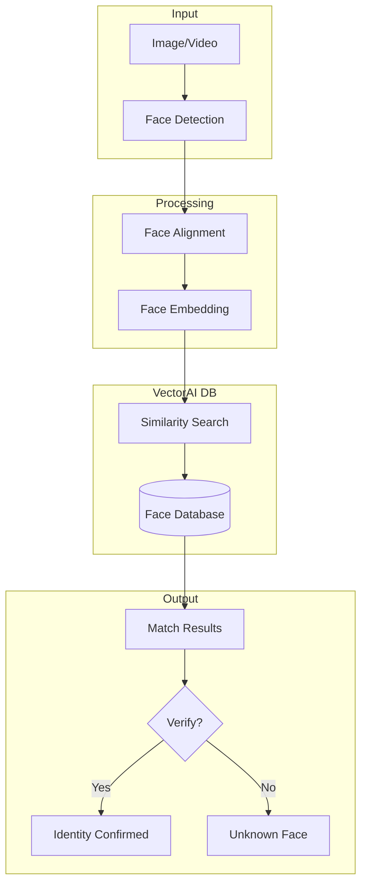

Modern facial recognition systems rely on transforming images into high-dimensional vector embeddings that encode distinctive facial features. Rather than comparing images directly, similarity is measured in vector space, where visually similar faces are positioned closer together.

This representation enables efficient identification, verification, and large-scale search across millions of faces. Traditional approaches cannot handle this effectively.

This guide builds a facial recognition pipeline that combines deep learning-based embedding models with Actian VectorAI DB for fast, scalable similarity search.

## System architecture

The following diagram shows the complete facial recognition pipeline, from raw image or video input through face detection, embedding extraction, and similarity search, to a final identity decision:



## Concepts

Facial recognition systems are built as multistage pipelines, where each component transforms raw images into searchable representations. The following concepts are foundational to how these systems operate at scale:

<AccordionGroup>
  <Accordion title="Face embeddings as identity representations">
    Face embeddings are dense, fixed-length vectors (typically 128-512 dimensions) that encode the distinguishing features of a face. Models such as FaceNet and ArcFace are trained so that embeddings of the same individual cluster closely in vector space, while different identities are pushed farther apart.
    This transformation enables efficient similarity search in Actian VectorAI DB, replacing expensive image comparisons with fast vector distance calculations.
  </Accordion>
  
  <Accordion title="Detection as a prerequisite to recognition">
    Facial recognition begins with detection, which locates and extracts faces from raw images using bounding boxes. Recognition models assume clean, aligned face inputs, making detection a critical preprocessing step.
    Errors at this stage, such as missed or misaligned faces, directly impact downstream embedding quality and overall system accuracy.
  </Accordion>
  
  <Accordion title="Verification vs. large-scale identification">
    Facial recognition systems typically operate in two modes. Verification (1:1) confirms whether a face matches a claimed identity, while identification (1:N) searches across a database to find the closest match.
    Identification introduces additional challenges around scalability and latency, where vector databases like Actian VectorAI DB play a key role in enabling fast nearest-neighbor search across large embedding collections.
  </Accordion>
</AccordionGroup>

## Prerequisites

Before following the implementation steps, ensure your environment meets the following requirements:

- Python 3.9 or later is installed.
- Actian VectorAI DB is running and accessible at `localhost:50051` (see [installation guide](/docs/installation/index)).
- A GPU is optional but strongly recommended for DeepFace embedding extraction at production throughput.
- The following system-level dependencies are installed for OpenCV and DeepFace:
  - On Ubuntu/Debian: `libgl1-mesa-glx libglib2.0-0`.
  - On macOS: Xcode command line tools (`xcode-select --install`).
- At least one face image per person is available for registration.

## Implementation

All code snippets in this guide are designed to be placed in a single Python file and run together using `asyncio.run(main())` at the end. The individual `asyncio.run(...)` calls shown in steps 2 and 3 are only for testing those steps in isolation during development.

### Step 1: Install dependencies

Run the following command to install the three packages required across all steps. This installs DeepFace for embedding extraction, OpenCV for image and video processing, and the Actian VectorAI DB Python client:

```bash
pip install deepface opencv-python actian-vectorai
```

<Note>
Confirm the exact installable package name and version with your Actian VectorAI DB distribution before running this command, as the package name may differ between release channels.
</Note>

### Step 2: Create the face database collection

The following code connects to Actian VectorAI DB and creates a collection named `face_database` configured for 512-dimensional vectors using cosine similarity. If the collection already exists, the function exits without making changes. All imports used across the full implementation are included at the top so they can be placed once at the top of the file:

```python
import asyncio
import uuid
from typing import List, Dict, Optional, Any
import numpy as np
import cv2
from actian_vectorai import AsyncVectorAIClient, VectorParams, Distance, PointStruct
from deepface import DeepFace

async def create_face_collection():
    async with AsyncVectorAIClient("localhost:50051") as db:
        exists = await db.collections.exists("face_database")
        if exists:
            print("Collection already exists")
            return
        
        # Facenet512 produces 512-dimensional embeddings; adjust size if using a different model
        await db.collections.create(
            "face_database",
            vectors_config=VectorParams(
                size=512,
                distance=Distance.Cosine
            )
        )
        print("Face collection created")
```

<Note>
Verify with your Actian engineering team that `AsyncVectorAIClient`, `VectorParams`, `Distance`, and `PointStruct` are exported from `actian_vectorai` with the method signatures used here before running in production.
</Note>

### Step 3: Extract face embeddings

The following two functions extract embeddings from static image files and from live video frames respectively. `extract_face_embedding` returns `None` when no face is detected so the caller can skip the registration step. `extract_embeddings_from_frame` returns an empty list when no faces are detected, and silently drops any face whose bounding box is incomplete to prevent runtime errors downstream:

```python
def extract_face_embedding(
    image_path: str,
    model_name: str = "Facenet512"
) -> Optional[List[float]]:
    """Extract a single face embedding from an image file.
    
    Args:
        image_path: Path to the image file.
        model_name: DeepFace model name (Facenet512, ArcFace, etc.).
    
    Returns:
        A 512-dimensional embedding vector, or None if no face was detected.
    """
    try:
        embeddings = DeepFace.represent(
            img_path=image_path,
            model_name=model_name,
            enforce_detection=True
        )
        
        if embeddings and isinstance(embeddings, list) and "embedding" in embeddings[0]:
            return embeddings[0]["embedding"]
        return None
        
    except Exception as e:
        print(f"Face extraction failed: {e}")
        return None


def extract_embeddings_from_frame(
    frame: np.ndarray,
    model_name: str = "Facenet512"
) -> List[Dict]:
    """Extract embeddings for all faces found in a video frame.
    
    Args:
        frame: An OpenCV frame in BGR format.
        model_name: DeepFace model name.
    
    Returns:
        A list of dicts, each containing an embedding vector, a facial_area
        bounding box, and a confidence score. Faces without a complete
        bounding box (x, y, w, h) are excluded.
    """
    try:
        results = DeepFace.represent(
            img_path=frame,
            model_name=model_name,
            enforce_detection=False
        )
        
        faces = []
        for result in results:
            facial_area = result.get("facial_area", {})
            # Exclude faces that lack a complete bounding box to avoid KeyError in _draw_result
            if not all(k in facial_area for k in ("x", "y", "w", "h")):
                continue
            faces.append({
                "embedding": result["embedding"],
                "facial_area": facial_area,
                "confidence": result.get("face_confidence", 0)
            })
        
        return faces
        
    except Exception as e:
        print(f"Frame extraction failed: {e}")
        return []
```

<Note>
The output shape of `DeepFace.represent()` can vary depending on the detector backend and DeepFace version. Verify that `result["embedding"]`, `result.get("facial_area")`, and `result.get("face_confidence")` are present in your installed version before deploying.
</Note>

### Step 4: Register faces in the database

`register_face` extracts an embedding from a single image and stores it in Actian VectorAI DB as a point with a UUID, the person's ID and name, the source image path, and any optional metadata. `register_multiple_faces` calls `register_face` in a loop to support registering several photos of the same person, which improves recognition accuracy by covering different angles and lighting conditions:

```python
async def register_face(
    image_path: str,
    person_id: str,
    name: str,
    metadata: Optional[Dict[str, Any]] = None
) -> Optional[str]:
    """Register a single face image in the database.
    
    Args:
        image_path: Path to the face image.
        person_id: Unique identifier for this person.
        name: Display name for this person.
        metadata: Any additional key-value pairs to store with the record.
    
    Returns:
        The UUID of the stored face record, or None if registration failed.
    """
    embedding = extract_face_embedding(image_path)
    if embedding is None:
        print("No face detected in image")
        return None
    
    face_id = str(uuid.uuid4())
    
    async with AsyncVectorAIClient("localhost:50051") as db:
        await db.points.upsert(
            "face_database",
            points=[PointStruct(
                id=face_id,
                vector=embedding,
                payload={
                    "person_id": person_id,
                    "name": name,
                    "image_path": image_path,
                    **(metadata or {})
                }
            )]
        )
    
    print(f"Registered face for {name} (ID: {face_id})")
    return face_id


async def register_multiple_faces(
    person_id: str,
    name: str,
    image_paths: List[str]
) -> List[str]:
    """Register multiple photos of the same person.
    
    Args:
        person_id: Unique identifier for this person.
        name: Display name for this person.
        image_paths: Paths to the face images to register.
    
    Returns:
        A list of UUIDs for successfully registered face records.
    """
    face_ids = []
    
    for i, path in enumerate(image_paths):
        face_id = await register_face(
            path,
            person_id,
            name,
            {"photo_index": i}
        )
        if face_id:
            face_ids.append(face_id)
    
    print(f"Registered {len(face_ids)} faces for {name}")
    return face_ids
```

<Note>
Verify with engineering that `db.points.upsert()` accepts a string UUID as the `id` field in `PointStruct`. Some SDK versions may require integer IDs or a different point schema.
</Note>

### Step 5: Search and verify faces

`search_face` converts a query image into an embedding and returns up to `limit` matching records whose cosine similarity score meets or exceeds `threshold`. `verify_identity` performs the same search but restricts the candidate set to faces already registered under `claimed_person_id`, returning a verification result with the matched name and confidence score:

```python
from actian_vectorai import Filter, Conditions

async def search_face(
    image_path: str,
    threshold: float = 0.6,
    limit: int = 5
) -> List[Dict]:
    """Search the database for faces similar to a query image.
    
    Args:
        image_path: Path to the query image.
        threshold: Minimum cosine similarity score (0 to 1) to include a result.
        limit: Maximum number of results to return.
    
    Returns:
        A list of matching records, each with face_id, similarity score,
        person_id, name, and image_path.
    """
    embedding = extract_face_embedding(image_path)
    if embedding is None:
        return []
    
    async with AsyncVectorAIClient("localhost:50051") as db:
        results = await db.points.search(
            "face_database",
            vector=embedding,
            limit=limit,
            with_payload=True,
            score_threshold=threshold
        )
    
    return [
        {
            "face_id": r.id,
            "similarity": r.score,
            "person_id": r.payload.get("person_id"),
            "name": r.payload.get("name"),
            "image_path": r.payload.get("image_path")
        }
        for r in results
    ]


async def verify_identity(
    image_path: str,
    claimed_person_id: str,
    threshold: float = 0.7
) -> Dict:
    """Verify whether a face image matches a claimed identity.
    
    Args:
        image_path: Path to the image to verify.
        claimed_person_id: The person_id to verify against.
        threshold: Minimum cosine similarity score required to confirm a match.
    
    Returns:
        A dict with verified (bool), similarity score, threshold used,
        and matched_name if verified.
    """
    embedding = extract_face_embedding(image_path)
    if embedding is None:
        return {"verified": False, "reason": "No face detected"}
    
    async with AsyncVectorAIClient("localhost:50051") as db:
        results = await db.points.search(
            "face_database",
            vector=embedding,
            filter=Filter.all([
                Conditions.match("person_id", claimed_person_id)
            ]),
            limit=1,
            with_payload=True
        )
    
    if not results:
        return {
            "verified": False,
            "reason": "No registered faces for claimed identity"
        }
    
    best_match = results[0]
    is_verified = best_match.score >= threshold
    
    return {
        "verified": is_verified,
        "similarity": best_match.score,
        "threshold": threshold,
        "matched_name": best_match.payload.get("name") if is_verified else None
    }
```

<Note>
Verify with engineering that `score_threshold` is a supported parameter on `db.points.search()`, that `r.score` represents a cosine similarity value between 0 and 1, and that `Filter.all([Conditions.match(...)])` is the correct filter constructor in your SDK version. If the backend returns a distance metric rather than a similarity score, the threshold values above will need to be adjusted accordingly.
</Note>

### Step 6: Run real-time video recognition

`RealTimeFaceRecognition` opens a video capture source, processes every fifth frame to extract face embeddings, queries the database for each high-confidence detection, and draws a bounding box with the matched name and similarity score on the frame. Labels are only updated on processed frames; on skipped frames the previous overlay remains visible, which can cause brief flickering during fast movement. This is an intentional tradeoff to reduce embedding computation. Cache the last detection results if a consistent per-frame overlay is required:

```python
class RealTimeFaceRecognition:
    
    def __init__(self, threshold: float = 0.6):
        self.threshold = threshold
        self.frame_skip = 5  # Run embedding extraction every Nth frame to limit CPU/GPU load
        self.frame_count = 0
    
    async def process_video(self, video_source: int | str = 0):
        """Open a video source and run face recognition until the user presses q.
        
        Args:
            video_source: Camera index (int) or path to a video file (str).
                          Pass 0 to use the default system camera.
        """
        cap = cv2.VideoCapture(video_source)
        
        while cap.isOpened():
            ret, frame = cap.read()
            if not ret:
                break
            
            self.frame_count += 1
            
            if self.frame_count % self.frame_skip == 0:
                faces = extract_embeddings_from_frame(frame)
                
                for face in faces:
                    if face["confidence"] > 0.9:
                        matches = await self._search_embedding(face["embedding"])
                        self._draw_result(frame, face, matches)
            
            cv2.imshow("Face Recognition", frame)
            
            if cv2.waitKey(1) & 0xFF == ord("q"):
                break
        
        cap.release()
        cv2.destroyAllWindows()
    
    async def _search_embedding(self, embedding: List[float]) -> List[Dict]:
        """Query the database for the closest face to the given embedding."""
        async with AsyncVectorAIClient("localhost:50051") as db:
            results = await db.points.search(
                "face_database",
                vector=embedding,
                limit=1,
                with_payload=True,
                score_threshold=self.threshold
            )
        
        return [
            {"name": r.payload.get("name"), "score": r.score}
            for r in results
        ]
    
    def _draw_result(self, frame: np.ndarray, face: Dict, matches: List[Dict]):
        """Overlay a bounding box and identity label on the frame in place."""
        area = face["facial_area"]
        x, y, w, h = area["x"], area["y"], area["w"], area["h"]
        
        if matches:
            name = matches[0]["name"]
            score = matches[0]["score"]
            color = (0, 255, 0)
            label = f"{name} ({score:.2f})"
        else:
            color = (0, 0, 255)
            label = "Unknown"
        
        cv2.rectangle(frame, (x, y), (x + w, y + h), color, 2)
        cv2.putText(frame, label, (x, y - 10), cv2.FONT_HERSHEY_SIMPLEX, 0.9, color, 2)
```

## Usage example

Place all the functions and the class above in a single Python file. Add the following `main()` function at the bottom of the file. Running the file calls `create_face_collection()` to set up the database, registers three photos of a person, runs a similarity search against a query image, verifies an identity, and then opens a live recognition window:

```python
async def main():
    await create_face_collection()
    
    await register_multiple_faces(
        person_id="person_001",
        name="John Smith",
        image_paths=[
            "photos/john_1.jpg",
            "photos/john_2.jpg",
            "photos/john_3.jpg"
        ]
    )
    
    matches = await search_face("query_photo.jpg", threshold=0.6)
    for match in matches:
        print(f"Match: {match['name']} (similarity: {match['similarity']:.2f})")
    
    result = await verify_identity("verify_photo.jpg", "person_001")
    print(f"Verification: {result}")
    
    recognizer = RealTimeFaceRecognition(threshold=0.65)
    await recognizer.process_video(0)

asyncio.run(main())
```
The `main()` function orchestrates the complete pipeline in sequence. It first calls `create_face_collection()` to initialize the `face_database` collection in Actian VectorAI DB with 512-dimensional cosine-similarity vectors. It then registers three JPEG photos of John Smith (with `person_id="person_001"`) by extracting a Facenet512 embedding from each image and upserting it as a separate point. Next, it runs a similarity search against `query_photo.jpg` using a cosine similarity threshold of `0.6`, printing the name and score for every match that meets the threshold. It then verifies `verify_photo.jpg` against the registered embeddings for `person_001` using the stricter threshold of `0.7` and prints the full verification result dictionary. Finally, it opens the default system camera (`video_source=0`) and starts the real-time recognition loop.
**Expected Output**
```
Face collection created
Registered face for John Smith (ID: 3f2a1b...)
Registered face for John Smith (ID: 7c8d9e...)
Registered face for John Smith (ID: 1a4f5c...)
Registered 3 faces for John Smith
Match: John Smith (similarity: 0.87)
Verification: {'verified': True, 'similarity': 0.91, 'threshold': 0.7, 'matched_name': 'John Smith'}
```
Each output line corresponds to a specific pipeline stage. `Face collection created` confirms that the `face_database` collection was initialized in Actian VectorAI DB. The three `Registered face for John Smith` lines each display the UUID assigned to the embedding extracted from one of the three registration photos. `Registered 3 faces for John Smith` summarizes the total count of successfully stored records for that identity. `Match: John Smith (similarity: 0.87)` shows the top result returned by the similarity search against `query_photo.jpg`, where `0.87` is the cosine similarity score exceeding the `0.6` threshold. The final `Verification` dict shows that `verify_photo.jpg` was confirmed as `person_001` with a similarity of `0.91`, which exceeds the `0.7` verification threshold, and returns `matched_name` as `John Smith`. After the terminal output, an OpenCV window opens showing the camera feed with bounding boxes and name labels overlaid on detected faces. Green boxes indicate a matched identity with the name and score shown; red boxes indicate an unrecognized face. Press `q` to close the window and end the process.

## Performance optimization

Each of the following techniques targets a different bottleneck in the pipeline. GPU acceleration and batching reduce embedding extraction time, caching reduces redundant computation, ANN indexing reduces search latency at large scale, and quantization reduces storage and memory overhead:

- Use GPU acceleration for face embedding extraction.
- Batch-process multiple faces when possible.
- Cache recent embeddings to reduce repeated computation for the same person across consecutive frames.
- Use approximate nearest neighbor (ANN) indexing for databases containing more than a few thousand faces.
- Consider vector quantization to reduce embedding storage size without significantly reducing accuracy.

## Ethical and legal considerations

Facial recognition systems handle sensitive biometric data and require careful attention to legal and ethical obligations before any deployment:

- Ensure compliance with applicable regulations such as GDPR, CCPA, or BIPA.
- Obtain informed consent before collecting or processing facial data.
- Account for bias: all facial recognition models exhibit varying accuracy across demographic groups, which can result in false positives or false negatives at different rates.
- Do not use automated facial recognition as the sole decision mechanism in high-stakes contexts such as law enforcement, hiring, or access control. Always include human review for consequential decisions.

## Next steps

The following cards link to related articles and tutorials that extend the concepts covered in this guide:

<CardGroup cols={2}>
  <Card title="Vector database fundamentals" href="/docs/fundamentals">
    Core concepts for collections, points, vectors, and payloads.
  </Card>
  <Card title="Similarity search" href="/academy/tutorials/similarity-search">
    Search patterns and techniques.
  </Card>
</CardGroup>
