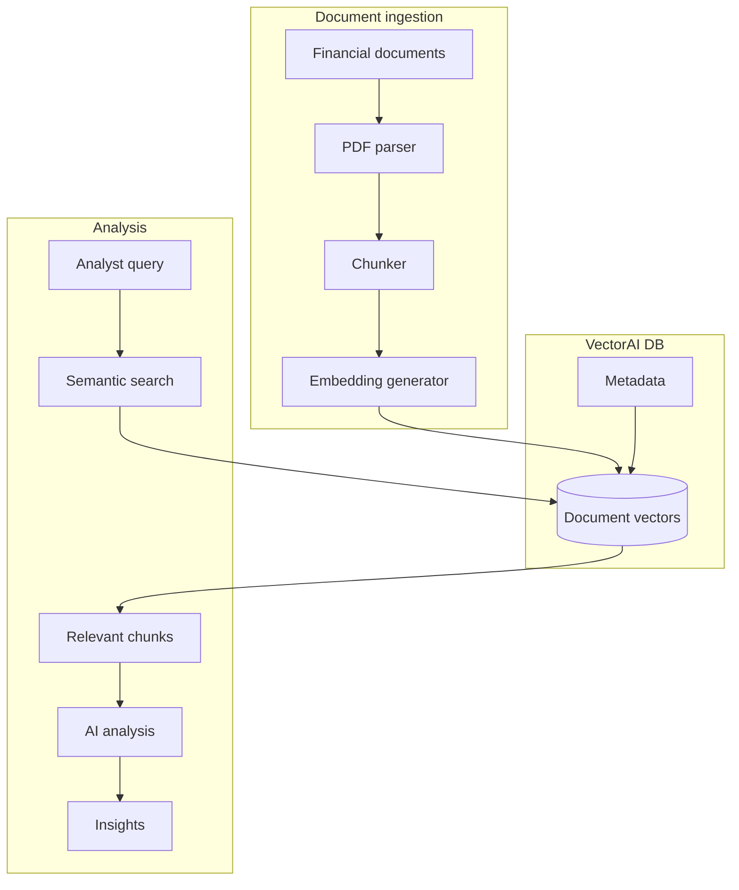

Financial data is not just large—it is ambiguous, contextual, and often deliberately indirect. Earnings reports, SEC filings, and analyst notes rarely state insights plainly. They rely on phrasing like "margin pressure" or "soft demand," where meaning depends on context rather than exact wording.

Traditional keyword search breaks down in this setting. It treats language literally, missing relationships between semantically equivalent phrases. It also fails to surface the insights analysts actually care about.

This guide explains how to build a semantic financial document analysis system powered by VectorAI DB. The system understands meaning, not just text matches, enabling accurate retrieval across complex financial narratives.

## Prerequisites

Before starting, ensure the following are in place:

- A running VectorAI DB instance (see the [installation guide](/docs/installation/docker).)
- Python 3.9 or later.
- An OpenAI API key set as the environment variable `OPENAI_API_KEY`.
- The following packages installed.

Run the following command to install the required packages:

```bash
pip install actian-vectorai openai pypdf
```

## System architecture

The following diagram shows how a financial document flows from raw PDF through ingestion, vector storage, and into AI-powered analysis:



---

## Concepts

Financial document analysis introduces challenges that go beyond standard semantic search. The following concepts are critical when building systems that operate on real-world financial data:

<AccordionGroup>
  <Accordion title="Context-aware document chunking">
    Financial documents are highly structured, and meaning is often tied to sections rather than raw text proximity. Instead of fixed-size chunks, segment documents along logical boundaries such as Management Discussion and Analysis, Risk Factors, or Financial Statements.
    Preserving section-level metadata enables more precise retrieval and allows downstream systems to distinguish between forward-looking statements and historical reporting.
  </Accordion>

  <Accordion title="Financial-domain embeddings">
    Financial language is dense, nuanced, and often indirect. General-purpose embeddings may miss subtle relationships between phrases like "margin compression" and "cost pressures."
    Using domain-adapted models—or validating that your embedding pipeline captures financial semantics—is essential for high-quality retrieval in this space.
  </Accordion>

  <Accordion title="Time-aware retrieval and comparison">
    Financial insights are rarely static—they evolve across reporting periods. A meaningful analysis system must account for time by associating documents with structured temporal metadata such as quarter or fiscal year.
    This enables queries that go beyond retrieval, supporting comparisons like quarter-over-quarter performance or shifts in company outlook.
  </Accordion>
</AccordionGroup>

---

## Implementation

The pipeline covers everything from ingesting raw PDFs to running AI-driven analysis. Each step below builds on the previous one: set up the collection, parse and chunk documents, generate embeddings, index them, build the analyzer, and run the full pipeline.

### Step 1: Set up document processing

The following code imports the required libraries, initializes the OpenAI client, and defines `create_financial_collection()`, which connects to VectorAI DB and creates a `financial_docs` collection with 1536-dimensional cosine vectors. Running `asyncio.run(create_financial_collection())` at the bottom executes the setup immediately:

```python
import asyncio
from actian_vectorai import AsyncVectorAIClient, VectorParams, Distance, PointStruct
import openai
from typing import List, Dict, Optional
import uuid
from datetime import datetime
import re
from pypdf import PdfReader

client = openai.OpenAI()

async def create_financial_collection():
    """Create a collection for financial documents if it does not already exist."""
    async with AsyncVectorAIClient("localhost:50051") as db:
        exists = await db.collections.exists("financial_docs")
        if exists:
            return

        await db.collections.create(
            "financial_docs",
            vectors_config=VectorParams(
                size=1536,
                distance=Distance.Cosine
            )
        )
        print("Financial documents collection created")

asyncio.run(create_financial_collection())
```

### Step 2: Implement document parsing

The following code defines three functions. `parse_financial_pdf()` reads all pages from a PDF and returns the full text, document metadata, and a list of sections. `extract_document_metadata()` uses heuristics to detect the company name and reporting period from the first page. `identify_sections()` scans the full text for known section headers, sorts them by their position in the document, and returns each section as a dictionary with its title and content:

```python
def parse_financial_pdf(file_path: str) -> Dict:
    """Read a financial PDF and return its text, metadata, and sections."""
    reader = PdfReader(file_path)

    full_text = ""
    for page in reader.pages:
        full_text += page.extract_text() + "\n"

    first_page = reader.pages[0].extract_text()
    metadata = extract_document_metadata(first_page, file_path)
    sections = identify_sections(full_text)

    return {
        "metadata": metadata,
        "sections": sections,
        "full_text": full_text
    }

def extract_document_metadata(first_page: str, file_path: str) -> Dict:
    """Extract company name and reporting period from the first page."""
    metadata = {
        "file_path": file_path,
        "processed_at": datetime.utcnow().isoformat()
    }

    lines = first_page.split("\n")[:10]
    for line in lines:
        if 5 < len(line.strip()) < 50:
            metadata["company"] = line.strip()
            break

    date_patterns = [
        r"Q[1-4]\s+20\d{2}",
        r"FY\s*20\d{2}",
        r"(January|February|March|April|May|June|July|August|September|October|November|December)\s+\d{1,2},?\s+20\d{2}"
    ]

    for pattern in date_patterns:
        match = re.search(pattern, first_page, re.IGNORECASE)
        if match:
            metadata["period"] = match.group()
            break

    return metadata

def identify_sections(text: str) -> List[Dict]:
    """Split text into named sections based on known financial document headers.

    All headers are matched first, then sorted by their position in the document
    so sections are returned in reading order regardless of the header list order.
    """
    section_headers = [
        "Management's Discussion",
        "Risk Factors",
        "Financial Statements",
        "Notes to Financial Statements",
        "Revenue Recognition",
        "Forward-Looking Statements",
        "Executive Summary",
        "Business Overview"
    ]

    found = []
    for header in section_headers:
        pattern = re.compile(rf"^{re.escape(header)}.*$", re.MULTILINE | re.IGNORECASE)
        match = pattern.search(text)
        if match:
            found.append((match.start(), header, match))

    found.sort(key=lambda x: x[0])

    sections = []
    current_section = {"title": "Introduction", "content": "", "start": 0}

    for pos, header, match in found:
        current_section["content"] = text[current_section["start"]:pos].strip()
        if current_section["content"]:
            sections.append(current_section)

        current_section = {
            "title": header,
            "content": "",
            "start": match.start()
        }

    current_section["content"] = text[current_section["start"]:].strip()
    if current_section["content"]:
        sections.append(current_section)

    return sections
```

### Step 3: Implement chunking

The following code defines `chunk_financial_document()`, which iterates over each section and splits its text into overlapping chunks of up to 1000 characters. Each chunk boundary is aligned to the nearest sentence ending to avoid cutting mid-sentence. A guard prevents an infinite loop when the remaining text is shorter than the overlap window:

```python
def chunk_financial_document(
    document: Dict,
    chunk_size: int = 1000,
    chunk_overlap: int = 200
) -> List[Dict]:
    """Split a parsed document into overlapping text chunks, one set per section.

    Each chunk includes the section title and all document-level metadata
    so that retrieval results can be filtered and attributed to their source.
    """
    chunks = []
    metadata = document["metadata"]

    for section in document["sections"]:
        section_text = section["content"]
        section_title = section["title"]

        start = 0
        while start < len(section_text):
            end = start + chunk_size

            if end < len(section_text):
                sentence_end = section_text.rfind(".", start, end)
                if sentence_end > start + chunk_size // 2:
                    end = sentence_end + 1

            chunk_text = section_text[start:end].strip()

            if chunk_text:
                chunks.append({
                    "id": str(uuid.uuid4()),
                    "text": chunk_text,
                    "section": section_title,
                    "chunk_index": len(chunks),
                    **metadata
                })

            next_start = end - chunk_overlap
            if next_start <= start:
                next_start = start + 1
            start = next_start

    return chunks
```

### Step 4: Index documents

`embed_texts()` calls the OpenAI embeddings API synchronously and blocks until the response returns. Keep this in mind when integrating into larger async pipelines.

The following code defines `embed_texts()`, which sends a batch of text strings to OpenAI and returns a list of embedding vectors. `index_financial_document()` orchestrates the full ingestion sequence: it parses the PDF, chunks the result, generates embeddings for every chunk, and upserts all vectors into the `financial_docs` collection. It returns the number of chunks indexed, or 0 if no text was extracted:

```python
def embed_texts(texts: List[str]) -> List[List[float]]:
    """Send texts to the OpenAI embeddings API and return the resulting vectors.

    This function is synchronous and blocks until the API responds.
    """
    response = client.embeddings.create(
        input=texts,
        model="text-embedding-3-small"
    )
    return [d.embedding for d in response.data]

async def index_financial_document(
    file_path: str,
    document_type: str = "10-K"
) -> int:
    """Parse, chunk, embed, and upsert a financial PDF into VectorAI DB.

    Args:
        file_path: Path to the PDF file.
        document_type: Filing type such as 10-K, 10-Q, or 8-K.

    Returns:
        Number of chunks indexed, or 0 if no text was extracted.
    """
    document = parse_financial_pdf(file_path)
    document["metadata"]["document_type"] = document_type

    chunks = chunk_financial_document(document)

    if not chunks:
        print(f"No text extracted from {file_path}. Skipping indexing.")
        return 0

    texts = [c["text"] for c in chunks]
    embeddings = embed_texts(texts)

    points = [
        PointStruct(
            id=chunk["id"],
            vector=embedding,
            payload={
                "text": chunk["text"],
                "section": chunk["section"],
                "company": chunk.get("company", "Unknown"),
                "period": chunk.get("period", "Unknown"),
                "document_type": document_type,
                "file_path": chunk["file_path"],
                "chunk_index": chunk["chunk_index"]
            }
        )
        for chunk, embedding in zip(chunks, embeddings)
    ]

    async with AsyncVectorAIClient("localhost:50051") as db:
        await db.points.upsert("financial_docs", points=points)

    print(f"Indexed {len(points)} chunks from {file_path}")
    return len(points)
```

### Step 5: Build the analysis system

The following code defines the `FinancialAnalyzer` class, which provides three methods. `search()` embeds a natural language query and retrieves the most relevant chunks from the collection, with optional filters for company, document type, and section. `analyze_topic()` retrieves relevant chunks and passes them to GPT-4o to produce a cited analysis. `compare_companies()` retrieves chunks per company and asks GPT-4o for a structured comparison. `extract_metrics()` queries specific metrics per company and uses GPT-4o Mini to extract values from the retrieved text.

Note that each chunk passed to the LLM is truncated to 500 characters. Precise figures may require cross-referencing the full source document:

```python
from actian_vectorai import Filter, Conditions

class FinancialAnalyzer:
    """AI-powered financial document analyzer."""

    def __init__(self):
        self.llm = openai.OpenAI()

    async def search(
        self,
        query: str,
        company: Optional[str] = None,
        document_type: Optional[str] = None,
        section: Optional[str] = None,
        limit: int = 10
    ) -> List[Dict]:
        """Embed a query and return the closest matching document chunks.

        Args:
            query: Natural language query.
            company: Restrict results to this company name.
            document_type: Restrict results to this filing type.
            section: Restrict results to this document section.
            limit: Maximum number of results to return.

        Returns:
            List of matching chunks, each with a relevance score and payload fields.
        """
        query_vector = embed_texts([query])[0]

        conditions = []
        if company:
            conditions.append(Conditions.match("company", company))
        if document_type:
            conditions.append(Conditions.match("document_type", document_type))
        if section:
            conditions.append(Conditions.match("section", section))

        async with AsyncVectorAIClient("localhost:50051") as db:
            results = await db.points.search(
                "financial_docs",
                vector=query_vector,
                filter=Filter.all(conditions) if conditions else None,
                limit=limit,
                with_payload=True
            )

        return [
            {"score": r.score, **r.payload}
            for r in results
        ]

    async def analyze_topic(
        self,
        topic: str,
        company: Optional[str] = None
    ) -> Dict:
        """Retrieve relevant chunks and generate a cited analysis of the topic.

        Args:
            topic: Topic to analyze.
            company: Restrict retrieval to this company.

        Returns:
            Dictionary containing the analysis text and a list of source references.
        """
        results = await self.search(topic, company=company, limit=10)

        if not results:
            return {"analysis": "No relevant information found", "sources": []}

        context = "Financial document excerpts:\n\n"
        for i, r in enumerate(results, 1):
            context += f"[{i}] {r['company']} - {r['section']} ({r['period']}):\n"
            context += f"{r['text'][:500]}...\n\n"

        response = self.llm.chat.completions.create(
            model="gpt-4o",
            messages=[{
                "role": "system",
                "content": (
                    "You are a financial analyst. Analyze the provided document excerpts "
                    "and provide insights on the requested topic. "
                    "Cite sources using [1], [2], etc. "
                    "Be specific about numbers and trends."
                )
            }, {
                "role": "user",
                "content": f"Analyze: {topic}\n\n{context}"
            }]
        )

        return {
            "topic": topic,
            "analysis": response.choices[0].message.content,
            "sources": [
                {
                    "company": r["company"],
                    "section": r["section"],
                    "period": r["period"],
                    "relevance": r["score"]
                }
                for r in results[:5]
            ]
        }

    async def compare_companies(
        self,
        companies: List[str],
        topic: str
    ) -> Dict:
        """Retrieve chunks per company and produce a structured comparison.

        Args:
            companies: List of company names to compare.
            topic: Topic on which to compare them.

        Returns:
            Dictionary containing the topic, company list, and comparison text.
        """
        company_data = {}

        for company in companies:
            results = await self.search(topic, company=company, limit=5)
            company_data[company] = results

        context = f"Compare these companies on: {topic}\n\n"
        for company, results in company_data.items():
            context += f"## {company}\n"
            for r in results:
                context += f"- {r['section']}: {r['text'][:300]}...\n"
            context += "\n"

        response = self.llm.chat.completions.create(
            model="gpt-4o",
            messages=[{
                "role": "system",
                "content": (
                    "You are a financial analyst comparing companies. "
                    "Provide a structured comparison with: "
                    "1. Key differences. "
                    "2. Relative strengths and weaknesses. "
                    "3. Risk factors. "
                    "Be specific and cite evidence from the documents."
                )
            }, {
                "role": "user",
                "content": context
            }]
        )

        return {
            "topic": topic,
            "companies": companies,
            "comparison": response.choices[0].message.content
        }

    async def extract_metrics(
        self,
        company: str,
        metrics: List[str]
    ) -> Dict:
        """Search for each metric in the Financial Statements section and extract its value.

        Args:
            company: Company name to search.
            metrics: List of metric names to extract, such as Total Revenue or Gross Margin.

        Returns:
            Dictionary with the company name and a dict of metric names to value and period.
        """
        results = {}

        for metric in metrics:
            search_results = await self.search(
                metric,
                company=company,
                section="Financial Statements",
                limit=3
            )

            if search_results:
                context = "\n".join([r["text"] for r in search_results])

                response = self.llm.chat.completions.create(
                    model="gpt-4o-mini",
                    messages=[{
                        "role": "user",
                        "content": (
                            f"Extract the {metric} value from this text. "
                            f"Return just the number and unit.\n\n{context}"
                        )
                    }]
                )

                results[metric] = {
                    "value": response.choices[0].message.content.strip(),
                    "source_period": search_results[0].get("period", "Unknown")
                }
            else:
                results[metric] = {"value": "Not found", "source_period": None}

        return {"company": company, "metrics": results}
```

### Step 6: Usage example

The following code indexes three earnings PDFs as 10-K filings, then runs topic analysis for Apple, a cloud revenue comparison between Microsoft and Google, and metric extraction for Apple. Running it prints indexed chunk counts, a cited analysis paragraph, a structured company comparison, and three extracted metric values with their reporting periods:

```python
async def main():
    await index_financial_document("earnings/AAPL_Q4_2024.pdf", "10-K")
    await index_financial_document("earnings/MSFT_Q4_2024.pdf", "10-K")
    await index_financial_document("earnings/GOOGL_Q4_2024.pdf", "10-K")

    analyzer = FinancialAnalyzer()

    print("=== Revenue growth analysis ===")
    result = await analyzer.analyze_topic(
        "revenue growth drivers and challenges",
        company="Apple Inc"
    )
    print(result["analysis"])

    print("\n=== Cloud revenue comparison ===")
    comparison = await analyzer.compare_companies(
        companies=["Microsoft", "Google"],
        topic="cloud computing revenue and growth"
    )
    print(comparison["comparison"])

    print("\n=== Key metrics ===")
    metrics = await analyzer.extract_metrics(
        company="Apple Inc",
        metrics=["Total Revenue", "Gross Margin", "R&D Expenses"]
    )
    for metric, data in metrics["metrics"].items():
        print(f"{metric}: {data['value']} ({data['source_period']})")

asyncio.run(main())
```
This code indexes three Q4 2024 earnings PDFs — Apple, Microsoft, and Google — as `10-K` filings by calling `index_financial_document()` for each file. It then instantiates `FinancialAnalyzer` and runs three queries: a topic analysis of Apple's revenue growth drivers filtered to the company `"Apple Inc"`, a structured comparison of Microsoft and Google on cloud computing revenue, and a metric extraction for Apple targeting Total Revenue, Gross Margin, and R&D Expenses from the Financial Statements section. The output reports the number of chunks indexed per file, a cited narrative analysis of Apple's revenue trends sourced from the top-ranked document chunks, a side-by-side cloud revenue comparison between Microsoft Azure and Google Cloud, and the three extracted metric values with their associated reporting period.
**Expected Output**
```
Indexed 142 chunks from earnings/AAPL_Q4_2024.pdf
Indexed 138 chunks from earnings/MSFT_Q4_2024.pdf
Indexed 155 chunks from earnings/GOOGL_Q4_2024.pdf

=== Revenue growth analysis ===
Apple's Q4 2024 revenue growth was driven primarily by Services [1], which
reached $24.2B, up 12% year-over-year. iPhone revenue faced headwinds in
China [2], partially offset by strength in India and emerging markets [3].

=== Cloud revenue comparison ===
Microsoft Azure grew 28% year-over-year [1], outpacing Google Cloud at 22% [2].
Azure's enterprise contracts and OpenAI integrations drove differentiation [1],
while Google Cloud improved operating margin from -1% to 9% [2].

=== Key metrics ===
Total Revenue: $94.9B (Q4 2024)
Gross Margin: 46.2% (Q4 2024)
R&D Expenses: $7.3B (Q4 2024)
```

---

## Next steps

The following cards link to related articles and tutorials that extend the concepts covered in this guide:

<CardGroup cols={2}>
  <Card title="RAG fundamentals" href="/academy/articles/general-overview-of-rag">
    Retrieval-augmented generation
  </Card>
  <Card title="Vector databases" href="/academy/articles/understanding-vector-databases">
    Vector database fundamentals
  </Card>
  <Card title="Predicate filters" href="/academy/tutorials/predicate-filters">
    Advanced metadata filtering
  </Card>
  <Card title="Similarity search" href="/academy/tutorials/similarity-search">
    Search patterns and techniques
  </Card>
</CardGroup>
