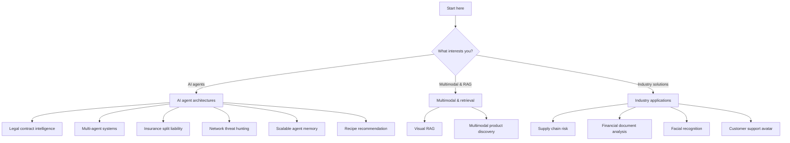

These articles cover real-world AI agent architectures, multimodal systems, and industry-specific applications built with Actian VectorAI DB. Each article walks through a complete implementation — from data modeling and vector ingestion to semantic retrieval, filtering, and reasoning.

## Choose your focus area

Use the flowchart below to navigate to the article category that matches your interest. Each branch leads to a group of articles organized by theme.

## AI agent architectures

These articles show how to build intelligent agents that combine semantic retrieval with domain-specific reasoning.

<CardGroup cols={2}>
  <Card title="AI legal contract intelligence agent" href="/academy/articles/ai-legal-contract-intelligence-agent">
    Build an AI-powered legal contract analysis system with cross-collection lookup, retrieval sorted with OrderBy, connection pooling, and quantization-aware search.
  </Card>
  <Card title="AI clinical trial patient matching agent" href="/academy/articles/building-a-reliable-multi-agent-system">
    Build a clinical trial patient matching system using Euclidean and Manhattan distance metrics, scalar quantization, IVF indexing, server-side fusion, and UUID payload indexes.
  </Card>
  <Card title="AI insurance split liability agent" href="/academy/articles/insurance-split-liability-agent">
    Build an insurance split liability workflow with named vectors, multi-stage prefetch queries, batch search, datetime filters, geo-radius filtering, and payload mutation.
  </Card>
  <Card title="AI network threat hunting agent" href="/academy/articles/ai-network-threat-hunting-agent-with-vector-databases">
    Build a network anomaly detection system with SmartBatcher streaming ingestion, full-text search, query batching, nested filters, condition operators, and collection lifecycle management.
  </Card>
  <Card title="Scalable agent memory" href="/academy/articles/building-a-scalable-agent-memory-with-actian-vector-ai-database">
    Build a scalable agent memory system with cross-collection lookup, retrieval sorted with OrderBy, WAL and optimizer tuning, and strict deletion.
  </Card>
  <Card title="AI recipe recommendation agent" href="/academy/articles/ai-recipe-recommendation-agent">
    Build a recipe recommendation agent that matches cravings through semantic search, filters by dietary restrictions and ingredients, and learns preferences over time.
  </Card>
</CardGroup>

## Multimodal and retrieval

These articles cover how to combine text, image, and document embeddings for rich retrieval experiences.

<CardGroup cols={2}>
  <Card title="Multivector document intelligence with Visual RAG" href="/academy/articles/multivector-document-intelligence-with-visual-rag">
    Build a multimodal document intelligence system that embeds PDF pages as images with CLIP and generates answers using GPT-4o vision.
  </Card>
  <Card title="Next-Gen product discovery with multimodal AI" href="/academy/articles/next-gen-product-discovery-with-multimodal-ai">
    Build a multimodal hybrid search system combining CLIP dense embeddings and BM25 sparse scoring for semantic and keyword product retrieval.
  </Card>
</CardGroup>

## Industry applications

These articles apply vector search to solve real-world problems across specific industries.

<CardGroup cols={2}>
  <Card title="AI supply chain inventory risk intelligence agent" href="/academy/articles/supply-chain-inventory-management-agent">
    Build a supply chain risk intelligence workflow with semantic retrieval, payload filters, and a lightweight reasoning layer for stockout prediction.
  </Card>
  <Card title="Financial document analysis" href="/academy/articles/financial-document-analysis">
    Build AI-powered systems for analyzing financial documents using semantic search and structured metadata filtering.
  </Card>
  <Card title="Facial recognition with vector embeddings" href="/academy/articles/facial-recognition">
    Implement facial recognition using face embeddings and VectorAI DB for identity verification and search.
  </Card>
  <Card title="Avatar-Based assistant for customer support" href="/academy/articles/avatar-based-assistant-for-customer-support">
    Build an intelligent avatar assistant that retrieves knowledge and provides personalized customer support.
  </Card>
</CardGroup>

## Article summary

The table below lists every article alongside its domain and the specific VectorAI DB features it covers, so you can find an article based on the capability you want to learn.

| Article | Domain | Key VectorAI DB features |
|---------|--------|--------------------------|
| [Legal contract intelligence](/academy/articles/ai-legal-contract-intelligence-agent) | Legal | Cross-collection lookup, retrieval sorted with OrderBy, connection pooling, quantization |
| [Multi-agent systems](/academy/articles/building-a-reliable-multi-agent-system) | Healthcare | Euclidean/Manhattan distance, scalar quantization, IVF, fusion |
| [Insurance split liability](/academy/articles/insurance-split-liability-agent) | Insurance | Named vectors, prefetch, batch search, geo-radius, datetime filters |
| [Network threat hunting](/academy/articles/ai-network-threat-hunting-agent-with-vector-databases) | Cybersecurity | SmartBatcher, full-text search, query batching, nested filters, condition operators |
| [Scalable agent memory](/academy/articles/building-a-scalable-agent-memory-with-actian-vector-ai-database) | Infrastructure | Cross-collection, WAL tuning, optimizer config, strict deletion |
| [Recipe recommendation](/academy/articles/ai-recipe-recommendation-agent) | Consumer | Semantic search, payload filters, preference learning |
| [Visual RAG](/academy/articles/multivector-document-intelligence-with-visual-rag) | Document AI | CLIP embeddings, multimodal retrieval, GPT-4o vision |
| [Multimodal product discovery](/academy/articles/next-gen-product-discovery-with-multimodal-ai) | E-commerce | CLIP + BM25 hybrid search, sparse/dense fusion |
| [Supply chain risk](/academy/articles/supply-chain-inventory-management-agent) | Logistics | Semantic retrieval, payload filters, risk reasoning |
| [Financial document analysis](/academy/articles/financial-document-analysis) | Finance | Semantic search, structured metadata filtering |
| [Facial recognition](/academy/articles/facial-recognition) | Security | Face embeddings, identity verification, similarity search |
| [Customer support avatar](/academy/articles/avatar-based-assistant-for-customer-support) | Customer service | Knowledge retrieval, personalized responses |

<Tip>
Each article is self-contained — pick the one that matches your use case and follow along. If you are new to VectorAI DB, then start with the [tutorials](/academy/tutorials/index) first to build foundational skills.
</Tip>
