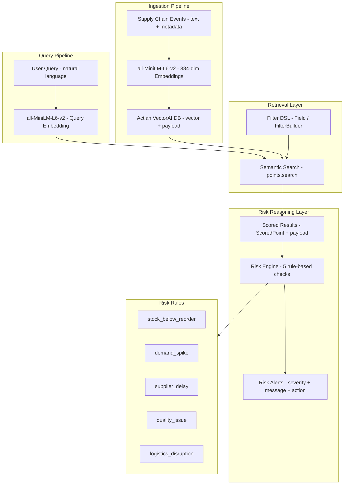

Supply chains rarely fail because of a single obvious signal. More often, disruptions build gradually and combine into a hidden risk pattern:

- Supplier delays slow replenishment before stock runs out.
- Rising demand accelerates inventory depletion.
- Regional logistics issues block inbound shipments.
- Warehouse imbalances leave some locations critically understocked.

Traditional inventory systems track structured data well, but they are not designed to recognize semantically similar incidents across messy operational events.

In this tutorial, you will build an AI supply chain inventory risk intelligence agent. It uses Actian VectorAI DB to detect inventory risk patterns before they become stockouts. The system will:

- Ingest supply chain events and convert them into embeddings.
- Store events with structured metadata in Actian VectorAI DB.
- Retrieve similar historical incidents using semantic search and payload filters.
- Generate risk alerts using a lightweight reasoning layer.

## Architecture overview

The agent is built around four connected stages:

- **Ingestion pipeline** — Converts raw supply chain events into embeddings and stores them in Actian VectorAI DB.
- **Query pipeline** — Embeds incoming natural-language questions.
- **Retrieval layer** — Combines semantic search with payload filters to surface relevant historical incidents.
- **Risk reasoning layer** — Evaluates each result against five rule-based checks to generate actionable alerts.

The diagram below shows how supply chain events flow through embeddings, vector storage, semantic retrieval with payload filters, and the risk reasoning layer.



## Environment setup

This tutorial requires Python, a sentence embedding model, and the Actian VectorAI Python SDK. Run the following command to install both required packages:

```bash
pip install actian-vectorai sentence-transformers
```

Each package serves a specific role in the pipeline:

- `actian-vectorai` — Official Python SDK for Actian VectorAI DB (async/sync clients, Filter DSL, gRPC transport).
- `sentence-transformers` — For generating text embeddings with `all-MiniLM-L6-v2`.

## Implementation

This section walks through the implementation steps for building the inventory risk intelligence workflow using Actian VectorAI DB.

### Step 1: Import dependencies and configure

The following block imports the Actian VectorAI client, the embedding model, and defines the connection endpoint and collection settings. Running it prints a confirmation that the configuration was loaded correctly.

```python
# Core Actian VectorAI SDK — client, distance metric, filter helpers, and data types
from actian_vectorai import (
    AsyncVectorAIClient,
    Distance,
    Field,
    FilterBuilder,
    PointStruct,
    VectorParams,
)
# HNSW index tuning parameters
from actian_vectorai.models.collections import HnswConfigDiff
# Sentence embedding model for converting event text to dense vectors
from sentence_transformers import SentenceTransformer

# gRPC endpoint for the Actian VectorAI server
SERVER = "localhost:50051"
# Name of the vector collection that stores supply chain events
COLLECTION = "Supply-Chain-Risk"
# Lightweight model that produces 384-dimensional embeddings
EMBED_MODEL = "all-MiniLM-L6-v2"
EMBED_DIM = 384
# Maximum number of similar events to retrieve per query
TOP_K = 5

# Load the embedding model once at startup to avoid repeated initialization overhead
model = SentenceTransformer(EMBED_MODEL)

print(f"VectorAI Server: {SERVER}")
print(f"Collection: {COLLECTION}")
print(f"Embedding model: {EMBED_MODEL} ({EMBED_DIM}-dim)")
```

Every component is configured upfront. The key settings are:

- VectorAI server — The Actian VectorAI gRPC endpoint (default port `50051`).
- Collection name — Identifies the vector collection for supply chain events.
- Embedding model — Converts event text into 384-dimensional dense vectors.

Running this configuration block prints the following confirmation:

```text
VectorAI Server: localhost:50051
Collection: Supply-Chain-Risk
Embedding model: all-MiniLM-L6-v2 (384-dim)
```

### Step 2: Define embedding helpers

The following functions wrap the embedding model so the rest of the pipeline can convert event text to vectors with a single call. `embed_text` handles single strings; `embed_texts` processes a list of strings in one model pass, which is more efficient when ingesting batches.

```python
def embed_text(text: str) -> list[float]:
    """Generate a 384-dimensional embedding for a text string."""
    return model.encode(text).tolist()

def embed_texts(texts: list[str]) -> list[list[float]]:
    """Batch-embed multiple text strings in a single model pass."""
    return model.encode(texts).tolist()
```

The embedding model turns natural-language event summaries into numerical representations that preserve semantic meaning. This allows the vector database to retrieve related incidents even when the wording is different. For example, these two event descriptions map to nearby vectors:

- "Supplier delay caused battery shortage risk."
- "Low battery stock after repeated replenishment delays."

### Step 3: Initialize the vector database collection

Collections in Actian VectorAI DB define the vector dimensionality, distance metric, and index parameters. The following code calls `get_or_create`, which is idempotent. It creates the collection if it does not exist and skips creation if it already does. Running this block prints a confirmation that the collection is ready.

```python
import asyncio

async def ensure_collection():
    async with AsyncVectorAIClient(url=SERVER) as client:
        # get_or_create is idempotent — safe to run on every startup
        await client.collections.get_or_create(
            name=COLLECTION,
            # 384-dim cosine space matches the all-MiniLM-L6-v2 output
            vectors_config=VectorParams(size=EMBED_DIM, distance=Distance.Cosine),
            # Higher m and ef_construct improve recall at the cost of build time
            hnsw_config=HnswConfigDiff(m=32, ef_construct=256),
        )
    print(f"Collection '{COLLECTION}' ready.")

asyncio.run(ensure_collection())
```

This step creates a dedicated vector space for supply chain risk events. The configuration tells VectorAI DB the following:

- Vectors will have 384 dimensions.
- Similarity is computed with cosine distance.
- The HNSW index uses `m=32` connections and `ef_construct=256` for high recall.

Once the collection is ready, the following message is printed:

```text
Collection 'Supply-Chain-Risk' ready.
```

### Step 4: Prepare sample supply chain events

The following block defines a dataset of realistic supply chain incidents. Each event includes an `event_text` field for semantic meaning and structured fields for payload filtering. Running it prints the number of events loaded.

```python
events = [
    {
        # Natural-language summary used for embedding and semantic search
        "event_text": "Supplier Alpha delayed two laptop battery shipments to Warehouse West while demand increased by 22 percent.",
        "event_type": "supplier_delay",
        "product": "laptop_battery",
        "category": "electronics",
        "supplier": "Supplier Alpha",
        "warehouse": "Warehouse West",
        "region": "Southeast Asia",
        # Current and minimum acceptable stock thresholds
        "stock_level": 18,
        "reorder_point": 40,
        "risk_level": "high",
        "demand_change_pct": 22.0,
        "created_at": "2026-03-10T09:30:00Z",
        "location": {"lat": 13.7563, "lon": 100.5018},
    },
    {
        "event_text": "Port congestion slowed inbound electronics shipments to Warehouse South.",
        "event_type": "logistics_disruption",
        "product": "microcontroller",
        "category": "electronics",
        "supplier": "Supplier Beta",
        "warehouse": "Warehouse South",
        "region": "South Asia",
        "stock_level": 55,
        "reorder_point": 35,
        "risk_level": "medium",
        "demand_change_pct": 8.0,
        "created_at": "2026-03-08T12:00:00Z",
        "location": {"lat": 6.9271, "lon": 79.8612},
    },
    {
        "event_text": "Warehouse West reported critically low battery safety stock after repeated supplier delays.",
        "event_type": "inventory_alert",
        "product": "laptop_battery",
        "category": "electronics",
        "supplier": "Supplier Alpha",
        "warehouse": "Warehouse West",
        "region": "Southeast Asia",
        "stock_level": 9,
        "reorder_point": 40,
        "risk_level": "high",
        "demand_change_pct": 25.0,
        "created_at": "2026-03-11T08:45:00Z",
        "location": {"lat": 13.7563, "lon": 100.5018},
    },
]

print(f"{len(events)} events loaded.")
```

Actian VectorAI DB stores rich payload metadata alongside vectors, making it possible to combine semantic similarity with operational filtering. Each event carries both unstructured text (for embeddings) and structured fields (for filters).

### Step 5: Embed and ingest events into VectorAI DB

The following code embeds each event description, packages it as a `PointStruct` with payload, and upserts all points into the collection in a single operation. Running it prints the number of events ingested and the updated total stored in the collection.

```python
async def ingest_events(events):
    texts = [e["event_text"] for e in events]
    # Batch-embed all event texts in one model call for efficiency
    vectors = embed_texts(texts)

    async with AsyncVectorAIClient(url=SERVER) as client:
        # Offset new IDs by the existing count to avoid collisions on repeated runs
        existing = await client.vde.get_vector_count(COLLECTION)

        points = []
        for i, (event, vector) in enumerate(zip(events, vectors)):
            payload = {**event}
            # VectorAI DB stores geo coordinates as flat fields, not nested objects
            if "location" in payload and payload["location"] is not None:
                loc = payload.pop("location")
                payload["lat"] = loc["lat"]
                payload["lon"] = loc["lon"]

            points.append(
                PointStruct(
                    id=existing + i,
                    vector=vector,
                    payload=payload,
                )
            )

        await client.points.upsert(COLLECTION, points=points)
        # Flush immediately so vectors are queryable without waiting for background persistence
        await client.vde.flush(COLLECTION)
        total = await client.vde.get_vector_count(COLLECTION)

    print(f"Ingested {len(points)} events. Total in collection: {total}")

asyncio.run(ingest_events(events))
```

Each supply chain event becomes a searchable point in VectorAI DB. The three fields that make up each point are:

- `id` — Sequential integer identifier.
- `vector` — 384-dim dense embedding from `all-MiniLM-L6-v2`.
- `payload` — All structured metadata (category, supplier, stock level, region, etc.).

The `vde.flush()` call ensures vectors are persisted to disk immediately. After ingestion, the pipeline prints the following confirmation:

```text
Ingested 3 events. Total in collection: 3
```

### Step 6: Run basic semantic search

The following code embeds a natural-language inventory risk query and uses `points.search` to retrieve the most semantically similar events from the collection. Running it prints each result's ID, similarity score, and a preview of the event text.

```python
async def semantic_search(query: str, top_k: int = TOP_K):
    # Embed the query using the same model used during ingestion
    query_vector = embed_text(query)
    async with AsyncVectorAIClient(url=SERVER) as client:
        results = await client.points.search(
            COLLECTION,
            vector=query_vector,
            limit=top_k,
            # Return the full payload so the caller can inspect event metadata
            with_payload=True,
        ) or []
    return results

query = "Laptop battery stock is falling while the supplier is delayed and demand is rising."
results = asyncio.run(semantic_search(query))

for r in results:
    print(f"  id={r.id}  score={r.score:.4f}  event={r.payload['event_text'][:80]}...")
```

This is the semantic search core of the system. The `points.search` method accepts the following parameters:

- `vector` — The query embedding.
- `limit` — Number of results.
- `with_payload` — Whether to return metadata.

Results are ranked by cosine similarity. The search returns the three ingested events in the following order:

```text
  id=0  score=0.9200  event=Supplier Alpha delayed two laptop battery shipments to Warehouse West whi...
  id=2  score=0.8900  event=Warehouse West reported critically low battery safety stock after repeated...
  id=1  score=0.5100  event=Port congestion slowed inbound electronics shipments to Warehouse South...
```

### Step 7: Apply structured payload filters using the Filter DSL

Actian VectorAI provides a type-safe `Field` / `FilterBuilder` API for payload filtering. The following code adds a server-side filter that restricts results to electronics events with stock below 20 before ranking by similarity. Running it prints only the two events that pass both the category and stock-level filters.

```python
async def filtered_search(query: str, category: str, stock_below: int, top_k: int = TOP_K):
    query_vector = embed_text(query)

    # Build a server-side filter: only return electronics with stock below the threshold
    filter_obj = (
        FilterBuilder()
        .must(Field("category").eq(category))
        .must(Field("stock_level").lt(float(stock_below)))
        .build()
    )

    async with AsyncVectorAIClient(url=SERVER) as client:
        results = await client.points.search(
            COLLECTION,
            vector=query_vector,
            limit=top_k,
            with_payload=True,
            filter=filter_obj,
        ) or []
    return results

results = asyncio.run(filtered_search(query, category="electronics", stock_below=20))

for r in results:
    print(f"  id={r.id}  score={r.score:.4f}  stock={r.payload['stock_level']}  product={r.payload['product']}")
```

This combines semantic search with Actian VectorAI's Filter DSL. The three filter expressions used here are:

- `Field("category").eq("electronics")` — Exact match filter.
- `Field("stock_level").lt(20.0)` — Numeric range filter.
- `FilterBuilder().must(...)` — AND logic.

The filter is applied server-side before ranking, so only matching points are considered. With the category and stock filters applied, only the two low-stock laptop battery events are returned:

```text
  id=0  score=0.9200  stock=18  product=laptop_battery
  id=2  score=0.8900  stock=9   product=laptop_battery
```

### Step 8: Add boolean logic with must, should, and must_not

The Filter DSL supports `must` (AND), `should` (OR/preference), and `must_not` (exclusion) for complex business queries. The following code demonstrates all three clause types in a single filter. Running it returns only the Supplier Alpha events that match the low-stock electronics criteria, with the deprecated-region events excluded.

```python
async def boolean_filtered_search(query: str, top_k: int = TOP_K):
    query_vector = embed_text(query)

    filter_obj = (
        FilterBuilder()
        # must: ALL of these conditions must match
        .must(Field("category").eq("electronics"))
        .must(Field("stock_level").lt(20.0))
        # should: prefer events from Supplier Alpha (boosts their score)
        .should(Field("supplier").eq("Supplier Alpha"))
        # must_not: exclude events from regions marked as deprecated
        .must_not(Field("region").eq("Deprecated Region"))
        .build()
    )

    async with AsyncVectorAIClient(url=SERVER) as client:
        results = await client.points.search(
            COLLECTION,
            vector=query_vector,
            limit=top_k,
            with_payload=True,
            filter=filter_obj,
        ) or []
    return results

results = asyncio.run(boolean_filtered_search(query))

for r in results:
    print(f"  id={r.id}  score={r.score:.4f}  risk={r.payload['risk_level']}  supplier={r.payload['supplier']}")
```

The Filter DSL supports three clause types, each with different matching behavior:

- `.must()` — All conditions must match (AND logic). Used here to require `category = electronics` and `stock_level < 20`.
- `.should()` — Preference boost. Events from `Supplier Alpha` are ranked higher but not excluded if absent.
- `.must_not()` — Hard exclusion. Events from `Deprecated Region` are removed from results entirely.

This lets the agent answer realistic business questions such as: find low-stock electronics events, prefer Supplier Alpha, and exclude deprecated regions. The boolean filter keeps only the high-risk Supplier Alpha events:

```text
  id=0  score=0.9200  risk=high  supplier=Supplier Alpha
  id=2  score=0.8900  risk=high  supplier=Supplier Alpha
```

### Step 9: Build the hybrid inventory risk query

This step combines semantic search with multiple filter dimensions — category, stock level, risk, and supplier — into a single reusable function. Each filter parameter is optional, so the function adapts to different query scenarios without code changes. Running the example call returns the high-risk, low-stock electronics events that are semantically closest to the query.

```python
async def hybrid_risk_search(
    query: str,
    category: str = None,
    supplier: str = None,
    risk_level: str = None,
    stock_below: int = None,
    event_type: str = None,
    top_k: int = TOP_K,
):
    query_vector = embed_text(query)

    # Build filter dynamically — only add clauses for parameters that were provided
    fb = FilterBuilder()
    if category:
        fb = fb.must(Field("category").eq(category))
    if supplier:
        fb = fb.must(Field("supplier").eq(supplier))
    if risk_level:
        fb = fb.must(Field("risk_level").eq(risk_level))
    if stock_below is not None:
        fb = fb.must(Field("stock_level").lt(float(stock_below)))
    if event_type:
        fb = fb.must(Field("event_type").eq(event_type))

    filter_obj = fb.build()

    async with AsyncVectorAIClient(url=SERVER) as client:
        results = await client.points.search(
            COLLECTION,
            vector=query_vector,
            limit=top_k,
            with_payload=True,
            filter=filter_obj,
        ) or []
    return results

results = asyncio.run(hybrid_risk_search(
    query,
    category="electronics",
    stock_below=20,
    risk_level="high",
))

for r in results:
    print(f"  id={r.id}  score={r.score:.4f}  product={r.payload['product']}  stock={r.payload['stock_level']}")
```

Hybrid retrieval combines vector similarity with structured constraints to deliver results that are both semantically relevant and operationally valid. The hybrid query narrows results to high-risk, low-stock electronics events matching the query:

```text
  id=0  score=0.9200  product=laptop_battery  stock=18
  id=2  score=0.8900  product=laptop_battery  stock=9
```

### Step 10: Build the risk reasoning layer

Retrieval alone is not enough. The following function adds a rule-based reasoning layer that evaluates each retrieved event's payload and returns a list of structured risk alerts. Each alert includes a rule name, severity, recommended message, and action.

```python
def assess_risk(payload: dict) -> list[dict]:
    """Run all risk rules against an event payload."""
    alerts = []

    stock = payload.get("stock_level")
    reorder = payload.get("reorder_point")
    if stock is not None and reorder is not None and stock < reorder:
        pct_below = round((1 - stock / reorder) * 100, 1)
        severity = "critical" if pct_below >= 50 else "warning"
        alerts.append({
            "rule": "stock_below_reorder",
            "severity": severity,
            "message": f"Stock ({stock}) is {pct_below}% below reorder point ({reorder}).",
            "action": "Expedite reorder or activate backup supplier.",
        })

    change = payload.get("demand_change_pct", 0.0)
    if change >= 20:
        severity = "critical" if change >= 30 else "warning"
        alerts.append({
            "rule": "demand_spike",
            "severity": severity,
            "message": f"Demand surged by {change}%.",
            "action": "Increase safety stock and review forecast.",
        })

    if payload.get("event_type") == "supplier_delay":
        risk = payload.get("risk_level", "low")
        severity = "critical" if risk == "high" else "warning"
        alerts.append({
            "rule": "supplier_delay",
            "severity": severity,
            "message": f"Supplier '{payload.get('supplier', 'unknown')}' has reported delays.",
            "action": "Contact supplier for revised ETA or switch to alternate source.",
        })

    if payload.get("event_type") == "quality_issue":
        alerts.append({
            "rule": "quality_issue",
            "severity": "warning",
            "message": f"Quality issue for '{payload.get('product')}' from '{payload.get('supplier')}'.",
            "action": "Hold incoming batch and schedule re-inspection.",
        })

    if payload.get("event_type") == "logistics_disruption":
        severity = "critical" if payload.get("risk_level") == "high" else "warning"
        alerts.append({
            "rule": "logistics_disruption",
            "severity": severity,
            "message": f"Logistics disruption affecting '{payload.get('product')}' at {payload.get('warehouse')}.",
            "action": "Reroute shipments or activate contingency logistics partner.",
        })

    return alerts
```

This is where the system becomes an agent rather than a search tool. The risk engine runs five rules against each event, as shown in the table below:

| Rule | Trigger | Severity |
|------|---------|----------|
| `stock_below_reorder` | Stock < reorder point | Critical if >= 50% below, else warning |
| `demand_spike` | Demand change >= 20% | Critical if >= 30%, else warning |
| `supplier_delay` | Event type is `supplier_delay` | Based on risk level |
| `quality_issue` | Event type is `quality_issue` | Always warning |
| `logistics_disruption` | Event type is `logistics_disruption` | Based on risk level |

### Step 11: Run the end-to-end flow

The following code connects all the pieces into a single pipeline function and runs it with a sample query. Calling `run_risk_intelligence` performs a hybrid semantic search, then runs the risk reasoning layer on every result and prints all triggered alerts with their severity and recommended action.

```python
async def run_risk_intelligence(query: str, **filters):
    """Full pipeline: search + risk assessment."""
    results = await hybrid_risk_search(query, **filters)

    print(f"\nQuery: {query}")
    print(f"Filters: {filters}")
    print(f"Results found: {len(results)}\n")

    for r in results:
        payload = r.payload or {}
        # Run all five risk rules against this event's payload
        alerts = assess_risk(payload)

        print(f"--- Event id={r.id}  score={r.score:.4f} ---")
        print(f"  Text: {payload.get('event_text', '')[:100]}")
        print(f"  Product: {payload.get('product')}  |  Stock: {payload.get('stock_level')}  |  Risk: {payload.get('risk_level')}")

        if alerts:
            print(f"  Alerts ({len(alerts)}):")
            for a in alerts:
                print(f"    [{a['severity'].upper()}] {a['rule']}: {a['message']}")
                print(f"      -> {a['action']}")
        else:
            print("  No alerts triggered.")
        print()

asyncio.run(run_risk_intelligence(
    "Laptop battery stock is falling while the supplier is delayed and demand is rising.",
    category="electronics",
    stock_below=20,
))
```

The end-to-end pipeline prints the query, applied filters, and all risk alerts for each matched event:

```text
Query: Laptop battery stock is falling while the supplier is delayed and demand is rising.
Filters: {'category': 'electronics', 'stock_below': 20}
Results found: 2

--- Event id=0  score=0.9200 ---
  Text: Supplier Alpha delayed two laptop battery shipments to Warehouse West while demand increased by
  Product: laptop_battery  |  Stock: 18  |  Risk: high
  Alerts (3):
    [CRITICAL] stock_below_reorder: Stock (18) is 55.0% below reorder point (40).
      -> Expedite reorder or activate backup supplier.
    [WARNING] demand_spike: Demand surged by 22.0%.
      -> Increase safety stock and review forecast.
    [CRITICAL] supplier_delay: Supplier 'Supplier Alpha' has reported delays.
      -> Contact supplier for revised ETA or switch to alternate source.

--- Event id=2  score=0.8900 ---
  Text: Warehouse West reported critically low battery safety stock after repeated supplier delays.
  Product: laptop_battery  |  Stock: 9  |  Risk: high
  Alerts (2):
    [CRITICAL] stock_below_reorder: Stock (9) is 77.5% below reorder point (40).
      -> Expedite reorder or activate backup supplier.
    [WARNING] demand_spike: Demand surged by 25.0%.
      -> Increase safety stock and review forecast.
```

### Step 12: Retrieve a specific event by ID for risk assessment

Actian VectorAI DB supports retrieving points by ID using `points.get`, which is useful for inspecting individual events without running a vector search. The following code fetches event ID `0` and runs the risk reasoning layer against it, printing the event summary and any triggered alerts.

```python
async def assess_event_by_id(event_id: int):
    """Retrieve a specific event and run risk assessment."""
    async with AsyncVectorAIClient(url=SERVER) as client:
        # Fetch a single point by its integer ID without a vector search
        points = await client.points.get(
            COLLECTION,
            ids=[event_id],
            with_payload=True,
        )

    if not points:
        print(f"Event {event_id} not found.")
        return

    payload = points[0].payload or {}
    alerts = assess_risk(payload)

    print(f"Event {event_id}: {payload.get('event_text', '')[:100]}")
    print(f"Risk Level: {payload.get('risk_level')}")
    for a in alerts:
        print(f"  [{a['severity'].upper()}] {a['rule']}: {a['message']}")

asyncio.run(assess_event_by_id(0))
```

Direct point retrieval via `points.get` allows the system to inspect specific events without a vector search, which is useful for dashboards and audit trails.

### Step 13: Collection administration

Actian VectorAI provides Vector Data Engine (VDE) operations for managing collections. Use `get_vector_count` to check collection size and `flush` to persist data to disk (already shown in step 5). To remove a collection entirely, call `client.collections.delete(COLLECTION)`.

## Actian VectorAI features used

The following table summarizes every Actian VectorAI DB API used in this tutorial and the role each one plays:

| Feature | API | Purpose |
|---------|-----|---------|
| Collection creation | `client.collections.get_or_create()` | Create vector space with HNSW config |
| Point upsert | `client.points.upsert()` | Store vectors with payload metadata |
| Semantic search | `client.points.search()` | Nearest-neighbour retrieval |
| Filtered search | `client.points.search(filter=...)` | Combine similarity with payload constraints |
| Filter DSL | `Field().eq()`, `.lt()`, `FilterBuilder().must()` | Type-safe filter construction |
| Point retrieval | `client.points.get()` | Fetch specific events by ID |
| Vector count | `client.vde.get_vector_count()` | Collection statistics |
| Flush | `client.vde.flush()` | Persist vectors to disk |
| Delete collection | `client.collections.delete()` | Clean up |

## Conclusion

This tutorial built an AI supply chain inventory risk intelligence agent using Actian VectorAI DB as the retrieval engine.

The full pipeline covered the following steps:

- Create a collection with `VectorParams` and `HnswConfigDiff`.
- Embed supply chain events with `all-MiniLM-L6-v2` (384-dim).
- Store vectors with rich payload metadata via `PointStruct`.
- Run semantic search with `points.search`.
- Refine results with the type-safe `Field` / `FilterBuilder` DSL.
- Retrieve specific events by ID with `points.get`.
- Apply a rule-based risk reasoning layer.
- Generate actionable inventory risk alerts.

This pattern is a strong fit for vector databases. Supply chain failures are rarely caused by one keyword or one threshold crossing. They emerge from combinations of semantically related events, metadata, recency, and location. Actian VectorAI's semantic retrieval and payload filter DSL let you detect these risk patterns before they turn into costly disruptions.

## Next steps

Explore these related tutorials to deepen your understanding of the Actian VectorAI DB features used in this workflow:

<CardGroup cols={2}>
 <Card title="Re-ranking search results" href="/academy/tutorials/re-ranking">
 Improve relevance with cross-encoder and reciprocal rank fusion re-ranking
 </Card>
 <Card title="Similarity search" href="/academy/tutorials/similarity-search">
 Learn the core similarity search workflow
 </Card>
 <Card title="Predicate filters" href="/academy/tutorials/predicate-filters">
 Combine vector search with structured payload constraints
 </Card>
 <Card title="Retrieval quality" href="/academy/tutorials/retrieval-quality">
 Measure and optimize search accuracy using precision, recall, and MRR
 </Card>
</CardGroup>
