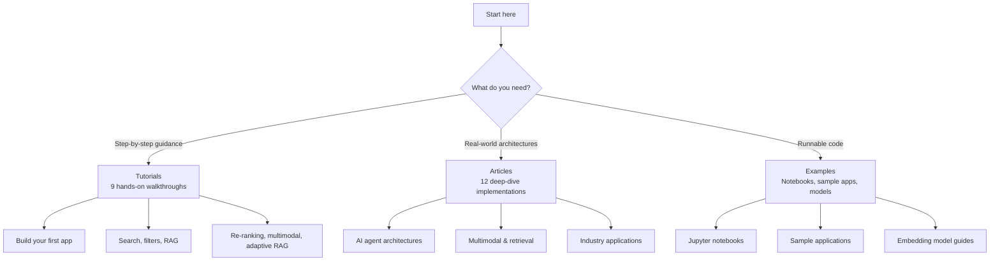

The VectorAI DB Academy is your learning hub for building vector search applications and AI agents. Whether you are getting started with your first collection or designing production-grade multi-agent systems, the Academy has a path for you.

## Choose your path

The diagram below shows three learning paths branching from a single entry point: tutorials for step-by-step guidance, articles for real-world architectures, and examples for runnable code. Follow the branch that matches your current goal.

---

## Tutorials

Structured, step-by-step walkthroughs that teach VectorAI DB skills progressively. Each tutorial builds on the last, taking you from basic operations to advanced retrieval architectures.

<CardGroup cols={3}>
 <Card title="Build your first application" href="/academy/tutorials/first-application" icon="rocket">
 Learn how to connect to VectorAI DB, store your first vectors, and run a semantic search query.
 </Card>
 <Card title="Similarity search" href="/academy/tutorials/similarity-search" icon="magnifying-glass">
 Learn how to search, score, batch, and paginate vector query results effectively.
 </Card>
 <Card title="Predicate filters" href="/academy/tutorials/predicate-filters" icon="filter">
 Learn how to combine vector search with structured payload filters to narrow results.
 </Card>
 <Card title="RAG pipeline" href="/academy/tutorials/simple-rag-pipeline" icon="brain">
 Build a retrieval-augmented generation pipeline to power document question-and-answer systems.
 </Card>
 <Card title="Open-Source embeddings" href="/academy/tutorials/leverage-open-source-embedding-models" icon="cube">
 Learn how to integrate open-source models like Sentence Transformers and BGE into your pipeline.
 </Card>
 <Card title="Multimodal systems" href="/academy/tutorials/multimodal-system" icon="layer-group">
 Learn how to fuse text, image, and metadata embeddings using named vectors.
 </Card>
 <Card title="Re-Ranking" href="/academy/tutorials/re-ranking" icon="arrow-up-wide-short">
 Learn how to improve relevance with cross-encoder and reciprocal rank fusion re-ranking.
 </Card>
 <Card title="Retrieval quality" href="/academy/tutorials/retrieval-quality" icon="chart-line">
 Learn how to measure and optimize search accuracy using precision, recall, and MRR.
 </Card>
 <Card title="Adaptive RAG" href="/academy/tutorials/adaptive-rag" icon="sliders">
 Build RAG pipelines that automatically adapt their retrieval strategy based on query complexity.
 </Card>
</CardGroup>

<Card title="View all tutorials" href="/academy/tutorials/index" icon="arrow-right">
 See the full tutorial overview with a recommended learning order and time estimates.
</Card>

---

## Articles

Deep-dive implementations of AI agents and real-world applications. Each article walks through a complete architecture, covering topics such as data modeling, retrieval strategies, and agent reasoning.

<CardGroup cols={3}>
 <Card title="Legal contract intelligence" href="/academy/articles/ai-legal-contract-intelligence-agent" icon="scale-balanced">
 Build an agent that analyzes legal contracts using cross-collection lookup, ranked retrieval, and quantization-aware search.
 </Card>
 <Card title="Multi-Agent systems" href="/academy/articles/building-a-reliable-multi-agent-system" icon="users">
 Build a reliable multi-agent system using distance metrics, scalar quantization, IVF indexing, and score fusion.
 </Card>
 <Card title="Insurance split liability" href="/academy/articles/insurance-split-liability-agent" icon="shield-halved">
 Build an insurance liability agent using named vectors, prefetch queries, geo-radius, and datetime filters.
 </Card>
 <Card title="Network threat hunting" href="/academy/articles/ai-network-threat-hunting-agent-with-vector-databases" icon="shield-virus">
 Build a threat detection agent using full-text search, batched queries, nested filters, and condition operators.
 </Card>
 <Card title="Scalable agent memory" href="/academy/articles/building-a-scalable-agent-memory-with-actian-vector-ai-database" icon="database">
 Build persistent agent memory with cross-collection lookup, WAL tuning, optimizer configuration, and strict deletion.
 </Card>
 <Card title="Recipe recommendation" href="/academy/articles/ai-recipe-recommendation-agent" icon="utensils">
 Build a personalized recipe recommendation agent using semantic search, payload filters, and preference learning.
 </Card>
 <Card title="Visual RAG" href="/academy/articles/multivector-document-intelligence-with-visual-rag" icon="file-image">
 Build a visual document intelligence system using CLIP embeddings, multimodal retrieval, and GPT-4o vision.
 </Card>
 <Card title="Multimodal product discovery" href="/academy/articles/next-gen-product-discovery-with-multimodal-ai" icon="bag-shopping">
 Build a product discovery system using CLIP and BM25 hybrid search with sparse and dense score fusion.
 </Card>
 <Card title="Supply chain risk" href="/academy/articles/supply-chain-inventory-management-agent" icon="truck">
 Build a supply chain risk agent using semantic retrieval, payload filters, and a reasoning layer.
 </Card>
 <Card title="Financial document analysis" href="/academy/articles/financial-document-analysis" icon="file-invoice-dollar">
 Build a financial document analysis system using semantic search and metadata filtering.
 </Card>
 <Card title="Facial recognition" href="/academy/articles/facial-recognition" icon="face-viewfinder">
 Build a facial recognition system using face embeddings, identity verification, and similarity search.
 </Card>
 <Card title="Customer support avatar" href="/academy/articles/avatar-based-assistant-for-customer-support" icon="headset">
 Build an avatar-based customer support assistant using knowledge retrieval and personalized response generation.
 </Card>
</CardGroup>

<Card title="View all articles" href="/academy/articles/index" icon="arrow-right">
 See the full article overview organized by category with a feature summary table.
</Card>

---

## Examples

Runnable code and integration guides to accelerate your development.

<CardGroup cols={3}>
 <Card title="Jupyter notebooks" href="/academy/examples/notebooks" icon="book">
 Explore interactive notebooks you can run locally for hands-on experimentation with VectorAI DB.
 </Card>
 <Card title="Sample applications" href="/academy/examples/sample-apps" icon="code">
 Browse complete reference applications you can clone and run as starting points for your own projects.
 </Card>
 <Card title="Embedding models guide" href="/academy/examples/embedding-models" icon="cubes">
 Learn how to choose the right embedding model for your use case and data type.
 </Card>
 <Card title="OpenAI embeddings" href="/academy/examples/openai-embedding-model" icon="microchip">
 Learn how to use OpenAI embedding models with VectorAI DB.
 </Card>
 <Card title="Cohere embeddings" href="/academy/examples/cohere-embedding-model" icon="microchip">
 Learn how to use Cohere embedding models with VectorAI DB.
 </Card>
</CardGroup>

---

## Where to start

The table below maps common goals to the most relevant starting point in the Academy. Each link takes you directly to the tutorial, article, or example that best fits that goal.

| Your goal | Start here |
|-----------|------------|
| New to VectorAI DB | [Build your first application](/academy/tutorials/first-application) |
| Need to add search to an app | [Similarity search](/academy/tutorials/similarity-search) |
| Building a RAG system | [Build a RAG pipeline](/academy/tutorials/simple-rag-pipeline) |
| Designing an AI agent | [Legal contract intelligence](/academy/articles/ai-legal-contract-intelligence-agent) |
| Working with images and text | [Multimodal systems](/academy/tutorials/multimodal-system) |
| Optimizing search quality | [Retrieval quality](/academy/tutorials/retrieval-quality) |
| Need runnable code fast | [Jupyter notebooks](/academy/examples/notebooks) |

<Tip>
If you are new to vector databases, start with the tutorials — they build skills progressively from beginner to advanced. Articles are best when you have a specific use case in mind and want to see a complete implementation. Use examples when you need runnable code you can clone and adapt right away.
</Tip>