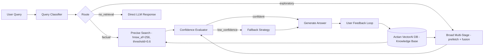

Standard RAG is a fixed pipeline: embed the query, search the vector database, stuff the top-K results into a prompt, and call the LLM. This works for simple factual questions but fails in practice because:

- Not all queries need retrieval. "What is 2 + 2?" should skip the vector database entirely. Sending it through retrieval wastes latency and may inject irrelevant context.
- Different queries need different retrieval strategies. A factual lookup ("What is the capital of France?") needs high-precision single-pass search. An exploratory question ("How does authentication work in the system?") needs broad multistage retrieval across multiple document types.
- Retrieval confidence varies. If the top result has a score of 0.92, the LLM probably has enough context. If the best score is 0.35, the system should either try a different search strategy or tell the user it does not know.
- User feedback should improve future retrieval. When a user marks a response as unhelpful, the system should learn which documents were not relevant.

An _Adaptive RAG_ system solves these problems by making the retrieval pipeline dynamic. Instead of one fixed strategy, the system classifies each query, selects the appropriate retrieval approach, evaluates result quality, and adapts based on feedback.

This tutorial builds a complete adaptive RAG pipeline on Actian VectorAI DB. By the end, you will have:

- A knowledge base collection with payload indexes for routing, feedback, and analytics.
- A keyword-signal query classifier that maps queries to four retrieval strategies.
- Three retrieval strategies (precise, broad multistage, and nested troubleshooting prefetch) plus an automatic fallback.
- A confidence evaluator that decides whether results are good enough or a fallback is needed.
- A user feedback loop that updates per-document usefulness scores over time.
- A feedback-aware retrieval function that boosts historically helpful documents.
- An analytics function that shows which documents are most retrieved and most useful.
- A prompt-assembly step that packages context and confidence instructions for any LLM.

---

## Architecture overview

The following diagram shows how queries flow through the adaptive RAG pipeline, from classification through strategy selection, confidence evaluation, and the feedback loop back into the knowledge base:



---

## Environment setup

Run the following command to install the Actian VectorAI SDK and the sentence-transformers library used for embedding:

```bash
pip install actian-vectorai sentence-transformers
```

---

## Step 1: Import dependencies and configure the environment

The following block imports all SDK symbols used throughout the tutorial, loads the `all-MiniLM-L6-v2` embedding model, and defines three constants (`SERVER`, `COLLECTION`, `EMBED_DIM`) that every subsequent step shares. Running it prints the active configuration so you can confirm the setup before proceeding:

```python
import asyncio
from datetime import datetime, timezone
from enum import Enum
from dataclasses import dataclass
from sentence_transformers import SentenceTransformer

from actian_vectorai import (
    AsyncVectorAIClient,
    Distance,
    Field,
    FieldType,
    FilterBuilder,
    FloatIndexParams,
    IntegerIndexParams,
    DatetimeIndexParams,
    PointStruct,
    PrefetchQuery,
    SearchParams,
    VectorParams,
    reciprocal_rank_fusion,
)
from actian_vectorai.models.collections import HnswConfigDiff
from actian_vectorai.models.enums import Direction, Fusion, Sample
from actian_vectorai.models.points import (
    OrderBy,
    ScoredPoint,
    WithPayloadSelector,
)

SERVER = "localhost:6574"
COLLECTION = "Adaptive-RAG"
EMBED_DIM = 384

model = SentenceTransformer("all-MiniLM-L6-v2")

def embed_text(text: str) -> list[float]:
    return model.encode(text).tolist()

def embed_texts(texts: list[str]) -> list[list[float]]:
    return model.encode(texts).tolist()

def now_iso() -> str:
    return datetime.now(timezone.utc).isoformat()

print(f"Server:     {SERVER}")
print(f"Collection: {COLLECTION}")
print(f"Embedding:  all-MiniLM-L6-v2 ({EMBED_DIM}-dim)")
```

### Expected output

This block loads the `all-MiniLM-L6-v2` sentence-transformer model and defines the three shared constants—`SERVER`, `COLLECTION`, and `EMBED_DIM`—that every subsequent step references. The three `print` calls confirm the active server address, the target collection name, and the embedding model with its vector dimensionality, so you can verify the configuration is correct before proceeding.

```text
Server:     localhost:6574
Collection: Adaptive-RAG
Embedding:  all-MiniLM-L6-v2 (384-dim)
```

---

## Step 2: Create the knowledge base collection

The following block creates the `Adaptive-RAG` collection with a cosine-distance HNSW index and registers six payload field indexes. Running it prints a confirmation message when the collection and all indexes are ready:

```python
async def create_knowledge_base():
    async with AsyncVectorAIClient(url=SERVER) as client:
        await client.collections.get_or_create(
            name=COLLECTION,
            vectors_config=VectorParams(size=EMBED_DIM, distance=Distance.Cosine),
            hnsw_config=HnswConfigDiff(m=16, ef_construct=128),
        )

        # Keyword indexes for routing and source filtering
        await client.points.create_field_index(
            COLLECTION, field_name="doc_type",
            field_type=FieldType.FieldTypeKeyword,
        )
        await client.points.create_field_index(
            COLLECTION, field_name="source",
            field_type=FieldType.FieldTypeKeyword,
        )
        await client.points.create_field_index(
            COLLECTION, field_name="section",
            field_type=FieldType.FieldTypeKeyword,
        )

        # Numeric indexes for analytics and feedback-aware boosting
        await client.points.create_field_index(
            COLLECTION, field_name="retrieval_count",
            field_type=FieldType.FieldTypeInteger,
            field_index_params=IntegerIndexParams(range=True),
        )
        await client.points.create_field_index(
            COLLECTION, field_name="usefulness_score",
            field_type=FieldType.FieldTypeFloat,
            field_index_params=FloatIndexParams(is_principal=True),
        )

        # Datetime index for time-based range queries
        await client.points.create_field_index(
            COLLECTION, field_name="created_at",
            field_type=FieldType.FieldTypeDatetime,
            field_index_params=DatetimeIndexParams(is_principal=True),
        )

    print(f"Knowledge base '{COLLECTION}' ready.")

asyncio.run(create_knowledge_base())
```

Each index serves a specific role in the adaptive pipeline. The table below explains what each field enables:

| Field | Purpose in adaptive RAG |
|-------|-------------------------|
| `doc_type` | Route different query types to different document categories. |
| `source` | Filter by origin (API docs vs. tutorials vs. changelogs). |
| `section` | Narrow retrieval to specific parts of the documentation. |
| `retrieval_count` | Track which documents are retrieved frequently. |
| `usefulness_score` | Boost or demote documents based on user feedback. |
| `created_at` | Enable time-based range queries and filtering on document age. |

The combination of keyword, integer, float, and datetime indexes means the adaptive router can filter, sort, and range-query on any payload field without a full collection scan.

---

## Step 3: Ingest documents into the knowledge base

The following block defines 20 sample documents across five categories (API reference, tutorials, conceptual guides, troubleshooting, and changelog) and upserts them into the collection. Each point is assigned initial metadata values: `retrieval_count: 0`, `usefulness_score: 0.5`, and a UTC timestamp. Running it prints the total number of documents confirmed in the collection:

```python
documents = [
    # API reference
    {"text": "The create_collection method accepts vectors_config, hnsw_config, wal_config, and quantization_config parameters to initialize a new collection.", "doc_type": "api_reference", "source": "sdk_docs", "section": "collections"},
    {"text": "points.search performs approximate nearest-neighbour search. It accepts vector, limit, filter, params, score_threshold, and offset parameters.", "doc_type": "api_reference", "source": "sdk_docs", "section": "search"},
    {"text": "points.query is the universal endpoint supporting vector search, fusion, order_by, and multistage prefetch queries.", "doc_type": "api_reference", "source": "sdk_docs", "section": "search"},
    {"text": "FilterBuilder supports must, should, must_not, and min_should for combining conditions. Field provides eq, any_of, except_of, gt, gte, lt, lte, between, and text methods.", "doc_type": "api_reference", "source": "sdk_docs", "section": "filters"},
    {"text": "SearchParams allows setting hnsw_ef for accuracy tuning, exact for brute-force search, and quantization for compressed vector search.", "doc_type": "api_reference", "source": "sdk_docs", "section": "search"},

    # Tutorials
    {"text": "To build a RAG pipeline, first create a collection, embed your documents with a sentence transformer, upsert the vectors with payload metadata, and search at query time.", "doc_type": "tutorial", "source": "academy", "section": "getting_started"},
    {"text": "Hybrid search combines dense vector similarity with sparse keyword matching. Use reciprocal_rank_fusion or distribution_based_score_fusion to merge results.", "doc_type": "tutorial", "source": "academy", "section": "hybrid_search"},
    {"text": "Named vectors allow storing multiple embedding spaces per collection. Use vectors_config as a dictionary to define each space with its own dimensionality and distance metric.", "doc_type": "tutorial", "source": "academy", "section": "multimodal"},
    {"text": "Prefetch queries retrieve candidates from multiple vector spaces or filter conditions, then a fusion stage merges and reranks the results.", "doc_type": "tutorial", "source": "academy", "section": "prefetch"},
    {"text": "Score thresholds discard low-confidence results. Set score_threshold on search or query to filter out results below a minimum similarity.", "doc_type": "tutorial", "source": "academy", "section": "search_tuning"},

    # Conceptual guides
    {"text": "HNSW is a graph-based index where each node connects to M neighbours. Higher M improves recall at the cost of memory. ef_construct controls build-time search width.", "doc_type": "concept", "source": "guides", "section": "indexing"},
    {"text": "Cosine distance measures the angle between vectors and is ideal for normalized embeddings. Dot product is equivalent to cosine for unit vectors.", "doc_type": "concept", "source": "guides", "section": "distance_metrics"},
    {"text": "Scalar quantization compresses 32-bit floats to 8-bit integers, reducing memory by 4x. Use rescore=True and oversampling to recover accuracy.", "doc_type": "concept", "source": "guides", "section": "quantization"},
    {"text": "Payload indexes accelerate filtered searches. Keyword indexes support exact match and any_of. Integer and float indexes support range queries.", "doc_type": "concept", "source": "guides", "section": "payload_indexes"},

    # Troubleshooting
    {"text": "If search returns empty results, check that the collection has vectors (vde.get_vector_count), that your filter is not too restrictive, and that you flushed after upserting.", "doc_type": "troubleshooting", "source": "faq", "section": "empty_results"},
    {"text": "If recall is low, increase hnsw_ef at search time or rebuild the index with higher m and ef_construct values.", "doc_type": "troubleshooting", "source": "faq", "section": "low_recall"},
    {"text": "If latency is high, reduce hnsw_ef, enable quantization, or decrease the limit parameter. Use connection pooling for concurrent access.", "doc_type": "troubleshooting", "source": "faq", "section": "high_latency"},

    # Changelog
    {"text": "Version 2.5 added the universal query endpoint with prefetch, fusion, and order_by support.", "doc_type": "changelog", "source": "releases", "section": "v2.5"},
    {"text": "Version 2.4 introduced SmartBatcher for streaming ingestion with automatic size, byte, and time-based flush triggers.", "doc_type": "changelog", "source": "releases", "section": "v2.4"},
    {"text": "Version 2.3 added scalar quantization with rescore and oversampling for memory-efficient search.", "doc_type": "changelog", "source": "releases", "section": "v2.3"},
]

async def ingest_documents():
    texts = [d["text"] for d in documents]
    vectors = embed_texts(texts)

    points = []
    for i, (doc, vector) in enumerate(zip(documents, vectors)):
        points.append(PointStruct(
            id=i,
            vector=vector,
            payload={
                **doc,
                "created_at": now_iso(),
                "retrieval_count": 0,
                "usefulness_score": 0.5,  # Neutral starting score
                "feedback_count": 0,
            },
        ))

    async with AsyncVectorAIClient(url=SERVER) as client:
        await client.points.upsert(COLLECTION, points=points)
        await client.vde.flush(COLLECTION)
        count = await client.vde.get_vector_count(COLLECTION)

    print(f"Ingested {len(points)} documents. Total: {count}")

asyncio.run(ingest_documents())
```

### Expected output

This block embeds all 20 document texts in a single batch call and upserts them as `PointStruct` objects, each carrying its source metadata alongside the initial tracking fields (`retrieval_count: 0`, `usefulness_score: 0.5`, `feedback_count: 0`). After upserting, it calls `flush` to persist the writes to disk and then queries `get_vector_count` to confirm the exact number of vectors now stored in the collection.

```text
Ingested 20 documents. Total: 20
```

---

## Step 4: Build the query classifier

The classifier inspects keyword signals in a query and returns a `ClassifiedQuery` that names the query type and the target document categories to search. The following block defines the `QueryType` enum, the `ClassifiedQuery` dataclass, and the `classify_query` function, then runs it against four test queries and prints the assigned type and confidence for each:

```python
class QueryType(Enum):
    FACTUAL = "factual"
    EXPLORATORY = "exploratory"
    TROUBLESHOOTING = "troubleshooting"
    NO_RETRIEVAL = "no_retrieval"

@dataclass
class ClassifiedQuery:
    original: str
    query_type: QueryType
    target_doc_types: list[str]
    confidence: float

def classify_query(query: str) -> ClassifiedQuery:
    """Classify a query to determine retrieval strategy.

    In production, replace this keyword-signal approach with an LLM-based
    classifier or a fine-tuned text classification model for higher accuracy.
    """
    q = query.lower()

    # Greetings and arithmetic do not benefit from document retrieval
    no_retrieval_signals = [
        "hello", "hi ", "thanks", "thank you",
        "what is 2", "calculate", "what time",
    ]
    if any(sig in q for sig in no_retrieval_signals):
        return ClassifiedQuery(query, QueryType.NO_RETRIEVAL, [], 0.95)

    # Error reports and "why/how to fix" patterns indicate a troubleshooting intent
    troubleshooting_signals = [
        "error", "not working", "empty results", "slow",
        "fails", "issue", "problem", "bug", "fix",
        "why is", "how to fix", "doesn't work",
    ]
    if any(sig in q for sig in troubleshooting_signals):
        return ClassifiedQuery(
            query, QueryType.TROUBLESHOOTING,
            ["troubleshooting", "api_reference"], 0.85,
        )

    # "What is / what does / how to use" patterns point to a factual API lookup
    factual_signals = [
        "what is", "what does", "how to use", "what parameters",
        "which method", "api for", "syntax for", "default value",
    ]
    if any(sig in q for sig in factual_signals):
        return ClassifiedQuery(
            query, QueryType.FACTUAL,
            ["api_reference", "concept"], 0.80,
        )

    # Everything else is treated as an open-ended exploratory question
    return ClassifiedQuery(
        query, QueryType.EXPLORATORY,
        ["tutorial", "concept", "api_reference"], 0.70,
    )

test_queries = [
    "How to use the search method?",
    "How does the prefetch pipeline work with hybrid search?",
    "My search returns empty results, what's wrong?",
    "Hello, how are you?",
]

for q in test_queries:
    c = classify_query(q)
    print(f"  {c.query_type.value:>17}  conf={c.confidence:.2f}  {q}")
```

### Expected output

The classifier inspects each query for keyword signals and maps it to one of four `QueryType` values. The four test queries are designed to exercise every branch: a "how to use" phrase triggers `factual`, an open-ended "how does" triggers `exploratory`, an error-related phrase triggers `troubleshooting`, and a greeting triggers `no_retrieval`. Each line of output shows the assigned type right-aligned, the classifier's confidence score, and the original query text.

```text
          factual  conf=0.80  How to use the search method?
      exploratory  conf=0.70  How does the prefetch pipeline work with hybrid search?
  troubleshooting  conf=0.85  My search returns empty results, what's wrong?
     no_retrieval  conf=0.95  Hello, how are you?
```

---

## Step 5: Strategy 1—Precise retrieval for factual queries

Factual queries require high precision. The following block defines `precise_retrieval`, which searches only within the specified document type categories, applies a `score_threshold` of 0.5 to discard low-similarity results, and uses `hnsw_ef=256` to maximise recall accuracy. Running the test query prints each result's score, document type, and a truncated text preview:

```python
async def precise_retrieval(query: str, doc_types: list[str], top_k: int = 3) -> list[ScoredPoint]:
    vec = embed_text(query)

    fb = FilterBuilder()
    if doc_types:
        # Restrict results to the document categories appropriate for factual queries
        fb = fb.must(Field("doc_type").any_of(doc_types))

    async with AsyncVectorAIClient(url=SERVER) as client:
        results = await client.points.search(
            COLLECTION,
            vector=vec,
            limit=top_k,
            filter=fb.build(),
            score_threshold=0.5,      # Drop results below cosine 0.5
            params=SearchParams(hnsw_ef=256),  # High ef for maximum accuracy
            with_payload=True,
        ) or []

    return results

query = "What parameters does the search method accept?"
results = asyncio.run(precise_retrieval(query, ["api_reference", "concept"]))

print(f"Query: {query}")
print(f"Strategy: PRECISE (hnsw_ef=256, threshold=0.5)\n")
for r in results:
    p = r.payload
    print(f"  score={r.score:.4f}  [{p['doc_type']}]  {p['text'][:70]}...")
```

The table below explains why each parameter is configured this way for factual queries:

| Parameter | Setting | Rationale |
|-----------|---------|-----------|
| `hnsw_ef=256` | High | Factual queries need the *right* answer, not just a plausible one. |
| `score_threshold=0.5` | Strict | Drops results below cosine 0.5—better to return nothing than noise. |
| `doc_types` filter | Focused | Searches only API reference and concepts for factual questions. |
| `top_k=3` | Small | Factual answers are usually found in one or two documents. |

With these settings the search either returns a small number of highly confident matches or nothing at all—both are useful signals. An empty result set tells the router to invoke the fallback strategy rather than hallucinate an answer.

---

## Step 6: Strategy 2—Broad multistage retrieval for exploratory queries

Exploratory queries need breadth across multiple document types. The following block defines `broad_retrieval`, which creates one prefetch stream per document type plus an unfiltered catch-all stream, then merges all candidates with RRF fusion. Running the test query prints each result's score, document type, and a text preview:

```python
async def broad_retrieval(query: str, doc_types: list[str], top_k: int = 5) -> list[ScoredPoint]:
    vec = embed_text(query)

    prefetch_stages = []

    # One prefetch stream per requested document type
    for dtype in doc_types:
        f = FilterBuilder().must(Field("doc_type").eq(dtype)).build()
        prefetch_stages.append(
            PrefetchQuery(
                query=vec,
                filter=f,
                limit=10,
                params=SearchParams(hnsw_ef=128),  # Lower ef per stream; breadth matters more than per-stream precision
            )
        )

    # Add an unfiltered stream to catch documents that span multiple types
    prefetch_stages.append(
        PrefetchQuery(query=vec, limit=15)
    )

    async with AsyncVectorAIClient(url=SERVER) as client:
        results = await client.points.query(
            COLLECTION,
            query={"fusion": Fusion.RRF},  # Merge all streams by reciprocal rank
            prefetch=prefetch_stages,
            limit=top_k,
            with_payload=True,
        )

    return list(results or [])

query = "How does the prefetch pipeline work with hybrid search and fusion?"
results = asyncio.run(broad_retrieval(query, ["tutorial", "concept", "api_reference"]))

print(f"Query: {query}")
print(f"Strategy: BROAD (4 prefetch streams, RRF fusion)\n")
for r in results:
    p = r.payload
    print(f"  score={r.score:.4f}  [{p['doc_type']:>15}]  {p['text'][:65]}...")
```

The following diagram shows the four prefetch streams and how RRF fusion merges them into a single ranked result set:

```text
Prefetch 1: tutorial docs      → 10 candidates (how-to context)
Prefetch 2: concept docs       → 10 candidates (theory/explanation)
Prefetch 3: api_reference docs → 10 candidates (exact API details)
Prefetch 4: unfiltered         → 15 candidates (catch-all)

RRF fusion: merge all by rank  → top 5 (diverse, multiperspective results)
```

Documents that appear across multiple prefetch streams rank higher, giving the LLM a well-rounded context. The lower `hnsw_ef=128` per stream is a deliberate trade-off: the four parallel streams compensate for any individual miss, so per-stream precision matters less than overall breadth.

---

## Step 7: Strategy 3—Troubleshooting retrieval with nested prefetch

Troubleshooting queries benefit from a wide net across both FAQ-style documents and changelogs, which often contain relevant fixes. The following block defines `troubleshooting_retrieval`, which uses a nested prefetch pipeline: inner prefetch stages gather candidates from troubleshooting docs and changelogs, DBSF fusion merges them, and a final rerank pass uses the query vector to surface the most relevant results. Running the test query prints each result's score, document type, and a text preview:

```python
async def troubleshooting_retrieval(query: str, top_k: int = 5) -> list[ScoredPoint]:
    vec = embed_text(query)

    # Target troubleshooting docs and API reference for error-related queries
    trouble_filter = FilterBuilder().must(
        Field("doc_type").any_of(["troubleshooting", "api_reference"])
    ).build()

    # Also gather changelog entries, which often document bug fixes
    changelog_filter = FilterBuilder().must(
        Field("doc_type").eq("changelog")
    ).build()

    async with AsyncVectorAIClient(url=SERVER) as client:
        results = await client.points.query(
            COLLECTION,
            query=vec,                  # Final rerank by query vector
            prefetch=[
                PrefetchQuery(
                    query={"fusion": Fusion.DBSF},  # Normalize scores across inner streams before merging
                    prefetch=[
                        PrefetchQuery(query=vec, filter=trouble_filter, limit=10),
                        PrefetchQuery(query=vec, filter=changelog_filter, limit=5),
                    ],
                    limit=12,
                ),
            ],
            limit=top_k,
            with_payload=True,
        )

    return list(results or [])

query = "My search returns empty results, what's wrong?"
results = asyncio.run(troubleshooting_retrieval(query))

print(f"Query: {query}")
print(f"Strategy: TROUBLESHOOTING (nested prefetch: FAQ + changelog, DBSF → re-rank)\n")
for r in results:
    p = r.payload
    print(f"  score={r.score:.4f}  [{p['doc_type']:>17}]  {p['text'][:65]}...")
```

The troubleshooting strategy uses three stages to progressively narrow candidates before the final rerank:

```text
Inner prefetch 1: troubleshooting + api_reference  → 10 candidates
Inner prefetch 2: changelog                         →  5 candidates
Middle stage:     DBSF fusion                       → 12 candidates
Outer query:      rerank by query vector           →  top 5
```

DBSF normalizes the scores from both inner streams before merging, giving a fair comparison between troubleshooting tips and changelog notes. The final rerank with the query vector ensures the most relevant results surface at the top.

---

## Step 8: Build the confidence evaluator

After retrieval, the pipeline needs to decide whether the results are strong enough to pass to the LLM or whether a fallback is needed. The following block defines the `RetrievalResult` dataclass and the `evaluate_confidence` function, then runs it against a test query and prints the confidence level, top score, average score, and document count:

```python
@dataclass
class RetrievalResult:
    results: list[ScoredPoint]
    strategy: str
    confidence: str    # "high", "medium", "low", or "no_results"
    top_score: float
    avg_score: float
    coverage: int      # Number of documents returned

def evaluate_confidence(
    results: list[ScoredPoint],
    strategy: str,
    high_threshold: float = 0.6,
    low_threshold: float = 0.35,
) -> RetrievalResult:
    """Classify retrieval quality into four confidence levels.

    Uses the top score as the primary signal and average score as a secondary
    check to avoid cases where one strong result masks several weak ones.
    """
    if not results:
        return RetrievalResult(results, strategy, "no_results", 0.0, 0.0, 0)

    scores = [r.score for r in results]
    top_score = max(scores)
    avg_score = sum(scores) / len(scores)

    if top_score >= high_threshold and avg_score >= low_threshold:
        confidence = "high"
    elif top_score >= low_threshold:
        confidence = "medium"
    else:
        confidence = "low"

    return RetrievalResult(
        results=results,
        strategy=strategy,
        confidence=confidence,
        top_score=top_score,
        avg_score=avg_score,
        coverage=len(results),
    )

query = "What parameters does the search method accept?"
results = asyncio.run(precise_retrieval(query, ["api_reference"]))
evaluation = evaluate_confidence(results, "precise")

print(f"Query:      {query}")
print(f"Strategy:   {evaluation.strategy}")
print(f"Confidence: {evaluation.confidence}")
print(f"Top score:  {evaluation.top_score:.4f}")
print(f"Avg score:  {evaluation.avg_score:.4f}")
print(f"Coverage:   {evaluation.coverage} documents")
```

The evaluator maps score thresholds to one of four confidence levels, each of which drives a different downstream action:

| Confidence | Condition | Action |
|-----------|-----------|--------|
| `high` | Top score >= 0.6 and avg >= 0.35. | Proceed to LLM with full confidence. |
| `medium` | Top score >= 0.35. | Proceed but add a caveat: "Based on available information..." |
| `low` | Top score < 0.35. | Try the fallback strategy or respond with "I don't know." |
| `no_results` | Empty result set. | Skip retrieval, answer directly or say "No relevant docs found." |

---

## Step 9: Fallback strategy—Widen the search

When initial retrieval has low confidence, the fallback strategy removes all filters, raises the candidate pool size, and merges the original results with an unfiltered search using client-side RRF. The following block defines `fallback_retrieval`, simulates a low-confidence query, and prints the fallback confidence level and the top results returned:

```python
async def fallback_retrieval(query: str, original_results: list[ScoredPoint], top_k: int = 5) -> list[ScoredPoint]:
    """Widen the search when initial retrieval has low confidence.

    Uses a single client connection to run both fallback queries together,
    avoiding an extra network round-trip.
    """
    vec = embed_text(query)

    async with AsyncVectorAIClient(url=SERVER) as client:
        # Remove all filters and lower the threshold to cast the widest possible net
        unfiltered = await client.points.search(
            COLLECTION,
            vector=vec,
            limit=top_k * 3,
            with_payload=True,
            params=SearchParams(hnsw_ef=256),
        ) or []

        # Sample random documents as a last-resort "did you mean?" backup
        random_sample = list(await client.points.query(
            COLLECTION,
            query={"sample": Sample.Random},
            limit=5,
            with_payload=WithPayloadSelector(include=["text", "doc_type", "section"]),
        ) or [])

    # Merge original filtered results with the unfiltered widening pass
    if original_results and unfiltered:
        merged = reciprocal_rank_fusion(
            [original_results, unfiltered],
            limit=top_k,
        )
    else:
        merged = unfiltered[:top_k]

    # If both passes return nothing, surface random documents so the user
    # can see what the knowledge base contains and reformulate the query.
    if not merged and random_sample:
        return random_sample[:top_k]

    return merged or random_sample[:top_k]

query = "How does the quantum flux capacitor module work?"
results = asyncio.run(precise_retrieval(query, ["api_reference"]))
evaluation = evaluate_confidence(results, "precise")

print(f"Initial: confidence={evaluation.confidence}, top_score={evaluation.top_score:.4f}")

if evaluation.confidence == "low" or evaluation.confidence == "no_results":
    fallback_results = asyncio.run(fallback_retrieval(query, results))
    fallback_eval = evaluate_confidence(fallback_results, "fallback")
    print(f"Fallback: confidence={fallback_eval.confidence}, top_score={fallback_eval.top_score:.4f}")
    for r in fallback_results:
        p = r.payload
        print(f"  score={r.score:.4f}  [{p.get('doc_type', '')}]  {p.get('text', '')[:60]}...")
```

`Sample.Random` returns random points from the collection. In the fallback function above, it acts as a last-resort "did you mean?" response: if neither the original filtered search nor the unfiltered widening returns any results, the function returns these random documents so the user can see what is in the knowledge base and reformulate the query. Both fallback queries run inside a single client connection to avoid an extra round-trip.

---

## Step 10: Build the adaptive router

The router is the central coordinator. It classifies the incoming query, dispatches it to the appropriate retrieval strategy, evaluates the result confidence, invokes the fallback when needed, and increments a retrieval counter on every returned document. The following block defines the `AdaptiveRAGRouter` class:

```python
class AdaptiveRAGRouter:
    """Routes queries to the appropriate retrieval strategy."""

    async def retrieve(self, query: str) -> RetrievalResult:
        """Run the full adaptive retrieval pipeline for a single query."""
        classified = classify_query(query)

        # Short-circuit for queries that do not benefit from retrieval
        if classified.query_type == QueryType.NO_RETRIEVAL:
            return RetrievalResult([], "no_retrieval", "high", 0.0, 0.0, 0)

        # Dispatch to the strategy that matches the query type
        if classified.query_type == QueryType.FACTUAL:
            results = await precise_retrieval(query, classified.target_doc_types)
            evaluation = evaluate_confidence(results, "precise")

        elif classified.query_type == QueryType.TROUBLESHOOTING:
            results = await troubleshooting_retrieval(query)
            evaluation = evaluate_confidence(results, "troubleshooting")

        else:
            results = await broad_retrieval(query, classified.target_doc_types)
            evaluation = evaluate_confidence(results, "broad")

        # Widen the search if the primary strategy did not produce confident results
        if evaluation.confidence in ("low", "no_results"):
            fallback_results = await fallback_retrieval(query, results)
            evaluation = evaluate_confidence(fallback_results, f"{evaluation.strategy}+fallback")

        await self._track_retrieval(evaluation.results)

        return evaluation

    async def _track_retrieval(self, results: list[ScoredPoint]):
        """Increment the retrieval counter on each returned document."""
        if not results:
            return

        async with AsyncVectorAIClient(url=SERVER) as client:
            for r in results:
                count = (r.payload or {}).get("retrieval_count", 0) + 1
                await client.points.set_payload(
                    COLLECTION,
                    payload={"retrieval_count": count},
                    ids=[r.id],
                )
```

The following block runs the router against five representative queries and prints the assigned strategy, confidence level, top score, and document count for each. It covers all four query types including the fallback path:

```python
async def demo_router():
    router = AdaptiveRAGRouter()

    queries = [
        "What parameters does the search method accept?",
        "How does hybrid search work with fusion and prefetch?",
        "My search returns empty results, what's wrong?",
        "Hi there!",
        "How does the quantum flux capacitor module work?",
    ]

    for query in queries:
        result = await router.retrieve(query)
        classified = classify_query(query)
        print(
            f"  [{classified.query_type.value:>17}]  strategy={result.strategy:<25}  "
            f"confidence={result.confidence:<10}  top={result.top_score:.4f}  "
            f"docs={result.coverage}  | {query[:50]}"
        )

asyncio.run(demo_router())
```

### Expected output

The `demo_router` function passes five representative queries through the full adaptive pipeline. Each query is first classified, then dispatched to the appropriate strategy—`precise` for factual, `broad` for exploratory, `troubleshooting` for error queries, and `no_retrieval` for the greeting. The final query about a non-existent "quantum flux capacitor" does not match any document closely enough, so the primary broad search scores poorly and the router automatically invokes the fallback strategy, producing the `broad+fallback` label with a low confidence rating and a reduced top score.

```text
  [          factual]  strategy=precise                   confidence=high        top=0.7234  docs=3  | What parameters does the search method accept?
  [      exploratory]  strategy=broad                     confidence=high        top=0.6890  docs=5  | How does hybrid search work with fusion and prefe
  [  troubleshooting]  strategy=troubleshooting           confidence=high        top=0.7123  docs=5  | My search returns empty results, what's wrong?
  [     no_retrieval]  strategy=no_retrieval              confidence=high        top=0.0000  docs=0  | Hi there!
  [      exploratory]  strategy=broad+fallback            confidence=low         top=0.2345  docs=5  | How does the quantum flux capacitor module work?
```

---

## Step 11: User feedback loop

When a user marks a response as helpful or unhelpful, the `usefulness_score` of every retrieved document is updated. The following block defines `record_feedback`, simulates a helpful feedback event on a real retrieval result, and prints a confirmation with the number of documents updated:

```python
async def record_feedback(result: RetrievalResult, helpful: bool):
    """Update usefulness scores based on user feedback.

    Applies an exponential moving-average adjustment so that a single
    feedback event does not dominate the score history.
    """
    if not result.results:
        return

    async with AsyncVectorAIClient(url=SERVER) as client:
        for r in result.results:
            payload = r.payload or {}
            current_score = payload.get("usefulness_score", 0.5)
            feedback_count = payload.get("feedback_count", 0) + 1

            if helpful:
                # Nudge score toward 1.0; converges asymptotically
                new_score = min(current_score + (1.0 - current_score) * 0.1, 1.0)
            else:
                # Penalize faster to deprioritize persistently unhelpful documents
                new_score = max(current_score - current_score * 0.15, 0.0)

            await client.points.set_payload(
                COLLECTION,
                payload={
                    "usefulness_score": round(new_score, 4),
                    "feedback_count": feedback_count,
                    "last_feedback": now_iso(),
                    "last_feedback_type": "helpful" if helpful else "unhelpful",
                },
                ids=[r.id],
            )

    label = "helpful" if helpful else "unhelpful"
    print(f"Recorded '{label}' feedback for {len(result.results)} documents.")

router = AdaptiveRAGRouter()
result = asyncio.run(router.retrieve("What parameters does the search method accept?"))
asyncio.run(record_feedback(result, helpful=True))
```

Each feedback event nudges a document's score toward 1.0 (helpful) or toward 0.0 (unhelpful) using an exponential moving-average formula so that no single event dominates the history:

| Scenario | Formula | Effect |
|----------|---------|--------|
| Helpful feedback. | `score += (1.0 - score) * 0.1` | Score rises asymptotically toward 1.0. |
| Unhelpful feedback. | `score -= score * 0.15` | Score drops faster, penalizing poor results. |
| No feedback. | Score unchanged. | Stays at the default of 0.5. |

After many feedback cycles, frequently helpful documents accumulate high scores while unhelpful ones sink. The feedback-aware retrieval function in the next step uses these scores to boost useful documents.

---

## Step 12: Feedback-aware retrieval

The `usefulness_score` accumulated in step 11 can be used to bias future retrieval toward documents that users have consistently found helpful. The following block defines `feedback_aware_retrieval`, runs a test query, and prints each result's score, usefulness score, retrieval count, document type, and a text preview:

```python
async def feedback_aware_retrieval(query: str, top_k: int = 5) -> list[ScoredPoint]:
    """Retrieve documents, biasing toward those with high usefulness scores."""
    vec = embed_text(query)

    # Restrict the second prefetch stream to documents above the usefulness threshold
    useful_filter = FilterBuilder().must(
        Field("usefulness_score").gte(0.4)
    ).build()

    async with AsyncVectorAIClient(url=SERVER) as client:
        results = await client.points.query(
            COLLECTION,
            query={"fusion": Fusion.RRF},
            prefetch=[
                PrefetchQuery(query=vec, limit=15),                   # Semantic relevance stream
                PrefetchQuery(query=vec, filter=useful_filter, limit=15),  # Proven-helpful stream
            ],
            limit=top_k,
            with_payload=True,
        )

    return list(results or [])

query = "How to perform filtered search?"
results = asyncio.run(feedback_aware_retrieval(query))

print(f"Query: {query}")
print(f"Strategy: feedback-aware (RRF: unfiltered + usefulness>=0.4)\n")
for r in results:
    p = r.payload
    print(
        f"  score={r.score:.4f}  useful={p.get('usefulness_score', 0.5):.2f}  "
        f"retrievals={p.get('retrieval_count', 0)}  [{p['doc_type']}]  "
        f"{p['text'][:55]}..."
    )
```

The function runs two prefetch streams in parallel and merges them with RRF, so documents that satisfy both criteria rank above those that satisfy only one:

```text
Prefetch 1: Unfiltered search   → 15 candidates (semantic relevance)
Prefetch 2: Usefulness-filtered → 15 candidates (proven helpful)

RRF fusion: documents in both lists rank higher
```

A document that is both semantically relevant _and_ historically useful gets a double boost. A document that is semantically relevant but has been marked unhelpful appears in only one stream and ranks lower.

---

## Step 13: Analytics—what is the system learning?

As the system accumulates retrieval events and feedback, payload fields like `retrieval_count` and `usefulness_score` reflect its usage patterns. The following block queries the collection for the five most-retrieved documents, the five most-useful documents, and any documents that are frequently retrieved but consistently rated unhelpful, then prints all three groups:

```python
async def retrieval_analytics():
    async with AsyncVectorAIClient(url=SERVER) as client:
        total = await client.vde.get_vector_count(COLLECTION)

        # Order by retrieval_count descending to find the most-used documents
        most_retrieved = list(await client.points.query(
            COLLECTION,
            query={"order_by": OrderBy(key="retrieval_count", direction=Direction.Desc)},
            limit=5,
            with_payload=WithPayloadSelector(
                include=["text", "doc_type", "retrieval_count", "usefulness_score"],
            ),
        ) or [])

        # Order by usefulness_score descending to find the highest-rated documents
        most_useful = list(await client.points.query(
            COLLECTION,
            query={"order_by": OrderBy(key="usefulness_score", direction=Direction.Desc)},
            limit=5,
            with_payload=WithPayloadSelector(
                include=["text", "doc_type", "usefulness_score", "feedback_count"],
            ),
        ) or [])

        # Find documents retrieved often but rated poorly—candidates for review or removal
        frequently_bad = await client.points.search(
            COLLECTION,
            vector=embed_text("general documentation"),
            limit=20,
            filter=(
                FilterBuilder()
                .must(Field("retrieval_count").gte(3))
                .must(Field("usefulness_score").lt(0.3))
                .build()
            ),
            with_payload=WithPayloadSelector(
                include=["text", "doc_type", "retrieval_count", "usefulness_score"],
            ),
        ) or []

        # Count documents per type to understand collection composition
        for dtype in ["api_reference", "tutorial", "concept", "troubleshooting", "changelog"]:
            result = await client.points.count(
                COLLECTION,
                filter=FilterBuilder().must(Field("doc_type").eq(dtype)).build(),
                exact=True,
            )
            print(f"  {dtype:>17}: {result.count} documents")

    print(f"\nTotal documents: {total}")
    print(f"\n--- Most retrieved ---")
    for r in most_retrieved:
        p = r.payload
        print(f"  retrievals={p.get('retrieval_count', 0):>3}  useful={p.get('usefulness_score', 0.5):.2f}  {p['text'][:55]}...")

    print(f"\n--- Most useful ---")
    for r in most_useful:
        p = r.payload
        print(f"  useful={p.get('usefulness_score', 0.5):.2f}  feedback={p.get('feedback_count', 0)}  {p['text'][:55]}...")

    if frequently_bad:
        print(f"\n--- Frequently retrieved but not useful (candidates for review) ---")
        for r in frequently_bad:
            p = r.payload
            print(f"  retrievals={p.get('retrieval_count', 0)}  useful={p.get('usefulness_score', 0.5):.2f}  {p['text'][:55]}...")

asyncio.run(retrieval_analytics())
```

---

## Step 14: Prepare the prompt for LLM integration

The final pipeline step assembles the retrieved context chunks and a confidence-adjusted instruction into a prompt string. The following block defines `adaptive_rag_answer`, runs it against four test queries, and prints the strategy, confidence level, and source document count for each. The actual LLM call is left as a stub (`# answer = await llm.generate(prompt)`) so any provider can be plugged in:

```python
async def adaptive_rag_answer(query: str) -> dict:
    """Classify the query, retrieve context, and assemble an LLM prompt.

    Returns a dictionary containing the strategy used, confidence level,
    source document metadata, and a truncated preview of the assembled prompt.
    The prompt itself is ready to pass to any LLM; replace the stub comment
    with your provider's generate call.
    """
    router = AdaptiveRAGRouter()

    classified = classify_query(query)

    # Skip retrieval entirely for queries that do not need document context
    if classified.query_type == QueryType.NO_RETRIEVAL:
        return {
            "query": query,
            "strategy": "no_retrieval",
            "confidence": "high",
            "answer": f"[Direct response — no retrieval needed for: '{query}']",
            "sources": [],
        }

    result = await router.retrieve(query)

    context_chunks = []
    sources = []
    for r in result.results:
        p = r.payload or {}
        context_chunks.append(p.get("text", ""))
        sources.append({
            "id": r.id,
            "score": r.score,
            "doc_type": p.get("doc_type"),
            "section": p.get("section"),
        })

    context = "\n\n".join(context_chunks)

    # Adjust the instruction based on how confident the retrieval was
    if result.confidence == "high":
        instruction = "Answer based on the provided context."
    elif result.confidence == "medium":
        instruction = "Answer based on available information. Note that context may be incomplete."
    else:
        instruction = "Limited context was found. Provide a best-effort answer and suggest the user consult the full documentation."

    prompt = f"""Context:
{context}

Instruction: {instruction}

Question: {query}

Answer:"""

    # Send `prompt` to your LLM here, for example:
    # answer = await llm.generate(prompt)

    return {
        "query": query,
        "strategy": result.strategy,
        "confidence": result.confidence,
        "top_score": result.top_score,
        "sources": sources,
        "prompt_preview": prompt[:200] + "...",
    }

queries = [
    "What parameters does the search method accept?",
    "How do I build a hybrid search pipeline?",
    "My search is returning empty results",
    "Thanks!",
]

for q in queries:
    response = asyncio.run(adaptive_rag_answer(q))
    print(f"\nQuery: {q}")
    print(f"  Strategy:   {response['strategy']}")
    print(f"  Confidence: {response['confidence']}")
    print(f"  Sources:    {len(response.get('sources', []))} documents")
```

---

## Step 15: Collection cleanup

The following block retrieves the current document count, flushes all pending writes to disk, and prints a confirmation. Uncomment the delete lines to remove the collection entirely:

```python
async def cleanup():
    async with AsyncVectorAIClient(url=SERVER) as client:
        count = await client.vde.get_vector_count(COLLECTION)
        print(f"Collection '{COLLECTION}' contains {count} documents.")

        await client.vde.flush(COLLECTION)
        print("Flushed to disk.")

        # Uncomment to delete the collection:
        # await client.collections.delete(COLLECTION)
        # print("Collection deleted.")

asyncio.run(cleanup())
```

---

## Adaptive strategies summary

The following table summarizes the retrieval strategy, search configuration, and fusion method used for each query type:

| Query type | Strategy | Search config | Prefetch | Fusion | Threshold |
|-----------|----------|--------------|----------|--------|-----------|
| Factual. | Precise. | `hnsw_ef=256` | None. | None. | 0.5 |
| Exploratory. | Broad multistage. | `hnsw_ef=128` | 4 streams (per doc_type + unfiltered). | `Fusion.RRF` | None. |
| Troubleshooting. | Nested prefetch. | Default. | 2 inner (FAQ + changelog) → DBSF → rerank. | `Fusion.DBSF` inner. | None. |
| Low confidence. | Fallback. | `hnsw_ef=256` | None (unfiltered) + `Sample.Random`. | Client-side RRF. | None. |
| Feedback-aware. | Boosted fusion. | Default. | 2 streams (all + useful). | `Fusion.RRF` | usefulness >= 0.4 |

---

## APIs and features used in this tutorial

The following table lists every VectorAI DB API and feature demonstrated across the fifteen steps:

| Feature | API | Purpose |
|---------|-----|---------|
| Collection creation. | `collections.get_or_create(hnsw_config=...)` | Knowledge base setup. |
| Semantic search. | `points.search(params=SearchParams(hnsw_ef=256))` | Precise factual retrieval. |
| Score threshold. | `points.search(score_threshold=0.5)` | Cut low-confidence results. |
| Multi-stage prefetch. | `PrefetchQuery(query=..., filter=..., limit=...)` | Per-doc-type retrieval streams. |
| Nested prefetch. | `PrefetchQuery(prefetch=[...])` | Three-stage troubleshooting pipeline. |
| Server-side RRF. | `query={"fusion": Fusion.RRF}` | Broad exploratory fusion. |
| Server-side DBSF. | `query={"fusion": Fusion.DBSF}` | Troubleshooting score-normalized fusion. |
| Random sampling. | `query={"sample": Sample.Random}` | Fallback discovery. |
| Client-side RRF. | `reciprocal_rank_fusion(results, limit=...)` | Fallback merge. |
| Payload updates. | `points.set_payload(payload=...)` | Feedback tracking, retrieval counters. |
| Payload ordering. | `query(query={"order_by": OrderBy(...)})` | Most-retrieved, most-useful analytics. |
| Selective payload. | `WithPayloadSelector(include=[...])` | Return only needed fields. |
| Keyword index. | `FieldType.FieldTypeKeyword` | Doc type and source filtering. |
| Float index (principal). | `FloatIndexParams(is_principal=True)` | Usefulness score ordering. |
| Integer index (range). | `IntegerIndexParams(range=True)` | Retrieval count range queries. |
| Datetime index. | `DatetimeIndexParams(is_principal=True)` | Index `created_at` for range queries and time-based filtering. |
| `any_of` filter. | `Field("doc_type").any_of([...])` | Multi-value doc type matching. |
| `gte` / `lt` filters. | `Field("usefulness_score").gte(0.4)` | Feedback-based boosting. |
| Filtered count. | `points.count(filter=..., exact=True)` | Analytics per doc type. |
| Vector count. | `vde.get_vector_count()` | Collection statistics. |
| Flush. | `vde.flush()` | Persist pending writes. |

---

## Next steps

<CardGroup cols={2}>
 <Card title="Reranking search results" href="/academy/tutorials/re-ranking">
 Improve relevance with multistage reranking
 </Card>
 <Card title="Building multimodal systems" href="/academy/tutorials/multimodel-system">
 Add image search to your RAG pipeline
 </Card>
 <Card title="Optimizing retrieval quality" href="/academy/tutorials/retrieval-quality">
 Tune HNSW, quantization, and search parameters
 </Card>
 <Card title="Predicate filters" href="/academy/tutorials/predicate-filters">
 Master the full Filter DSL
 </Card>
</CardGroup>
