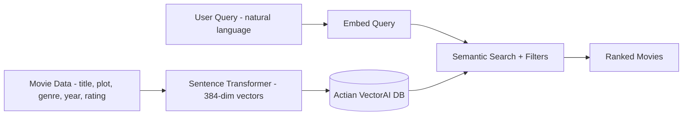

In this tutorial, you build a complete application on Actian VectorAI DB from scratch. By the end, you have a working movie recommendation engine that can store movie descriptions as dense vectors, find semantically similar movies using natural language queries, filter results by genre, year, or rating, update movie information after ingestion, delete outdated records, and inspect collection health and statistics.

No prior vector database experience is required. Each step introduces a concept, explains why it matters, and shows the code you need.

---

## What you build

A user describes what they want to watch in natural language — "a suspenseful space movie" — and the system finds the best matches from the database, optionally filtered by genre, year, or minimum rating. The diagram below shows how data flows from raw movie records through embedding and into a searchable vector store.



---

## Prerequisites

Before starting, make sure the following are in place.

- Python 3.10 or later.
- `pip` available in your environment (verify with `pip --version`).
- A virtual environment activated (recommended: `python -m venv .venv && source .venv/bin/activate`).
- An Actian VectorAI DB server running (default: `localhost:50051`).
- Internet access on first run — `sentence-transformers` downloads the embedding model (`all-MiniLM-L6-v2`, approximately 90 MB) from Hugging Face when you first call `SentenceTransformer(EMBED_MODEL)`.
- At least 512 MB of free memory to load the embedding model.

---

## Step 1: Install dependencies

The following command installs the Actian VectorAI SDK and the sentence embedding library. Run it inside your virtual environment.

```bash
pip install actian-vectorai sentence-transformers
```

The two packages serve distinct roles in the application.

| Package | Purpose |
|---------|---------|
| `actian-vectorai` | Official Python SDK — async/sync clients, Filter DSL, gRPC transport. |
| `sentence-transformers` | Open-source library for generating text embeddings. |

---

## Step 2: Import libraries and configure

The following snippet imports every class needed for this tutorial and sets three constants that identify the server address, collection name, and embedding model. Running it loads the model into memory and prints the resolved configuration so you can confirm the values before proceeding.

```python
import asyncio
from sentence_transformers import SentenceTransformer

from actian_vectorai import (
    AsyncVectorAIClient,
    Distance,
    Field,
    FilterBuilder,
    PointStruct,
    VectorParams,
)
from actian_vectorai.models.collections import HnswConfigDiff

# Connection and collection settings
SERVER = "localhost:50051"
COLLECTION = "Movies"

# Embedding model settings — model name and its output dimension must match
EMBED_MODEL = "all-MiniLM-L6-v2"
EMBED_DIM = 384

# Load the embedding model into memory (downloads on first run)
model = SentenceTransformer(EMBED_MODEL)

print(f"Server:     {SERVER}")
print(f"Collection: {COLLECTION}")
print(f"Model:      {EMBED_MODEL} ({EMBED_DIM} dimensions)")
```
The table below describes what each import provides.

| Import | Purpose |
|--------|---------|
| `AsyncVectorAIClient` | Manages the gRPC connection to VectorAI DB. |
| `Distance` | Enum for similarity metrics (Cosine, Dot, Euclid, Manhattan). |
| `Field` | Builds type-safe conditions on payload fields. |
| `FilterBuilder` | Combines conditions with boolean logic (AND / OR / NOT). |
| `PointStruct` | A data point: ID + vector + payload (metadata). |
| `VectorParams` | Configuration for the vector space: dimension + distance. |
| `HnswConfigDiff` | Tuning parameters for the HNSW search index. |

### Expected output

The three constants are printed in order — server address, collection name, and the model name with its output dimension.

```text
Server:     localhost:50051
Collection: Movies
Model:      all-MiniLM-L6-v2 (384 dimensions)
```

---

## Step 3: Connect to the server

The following snippet opens a gRPC connection to the server, calls `health_check()`, and prints the server's version information. If the connection fails, an exception is raised inside the `async with` block and the error message identifies the problem.

```python
async def check_connection():
    # async with manages the connection lifecycle — opens on entry, closes on exit
    async with AsyncVectorAIClient(url=SERVER) as client:
        health = await client.health_check()
        print(f"Server health: {health}")

asyncio.run(check_connection())
```

### Expected output

When the server is reachable, health information similar to the following is printed.

```text
Server health: {'title': 'actian-vectorai', 'version': '2.5.0'}
```

If you see a connection error, then verify that the VectorAI DB server is running on `localhost:50051`.

When `check_connection()` runs, the `async with AsyncVectorAIClient(...)` block manages the gRPC connection lifecycle. The client opens a channel to `SERVER`, runs the coroutine body including `health_check()`, and closes the channel when the block exits, so resources are released even if something fails. The sequence is as follows.

1. `AsyncVectorAIClient(url=SERVER)` creates a client instance.
2. `async with` opens a gRPC channel and verifies the server is reachable.
3. `health_check()` pings the server and returns status information.
4. When the `async with` block exits, the connection is closed cleanly.

---

## Step 4: Create a collection

A _collection_ is a named container for vectors. Think of it as a table in a relational database, but optimized for similarity search.

The following snippet calls `get_or_create`, which creates the collection if it does not already exist. On first run it prints `created`; on subsequent runs it prints `already exists`. The function returns a boolean indicating whether a new collection was provisioned.

```python
async def create_collection():
    async with AsyncVectorAIClient(url=SERVER) as client:
        created = await client.collections.get_or_create(
            name=COLLECTION,
            vectors_config=VectorParams(
                size=EMBED_DIM,          # vector dimension must match the embedding model
                distance=Distance.Cosine, # cosine similarity is recommended for sentence transformers
            ),
            hnsw_config=HnswConfigDiff(m=16, ef_construct=128),
        )
        print(f"Collection '{COLLECTION}' {'created' if created else 'already exists'}.")

asyncio.run(create_collection())
```
The arguments to `get_or_create` define the vector dimension, how similarity is measured, and how the HNSW index is built. The table below explains each parameter.

| Parameter | Value | Meaning |
|-----------|-------|---------|
| `size=384` | Vector dimension | Must match the embedding model's output dimension. |
| `distance=Distance.Cosine` | Similarity metric | Cosine similarity is ideal for sentence transformers. |
| `m=16` | HNSW graph connections | Each node connects to 16 neighbours — balances speed and recall. |
| `ef_construct=128` | Build-time search width | Higher values improve index quality at the cost of build time. |

### Why use `get_or_create`

`get_or_create` is safe to call repeatedly. When the collection does not yet exist, the SDK creates it and returns `True`. When the collection already exists, the SDK skips creation and returns `False`. This boolean return value lets you log whether a new collection was provisioned, and your scripts become idempotent — safe to re-run without side effects.

### Expected output

`get_or_create` prints whether it provisioned a new collection or found one that already existed.

```text
Collection 'Movies' created.
```

---

## Step 5: Create embedding helpers

The following two functions wrap the sentence transformer model. `embed_text` encodes a single string; `embed_texts` encodes a list of strings in one forward pass and is significantly faster when processing multiple items.

```python
def embed_text(text: str) -> list[float]:
    """Convert a single text string to a 384-dimensional vector."""
    return model.encode(text).tolist()

def embed_texts(texts: list[str]) -> list[list[float]]:
    """Convert a batch of text strings to vectors in a single forward pass."""
    return model.encode(texts).tolist()

# Encode a test string and print the dimension and first five values to verify the model loaded correctly
test_vec = embed_text("A thrilling adventure in space")
print(f"Vector dimension: {len(test_vec)}")
print(f"First 5 values:   {[round(v, 4) for v in test_vec[:5]]}")
```

### Expected output

The vector dimension confirms the model loaded correctly. The five sample values will differ slightly between runs because the model weights are fixed but floating-point precision varies across platforms.

```text
Vector dimension: 384
First 5 values:   [-0.0234, 0.0891, -0.0567, 0.0123, -0.0456]
```

Batching matters for three reasons.

- Speed: `embed_texts` processes all texts in a single forward pass through the model, which is significantly faster than calling `embed_text` in a loop.
- Efficiency: Batching reduces CPU and memory overhead compared to encoding one string at a time.
- Best practice: Always batch when embedding more than a few texts.

---

## Step 6: Prepare your data

Each movie becomes a point in the collection. A point has three parts.

- ID — A unique identifier (integer or UUID string).
- Vector — An embedding of the movie's plot description.
- Payload — Structured metadata (genre, year, rating, and so on).

The following list defines ten movies that will be embedded and stored in the next step. Each entry includes a plot description that the embedding model will encode into a 384-dimensional vector.

```python
movies = [
    {
        "title": "Interstellar",
        "plot": "A team of explorers travel through a wormhole in space to ensure humanity's survival on a dying Earth.",
        "genre": "sci-fi",
        "year": 2014,
        "rating": 8.7,
        "director": "Christopher Nolan",
    },
    {
        "title": "The Shawshank Redemption",
        "plot": "A banker sentenced to life in prison forms an unlikely friendship and finds hope through acts of common decency.",
        "genre": "drama",
        "year": 1994,
        "rating": 9.3,
        "director": "Frank Darabont",
    },
    {
        "title": "Inception",
        "plot": "A thief who steals corporate secrets through dream-sharing technology is given the task of planting an idea in a target's mind.",
        "genre": "sci-fi",
        "year": 2010,
        "rating": 8.8,
        "director": "Christopher Nolan",
    },
    {
        "title": "The Dark Knight",
        "plot": "Batman faces the Joker, a criminal mastermind who plunges Gotham City into anarchy and forces the Dark Knight to confront his beliefs.",
        "genre": "action",
        "year": 2008,
        "rating": 9.0,
        "director": "Christopher Nolan",
    },
    {
        "title": "Pulp Fiction",
        "plot": "The lives of two mob hitmen, a boxer, a gangster, and his wife intertwine in four tales of violence and redemption.",
        "genre": "crime",
        "year": 1994,
        "rating": 8.9,
        "director": "Quentin Tarantino",
    },
    {
        "title": "The Matrix",
        "plot": "A computer hacker discovers that reality is a simulation created by machines and joins a rebellion to free humanity.",
        "genre": "sci-fi",
        "year": 1999,
        "rating": 8.7,
        "director": "The Wachowskis",
    },
    {
        "title": "Forrest Gump",
        "plot": "A slow-witted but kind-hearted man from Alabama witnesses and unwittingly influences several historical events in the 20th century.",
        "genre": "drama",
        "year": 1994,
        "rating": 8.8,
        "director": "Robert Zemeckis",
    },
    {
        "title": "Alien",
        "plot": "The crew of a commercial spaceship encounters a deadly extraterrestrial creature that begins hunting them one by one.",
        "genre": "horror",
        "year": 1979,
        "rating": 8.5,
        "director": "Ridley Scott",
    },
    {
        "title": "Goodfellas",
        "plot": "The story of Henry Hill and his life in the mob, covering his relationship with his wife and his mob partners.",
        "genre": "crime",
        "year": 1990,
        "rating": 8.7,
        "director": "Martin Scorsese",
    },
    {
        "title": "Blade Runner 2049",
        "plot": "A young blade runner discovers a long-buried secret that leads him to track down a former blade runner who has been missing for thirty years.",
        "genre": "sci-fi",
        "year": 2017,
        "rating": 8.0,
        "director": "Denis Villeneuve",
    },
]

print(f"Loaded {len(movies)} movies.")
```

---

## Step 7: Embed and store the data

The following snippet embeds every plot in a single batch, wraps each movie as a `PointStruct`, sends all ten points to the server in one `upsert` call, flushes the data to disk, and then reads back the total vector count to confirm the write succeeded.

```python
async def ingest_movies():
    # Embed all plots in one batch for efficiency
    plots = [m["plot"] for m in movies]
    vectors = embed_texts(plots)

    # Build a PointStruct for each movie: integer ID, plot vector, and full metadata as payload
    points = []
    for i, (movie, vector) in enumerate(zip(movies, vectors)):
        points.append(PointStruct(
            id=i,
            vector=vector,
            payload={
                "title": movie["title"],
                "plot": movie["plot"],
                "genre": movie["genre"],
                "year": movie["year"],
                "rating": movie["rating"],
                "director": movie["director"],
            },
        ))

    async with AsyncVectorAIClient(url=SERVER) as client:
        await client.points.upsert(COLLECTION, points=points)  # insert-or-update
        await client.vde.flush(COLLECTION)                      # persist to disk immediately
        count = await client.vde.get_vector_count(COLLECTION)  # confirm stored count

    print(f"Stored {len(points)} movies. Total in collection: {count}")

asyncio.run(ingest_movies())
```

### Expected output

After a successful upsert and flush, the stored count matches the number of points sent. The total reported by `get_vector_count` confirms all ten movies were persisted.

```text
Stored 10 movies. Total in collection: 10
```

The ingestion pipeline runs through five stages.

1. `embed_texts` converts all 10 plots into 384-dimensional vectors in one batch.
2. Each movie becomes a `PointStruct` with an integer ID, the plot vector, and the full metadata as payload.
3. `points.upsert` sends the points to the server ("upsert" means insert-or-update).
4. `vde.flush` ensures the data is persisted to disk immediately.
5. `vde.get_vector_count` confirms how many vectors are stored.

---

## Step 8: Run your first semantic search

The following snippet embeds a natural-language query string, sends the query vector to the server, and prints the top five most similar movies ranked by cosine similarity score.

```python
async def search_movies(query: str, top_k: int = 5):
    query_vector = embed_text(query)

    async with AsyncVectorAIClient(url=SERVER) as client:
        results = await client.points.search(
            COLLECTION,
            vector=query_vector,
            limit=top_k,
            with_payload=True,
        ) or []

    return results

query = "a suspenseful movie set in outer space"
results = asyncio.run(search_movies(query))

print(f"Query: \"{query}\"\n")
for r in results:
    p = r.payload
    print(f"  {r.score:.4f}  {p['title']} ({p['year']}) — {p['genre']} — ★{p['rating']}")
```
The `search` call accepts three key parameters that control what is returned.

| Parameter | Value | Purpose |
|-----------|-------|---------|
| `vector` | Query embedding | The search finds vectors closest to this one. |
| `limit=5` | Top 5 results | Number of results to return. |
| `with_payload=True` | Include metadata | Returns title, genre, year, and other fields with each result. |

### Expected output

The results are ranked by cosine similarity score. The embedding model surfaces space-themed films even when the exact query words do not appear in their plot descriptions.

```text
Query: "a suspenseful movie set in outer space"

  0.7823  Alien (1979) — horror — ★8.5
  0.7156  Interstellar (2014) — sci-fi — ★8.7
  0.5934  Blade Runner 2049 (2017) — sci-fi — ★8.0
  0.5412  The Matrix (1999) — sci-fi — ★8.7
  0.3201  Inception (2010) — sci-fi — ★8.8
```

In this example, the embedding model captures semantic similarity rather than exact keyword matching. The query "suspenseful movie set in outer space" returns "Alien" (a horror film about a creature on a spaceship) and "Interstellar" (a space exploration film), even though none of the exact query words appear in their plot descriptions. Search quality depends on the model and dataset.

---

## Step 9: Filter by metadata

Filters restrict the candidate set before vector ranking, so similarity scores are only compared within the matching subset. Actian VectorAI DB provides the `Field` and `FilterBuilder` classes for this purpose. The examples below show how to filter by genre, by a minimum rating, and by a combination of both.

### Filter by genre

The following snippet defines a `search_by_genre` function that builds a `must` condition on the `genre` field. Only points where `genre` equals the provided value are considered during ranking. Calling the function with `"sci-fi"` returns the top sci-fi matches for the query.

```python
async def search_by_genre(query: str, genre: str, top_k: int = 5):
    query_vector = embed_text(query)

    # must() applies the condition before vector ranking — only matching points are scored
    filter_obj = (
        FilterBuilder()
        .must(Field("genre").eq(genre))
        .build()
    )

    async with AsyncVectorAIClient(url=SERVER) as client:
        results = await client.points.search(
            COLLECTION,
            vector=query_vector,
            limit=top_k,
            filter=filter_obj,
            with_payload=True,
        ) or []

    return results

results = asyncio.run(search_by_genre("an exciting adventure", "sci-fi"))

print("Genre filter: sci-fi\n")
for r in results:
    p = r.payload
    print(f"  {r.score:.4f}  {p['title']} ({p['year']})")
```

#### Expected output

Only sci-fi movies are scored and returned. Non-matching genres are excluded before ranking, so the similarity scores reflect distance within the sci-fi subset only.

```text
Genre filter: sci-fi

  0.6234  Interstellar (2014)
  0.5890  The Matrix (1999)
  0.5678  Inception (2010)
  0.4512  Blade Runner 2049 (2017)
```

`Field("genre").eq("sci-fi")` creates a condition that passes only movies where `genre` equals `"sci-fi"`. The filter is applied before ranking, so the search only scores matching points.

### Filter by minimum rating

The following snippet uses `.gte()` on the numeric `rating` field to restrict results to movies at or above a minimum quality threshold.

```python
async def search_highly_rated(query: str, min_rating: float, top_k: int = 5):
    query_vector = embed_text(query)

    filter_obj = (
        FilterBuilder()
        .must(Field("rating").gte(min_rating))
        .build()
    )

    async with AsyncVectorAIClient(url=SERVER) as client:
        results = await client.points.search(
            COLLECTION,
            vector=query_vector,
            limit=top_k,
            filter=filter_obj,
            with_payload=True,
        ) or []

    return results

results = asyncio.run(search_highly_rated("intense crime story", 8.8))

print("Filter: rating >= 8.8\n")
for r in results:
    p = r.payload
    print(f"  {r.score:.4f}  {p['title']} — ★{p['rating']}")
```

#### Expected output

Only movies with a rating of `8.8` or above are included. The results are still ordered by semantic similarity to the query, not by rating.

```text
Filter: rating >= 8.8

  0.6123  Pulp Fiction — ★8.9
  0.5234  The Dark Knight — ★9.0
  0.4678  The Shawshank Redemption — ★9.3
  0.4012  Inception — ★8.8
  0.3890  Forrest Gump — ★8.8
```

The filter passes only points whose `rating` payload value is greater than or equal to the threshold.

---

## Step 10: Combine multiple filters

`FilterBuilder` supports three types of boolean logic. Each method narrows or expands the candidate set in a different way.

| Method | Meaning | SQL equivalent |
|--------|---------|---------------|
| `.must()` | All conditions must match. | `AND` |
| `.should()` | At least one condition should match. | `OR` |
| `.must_not()` | Exclude any points that match. | `NOT` |

The following snippet chains three conditions: movies released after 2000, with a rating of at least 8.5, and not in the drama genre. Running it with the query "mind-bending thriller" returns only films that satisfy all three conditions, ranked by similarity.

```python
async def advanced_search(query: str, top_k: int = 5):
    query_vector = embed_text(query)

    # Chain multiple must() and must_not() calls — all conditions apply simultaneously
    filter_obj = (
        FilterBuilder()
        .must(Field("year").gte(2000))
        .must(Field("rating").gte(8.5))
        .must_not(Field("genre").eq("drama"))
        .build()
    )

    async with AsyncVectorAIClient(url=SERVER) as client:
        results = await client.points.search(
            COLLECTION,
            vector=query_vector,
            limit=top_k,
            filter=filter_obj,
            with_payload=True,
        ) or []

    return results

results = asyncio.run(advanced_search("mind-bending thriller"))

print("Filters: year >= 2000, rating >= 8.5, NOT drama\n")
for r in results:
    p = r.payload
    print(f"  {r.score:.4f}  {p['title']} ({p['year']}) — {p['genre']} — ★{p['rating']}")
```

### Expected output

All three conditions are applied simultaneously. Only films released after 2000, rated at least 8.5, and not in the drama genre are considered for ranking.

```text
Filters: year >= 2000, rating >= 8.5, NOT drama

  0.6234  Inception (2010) — sci-fi — ★8.8
  0.5890  The Dark Knight (2008) — action — ★9.0
  0.5234  Interstellar (2014) — sci-fi — ★8.7
```

This query finds mind-bending thrillers released after 2000 with a rating of at least 8.5, excluding dramas.

---

## Step 11: Retrieve a specific movie by ID

The following snippet fetches movie ID `0` directly from the collection by passing the integer ID to `points.get()`. No search is performed — the server returns the exact point and its payload.

```python
async def get_movie(movie_id: int):
    async with AsyncVectorAIClient(url=SERVER) as client:
        points = await client.points.get(
            COLLECTION,
            ids=[movie_id],
            with_payload=True,
        )

    if not points:
        print(f"Movie {movie_id} not found.")
        return None

    p = points[0].payload
    print(f"ID {movie_id}: {p['title']} ({p['year']}) — {p['genre']} — ★{p['rating']}")
    print(f"  Plot: {p['plot']}")
    return points[0]

asyncio.run(get_movie(0))
```

### Expected output

Point `0` is the first movie ingested in this tutorial, so the output shows Interstellar's full payload.

```text
ID 0: Interstellar (2014) — sci-fi — ★8.7
  Plot: A team of explorers travel through a wormhole in space to ensure humanity's survival on a dying Earth.
```

This code passes a single integer ID to `points.get()` with `with_payload=True`, so the server returns the exact point and its complete metadata without performing any similarity search. The function checks whether any points were returned, then prints the title, year, genre, rating, and full plot description of the matching record.

---

## Step 12: Update movie metadata

After ingestion, payload fields can be updated without re-embedding the vector. The following snippet calls `set_payload` to change the rating for movie ID `0` to `8.8`, then calls `get_movie` to confirm the change was applied.

```python
async def update_movie_rating(movie_id: int, new_rating: float):
    async with AsyncVectorAIClient(url=SERVER) as client:
        await client.points.set_payload(
            COLLECTION,
            payload={"rating": new_rating},
            ids=[movie_id],
        )

    print(f"Updated movie {movie_id} rating to ★{new_rating}")

asyncio.run(update_movie_rating(0, 8.8))
asyncio.run(get_movie(0))
```

### Expected output

The second call to `get_movie(0)` confirms the rating was updated from `8.7` to `8.8` while all other fields remain unchanged.

```text
Updated movie 0 rating to ★8.8
ID 0: Interstellar (2014) — sci-fi — ★8.8
  Plot: A team of explorers travel through a wormhole in space to ensure humanity's survival on a dying Earth.
```

`set_payload` merges the provided fields into the existing payload. Three properties define its behaviour.

- Merge behaviour: Only the specified fields are updated. All other fields in the existing payload remain unchanged.
- No re-embedding: The vector stays the same — only the metadata is modified, so there is no reprocessing cost.
- Immediate effect: Subsequent searches and retrievals reflect the updated values right away.

### Add new fields

`set_payload` can also add entirely new keys to a point. The following snippet adds a `tags` list to movie ID `0`. Because `set_payload` merges rather than replaces, the title, plot, genre, and all other existing fields are preserved.

```python
async def add_tags(movie_id: int, tags: list[str]):
    async with AsyncVectorAIClient(url=SERVER) as client:
        await client.points.set_payload(
            COLLECTION,
            payload={"tags": tags},
            ids=[movie_id],
        )

    print(f"Added tags to movie {movie_id}: {tags}")

asyncio.run(add_tags(0, ["space", "wormhole", "survival", "time-dilation"]))
asyncio.run(get_movie(0))
```

**Expected Output**

The follow-up `get_movie(0)` call confirms the new `tags` field was merged into the payload. All previously stored fields — title, plot, genre, year, and rating — remain intact.

```text
Added tags to movie 0: ['space', 'wormhole', 'survival', 'time-dilation']
ID 0: Interstellar (2014) — sci-fi — ★8.8
  Plot: A team of explorers travel through a wormhole in space to ensure humanity's survival on a dying Earth.
```

This code calls `add_tags` with movie ID `0` and a list of four descriptive tags: `space`, `wormhole`, `survival`, and `time-dilation`. The `set_payload` call merges the new `tags` field into the existing payload for that point, leaving all previously stored fields — title, plot, genre, year, rating, and director — unchanged. The follow-up call to `get_movie(0)` reads the point back from the collection so you can confirm the tags were stored correctly.

---

## Step 13: Delete points

Points can be removed individually by ID or in bulk by filter.

### Delete by ID

The following snippet removes movie ID `9` by passing an explicit ID list to `points.delete()`, then reads back the vector count to confirm the deletion.

```python
async def delete_movie(movie_id: int):
    async with AsyncVectorAIClient(url=SERVER) as client:
        await client.points.delete(COLLECTION, ids=[movie_id])
        count = await client.vde.get_vector_count(COLLECTION)

    print(f"Deleted movie {movie_id}. Remaining: {count}")

asyncio.run(delete_movie(9))
```

#### Expected output

The vector count drops from 10 to 9, confirming that movie ID `9` (Blade Runner 2049) was removed from the collection.

```text
Deleted movie 9. Remaining: 9
```

This code passes ID `9` — corresponding to "Blade Runner 2049", the last movie in the dataset — to `points.delete()`. After the deletion, `vde.get_vector_count` reads the updated total and prints it so you can confirm the point was removed.

### Delete by filter

The following snippet deletes all movies whose rating falls below a given threshold. The `filter_obj` uses `.lt()` (less than) to identify matching points. The vector count is read before and after the operation so the result is visible.

```python
async def delete_low_rated(min_rating: float):
    # Build a filter that matches any point with a rating below the threshold
    filter_obj = (
        FilterBuilder()
        .must(Field("rating").lt(min_rating))
        .build()
    )

    async with AsyncVectorAIClient(url=SERVER) as client:
        count_before = await client.vde.get_vector_count(COLLECTION)
        await client.points.delete(COLLECTION, filter=filter_obj)
        await client.vde.flush(COLLECTION)
        count_after = await client.vde.get_vector_count(COLLECTION)

    print(f"Deleted movies with rating < {min_rating}. Before: {count_before}, After: {count_after}")

# Uncomment the line below to run — this permanently removes points from the collection
# asyncio.run(delete_low_rated(8.6))
```

---

## Step 14: Count points

The following snippet counts the total number of points in the collection, then runs three filtered counts to check how many sci-fi movies exist, how many have a rating of 8.8 or higher, and how many were directed by Christopher Nolan.

```python
async def count_movies():
    async with AsyncVectorAIClient(url=SERVER) as client:
        # Total count — no filter applied
        total = await client.vde.get_vector_count(COLLECTION)
        print(f"Total movies: {total}")

        # Filtered counts using exact=True for a precise scan
        sci_fi = await client.points.count(
            COLLECTION,
            filter=FilterBuilder().must(Field("genre").eq("sci-fi")).build(),
            exact=True,
        )
        print(f"Sci-fi movies: {sci_fi}")

        highly_rated = await client.points.count(
            COLLECTION,
            filter=FilterBuilder().must(Field("rating").gte(8.8)).build(),
            exact=True,
        )
        print(f"Movies with rating >= 8.8: {highly_rated}")

        nolan = await client.points.count(
            COLLECTION,
            filter=FilterBuilder().must(Field("director").eq("Christopher Nolan")).build(),
            exact=True,
        )
        print(f"Christopher Nolan movies: {nolan}")

asyncio.run(count_movies())
```

The `exact` parameter controls whether the count is precise or approximate. The table below explains the trade-off.

| Value | Behaviour |
|-------|-----------|
| `exact=True` | Scans all points and returns the precise count. |
| `exact=False` | Uses an approximate count from the index (faster for large collections). |

For small collections, always use `exact=True`. For millions of points, `exact=False` avoids a full scan.

<Note>
`client.points.count()` returns a count response object. The integer count is accessed via the `.count` attribute (for example, `sci_fi.count`). The code samples above print the response object directly for readability; update them to access `.count` if your SDK version returns a structured object rather than a raw integer.
</Note>

### Expected output

Counts reflect the tutorial dataset after the earlier deletion of movie ID `9`.

```text
Total movies: 9
Sci-fi movies: 3
Movies with rating >= 8.8: 5
Christopher Nolan movies: 3
```

The code runs four separate counts: one for the full collection and three with filters applied using `exact=True`. The first count returns the total number of points currently in the collection. The second filters by `genre == "sci-fi"`, the third by `rating >= 8.8`, and the fourth by `director == "Christopher Nolan"`. The results reflect the dataset state after movie ID `9` was deleted in Step 13.

---

## Step 15: Inspect collection status

The following snippet retrieves the collection's status, configuration, and current VDE lifecycle state, then prints them alongside the vector count. Run this at any point to verify the collection is healthy before running searches.

```python
async def inspect_collection():
    async with AsyncVectorAIClient(url=SERVER) as client:
        info = await client.collections.get_info(COLLECTION)
        print(f"Collection: {COLLECTION}")
        print(f"  Status: {info.status}")
        print(f"  Config: {info.config}")

        state = await client.vde.get_state(COLLECTION)
        print(f"  VDE state: {state}")

        count = await client.vde.get_vector_count(COLLECTION)
        print(f"  Vector count: {count}")

asyncio.run(inspect_collection())
```

### Expected output

This code connects to the server, calls `collections.get_info` to retrieve the collection's operational status and vector configuration, then calls `vde.get_state` to read the current VDE lifecycle state, and finally calls `vde.get_vector_count` to confirm the number of stored vectors. A `green` status and `active` VDE state indicate the collection is healthy and ready for searches.

```text
Collection: Movies
  Status: green
  Config: {'params': {'vectors': {'size': 384, 'distance': 'Cosine'}, 'shard_number': 1, 'replication_factor': 1, 'write_consistency_factor': 1, 'on_disk_payload': True}, 'hnsw_config': {'m': 16, 'ef_construct': 128, 'full_scan_threshold': 10000, 'max_indexing_threads': 0, 'on_disk': False}, 'optimizer_config': {'deleted_threshold': 0.2, 'vacuum_min_vector_number': 1000, 'default_segment_number': 0, 'max_segment_size': None, 'memmap_threshold': None, 'indexing_threshold': 20000, 'flush_interval_sec': 5, 'max_optimization_threads': 1}, 'wal_config': {'wal_capacity_mb': 32, 'wal_segments_ahead': 0}, 'quantization_config': None}
  VDE state: active
  Vector count: 9
```

This code connects to the server, calls `collections.get_info` to retrieve the collection's operational status and vector configuration, then calls `vde.get_state` to read the current VDE lifecycle state, and finally calls `vde.get_vector_count` to confirm the number of stored vectors. All three values are printed together so you can verify the collection is healthy and correctly configured before running searches.

---

## Step 16: List all collections

The following snippet retrieves the names of every collection on the server and prints them as a numbered list. This is useful for confirming which collections are available before connecting a client.

```python
async def list_collections():
    async with AsyncVectorAIClient(url=SERVER) as client:
        names = await client.collections.list()

    print(f"Collections on server ({len(names)}):")
    for name in names:
        print(f"  - {name}")

asyncio.run(list_collections())
```

### Expected output

Because only one collection was created in this tutorial, `collections.list()` returns a single entry. The count in the header updates automatically as collections are added or removed.

```text
Collections on server (1):
  - Movies
```

This code calls `collections.list()`, which returns the names of all collections currently provisioned on the server. The result is printed as a numbered list with the total count shown in the header. In this tutorial only one collection has been created, so the output lists `Movies` as the single entry.

---

## Step 17: Put it all together — a complete search function

The previous steps introduced each operation individually. This section consolidates them into a single reusable `recommend_movies` function that accepts optional filters and applies only the ones provided.

The function below accepts a natural-language query and four optional filter parameters. For each filter that is not `None`, the corresponding condition is added to the `FilterBuilder`. Running the three example calls prints results for an unfiltered sci-fi query, a crime story filtered to high-rated movies, and a feel-good query that excludes crime films made before 1990.

```python
async def recommend_movies(
    query: str,
    genre: str | None = None,
    min_year: int | None = None,
    min_rating: float | None = None,
    exclude_genre: str | None = None,
    top_k: int = 5,
):
    """Recommend movies using semantic search with optional filters."""
    query_vector = embed_text(query)

    # Build filters conditionally — only add a condition when the parameter is provided
    fb = FilterBuilder()
    if genre:
        fb = fb.must(Field("genre").eq(genre))
    if min_year is not None:
        fb = fb.must(Field("year").gte(min_year))
    if min_rating is not None:
        fb = fb.must(Field("rating").gte(min_rating))
    if exclude_genre:
        fb = fb.must_not(Field("genre").eq(exclude_genre))
    filter_obj = fb.build()

    async with AsyncVectorAIClient(url=SERVER) as client:
        results = await client.points.search(
            COLLECTION,
            vector=query_vector,
            limit=top_k,
            filter=filter_obj,
            with_payload=True,
        ) or []

    # Print the query, active filters, and ranked results
    print(f"\n  Query: \"{query}\"")
    filters_desc = []
    if genre: filters_desc.append(f"genre={genre}")
    if min_year is not None: filters_desc.append(f"year>={min_year}")
    if min_rating is not None: filters_desc.append(f"rating>={min_rating}")
    if exclude_genre: filters_desc.append(f"NOT {exclude_genre}")
    print(f"  Filters: {', '.join(filters_desc) or 'none'}")
    print(f"  Results: {len(results)}\n")

    for r in results:
        p = r.payload
        print(f"    {r.score:.4f}  {p['title']} ({p['year']}) — {p['genre']} — ★{p['rating']}")
        print(f"           {p['plot'][:80]}...")
    print()

asyncio.run(recommend_movies("a mind-bending sci-fi movie"))

asyncio.run(recommend_movies(
    "an intense crime story",
    min_rating=8.8,
))

asyncio.run(recommend_movies(
    "a feel-good movie about life",
    exclude_genre="crime",
    min_year=1990,
))
```

### Expected output

Three calls are made with different queries and filter combinations. Each block shows the active filters and how many results matched before the ranked list is printed.

```text
  Query: "a mind-bending sci-fi movie"
  Filters: none
  Results: 5

    0.7234  The Matrix (1999) — sci-fi — ★8.7
           A computer hacker discovers that reality is a simulation created by machines and j...
    0.7012  Inception (2010) — sci-fi — ★8.8
           A thief who steals corporate secrets through dream-sharing technology is given the...
    0.5890  Interstellar (2014) — sci-fi — ★8.8
           A team of explorers travel through a wormhole in space to ensure humanity's surviv...
    0.4234  The Dark Knight (2008) — action — ★9.0
           Batman faces the Joker, a criminal mastermind who plunges Gotham City into anarchy...
    0.3012  Alien (1979) — horror — ★8.5
           The crew of a commercial spaceship encounters a deadly extraterrestrial creature t...

  Query: "an intense crime story"
  Filters: rating>=8.8
  Results: 2

    0.6890  Pulp Fiction (1994) — crime — ★8.9
           The lives of two mob hitmen, a boxer, a gangster, and his wife intertwine in four ...
    0.4123  The Dark Knight (2008) — action — ★9.0
           Batman faces the Joker, a criminal mastermind who plunges Gotham City into anarchy...

  Query: "a feel-good movie about life"
  Filters: NOT crime, year>=1990
  Results: 5

    0.6345  Forrest Gump (1994) — drama — ★8.8
           A slow-witted but kind-hearted man from Alabama witnesses and unwittingly influenc...
    0.5678  The Shawshank Redemption (1994) — drama — ★9.3
           A banker sentenced to life in prison forms an unlikely friendship and finds hope t...
    ...
```

The first call searches without any filters and returns the top five semantically similar movies for "a mind-bending sci-fi movie". The second call applies a `min_rating >= 8.8` filter, narrowing results to only highly rated movies that match "an intense crime story". The third call combines an `exclude_genre="crime"` exclusion with a `min_year=1990` lower bound, so the search for "a feel-good movie about life" returns only non-crime films from 1990 onwards. Each call prints the query, active filters, result count, and ranked movies with truncated plot descriptions.

---

## Step 18: Cleanup

The following snippet flushes any pending writes to disk and prints the current movie count. The two lines that delete the collection are commented out so the data is preserved by default — uncomment them only when the collection is no longer needed.

```python
async def cleanup():
    async with AsyncVectorAIClient(url=SERVER) as client:
        count = await client.vde.get_vector_count(COLLECTION)
        print(f"Collection '{COLLECTION}' contains {count} movies.")

        await client.vde.flush(COLLECTION)
        print("Data flushed to disk.")

        # Uncomment the next two lines to permanently delete the collection:
        # await client.collections.delete(COLLECTION)
        # print(f"Collection '{COLLECTION}' deleted.")

asyncio.run(cleanup())
```

### Expected output

The vector count reflects the state of the collection after all previous steps. The flush confirmation line indicates that any pending writes have been safely persisted to disk.

```text
Collection 'Movies' contains 9 movies.
Data flushed to disk.
```

This code reads the current vector count from the collection, prints it, then calls `vde.flush` to ensure any pending writes are persisted to disk. The two lines that delete the collection are commented out — they are safe to uncomment when the tutorial data is no longer needed, but the collection is preserved by default so the data remains available for further experimentation.

---

## What you learned

The table below summarises every concept and API used in this tutorial.

| Concept | API | What it does |
|---------|-----|-------------|
| Connect | `AsyncVectorAIClient(url=...)` | Open a gRPC connection to VectorAI DB. |
| Health check | `client.health_check()` | Verify the server is reachable. |
| Create collection | `collections.get_or_create(vectors_config=VectorParams(...))` | Define a vector space with dimension and distance metric. |
| Embed text | `SentenceTransformer.encode()` | Convert text to a numerical vector. |
| Store data | `points.upsert(collection, points=[PointStruct(...)])` | Insert or update points with vectors and metadata. |
| Persist | `vde.flush(collection)` | Write pending data to disk. |
| Semantic search | `points.search(collection, vector=..., limit=5)` | Find the most similar vectors. |
| Filter (equality) | `Field("genre").eq("sci-fi")` | Match a specific value. |
| Filter (range) | `Field("rating").gte(8.5)` | Numeric comparison. |
| Filter (exclude) | `FilterBuilder().must_not(...)` | Exclude matching points. |
| Combine filters | `FilterBuilder().must(...).must(...).build()` | Boolean AND/OR/NOT logic. |
| Get by ID | `points.get(collection, ids=[0])` | Retrieve specific points. |
| Update metadata | `points.set_payload(collection, payload={...}, ids=[0])` | Merge new fields into existing payloads. |
| Delete by ID | `points.delete(collection, ids=[0])` | Remove specific points. |
| Delete by filter | `points.delete(collection, filter=...)` | Remove points matching conditions. |
| Count | `points.count(collection, filter=..., exact=True)` | Count matching points. |
| Vector count | `vde.get_vector_count(collection)` | Total vectors in the collection. |
| Collection info | `collections.get_info(collection)` | Status and configuration. |
| Collection state | `vde.get_state(collection)` | VDE lifecycle state. |
| List collections | `collections.list()` | All collection names on the server. |
| Delete collection | `collections.delete(collection)` | Remove a collection entirely. |

---

## Common patterns quick reference

The patterns below capture the idioms used most often when building applications with Actian VectorAI DB.

### Pattern 1: Search with optional filters

Build the filter conditionally so the same function works with or without constraints. Using `is not None` rather than a truthiness check prevents valid falsy values such as `0.0` from being silently skipped.

```python
fb = FilterBuilder()
if genre:
    fb = fb.must(Field("genre").eq(genre))
if min_rating is not None:
    fb = fb.must(Field("rating").gte(min_rating))
filter_obj = fb.build()
```

### Pattern 2: Upsert is idempotent

Calling `upsert` with the same ID replaces the existing point, so ingestion scripts can be re-run safely without creating duplicates.

### Pattern 3: Always flush after writes

Call `vde.flush()` immediately after `points.upsert()` to ensure data survives server restarts. Without it, recent writes may be lost if the server crashes.

```python
await client.points.upsert(COLLECTION, points=points)
await client.vde.flush(COLLECTION)
```

### Pattern 4: Use `get_or_create` for collections

`get_or_create` is safe to run on every application startup. It creates the collection if it does not exist and does nothing if it already does, so startup code does not need a separate existence check.

```python
await client.collections.get_or_create(name=COLLECTION, vectors_config=...)
```

---

## Next steps

<CardGroup cols={2}>
 <Card title="Predicate filters" href="/academy/tutorials/predicate-filters">
 Master the full Filter DSL with all field types and operators.
 </Card>
 <Card title="Similarity search fundamentals" href="/academy/tutorials/similarity-search-fundamentals">
 Explore search parameters, score thresholds, and pagination.
 </Card>
 <Card title="Use open-source embedding models" href="/academy/tutorials/open-source-embedding-models">
 Choose the right model and configure quantization for production.
 </Card>
 <Card title="Optimizing retrieval quality" href="/academy/tutorials/optimizing-retrieval-quality">
 Tune HNSW parameters, quantization, and search settings.
 </Card>
</CardGroup>
