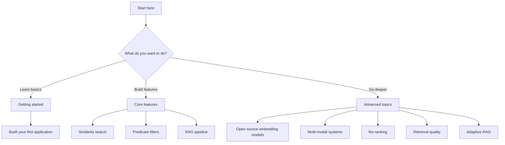

Learn Actian VectorAI DB through practical, task-focused tutorials. Each tutorial teaches specific skills you can apply immediately to your projects.

## Choose your learning path

Use this flowchart to find the tutorial track that matches your goals:

## Getting started

Build foundational skills by creating your first VectorAI DB application.

<CardGroup cols={2}>
  <Card title="Build your first application" href="/academy/tutorials/first-application">
    Create a complete semantic search application from scratch. Learn to connect, store vectors, and query data.
  </Card>
</CardGroup>

## Core features

Master the essential features for production vector search applications.

<CardGroup cols={2}>
  <Card title="Similarity search fundamentals" href="/academy/tutorials/similarity-search">
    Learn the core vector search workflow — from embedding and storing vectors to searching, scoring, batching, and paginating results.
  </Card>
  <Card title="Predicate filters" href="/academy/tutorials/predicate-filters">
    Combine vector search with structured payload filters using the type-safe Filter DSL and logical operators.
  </Card>
</CardGroup>

## Advanced topics

Take your skills further with advanced techniques and architectures.

<CardGroup cols={2}>
  <Card title="Use open-source embedding models" href="/academy/tutorials/leverage-open-source-embedding-models">
    Choose, configure, and integrate Sentence Transformers, BGE, and other open-source models. Covers dimensionality trade-offs, quantization, and re-embedding workflows.
  </Card>
  <Card title="Build multi-modal systems" href="/academy/tutorials/multimodel-system">
    Store, search, and fuse text, image, and metadata embeddings in a single collection using named vectors, multi-stage prefetch, and server-side fusion.
  </Card>
  <Card title="Re-rank search results" href="/academy/tutorials/re-ranking">
    Improve search relevance with multi-stage prefetch pipelines, cross-encoder scoring, payload-based boosting, and fusion re-ranking.
  </Card>
  <Card title="Optimize retrieval quality" href="/academy/tutorials/retrieval-quality">
    Measure and improve search accuracy by tuning HNSW parameters, distance metrics, quantization, score thresholds, and payload indexes.
  </Card>
  <Card title="Build adaptive RAG systems" href="/academy/tutorials/adaptive-rag">
    Create RAG pipelines that adapt retrieval strategy at runtime based on query type, confidence signals, and user feedback.
  </Card>
  <Card title="Build a full collection workflow" href="/academy/tutorials/python-first-collection">
    Connect, create a collection, insert vectors, search, retrieve, update, delete, and inspect collection info using the Python SDK.
  </Card>
</CardGroup>

## Recommended learning order

Follow this sequence to build skills progressively. Start with the beginner tutorials to build a strong foundation — each tutorial builds on concepts from previous ones, so following the recommended order helps you learn efficiently.

| Stage | Tutorial | Skills learned |
|-------|----------|----------------|
| 1 | [Build your first application](/academy/tutorials/first-application) | Connection, basic operations, search fundamentals |
| 2 | [Similarity search fundamentals](/academy/tutorials/similarity-search) | Search patterns, score thresholds, batch queries |
| 3 | [Predicate filters](/academy/tutorials/predicate-filters) | Metadata filtering, logical operators, combined queries |
| 4 | [Use open-source embedding models](/academy/tutorials/leverage-open-source-embedding-models) | Model selection, dimensionality, quantization |
| 5 | [Build multi-modal systems](/academy/tutorials/multimodel-system) | Named vectors, multi-stage prefetch, fusion |
| 6 | [Re-rank search results](/academy/tutorials/re-ranking) | Two-stage retrieval, cross-encoders, result optimization |
| 7 | [Optimize retrieval quality](/academy/tutorials/retrieval-quality) | Evaluation metrics, HNSW tuning, benchmarking |
| 8 | [Build adaptive RAG systems](/academy/tutorials/adaptive-rag) | Query classification, dynamic retrieval, self-correction |
| 9 | [Build a full collection workflow](/academy/tutorials/python-first-collection) | Connection, collection creation, CRUD operations, basic search |

## Time estimates

Use these estimates to plan your learning sessions and choose tutorials that fit your available time.

| Tutorial | Duration | Difficulty |
|----------|----------|------------|
| Build your first application | 15 min | Beginner |
| Similarity search fundamentals | 20 min | Beginner |
| Predicate filters | 25 min | Intermediate |
| Build a RAG pipeline | 30 min | Intermediate |
| Use open-source embedding models | 25 min | Intermediate |
| Build multi-modal systems | 35 min | Advanced |
| Re-rank search results | 30 min | Advanced |
| Optimize retrieval quality | 30 min | Advanced |
| Build adaptive RAG systems | 40 min | Advanced |
