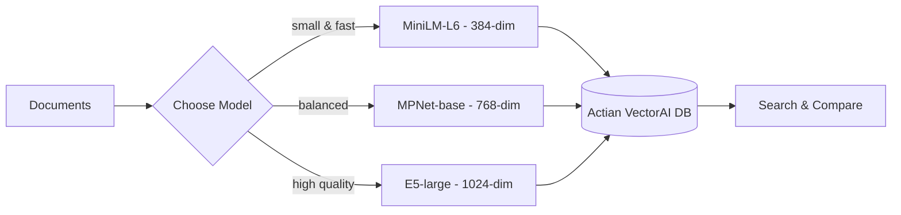

This is a hands-on tutorial. You will run Python against a local Actian VectorAI DB instance and step through choosing models, ingesting embeddings, and comparing search behavior. By the end, you will have a working multi-model search pipeline that lets you compare retrieval quality across different embedding architectures side by side.

Embedding models convert text (or images, audio, code) into dense numerical vectors that capture semantic meaning. Actian VectorAI DB stores these vectors and retrieves similar ones at scale — but the quality of your search depends entirely on the quality of your embeddings.

Choosing the right open-source model is one of the most impactful decisions you will make when building a vector search application. The wrong model wastes storage on unhelpful dimensions, produces low-recall results, and adds unnecessary latency.

Keep your server URL in `SERVER` aligned with your environment as you follow along.

---

## Architecture overview

The diagram below shows how documents flow through model selection, embedding, and storage in Actian VectorAI DB. Each model produces vectors of a different size, stored in separate collections so you can compare retrieval quality across configurations.



---

## Environment setup

Run the following command to install the two packages this tutorial depends on.

```bash
pip install actian-vectorai sentence-transformers
```

### What this installs

Both packages are required: one communicates with the database, and the other loads and runs embedding models on your machine. The list below maps each dependency to the role it plays in later steps.

- `actian-vectorai` — Official Python SDK for Actian VectorAI DB; provides async/sync clients, Filter DSL, and gRPC transport.
- `sentence-transformers` — Framework for loading and running open-source embedding models; downloads and caches models from Hugging Face.

---

## Step 1: Understand the model landscape

Before writing any code, review the table below to understand how the available models differ in dimension count, speed, and quality. The model you choose determines the shape of every vector stored in the database.

| Model | Dimensions | Speed | Quality | Best for |
|-------|-----------|-------|---------|----------|
| `sentence-transformers/all-MiniLM-L6-v2` | 384 | Very fast | Good | Prototyping, low-latency apps |
| `sentence-transformers/all-MiniLM-L12-v2` | 384 | Fast | Better | Production with speed constraints |
| `sentence-transformers/all-mpnet-base-v2` | 768 | Moderate | High | General production use |
| `sentence-transformers/multi-qa-mpnet-base-dot-v1` | 768 | Moderate | High (QA) | Question-answering systems |
| `sentence-transformers/all-distilroberta-v1` | 768 | Moderate | High | Diverse text types |
| `intfloat/e5-large-v2` | 1024 | Slow | Very high | Maximum quality, offline indexing |
| `BAAI/bge-large-en-v1.5` | 1024 | Slow | Very high | Benchmarks, academic use |
| `sentence-transformers/clip-ViT-B-32` | 512 | Moderate | High (multi) | Text + image multimodal |

### Key trade-offs

Keep the following trade-offs in mind before choosing a model.

- More dimensions means more storage and slower search, but better semantic resolution.
- Fewer dimensions means less RAM and faster search, but may lose subtle meaning.
- Model architecture matters more than dimension count — a well-trained 384-dim model can outperform a poorly trained 768-dim one.

---

## Step 2: Import dependencies and configure

The block below imports every module used across all steps of this tutorial and sets the server address. Run it once at the top of your script or notebook. If the import succeeds and the server address prints, your environment is ready.

```python
import asyncio
import time
from sentence_transformers import SentenceTransformer

from actian_vectorai import (
    AsyncVectorAIClient,
    Distance,
    PointStruct,
    VectorParams,
)
from actian_vectorai.models.collections import (
    HnswConfigDiff,
    ScalarQuantization,
    QuantizationConfig,
)
from actian_vectorai.models.enums import Datatype, QuantizationType
from actian_vectorai.models.points import (
    SearchParams,
    QuantizationSearchParams,
    WithPayloadSelector,
)

SERVER = "localhost:50051"

print(f"VectorAI Server: {SERVER}")
```

### Expected output

This block imports all SDK classes and utility modules needed throughout the tutorial — including the async client, distance enums, point structures, vector parameters, quantization types, and search parameter models — and sets `SERVER` to the local gRPC address. The final `print` statement confirms that the configuration loaded without errors and that the server address is set correctly.

```text
VectorAI Server: localhost:50051
```

---

## Step 3: Load multiple models and compare embedding output

The code below loads three models — small, medium, and large — and encodes the same sample sentence with each one. Running it prints each model's load time, dimension count, and the first five values of the resulting vector, confirming that each model produces a vector of a different size.

```python
# Three models spanning small, medium, and large architectures
models = {
    "minilm": {
        "name": "all-MiniLM-L6-v2",
        "dim": 384,
        "description": "Small, fast, good for prototyping",
    },
    "mpnet": {
        "name": "all-mpnet-base-v2",
        "dim": 768,
        "description": "Balanced quality and speed",
    },
    "e5-large": {
        "name": "intfloat/e5-large-v2",
        "dim": 1024,
        "description": "High quality, slower, needs quantization at scale",
    },
}

# Load each model and report its dimension count and load time
loaded_models = {}
for key, info in models.items():
    print(f"Loading {info['name']}...")
    t0 = time.time()
    loaded_models[key] = SentenceTransformer(info["name"])
    elapsed = time.time() - t0
    print(f"  Loaded in {elapsed:.1f}s — {info['dim']} dimensions — {info['description']}")

# Encode one sentence with each model to confirm output dimensions
sample_text = "Vector databases store high-dimensional embeddings for similarity search."

print(f"\nSample: \"{sample_text}\"\n")
for key, m in loaded_models.items():
    vec = m.encode(sample_text)
    print(f"  {key:>10}: dim={len(vec)}, first 5 values={vec[:5].round(4).tolist()}")
```

### Expected output

This block iterates over the three model definitions — MiniLM-L6 (384 dimensions), MPNet-base (768 dimensions), and E5-large-v2 (1024 dimensions) — loads each one from the Hugging Face cache via `SentenceTransformer`, and records the load time. It then encodes the same sample sentence with every loaded model and prints each model's actual output dimension and the first five vector values to confirm that the models are producing embeddings of the expected shape and are ready for ingestion.

```text
Loading all-MiniLM-L6-v2...
  Loaded in <time>s — 384 dimensions — Small, fast, good for prototyping
Loading all-mpnet-base-v2...
  Loaded in <time>s — 768 dimensions — Balanced quality and speed
Loading intfloat/e5-large-v2...
  Loaded in <time>s — 1024 dimensions — High quality, slower, needs quantization at scale

Sample: "Vector databases store high-dimensional embeddings for similarity search."

      minilm: dim=384, first 5 values=[...]
       mpnet: dim=768, first 5 values=[...]
    e5-large: dim=1024, first 5 values=[...]
```

<Info>Load times and vector values vary by hardware, library version, and model revision.</Info>

---

## Step 4: Measure embedding speed

The code below encodes a batch of 100 texts with each loaded model and prints total encoding time and throughput in texts per second. Running it shows how much slower larger models are relative to smaller ones, which directly affects ingestion time and real-time query latency.

```python
# Repeat five representative sentences to produce a 100-text benchmark corpus
benchmark_texts = [
    "How to create a collection in VectorAI DB?",
    "Semantic search finds documents by meaning rather than keywords.",
    "HNSW indexing builds a navigable small-world graph for fast search.",
    "Payload filters combine vector similarity with structured conditions.",
    "Quantization reduces memory usage by compressing vector components.",
] * 20  # 100 texts total

print(f"Benchmarking {len(benchmark_texts)} texts:\n")

# Encode the full batch with each model and measure throughput
for key, m in loaded_models.items():
    t0 = time.time()
    vecs = m.encode(benchmark_texts)
    elapsed = time.time() - t0
    throughput = len(benchmark_texts) / elapsed
    print(
        f"  {key:>10}: {elapsed:.3f}s total, "
        f"{throughput:.0f} texts/sec, "
        f"{models[key]['dim']} dims"
    )
```

### Expected output

This block constructs a 100-text corpus by repeating five representative sentences twenty times, then passes the full batch to each loaded model's `encode` method. It measures the wall-clock time for each encoding pass and computes throughput in texts per second. The output shows the absolute encoding time and throughput for each model at its native dimension count, making the latency cost of moving from MiniLM to E5-large directly visible.

```text
Benchmarking 100 texts:

      minilm: <time>s total, <n> texts/sec, 384 dims
       mpnet: <time>s total, <n> texts/sec, 768 dims
    e5-large: <time>s total, <n> texts/sec, 1024 dims
```

<Info>Throughput figures depend on your hardware and whether a GPU is available. Relative ordering — MiniLM fastest, E5-large slowest — is consistent across environments.</Info>

MiniLM is significantly faster than E5-large (typically several times faster depending on hardware). For real-time query embedding, this difference directly impacts response latency. For batch ingestion, it affects indexing time but not search quality.

## Step 5: Match distance metrics to models

Different models are trained with different objectives, and using the wrong distance metric silently degrades retrieval quality. The code below prints the correct metric for each model in the tutorial so you can verify your collection configuration matches the model.

```python
# Correct distance metric for each model based on its training objective
model_distance_map = {
    "all-MiniLM-L6-v2":            Distance.Cosine,
    "all-MiniLM-L12-v2":           Distance.Cosine,
    "all-mpnet-base-v2":           Distance.Cosine,
    "all-distilroberta-v1":        Distance.Cosine,
    "multi-qa-mpnet-base-dot-v1":  Distance.Dot,
    "intfloat/e5-large-v2":        Distance.Cosine,
    "BAAI/bge-large-en-v1.5":      Distance.Cosine,
}

print("Model → Distance metric:\n")
for model_name, dist in model_distance_map.items():
    print(f"  {model_name:<35} → {dist.name}")
```

The table below describes when each distance metric applies and which models use it.

| Distance | When to use | Models trained with it |
|----------|------------|----------------------|
| `Distance.Cosine` | Most general-purpose models, where outputs are normalized or benefit from angular comparison. | MiniLM, MPNet, E5, BGE |
| `Distance.Dot` | Models trained with dot-product loss, where outputs are not normalized and magnitude matters. | multi-qa-mpnet-base-dot-v1 |
| `Distance.Euclid` | When absolute distance matters; rare for text, but common for structured or tabular embeddings. | Custom models |
| `Distance.Manhattan` | L1 distance, more robust to outliers in individual dimensions. | Specialized pipelines |

If the model documentation says "cosine similarity", use `Distance.Cosine`. If it says "dot product", use `Distance.Dot`. When in doubt, use `Distance.Cosine`. The mapping for `multi-qa-mpnet-base-dot-v1` to `Distance.Dot` reflects its training objective; verify against your VectorAI DB version's scoring semantics before deploying.

---

## Step 6: Create collections for different models

The code below creates one collection for each of the three models, each configured with the matching dimension count, distance metric, and HNSW settings. Running it prints a confirmation line per collection showing its dimension and distance metric. The E5-large collection also applies int8 scalar quantization to reduce its memory footprint at scale.

```python
# One collection per model, each with matching dimensions and distance metric
collection_configs = {
    "embeddings-minilm": {
        "dim": 384,
        "distance": Distance.Cosine,
        "hnsw": HnswConfigDiff(m=16, ef_construct=128),
        "quantization": None,
    },
    "embeddings-mpnet": {
        "dim": 768,
        "distance": Distance.Cosine,
        "hnsw": HnswConfigDiff(m=16, ef_construct=128),
        "quantization": None,
    },
    # E5-large uses int8 scalar quantization to reduce memory at scale
    "embeddings-e5-large": {
        "dim": 1024,
        "distance": Distance.Cosine,
        "hnsw": HnswConfigDiff(m=16, ef_construct=128),
        "quantization": QuantizationConfig(
            scalar=ScalarQuantization(
                type=QuantizationType.Int8,
                quantile=0.99,
                always_ram=True,
            ),
        ),
    },
}

async def create_collections():
    async with AsyncVectorAIClient(url=SERVER) as client:
        for name, cfg in collection_configs.items():
            await client.collections.get_or_create(
                name=name,
                vectors_config=VectorParams(
                    size=cfg["dim"],
                    distance=cfg["distance"],
                    quantization_config=cfg["quantization"],
                ),
                hnsw_config=cfg["hnsw"],
            )
            print(f"  Collection '{name}' ready: {cfg['dim']}-dim, {cfg['distance'].name}")

asyncio.run(create_collections())
```

### Why quantization for E5-large

E5-large produces 1024-dimensional float32 vectors. The table below shows how much memory each model requires at scale, and how scalar int8 quantization cuts that footprint by 4x.

| Model | Dims | Bytes/vector (float32) | Bytes/vector (int8) | Savings |
|-------|------|----------------------|--------------------|---------| 
| MiniLM | 384 | 1,536 | 384 | 4x |
| MPNet | 768 | 3,072 | 768 | 4x |
| E5-large | 1,024 | 4,096 | 1,024 | 4x |

At 1 million documents, E5-large requires approximately 4 GB in float32 and approximately 1 GB in int8. Scalar quantization with `always_ram=True` keeps the compressed vectors in RAM for fast search while storing full-precision vectors on disk for rescoring. Verify this behavior against your product version and configuration before relying on it in production.

### Expected output

This block iterates over the `collection_configs` dictionary and calls `get_or_create` for each entry, passing the matching `VectorParams` (dimension size, distance metric, and optional quantization config) along with the HNSW settings. Each collection is provisioned independently — MiniLM and MPNet without quantization, E5-large with int8 scalar quantization — and a confirmation line is printed per collection once it is ready. The output confirms the dimension count and distance metric that were applied to each collection.

```text
  Collection 'embeddings-minilm' ready: 384-dim, Cosine
  Collection 'embeddings-mpnet' ready: 768-dim, Cosine
  Collection 'embeddings-e5-large' ready: 1024-dim, Cosine
```

---

## Step 7: Prepare a shared dataset

The code below defines a list of 20 short passages with `topic` and `difficulty` metadata. All three models embed this same dataset so that retrieval quality can be compared directly. The variety of topics — indexing, filtering, quantization, search — means different models may disagree on the top result for a given query, which makes the later comparison meaningful.

```python
# Twenty documents covering indexing, filtering, quantization, and search topics
documents = [
    {"text": "HNSW is a graph-based approximate nearest-neighbour index that achieves sub-linear search time.", "topic": "indexing", "difficulty": "intermediate"},
    {"text": "Cosine similarity measures the angle between two vectors and ranges from -1 to 1.", "topic": "distance_metrics", "difficulty": "beginner"},
    {"text": "Payload filters let you combine vector similarity with structured conditions like category equals electronics.", "topic": "filtering", "difficulty": "beginner"},
    {"text": "Scalar quantization compresses each float32 component to int8, reducing memory by 4x.", "topic": "quantization", "difficulty": "intermediate"},
    {"text": "Prefetch queries retrieve candidates from multiple vector spaces and merge them with fusion.", "topic": "search", "difficulty": "advanced"},
    {"text": "Named vectors allow a single collection to store multiple embedding spaces per document.", "topic": "multimodal", "difficulty": "intermediate"},
    {"text": "The FilterBuilder supports must, should, and must_not for complex boolean logic.", "topic": "filtering", "difficulty": "beginner"},
    {"text": "Connection pooling distributes gRPC calls across multiple channels for higher throughput.", "topic": "infrastructure", "difficulty": "advanced"},
    {"text": "Score thresholds discard results below a minimum similarity, preventing low-quality answers.", "topic": "search", "difficulty": "beginner"},
    {"text": "Reciprocal rank fusion merges results from multiple retrieval strategies by rank position.", "topic": "search", "difficulty": "advanced"},
    {"text": "The HNSW m parameter controls how many neighbours each node connects to during index construction.", "topic": "indexing", "difficulty": "intermediate"},
    {"text": "Euclidean distance measures the straight-line distance between two points in vector space.", "topic": "distance_metrics", "difficulty": "beginner"},
    {"text": "Dot product similarity is equivalent to cosine similarity when vectors are unit-normalized.", "topic": "distance_metrics", "difficulty": "intermediate"},
    {"text": "Batch search sends multiple queries in a single RPC call for better throughput.", "topic": "search", "difficulty": "intermediate"},
    {"text": "The VDE namespace provides operational commands like flush, rebuild index, and compact.", "topic": "infrastructure", "difficulty": "advanced"},
    {"text": "The ef parameter at search time controls accuracy versus speed for HNSW queries.", "topic": "indexing", "difficulty": "intermediate"},
    {"text": "Product quantization divides vectors into subspaces and quantizes each independently.", "topic": "quantization", "difficulty": "advanced"},
    {"text": "Geo filters restrict results to points within a radius, bounding box, or polygon.", "topic": "filtering", "difficulty": "intermediate"},
    {"text": "SmartBatcher provides streaming ingestion with automatic size-based and time-based flushing.", "topic": "infrastructure", "difficulty": "advanced"},
    {"text": "Text indexes tokenize string payloads to support full-text search alongside vector similarity.", "topic": "filtering", "difficulty": "intermediate"},
]
```

---

## Step 8: Embed and ingest with each model using `upload_points`

The code below embeds all 20 documents with each model and uploads the resulting vectors into the corresponding collection. Running it prints one line per model showing embedding time, ingestion time, and the total number of points confirmed in the collection after flushing.

```python
# Each model key maps to its dedicated collection
model_to_collection = {
    "minilm": "embeddings-minilm",
    "mpnet": "embeddings-mpnet",
    "e5-large": "embeddings-e5-large",
}

async def ingest_with_model(model_key: str, collection_name: str):
    m = loaded_models[model_key]
    texts = [d["text"] for d in documents]

    # Time the embedding pass separately from the network upload
    t0 = time.time()
    vectors = m.encode(texts).tolist()
    embed_time = time.time() - t0

    # Wrap each vector with its metadata payload into a PointStruct
    points = []
    for i, (doc, vec) in enumerate(zip(documents, vectors)):
        points.append(PointStruct(
            id=i,
            vector=vec,
            payload={
                "text": doc["text"],
                "topic": doc["topic"],
                "difficulty": doc["difficulty"],
                "model": model_key,
            },
        ))

    async with AsyncVectorAIClient(url=SERVER) as client:
        # upload_points splits the list into batches; batch_size=64 keeps messages under the gRPC size limit
        t1 = time.time()
        uploaded = await client.upload_points(
            collection_name, points=points, batch_size=64,
        )
        ingest_time = time.time() - t1

        # Flush pending writes before reading the confirmed count
        await client.vde.flush(collection_name)
        count = await client.vde.get_vector_count(collection_name)

    print(
        f"  {model_key:>10}: embedded in {embed_time:.3f}s, "
        f"ingested {uploaded} pts in {ingest_time:.3f}s, "
        f"total={count}"
    )

async def ingest_all():
    for key, collection in model_to_collection.items():
        await ingest_with_model(key, collection)

asyncio.run(ingest_all())
```

### Why `upload_points` instead of `upsert`

`upload_points` splits a large list into batches automatically (default `batch_size=256`). This avoids hitting gRPC message size limits when ingesting thousands of high-dimensional vectors at once. The method returns the number of points successfully uploaded; confirm the return type against your SDK version.

The snippet below shows the minimal call pattern.

```python
await client.upload_points(
    "my_collection",
    points=large_point_list,
    batch_size=64,
)
```

For 1024-dim vectors, smaller batch sizes (32–64) prevent individual messages from exceeding the default 256 MiB gRPC limit.

### Expected output

The `ingest_all` function loops over all three model-to-collection mappings, embeds the 20 shared documents with each model, wraps the resulting vectors into `PointStruct` objects that carry the text, topic, difficulty, and model name as payload, and uploads them in batches of 64 using `upload_points`. After uploading, it flushes pending writes and reads the confirmed vector count from the collection. The output reports per-model embedding time, ingestion time, and the final point count, confirming that all 20 documents were stored in each collection.

```text
      minilm: embedded in <time>s, ingested 20 pts in <time>s, total=20
       mpnet: embedded in <time>s, ingested 20 pts in <time>s, total=20
    e5-large: embedded in <time>s, ingested 20 pts in <time>s, total=20
```

<Info>Timing values vary by hardware and network conditions.</Info>

---

## Step 9: Compare search quality across models

The code below runs three test queries against all three collections and prints the top-scoring documents from each. Running it lets you see whether different models surface different documents for the same query, and how confidently each model scores its top result.

```python
test_queries = [
    "How does approximate nearest neighbour search work?",
    "What is the difference between cosine and dot product?",
    "How to filter search results by category?",
]

async def compare_models(query: str, top_k: int = 3):
    print(f"\nQuery: \"{query}\"\n")

    # Run the same query against each model's collection and print ranked results
    for key, collection in model_to_collection.items():
        m = loaded_models[key]
        vec = m.encode(query).tolist()

        async with AsyncVectorAIClient(url=SERVER) as client:
            results = await client.points.search(
                collection, vector=vec, limit=top_k,
                with_payload=WithPayloadSelector(include=["text", "topic"]),
            ) or []

        print(f"  [{key:>10}]")
        for r in results:
            print(f"    score={r.score:.4f}  [{r.payload['topic']:>16}]  {r.payload['text'][:65]}...")
        print()

for q in test_queries:
    asyncio.run(compare_models(q))
```

### What to look for

Use the same query across collections to see how each model ranks passages. Not every model will agree on rank 1, so the checks below keep comparisons fair.

- Check whether scores are spread between relevant and irrelevant results. Higher-quality models tend to produce wider separation, making it easier to set a threshold.
- Check whether the top result is the most relevant document. When models disagree on rank 1, the larger model is often a better reference, though results vary by query and domain.
- Check whether cosine scores fall above 0.7, which indicates strong relevance for most sentence transformers. Scores below 0.4 are usually noise.

---

## Step 10: Quantized search with rescoring

Scalar quantization (as shown for E5-large) compresses vectors but can reduce ranking accuracy. The code below runs the same query three ways — quantized without rescoring, quantized with rescoring, and exact brute-force — and prints timing and top results for each mode so you can see the accuracy-speed trade-off directly.

```python
async def quantized_vs_exact(query: str, top_k: int = 5):
    m = loaded_models["e5-large"]
    vec = m.encode(query).tolist()

    async with AsyncVectorAIClient(url=SERVER) as client:
        # Quantized search: fast but approximate, no full-precision re-rank
        t0 = time.time()
        quantized_results = await client.points.search(
            "embeddings-e5-large",
            vector=vec,
            limit=top_k,
            with_payload=WithPayloadSelector(include=["text"]),
            params=SearchParams(
                quantization=QuantizationSearchParams(
                    ignore=False,
                    rescore=False,
                ),
            ),
        ) or []
        quantized_time = time.time() - t0

        # Quantized with rescoring: fast initial pass, then exact re-rank on the shortlist
        t1 = time.time()
        rescored_results = await client.points.search(
            "embeddings-e5-large",
            vector=vec,
            limit=top_k,
            with_payload=WithPayloadSelector(include=["text"]),
            params=SearchParams(
                quantization=QuantizationSearchParams(
                    ignore=False,
                    rescore=True,
                    oversampling=2.0,
                ),
            ),
        ) or []
        rescored_time = time.time() - t1

        # Exact search: brute-force ground truth, slowest option
        t2 = time.time()
        exact_results = await client.points.search(
            "embeddings-e5-large",
            vector=vec,
            limit=top_k,
            with_payload=WithPayloadSelector(include=["text"]),
            params=SearchParams(exact=True),
        ) or []
        exact_time = time.time() - t2

    print(f"Query: \"{query}\"\n")
    print(f"  Quantized (no rescore): {quantized_time*1000:.1f}ms")
    for r in quantized_results[:3]:
        print(f"    id={r.id}  score={r.score:.4f}  {r.payload['text'][:60]}...")

    print(f"\n  Quantized + rescore (oversampling=2.0): {rescored_time*1000:.1f}ms")
    for r in rescored_results[:3]:
        print(f"    id={r.id}  score={r.score:.4f}  {r.payload['text'][:60]}...")

    print(f"\n  Exact (brute-force): {exact_time*1000:.1f}ms")
    for r in exact_results[:3]:
        print(f"    id={r.id}  score={r.score:.4f}  {r.payload['text'][:60]}...")

asyncio.run(quantized_vs_exact("How does graph-based indexing work?"))
```

### How rescoring works

Quantized vectors make the first pass fast; rescoring then recomputes distances in full precision for the shortlist so rankings match what you would get without compression. The two passes work as follows.

1. Initial pass: Search quantized (int8) vectors and retrieve top K × oversampling candidates.
2. Rescore pass: Recompute distance using full float32 vectors and return top K.

The table below summarises when to use each search mode and the accuracy-speed trade-off.

| Setting | Speed | Accuracy | When to use |
|---------|-------|----------|-------------|
| `rescore=False` | Fastest | Approximate | High-throughput workloads that can tolerate small errors. |
| `rescore=True, oversampling=1.5` | Fast | Near-exact | Default recommendation for most production workloads. |
| `rescore=True, oversampling=3.0` | Moderate | Very high | Quality-critical applications where accuracy outweighs speed. |
| `exact=True` | Slowest | Perfect | Benchmarking and establishing ground truth. |

---

## Step 11: Use `Datatype.Float16` for medium compression

Between full float32 and int8 quantization, `Datatype.Float16` offers a middle ground: 2x memory reduction with negligible quality loss. The code below creates a float16 collection for MPNet, embeds the shared dataset, and prints a confirmation with the document count.

```python
async def create_float16_collection():
    async with AsyncVectorAIClient(url=SERVER) as client:
        # Create a 768-dim collection that stores vectors in float16 format
        await client.collections.get_or_create(
            name="embeddings-mpnet-f16",
            vectors_config=VectorParams(
                size=768,
                distance=Distance.Cosine,
                datatype=Datatype.Float16,
            ),
            hnsw_config=HnswConfigDiff(m=16, ef_construct=128),
        )

        # Embed the shared dataset with MPNet and upload
        m = loaded_models["mpnet"]
        texts = [d["text"] for d in documents]
        vectors = m.encode(texts).tolist()

        points = [
            PointStruct(id=i, vector=vec, payload={"text": doc["text"], "topic": doc["topic"]})
            for i, (doc, vec) in enumerate(zip(documents, vectors))
        ]

        await client.upload_points("embeddings-mpnet-f16", points=points)
        await client.vde.flush("embeddings-mpnet-f16")
        count = await client.vde.get_vector_count("embeddings-mpnet-f16")

    print(f"Float16 collection ready: {count} documents")

asyncio.run(create_float16_collection())
```

### Datatype comparison

`VectorParams` can store vector components as float32 (default), float16, or uint8, trading RAM for precision. Choose a datatype before creating the collection; changing it later requires re-ingestion or migration. The table below shows the memory impact at one million 768-dim vectors.

<Note>`Datatype.Uint8` is listed for completeness. Verify with your engineering team that it is supported in your SDK version before using it in production.</Note>

| Datatype | Bytes/component | Precision | Memory (1M × 768-dim) |
|----------|----------------|-----------|----------------------|
| `Datatype.Float32` (default) | 4 | Full | ~3.0 GB |
| `Datatype.Float16` | 2 | Near-full | ~1.5 GB |
| `Datatype.Uint8` | 1 | Reduced | ~0.75 GB |

`Float16` is a good choice for models like MPNet where you want to reduce memory without adding the complexity of quantization rescoring.

---

## Step 12: Named vectors — multiple models in one collection

Rather than creating separate collections, you can store embeddings from multiple models in a single collection using named vectors. The code below creates a collection with two named vector spaces, embeds the shared dataset with both models, and uploads each document with both vectors attached. Running it prints a confirmation showing the document count and number of vector spaces.

```python
async def create_multi_model_collection():
    async with AsyncVectorAIClient(url=SERVER) as client:
        # Two named vector spaces in a single collection — one per model
        await client.collections.get_or_create(
            name="embeddings-multi-model",
            vectors_config={
                "minilm": VectorParams(
                    size=384,
                    distance=Distance.Cosine,
                ),
                "mpnet": VectorParams(
                    size=768,
                    distance=Distance.Cosine,
                    datatype=Datatype.Float16,
                ),
            },
            hnsw_config=HnswConfigDiff(m=16, ef_construct=128),
        )

        # Embed the shared dataset with both models
        texts = [d["text"] for d in documents]
        minilm_vecs = loaded_models["minilm"].encode(texts).tolist()
        mpnet_vecs = loaded_models["mpnet"].encode(texts).tolist()

        # Each point stores both embedding vectors alongside the metadata payload
        points = []
        for i, doc in enumerate(documents):
            points.append(PointStruct(
                id=i,
                vector={
                    "minilm": minilm_vecs[i],
                    "mpnet": mpnet_vecs[i],
                },
                payload={
                    "text": doc["text"],
                    "topic": doc["topic"],
                    "difficulty": doc["difficulty"],
                },
            ))

        await client.upload_points("embeddings-multi-model", points=points)
        await client.vde.flush("embeddings-multi-model")
        count = await client.vde.get_vector_count("embeddings-multi-model")

    print(f"Multi-model collection ready: {count} documents, 2 vector spaces")

asyncio.run(create_multi_model_collection())
```

### Expected output

This block creates a single collection named `embeddings-multi-model` with two named vector spaces — `"minilm"` (384-dim, Cosine, float32) and `"mpnet"` (768-dim, Cosine, float16) — then encodes all 20 shared documents with both models in parallel. Each document is stored as a single `PointStruct` carrying both embedding vectors alongside its text, topic, and difficulty metadata. After uploading and flushing, it reads the confirmed vector count and prints a summary showing the number of documents stored and the number of named vector spaces active in the collection.

```text
Multi-model collection ready: 20 documents, 2 vector spaces
```

---

## Step 13: Search individual models and fuse results

Each named space was produced by a different encoder, so you embed the query once per model and pass the vector that matches the `using` parameter (`"minilm"` or `"mpnet"`). The code below runs two single-space searches, then one fused query that merges candidate lists with reciprocal rank fusion (RRF). Running it prints the top three results from each approach side by side for the same query.

```python
from actian_vectorai import PrefetchQuery
from actian_vectorai.models.enums import Fusion

async def multi_model_search(query: str, top_k: int = 5):
    # Encode the query with both models to produce matching vectors for each named space
    minilm_vec = loaded_models["minilm"].encode(query).tolist()
    mpnet_vec = loaded_models["mpnet"].encode(query).tolist()

    async with AsyncVectorAIClient(url=SERVER) as client:
        # Search only the MiniLM vector space
        minilm_results = await client.points.search(
            "embeddings-multi-model",
            vector=minilm_vec,
            using="minilm",
            limit=top_k,
            with_payload=WithPayloadSelector(include=["text", "topic"]),
        ) or []

        # Search only the MPNet vector space
        mpnet_results = await client.points.search(
            "embeddings-multi-model",
            vector=mpnet_vec,
            using="mpnet",
            limit=top_k,
            with_payload=WithPayloadSelector(include=["text", "topic"]),
        ) or []

        # Merge both candidate lists with server-side reciprocal rank fusion
        fused_results = await client.points.query(
            "embeddings-multi-model",
            query={"fusion": Fusion.RRF},
            prefetch=[
                PrefetchQuery(query=minilm_vec, using="minilm", limit=10),
                PrefetchQuery(query=mpnet_vec, using="mpnet", limit=10),
            ],
            limit=top_k,
            with_payload=WithPayloadSelector(include=["text", "topic"]),
        )

    print(f"Query: \"{query}\"\n")

    print("  [MiniLM only]")
    for r in minilm_results[:3]:
        print(f"    score={r.score:.4f}  {r.payload['text'][:60]}...")

    print("\n  [MPNet only]")
    for r in mpnet_results[:3]:
        print(f"    score={r.score:.4f}  {r.payload['text'][:60]}...")

    print("\n  [RRF fusion: MiniLM + MPNet]")
    for r in fused_results[:3]:
        print(f"    score={r.score:.4f}  {r.payload['text'][:60]}...")

asyncio.run(multi_model_search("How does approximate search indexing work?"))
```

### Why multi-model fusion improves results

Different models capture different aspects of meaning. MiniLM is strong at lexical similarity, where "search" closely matches "search." MPNet better captures paraphrases, where "ANN search" matches "approximate nearest-neighbour." Documents that rank highly in both models are almost certainly relevant, and RRF fusion naturally promotes those consensus results.

<Note>The `client.points.query(query={"fusion": Fusion.RRF}, prefetch=[...])` call pattern is SDK-specific. Verify the method name and payload shape against your Python client version before deploying.</Note>

---

## Step 14: Re-embed specific vectors when switching models

To upgrade from one model to another, use `update_vectors` to re-embed specific vector spaces without touching other data. The code below simulates upgrading the MiniLM space from L6 to L12 by fetching all existing points, re-encoding each text with the upgraded model, and pushing only the new MiniLM vectors back. Running it prints a confirmation that the minilm space was updated and that MPNet vectors are unchanged.

```python
async def reembed_minilm_space():
    """Simulate upgrading minilm from L6 to L12."""
    # Load the upgraded model; it produces the same 384-dim output but with better quality
    upgraded_model = SentenceTransformer("all-MiniLM-L12-v2")

    async with AsyncVectorAIClient(url=SERVER) as client:
        # Retrieve all existing points to access their stored text payloads
        all_points = await client.points.get(
            "embeddings-multi-model",
            ids=list(range(len(documents))),
            with_payload=WithPayloadSelector(include=["text"]),
            with_vectors=False,
        )

        # Re-encode each document and prepare an update for the minilm space only
        updated = []
        for pt in all_points:
            text = pt.payload.get("text", "")
            new_vec = upgraded_model.encode(text).tolist()
            updated.append(PointStruct(
                id=pt.id,
                vector={"minilm": new_vec},
            ))

        await client.points.update_vectors(
            "embeddings-multi-model",
            points=updated,
        )

        await client.vde.flush("embeddings-multi-model")

    print(f"Re-embedded {len(updated)} points in 'minilm' space with L12 model.")
    print("MPNet vectors are unchanged.")

asyncio.run(reembed_minilm_space())
```

### Why `update_vectors` instead of re-ingesting

`update_vectors` only replaces the specified named vector(s). Payloads, other vector spaces, and point IDs remain untouched. This matters in the following situations.

- You want to upgrade one model without re-processing all data.
- Different teams own different embedding spaces.
- You need zero-downtime model upgrades.

---

## Step 15: Batch search — multiple queries in a single call

The code below builds a batch of three queries, encodes them, and sends all three to the same collection in a single gRPC call using `search_batch`. Running it loops over the MiniLM and MPNet collections in turn, printing the top two results for each query grouped by collection.

```python
async def batch_compare(queries: list[str], top_k: int = 3):
    for collection_key in ["minilm", "mpnet"]:
        m = loaded_models[collection_key]
        collection = model_to_collection[collection_key]

        # Build one search request per query, then send all of them in a single call
        searches = []
        for query in queries:
            vec = m.encode(query).tolist()
            searches.append({
                "vector": vec,
                "limit": top_k,
                "with_payload": WithPayloadSelector(include=["text"]),
            })

        # search_batch sends all requests in one gRPC call
        async with AsyncVectorAIClient(url=SERVER) as client:
            batch_results = await client.points.search_batch(
                collection, searches=searches,
            )

        print(f"\n[{collection_key}] — {len(queries)} queries batched:\n")
        for i, (query, results) in enumerate(zip(queries, batch_results)):
            print(f"  Q{i+1}: \"{query[:50]}...\"")
            for r in results[:2]:
                print(f"    score={r.score:.4f}  {r.payload['text'][:55]}...")

asyncio.run(batch_compare([
    "How does HNSW graph indexing work?",
    "What are the options for compressing vectors?",
    "How to combine vector search with metadata filters?",
]))
```

### Why `search_batch`

`search_batch` sends up to 100 search requests in a single gRPC call. This is far more efficient than sending individual requests for three reasons.

- Network round-trips are reduced from N to 1.
- The server can parallelize the searches internally.
- Latency is dominated by the slowest query, not the sum of all queries.

<Note>Verify that `client.points.search_batch(collection, searches=searches)` matches the current Python SDK method signature before deploying.</Note>

---

## Step 16: Build a model selection helper

The code below defines a `recommend_model` function that takes corpus size, latency budget, quality priority, and RAM budget as inputs and returns a fully configured `ModelRecommendation` dataclass. Running the four test scenarios at the end prints the recommended model, HNSW settings, and a plain-language reason for each configuration.

```python
from dataclasses import dataclass

# Structured return type for the recommendation function
@dataclass
class ModelRecommendation:
    model_name: str
    dimension: int
    distance: Distance
    quantization: QuantizationConfig | None
    datatype: Datatype | None
    hnsw_m: int
    hnsw_ef_construct: int
    reason: str

def recommend_model(
    corpus_size: int,
    max_latency_ms: float,
    quality_priority: str = "balanced",
    ram_budget_gb: float = 8.0,
) -> ModelRecommendation:
    """Return a model and VectorAI configuration for the given constraints.

    quality_priority accepts "speed", "balanced", or "quality".
    """
    bytes_per_vec_f32 = lambda dim: dim * 4
    est_ram = lambda dim, n: (bytes_per_vec_f32(dim) * n) / (1024**3)

    if quality_priority == "speed" or max_latency_ms < 10:
        return ModelRecommendation(
            model_name="all-MiniLM-L6-v2",
            dimension=384,
            distance=Distance.Cosine,
            quantization=None,
            datatype=None,
            hnsw_m=16, hnsw_ef_construct=100,
            reason=f"Fastest model. RAM: ~{est_ram(384, corpus_size):.1f} GB for {corpus_size:,} docs.",
        )

    if quality_priority == "quality":
        use_quant = est_ram(1024, corpus_size) > ram_budget_gb
        return ModelRecommendation(
            model_name="intfloat/e5-large-v2",
            dimension=1024,
            distance=Distance.Cosine,
            quantization=QuantizationConfig(
                scalar=ScalarQuantization(type=QuantizationType.Int8, quantile=0.99, always_ram=True),
            ) if use_quant else None,
            datatype=None,
            hnsw_m=32, hnsw_ef_construct=256,
            reason=(
                f"Highest quality. "
                f"RAM: ~{est_ram(1024, corpus_size):.1f} GB float32 "
                f"or ~{est_ram(1024, corpus_size) / 4:.1f} GB with int8 quantization."
                + (" Quantization enabled." if use_quant else "")
            ),
        )

    use_f16 = est_ram(768, corpus_size) > ram_budget_gb * 0.7
    return ModelRecommendation(
        model_name="all-mpnet-base-v2",
        dimension=768,
        distance=Distance.Cosine,
        quantization=None,
        datatype=Datatype.Float16 if use_f16 else None,
        hnsw_m=16, hnsw_ef_construct=128,
        reason=(
            f"Balanced quality and speed. "
            f"RAM: ~{est_ram(768, corpus_size):.1f} GB float32."
            + (f" Using float16 to fit {ram_budget_gb:.0f} GB budget." if use_f16 else "")
        ),
    )

# Four scenarios covering speed, balanced, quality, and RAM-constrained cases
scenarios = [
    {"corpus_size": 10_000,    "max_latency_ms": 5,   "quality_priority": "speed"},
    {"corpus_size": 500_000,   "max_latency_ms": 50,  "quality_priority": "balanced"},
    {"corpus_size": 2_000_000, "max_latency_ms": 200, "quality_priority": "quality", "ram_budget_gb": 4.0},
    {"corpus_size": 100_000,   "max_latency_ms": 20,  "quality_priority": "balanced", "ram_budget_gb": 1.0},
]

for s in scenarios:
    rec = recommend_model(**s)
    print(f"\n  Scenario: {s}")
    print(f"  → Model: {rec.model_name} ({rec.dimension}-dim, {rec.distance.name})")
    print(f"    HNSW: m={rec.hnsw_m}, ef_construct={rec.hnsw_ef_construct}")
    if rec.quantization:
        print(f"    Quantization: int8 (always_ram=True)")
    if rec.datatype:
        print(f"    Datatype: {rec.datatype.name}")
    print(f"    Reason: {rec.reason}")
```

---

## Step 17: Report and clean up tutorial collections

The code below lists all five tutorial collections with their document counts, flushes each one, then deletes them all. Running it confirms which collections exist before removing them so resources are freed without leaving orphaned data.

```python
async def cleanup():
    collections_to_delete = [
        "embeddings-minilm",
        "embeddings-mpnet",
        "embeddings-e5-large",
        "embeddings-mpnet-f16",
        "embeddings-multi-model",
    ]

    async with AsyncVectorAIClient(url=SERVER) as client:
        # Report document counts and flush each collection before deletion
        for name in collections_to_delete:
            exists = await client.collections.exists(name)
            if exists:
                count = await client.vde.get_vector_count(name)
                print(f"  '{name}': {count} documents")
                await client.vde.flush(name)

        # Delete all tutorial collections to free resources
        print("\nDeleting tutorial collections...")
        for name in collections_to_delete:
            exists = await client.collections.exists(name)
            if exists:
                await client.collections.delete(name)
                print(f"  Deleted '{name}'")

asyncio.run(cleanup())
```

---

## Quick reference: model → VectorAI configuration

The table below maps each model covered in this tutorial to its recommended VectorAI DB configuration. Use it as a checklist when setting up a new collection.

| Model | Dims | Distance | Datatype | Quantization | HNSW m | HNSW ef_construct |
|-------|------|----------|-----------|-------------|---------|-------------------|
| `sentence-transformers/all-MiniLM-L6-v2` | 384 | Cosine | Default (f32) | None | 16 | 100–128 |
| `sentence-transformers/all-MiniLM-L12-v2` | 384 | Cosine | Default (f32) | None | 16 | 128 |
| `sentence-transformers/all-mpnet-base-v2` | 768 | Cosine | Float16 (if RAM tight) | None | 16 | 128 |
| `sentence-transformers/multi-qa-mpnet-base-dot-v1` | 768 | Dot | Default (f32) | None | 16 | 128 |
| `sentence-transformers/all-distilroberta-v1` | 768 | Cosine | Float16 (if RAM tight) | None | 16 | 128 |
| `intfloat/e5-large-v2` | 1024 | Cosine | Default (f32) | ScalarQuantization (int8) | 32 | 256 |
| `BAAI/bge-large-en-v1.5` | 1024 | Cosine | Default (f32) | ScalarQuantization (int8) | 32 | 256 |
| `sentence-transformers/clip-ViT-B-32` | 512 | Cosine | Default (f32) | None | 16 | 128 |

---

## Actian VectorAI features used

The table below lists every SDK feature and API used in this tutorial alongside its purpose.

| Feature | API | Purpose |
|---------|-----|---------|
| Collection creation | `collections.get_or_create(vectors_config=VectorParams(...))` | Configure dimensions, distance, and quantization. |
| Distance metrics | `Distance.Cosine`, `Distance.Dot`, `Distance.Euclid`, `Distance.Manhattan` | Match the metric to the model's training objective. |
| Scalar quantization | `QuantizationConfig(scalar=ScalarQuantization(type=Int8, quantile=0.99, always_ram=True))` | Compress large model vectors to reduce memory usage. |
| Datatype control | `VectorParams(datatype=Datatype.Float16)` | 2x memory reduction with near-full precision. |
| Quantized search | `SearchParams(quantization=QuantizationSearchParams(rescore=True, oversampling=2.0))` | Fast quantized search with accuracy recovery via rescoring. |
| Exact search | `SearchParams(exact=True)` | Brute-force ground truth for benchmarking. |
| Batched upload | `client.upload_points(collection, points, batch_size=64)` | Automatic batching for large ingestions. |
| Named vectors | `vectors_config={"minilm": VectorParams(...), "mpnet": VectorParams(...)}` | Multiple models stored in one collection. |
| Named vector search | `points.search(..., using="mpnet")` | Search a specific embedding space by name. |
| Multi-model fusion | `PrefetchQuery(using="minilm") + PrefetchQuery(using="mpnet") + Fusion.RRF` | Combine results from different models using RRF. |
| Update vectors | `points.update_vectors(points=[PointStruct(id=..., vector={"minilm": new_vec})])` | Re-embed one model's space without touching others. |
| Batch search | `points.search_batch(searches=[...])` | Send multiple queries in one gRPC call. |
| Selective payload | `WithPayloadSelector(include=["text"])` | Return only the needed payload fields. |
| Collection exists | `collections.exists(name)` | Check whether a collection exists before operating on it. |
| Vector count | `vde.get_vector_count()` | Verify ingestion completed successfully. |
| Flush | `vde.flush()` | Persist pending writes to durable storage. |

---

## Next steps

Explore the tutorials below to apply open-source embedding models alongside other Actian VectorAI DB capabilities.

<CardGroup cols={2}>
 <Card title="Building multi-modal systems" href="/academy/tutorials/building-multimodal-systems">
 Add image embeddings with CLIP alongside text models
 </Card>
 <Card title="Optimizing retrieval quality" href="/academy/tutorials/optimizing-retrieval-quality">
 Tune HNSW parameters, quantization, and search settings
 </Card>
 <Card title="Re-ranking search results" href="/academy/tutorials/reranking-search-results">
 Improve result relevance with cross-encoders and fusion
 </Card>
 <Card title="Similarity search fundamentals" href="/academy/tutorials/similarity-search-fundamentals">
 Master the core search and query workflow
 </Card>
</CardGroup>