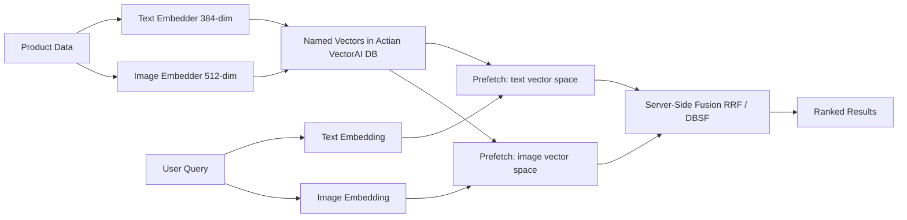

This tutorial builds a multimodel search system that stores text and image embeddings in a single Actian VectorAI DB collection, searches each vector space independently, and fuses the results using server-side Reciprocal Rank Fusion (RRF) and Distribution-Based Score Fusion (DBSF). The example uses a product catalog with two embedding models: `all-MiniLM-L6-v2` for text (384-dim) and `clip-ViT-B-32` for images (512-dim).

## Architecture overview

The diagram below shows how a single collection stores two named vector spaces—one for text embeddings and one for image embeddings. At query time, the system embeds the user query into both spaces, prefetches candidates from each, and fuses the ranked lists server-side before returning a single result set.



---

## Environment setup

Run the following command to install the three Python packages this tutorial depends on.

```bash
pip install actian-vectorai sentence-transformers pillow
```

Each package serves a distinct role in the pipeline:

- `actian-vectorai` is the Actian VectorAI Python SDK, providing the async client, named vector support, server-side fusion, and gRPC transport.
- `sentence-transformers` generates text embeddings using `all-MiniLM-L6-v2` and image embeddings using `clip-ViT-B-32`.
- `pillow` handles image loading and preprocessing.

---

## Step 1: Import dependencies and configure the client

The block below imports the Actian VectorAI SDK alongside the embedding models, then sets the server address, collection name, and dimensionality constants for both vector spaces. Running it loads both models into memory and prints a confirmation of the active configuration.

```python
import asyncio
import io
from PIL import Image
from sentence_transformers import SentenceTransformer

from actian_vectorai import (
    AsyncVectorAIClient,
    Distance,
    Field,
    FilterBuilder,
    PointStruct,
    PrefetchQuery,
    VectorParams,
    SearchParams,
    reciprocal_rank_fusion,
)
from actian_vectorai.models.collections import HnswConfigDiff
from actian_vectorai.models.enums import Fusion
from actian_vectorai.models.points import (
    WithPayloadSelector,
    WithVectorsSelector,
)

SERVER = "localhost:50051"
COLLECTION = "multimodal-products"
TEXT_DIM = 384   # Output dimensionality of all-MiniLM-L6-v2
IMAGE_DIM = 512  # Output dimensionality of clip-ViT-B-32

text_model = SentenceTransformer("all-MiniLM-L6-v2")
clip_model = SentenceTransformer("clip-ViT-B-32")

print(f"Server:     {SERVER}")
print(f"Collection: {COLLECTION}")
print(f"Text model: all-MiniLM-L6-v2 ({TEXT_DIM}-dim)")
print(f"CLIP model: clip-ViT-B-32 ({IMAGE_DIM}-dim)")
```

### Expected output

Running this block initializes the Actian VectorAI client, loads both the `all-MiniLM-L6-v2` text model and the `clip-ViT-B-32` image model into memory, and echoes the active server address, collection name, and the output dimensionality of each model. No collection is created at this stage—it simply confirms that all dependencies are loaded and the configuration constants are set.

```text
Server:     localhost:50051
Collection: multimodal-products
Text model: all-MiniLM-L6-v2 (384-dim)
CLIP model: clip-ViT-B-32 (512-dim)
```

---

## Step 2: Define embedding helpers

Each modality has its own embedding function. CLIP maps both images and text into the same 512-dim space, while `all-MiniLM-L6-v2` produces richer text representations in 384 dimensions. Running this block defines five helper functions but produces no output.

```python
def embed_text(text: str) -> list[float]:
    """Returns a 384-dim text embedding from all-MiniLM-L6-v2."""
    return text_model.encode(text).tolist()

def embed_texts(texts: list[str]) -> list[list[float]]:
    """Returns a batch of 384-dim text embeddings."""
    return text_model.encode(texts).tolist()

def embed_image_from_bytes(image_bytes: bytes) -> list[float]:
    """Returns a 512-dim CLIP embedding from raw image bytes."""
    img = Image.open(io.BytesIO(image_bytes)).convert("RGB")
    return clip_model.encode(img).tolist()

def embed_text_clip(text: str) -> list[float]:
    """Returns a 512-dim CLIP text embedding in the same space as images."""
    return clip_model.encode(text).tolist()

def embed_texts_clip(texts: list[str]) -> list[list[float]]:
    """Returns a batch of 512-dim CLIP text embeddings."""
    return clip_model.encode(texts).tolist()
```

The two text embedding functions serve distinct roles in the pipeline, which the table below explains.

| Function | Model | Dim | Purpose |
|----------|-------|-----|---------|
| `embed_text` | all-MiniLM-L6-v2 | 384 | High-quality semantic text matching |
| `embed_text_clip` | `clip-ViT-B-32` | 512 | Cross-modal matching (text ↔ image) |

When searching by text, you can query both vector spaces: the text space for semantic precision, and the CLIP space for visual relevance.

---

## Step 3: Create a collection with named vectors

Named vectors let you store multiple vector spaces in one collection. Running this block calls `get_or_create` with a `vectors_config` dictionary that defines a 384-dim text space and a 512-dim image space, each with its own HNSW parameters.

```python
async def create_collection():
    async with AsyncVectorAIClient(url=SERVER) as client:
        await client.collections.get_or_create(
            name=COLLECTION,
            vectors_config={
                # 384-dim space for semantic text matching
                "text": VectorParams(
                    size=TEXT_DIM,
                    distance=Distance.Cosine,
                    hnsw_config=HnswConfigDiff(m=16, ef_construct=128),
                ),
                # 512-dim space for CLIP image/text matching
                "image": VectorParams(
                    size=IMAGE_DIM,
                    distance=Distance.Cosine,
                    hnsw_config=HnswConfigDiff(m=32, ef_construct=256),
                ),
            },
        )
    print(f"Collection '{COLLECTION}' ready with named vectors: text ({TEXT_DIM}-dim), image ({IMAGE_DIM}-dim).")

asyncio.run(create_collection())
```

Instead of passing a single `VectorParams`, pass a dictionary where each key becomes a named vector space. The snippet below shows the minimal form of that dictionary.

```python
vectors_config={
    "text": VectorParams(size=384, distance=Distance.Cosine),
    "image": VectorParams(size=512, distance=Distance.Cosine),
}
```

Each point in this collection stores two vectors: one under `"text"` and one under `"image"`. Each space can have its own:

- Dimensionality—384 for text, 512 for CLIP.
- Distance metric—Cosine, Dot, Euclid, or Manhattan.
- HNSW config—different `m` and `ef_construct` per space.

### Expected output

Running `create_collection()` calls `get_or_create` with a `vectors_config` dictionary that registers a 384-dim cosine text space and a 512-dim cosine image space, each with its own HNSW parameters. If the collection already exists it is returned as-is; if it does not, it is created. The printed line confirms that both named vector spaces are active and ready to accept points.

```text
Collection 'multimodal-products' ready with named vectors: text (384-dim), image (512-dim).
```

---

## Step 4: Prepare multimodel product data

Each product entry has a text description and a visual description. In production, the image vector would come from actual product photos through `embed_image_from_bytes()`. This example uses CLIP text embeddings of visual descriptions as stand-ins so you can run the tutorial without downloading image files. Running this block defines the `products` list and prints the count.

```python
products = [
    {
        "name": "Classic Leather Jacket",
        "description": "Genuine brown leather biker jacket with zippered pockets and a slim fit silhouette.",
        "visual_description": "brown leather jacket with silver zippers on a mannequin",
        "category": "apparel",
        "subcategory": "outerwear",
        "price": 249.99,
        "color": "brown",
    },
    {
        "name": "Minimalist Running Shoes",
        "description": "Lightweight mesh running shoes with responsive cushioning for daily training.",
        "visual_description": "white and grey running shoes with mesh upper on white background",
        "category": "footwear",
        "subcategory": "athletic",
        "price": 119.99,
        "color": "white",
    },
    {
        "name": "Vintage Denim Jacket",
        "description": "Washed blue denim jacket with classic button front and chest pockets.",
        "visual_description": "faded blue denim jacket with brass buttons flat lay",
        "category": "apparel",
        "subcategory": "outerwear",
        "price": 89.99,
        "color": "blue",
    },
    {
        "name": "Wireless Noise-Cancelling Headphones",
        "description": "Over-ear headphones with active noise cancellation, 30-hour battery, and premium drivers.",
        "visual_description": "black over-ear headphones with cushioned pads on wooden desk",
        "category": "electronics",
        "subcategory": "audio",
        "price": 349.99,
        "color": "black",
    },
    {
        "name": "Ceramic Pour-Over Coffee Maker",
        "description": "Handcrafted ceramic dripper with spiral ribs for even extraction and full-bodied flavor.",
        "visual_description": "white ceramic pour-over coffee dripper with brown coffee dripping into glass carafe",
        "category": "kitchen",
        "subcategory": "coffee",
        "price": 42.99,
        "color": "white",
    },
    {
        "name": "Waterproof Hiking Boots",
        "description": "Mid-cut hiking boots with Gore-Tex membrane, Vibram sole, and ankle support.",
        "visual_description": "brown hiking boots on rocky mountain trail with green trees",
        "category": "footwear",
        "subcategory": "outdoor",
        "price": 189.99,
        "color": "brown",
    },
    {
        "name": "Silk Floral Print Dress",
        "description": "Flowing midi dress in pure silk with botanical floral print and adjustable waist tie.",
        "visual_description": "colorful floral print silk dress on a hanger against white wall",
        "category": "apparel",
        "subcategory": "dresses",
        "price": 199.99,
        "color": "multicolor",
    },
    {
        "name": "Mechanical Keyboard",
        "description": "Compact 75% mechanical keyboard with hot-swappable switches and RGB backlight.",
        "visual_description": "compact keyboard with colorful keycaps and RGB lighting on dark desk",
        "category": "electronics",
        "subcategory": "peripherals",
        "price": 159.99,
        "color": "black",
    },
    {
        "name": "Canvas Tote Bag",
        "description": "Heavy-duty organic cotton canvas tote with reinforced handles and interior pocket.",
        "visual_description": "natural canvas tote bag with leather handles on wooden table",
        "category": "accessories",
        "subcategory": "bags",
        "price": 34.99,
        "color": "natural",
    },
    {
        "name": "Smart Fitness Watch",
        "description": "GPS-enabled fitness tracker with heart rate monitoring, sleep tracking, and 7-day battery.",
        "visual_description": "black smartwatch on wrist showing workout metrics and heart rate",
        "category": "electronics",
        "subcategory": "wearables",
        "price": 279.99,
        "color": "black",
    },
]

print(f"{len(products)} products loaded.")
```

---

## Step 5: Ingest with named vectors

The function below batch-embeds all product descriptions and visual descriptions, then upserts them as named vectors. Each `PointStruct` carries a dictionary whose keys (`"text"` and `"image"`) match the named vector spaces defined during collection creation.

```python
async def ingest_products():
    descriptions = [p["description"] for p in products]
    visual_descs = [p["visual_description"] for p in products]

    text_vectors = embed_texts(descriptions)        # 384-dim per product
    image_vectors = embed_texts_clip(visual_descs)  # 512-dim per product

    points = []
    for i, product in enumerate(products):
        payload = {k: v for k, v in product.items() if k not in ("visual_description",)}
        payload["visual_description"] = product["visual_description"]

        points.append(
            PointStruct(
                id=i,
                vector={
                    "text": text_vectors[i],    # Named vector: text space
                    "image": image_vectors[i],  # Named vector: image space
                },
                payload=payload,
            )
        )

    async with AsyncVectorAIClient(url=SERVER) as client:
        await client.points.upsert(COLLECTION, points=points)
        await client.vde.flush(COLLECTION)  # Persist to disk
        count = await client.vde.get_vector_count(COLLECTION)

    print(f"Ingested {len(points)} products with named vectors. Total: {count}")

asyncio.run(ingest_products())
```

The snippet below shows how a single `PointStruct` carries both a `"text"` and an `"image"` vector. The keys must match the names declared in `vectors_config` when the collection was created—each vector is stored in its own HNSW index and searched independently.

```python
PointStruct(
    id=0,
    vector={
        "text":  [0.12, -0.34, ...],   # 384-dim
        "image": [0.56, 0.78, ...],    # 512-dim
    },
    payload={"name": "Jacket", ...},
)
```

### Expected output

Running `ingest_products()` batch-embeds all ten product descriptions using `all-MiniLM-L6-v2` (producing 384-dim text vectors) and all visual descriptions using the CLIP text encoder (producing 512-dim image vectors). Each `PointStruct` is assigned a sequential integer ID and carries both named vectors alongside the full product payload. After upserting, `flush` persists the collection to disk and `get_vector_count` confirms the total number of indexed vectors.

```text
Ingested 10 products with named vectors. Total: 10
```

---

## Step 6: Search a single vector space

Before fusing results across modalities, it helps to see what each vector space returns on its own. The two functions below search the `"text"` and `"image"` spaces independently using the `using` parameter, then print both ranked lists for the same query.

```python
async def search_text_space(query: str, top_k: int = 5):
    """Search the 'text' vector space only."""
    vec = embed_text(query)
    async with AsyncVectorAIClient(url=SERVER) as client:
        results = await client.points.search(
            COLLECTION,
            vector=vec,
            using="text",
            limit=top_k,
            with_payload=True,
        ) or []
    return results

async def search_image_space(query: str, top_k: int = 5):
    """Search the 'image' vector space using the CLIP text encoder."""
    vec = embed_text_clip(query)
    async with AsyncVectorAIClient(url=SERVER) as client:
        results = await client.points.search(
            COLLECTION,
            vector=vec,
            using="image",
            limit=top_k,
            with_payload=True,
        ) or []
    return results

query = "warm jacket for cold weather"

text_results = asyncio.run(search_text_space(query))
image_results = asyncio.run(search_image_space(query))

print(f"Query: {query}\n")
print("=== Text Space Results ===")
for r in text_results:
    print(f"  id={r.id}  score={r.score:.4f}  {r.payload.get('name')}")

print("\n=== Image Space Results ===")
for r in image_results:
    print(f"  id={r.id}  score={r.score:.4f}  {r.payload.get('name')}")
```

The two spaces return different rankings because each model captures a different aspect of the query—semantic meaning versus visual appearance. The table below shows what each space is sensitive to.

| Space | What it captures | Strength |
|-------|-----------------|----------|
| `text` | Semantic meaning of descriptions | Matches "cold weather" to "Gore-Tex membrane" |
| `image` | Visual appearance and style | Matches "jacket" to brown leather visual |

Neither space is universally better. Combining them gives more robust results.

### Expected output

Both functions embed the query `"warm jacket for cold weather"` using their respective encoders—`all-MiniLM-L6-v2` for the text space and the CLIP text encoder for the image space—then search each vector space independently, returning the top five scored matches. The text space ranks products by semantic overlap with the query terms, while the image space ranks them by visual similarity to the concept of a jacket in cold weather. Comparing the two lists side by side reveals where the two models agree and where they diverge.

```text
Query: warm jacket for cold weather

=== Text Space Results ===
  id=5  score=0.5812  Waterproof Hiking Boots
  id=0  score=0.5234  Classic Leather Jacket
  id=2  score=0.4987  Vintage Denim Jacket
  id=6  score=0.3210  Silk Floral Print Dress
  id=1  score=0.2890  Minimalist Running Shoes

=== Image Space Results ===
  id=0  score=0.3145  Classic Leather Jacket
  id=2  score=0.2987  Vintage Denim Jacket
  id=5  score=0.2654  Waterproof Hiking Boots
  id=8  score=0.2103  Canvas Tote Bag
  id=6  score=0.1890  Silk Floral Print Dress
```

> Why do Waterproof Hiking Boots rank first in the text space? The product description mentions "Gore-Tex membrane" and "ankle support"—terms that semantically overlap with cold-weather protection. `all-MiniLM-L6-v2` captures this association between weatherproof gear and cold-weather queries. The image space correctly ranks the leather jacket first, since CLIP responds to the visual cue "jacket" in the query. This is exactly why fusing both spaces in Step 7 produces better results than either alone.

---

## Step 7: Multistage prefetch with server-side fusion

This is the core multimodel search pattern. The function below prefetches 20 candidates from each vector space, then passes both lists to the server for RRF fusion, returning a single merged ranking.

```python
async def multimodal_search_rrf(query: str, top_k: int = 5):
    """Multimodel search: prefetch from text and image spaces, fuse with RRF."""
    text_vec = embed_text(query)       # Semantic embedding (384-dim)
    clip_vec = embed_text_clip(query)  # Visual embedding   (512-dim)

    async with AsyncVectorAIClient(url=SERVER) as client:
        results = await client.points.query(
            COLLECTION,
            query={"fusion": Fusion.RRF},  # Fuse prefetch results with RRF
            prefetch=[
                PrefetchQuery(
                    query=text_vec,
                    using="text",   # Search the text vector space
                    limit=20,       # Retrieve 20 candidates
                ),
                PrefetchQuery(
                    query=clip_vec,
                    using="image",  # Search the image vector space
                    limit=20,
                ),
            ],
            limit=top_k,
            with_payload=True,
        )
    return results

query = "warm jacket for cold weather"
results = asyncio.run(multimodal_search_rrf(query))

print(f"Query: {query}")
print(f"\n=== Multimodel results (RRF fusion) ===")
for r in results:
    print(f"  id={r.id}  score={r.score:.4f}  {r.payload.get('name')}  [{r.payload.get('category')}]")
```

The three stages execute in the following order:

1. Prefetch stage 1—search the `"text"` vector space with an `all-MiniLM-L6-v2` embedding and return 20 candidates.
2. Prefetch stage 2—search the `"image"` vector space with a CLIP embedding and return 20 candidates.
3. Fusion—the server merges both candidate lists using Reciprocal Rank Fusion, producing a single ranked list.

`query={"fusion": Fusion.RRF}` tells the server to fuse the prefetch results rather than search directly.

### Expected output

The function embeds the query `"warm jacket for cold weather"` into both the 384-dim text space and the 512-dim CLIP image space, then issues two prefetch requests—each retrieving 20 candidates from their respective vector space. The server applies Reciprocal Rank Fusion to merge both candidate lists and returns a single ranked result set of the top five products. RRF assigns each item a score based on its position across both ranked lists, so products that appear highly in both spaces receive the highest fused scores.

```text
Query: warm jacket for cold weather

=== Multimodel results (RRF fusion) ===
  id=0  score=0.0323  Classic Leather Jacket  [apparel]
  id=2  score=0.0312  Vintage Denim Jacket  [apparel]
  id=5  score=0.0298  Waterproof Hiking Boots  [footwear]
  id=6  score=0.0187  Silk Floral Print Dress  [apparel]
  id=8  score=0.0156  Canvas Tote Bag  [accessories]
```

---

## Step 8: Compare fusion methods—RRF vs DBSF

Actian VectorAI DB supports two server-side fusion algorithms. The function below runs the same prefetch stages through both algorithms so you can compare the ranking and score differences.

```python
async def compare_fusion_methods(query: str, top_k: int = 5):
    text_vec = embed_text(query)
    clip_vec = embed_text_clip(query)

    # Shared prefetch stages—same candidates for both fusion methods
    prefetch_stages = [
        PrefetchQuery(query=text_vec, using="text", limit=20),
        PrefetchQuery(query=clip_vec, using="image", limit=20),
    ]

    async with AsyncVectorAIClient(url=SERVER) as client:
        # Rank-based fusion—ignores raw scores
        rrf_results = await client.points.query(
            COLLECTION,
            query={"fusion": Fusion.RRF},
            prefetch=prefetch_stages,
            limit=top_k,
            with_payload=True,
        )

        # Score-normalized fusion—uses mean/std normalization
        dbsf_results = await client.points.query(
            COLLECTION,
            query={"fusion": Fusion.DBSF},
            prefetch=prefetch_stages,
            limit=top_k,
            with_payload=True,
        )

    return rrf_results, dbsf_results

query = "lightweight shoes for running"
rrf, dbsf = asyncio.run(compare_fusion_methods(query))

print(f"Query: {query}\n")

print("=== RRF (Reciprocal Rank Fusion) ===")
for r in rrf:
    print(f"  id={r.id}  score={r.score:.4f}  {r.payload.get('name')}")

print("\n=== DBSF (Distribution-Based Score Fusion) ===")
for r in dbsf:
    print(f"  id={r.id}  score={r.score:.4f}  {r.payload.get('name')}")
```

The choice between RRF and DBSF depends on whether raw scores from each vector space are meaningful and comparable. The table below summarizes when to use each.

| Method | How it works | Best for |
|--------|-------------|----------|
| RRF | Merges by rank position, ignores raw scores | When text and image scores are on different scales |
| DBSF | Normalizes scores using mean/std, then averages | When you want score-aware blending |

RRF is simpler and more robust. DBSF can give better results when scores from both spaces are meaningful and comparable.

### Expected output

The function embeds the query `"lightweight shoes for running"` into both vector spaces and runs two separate fusion queries against the same prefetch stages. The RRF query fuses the candidate lists by rank position alone, producing small fractional scores bounded by the RRF formula. The DBSF query normalizes scores from each prefetch stage using their mean and standard deviation before averaging them, resulting in scores on a 0–1 scale. Both queries return the same top-ranked items, but the score magnitudes differ significantly between the two methods.

```text
Query: lightweight shoes for running

=== RRF (Reciprocal Rank Fusion) ===
  id=1  score=0.0323  Minimalist Running Shoes
  id=5  score=0.0294  Waterproof Hiking Boots
  id=9  score=0.0187  Smart Fitness Watch
  id=0  score=0.0156  Classic Leather Jacket
  id=8  score=0.0143  Canvas Tote Bag

=== DBSF (Distribution-Based Score Fusion) ===
  id=1  score=0.8234  Minimalist Running Shoes
  id=5  score=0.5123  Waterproof Hiking Boots
  id=9  score=0.3456  Smart Fitness Watch
  id=8  score=0.2345  Canvas Tote Bag
  id=0  score=0.1890  Classic Leather Jacket
```

---

## Step 9: Add payload filters to multimodel search

The function below combines multimodel RRF fusion with structured payload filters. It builds a filter from optional `category` and `max_price` arguments and passes it to the outer `query()` call so it applies after the two prefetch stages have been fused.

```python
async def filtered_multimodal_search(query: str, category: str = None, max_price: float = None, top_k: int = 5):
    text_vec = embed_text(query)
    clip_vec = embed_text_clip(query)

    # Build a filter from the optional constraints
    fb = FilterBuilder()
    if category:
        fb = fb.must(Field("category").eq(category))
    if max_price is not None:
        fb = fb.must(Field("price").lte(max_price))
    filter_obj = fb.build()

    async with AsyncVectorAIClient(url=SERVER) as client:
        results = await client.points.query(
            COLLECTION,
            query={"fusion": Fusion.RRF},
            prefetch=[
                PrefetchQuery(query=text_vec, using="text", limit=20),
                PrefetchQuery(query=clip_vec, using="image", limit=20),
            ],
            filter=filter_obj,  # Applied after fusion (post-fusion filtering)
            limit=top_k,
            with_payload=True,
        )
    return results

results = asyncio.run(filtered_multimodal_search(
    "stylish casual outerwear",
    category="apparel",
    max_price=200.0,
))

print("=== Filtered multimodel search ===")
print("Filters: category=apparel, price<=200\n")
for r in results:
    print(f"  id={r.id}  score={r.score:.4f}  ${r.payload.get('price')}  {r.payload.get('name')}")
```

The `filter` on the outer `query()` call applies after fusion. The sequence is:

1. Both prefetch stages retrieve 20 candidates each, unfiltered within their space.
2. The server fuses the candidate lists.
3. The filter removes products that do not match—for example, wrong category or too expensive.
4. The top-K from the filtered fused list is returned.

This post-fusion filtering is the default behavior: the outer `filter` acts as a gate on the already-merged candidate pool, not on individual prefetch stages. To filter before fusion—for example, to restrict which documents each modality can retrieve—pass `filter` directly to `PrefetchQuery` instead.

```python
PrefetchQuery(
    query=text_vec,
    using="text",
    limit=20,
    filter=FilterBuilder().must(Field("category").eq("apparel")).build(),
)
```

### Expected output

The function queries the collection with `"stylish casual outerwear"`, applying `category=apparel` and `max_price=200.0` as post-fusion constraints. Both prefetch stages retrieve 20 candidates each from the text and image spaces without filtering; the server then fuses those candidates with RRF and removes any product whose category is not `apparel` or whose price exceeds `$200`. Only the products that satisfy both constraints appear in the final ranked list, each showing its fused RRF score and price.

```text
=== Filtered multimodel search ===
Filters: category=apparel, price<=200

  id=2  score=0.0323  $89.99  Vintage Denim Jacket
  id=6  score=0.0294  $199.99  Silk Floral Print Dress
```

---

## Step 10: Client-side fusion as an alternative

Server-side fusion treats both vector spaces equally. When you need to weight one modality higher than the other—for example, favoring text relevance over visual similarity—you can search each space independently and fuse the results client-side. The function below accepts an `alpha` parameter that controls the text-to-image weight balance and sweeps it from 1.0 (text only) to 0.0 (image only).

```python
async def client_side_fusion_search(query: str, alpha: float = 0.7, top_k: int = 5):
    """
    Multimodel search with client-side fusion.
    alpha controls the weight balance:
        1.0 = 100% text
        0.0 = 100% image
    """
    text_vec = embed_text(query)
    clip_vec = embed_text_clip(query)

    async with AsyncVectorAIClient(url=SERVER) as client:
        text_results = await client.points.search(
            COLLECTION, vector=text_vec, using="text",
            limit=top_k * 3, with_payload=True,
        ) or []

        image_results = await client.points.search(
            COLLECTION, vector=clip_vec, using="image",
            limit=top_k * 3, with_payload=True,
        ) or []

    if not text_results and not image_results:
        return []
    if not text_results:
        return image_results[:top_k]
    if not image_results:
        return text_results[:top_k]

    # The weights list applies a per-list multiplier before rank aggregation.
    # Confirm that this signature is supported in your SDK version before deploying to production.
    fused = reciprocal_rank_fusion(
        [text_results, image_results],
        limit=top_k,
        weights=[alpha, 1.0 - alpha],
    )
    return fused

# Sweep alpha from text-only (1.0) to image-only (0.0)
alphas = [1.0, 0.7, 0.5, 0.3, 0.0]
query = "comfortable everyday shoes"

for alpha in alphas:
    results = asyncio.run(client_side_fusion_search(query, alpha=alpha))
    names = [r.payload.get("name", "") for r in results[:3]]
    print(f"  alpha={alpha:.1f}  top-3: {names}")
```

The table below compares server-side and client-side fusion across the dimensions that matter most for production use: network cost, weight control, and flexibility.

| Aspect | Server-side (`query` + Fusion) | Client-side (`reciprocal_rank_fusion`) |
|--------|--------------------------------|---------------------------------------|
| Network calls | 1 (single query) | 2+ (one per vector space) |
| Weight control | No (equal weights) | Yes (`weights` parameter) |
| Algorithms | RRF, DBSF | RRF, DBSF |
| Latency | Lower (server merges internally) | Higher (extra round-trips) |
| Flexibility | Limited to server-supported fusions | Arbitrary post-processing |

Use server-side fusion for production to minimize network calls. Use client-side fusion when you need weighted blending or custom post-processing.

### Expected output

The code sweeps the `alpha` parameter across five values (`1.0`, `0.7`, `0.5`, `0.3`, `0.0`) for the query `"comfortable everyday shoes"`. At `alpha=1.0` the fusion result is driven entirely by text-space scores; at `alpha=0.0` it is driven entirely by the CLIP image space. Each iteration calls `client_side_fusion_search`, independently retrieves 15 candidates from each space, and passes both result lists to `reciprocal_rank_fusion` with the corresponding per-list weights. The printed top-3 names illustrate how the ranking shifts as the image space gains influence.

```text
  alpha=1.0  top-3: ['Minimalist Running Shoes', 'Waterproof Hiking Boots', 'Canvas Tote Bag']
  alpha=0.7  top-3: ['Minimalist Running Shoes', 'Waterproof Hiking Boots', 'Canvas Tote Bag']
  alpha=0.5  top-3: ['Minimalist Running Shoes', 'Waterproof Hiking Boots', 'Canvas Tote Bag']
  alpha=0.3  top-3: ['Minimalist Running Shoes', 'Waterproof Hiking Boots', 'Smart Fitness Watch']
  alpha=0.0  top-3: ['Minimalist Running Shoes', 'Waterproof Hiking Boots', 'Smart Fitness Watch']
```

---

## Step 11: Run batch searches across named vectors

When you need to run several queries at once—across different vector spaces or with different search terms—`search_batch` sends them all in a single gRPC call. The function below accepts a list of query dictionaries and dispatches them together, reducing total latency compared to issuing individual requests.

```python
async def batch_multimodal_search(queries: list[dict]):
    """
    Run multiple searches across named vector spaces in one batch.
    Each query dict must contain: {"text": str, "using": str, "limit": int}
    """
    search_dicts = []
    for q in queries:
        # Choose the correct encoder based on the target vector space
        if q["using"] == "text":
            vec = embed_text(q["text"])
        else:
            vec = embed_text_clip(q["text"])

        search_dicts.append({
            "vector": vec,
            "using": q["using"],
            "limit": q.get("limit", 5),
            "with_payload": True,
        })

    async with AsyncVectorAIClient(url=SERVER) as client:
        # Send all queries in a single gRPC call
        batch_results = await client.points.search_batch(
            COLLECTION, searches=search_dicts,
        )
    return batch_results

queries = [
    {"text": "leather outerwear", "using": "text", "limit": 3},
    {"text": "brown leather jacket", "using": "image", "limit": 3},
    {"text": "electronic gadgets", "using": "text", "limit": 3},
]

all_results = asyncio.run(batch_multimodal_search(queries))

for i, (q, results) in enumerate(zip(queries, all_results)):
    print(f"\nQuery {i+1}: '{q['text']}' (space: {q['using']})")
    for r in results:
        print(f"  id={r.id}  score={r.score:.4f}  {r.payload.get('name')}")
```

Each individual search requires a network round-trip. `search_batch` sends all queries in a single gRPC call, reducing total latency—especially important when searching multiple vector spaces for comparison or multiquery interfaces.

### Expected output

The function accepts three queries—`"leather outerwear"` in the text space, `"brown leather jacket"` in the image space, and `"electronic gadgets"` in the text space—and dispatches them together in a single `search_batch` gRPC call. Each query is encoded with the appropriate model: `all-MiniLM-L6-v2` for text-space queries and the CLIP text encoder for image-space queries. The batch returns a separate ranked list for each query, with scores reflecting the cosine similarity of each product vector to the query embedding within its respective named space.

```text
Query 1: 'leather outerwear' (space: text)
  id=0  score=0.6543  Classic Leather Jacket
  id=2  score=0.4321  Vintage Denim Jacket
  id=6  score=0.3210  Silk Floral Print Dress

Query 2: 'brown leather jacket' (space: image)
  id=0  score=0.4123  Classic Leather Jacket
  id=5  score=0.2987  Waterproof Hiking Boots
  id=8  score=0.2345  Canvas Tote Bag

Query 3: 'electronic gadgets' (space: text)
  id=3  score=0.5678  Wireless Noise-Cancelling Headphones
  id=7  score=0.5432  Mechanical Keyboard
  id=9  score=0.5210  Smart Fitness Watch
```

---

## Step 12: Retrieve specific vectors from named spaces

By default, search results include payloads but not the vectors themselves. The function below runs the same query twice: once requesting the `"text"` vector and a subset of payload fields, and once requesting the full payload with no vectors. This lets you compare both response shapes.

```python
async def search_with_vectors(query: str, top_k: int = 3):
    vec = embed_text(query)
    async with AsyncVectorAIClient(url=SERVER) as client:
        # Return only the "text" vector and selected payload fields
        results_all = await client.points.search(
            COLLECTION, vector=vec, using="text", limit=top_k,
            with_payload=WithPayloadSelector(include=["name", "category"]),
            with_vectors=WithVectorsSelector(include=["text"]),
        ) or []

        # Return full payload but no vectors (default behavior)
        results_none = await client.points.search(
            COLLECTION, vector=vec, using="text", limit=top_k,
            with_payload=True,
            with_vectors=False,
        ) or []

    return results_all, results_none

with_vecs, without_vecs = asyncio.run(search_with_vectors("running shoes"))

print("=== With text vectors returned ===")
for r in with_vecs:
    has_vec = r.vectors is not None
    vec_preview = ""
    if has_vec:
        if isinstance(r.vectors, dict) and "text" in r.vectors:
            vec_preview = f"[{r.vectors['text'][0]:.4f}, ...]"
        elif isinstance(r.vectors, list):
            vec_preview = f"[{r.vectors[0]:.4f}, ...]"
    print(f"  id={r.id}  {r.payload.get('name')}  vectors={vec_preview}")

print("\n=== Without vectors ===")
for r in without_vecs:
    print(f"  id={r.id}  {r.payload.get('name')}  vectors={r.vectors}")
```

The table below summarizes the selector options you can pass to control which vectors and payload fields are included in results.

| Selector | Effect |
|----------|--------|
| `with_vectors=True` | Return all named vectors. |
| `with_vectors=False` | Return no vectors (default). |
| `WithVectorsSelector(include=["text"])` | Return only the `"text"` vector. |
| `WithPayloadSelector(include=["name"])` | Return only the `"name"` payload field. |
| `WithPayloadSelector(exclude=["description"])` | Return all fields except `"description"`. |

---

## Step 13: Update a single named vector

In a multimodel system, different modalities change at different rates—product images may be re-shot while descriptions stay the same. The function below re-embeds and updates only the `"image"` vector for a given point without touching the `"text"` vector or any payload fields.

```python
async def update_image_vector(point_id: int, new_visual_desc: str):
    new_vec = embed_text_clip(new_visual_desc)  # Re-embed with CLIP

    async with AsyncVectorAIClient(url=SERVER) as client:
        await client.points.update_vectors(
            COLLECTION,
            points=[
                PointStruct(
                    id=point_id,
                    vector={"image": new_vec},  # Only update the image vector
                ),
            ],
        )
        await client.vde.flush(COLLECTION)

    print(f"Updated image vector for point {point_id}.")

# Simulate a product photo change for the leather jacket
asyncio.run(update_image_vector(0, "dark brown leather motorcycle jacket with studs on black background"))
```

Pass a dictionary containing only the named vectors to change. The server updates those vectors in place without touching the rest:

- Product descriptions rarely change, so skip re-embedding `"text"`.
- Product images change when new photos are taken, so update only `"image"`.
- Metadata changes with price updates, so use `set_payload` instead.

---

## Step 14: Nested prefetch—three-stage pipeline

When simple fusion is not enough, you can nest prefetch stages to build a multistage retrieval pipeline. The function below retrieves candidates from each vector space, fuses them with RRF, and then reranks the merged list by text similarity to give the semantic model the final say.

```python
async def nested_prefetch_search(query: str, top_k: int = 5):
    text_vec = embed_text(query)
    clip_vec = embed_text_clip(query)

    async with AsyncVectorAIClient(url=SERVER) as client:
        results = await client.points.query(
            COLLECTION,
            query=text_vec,   # Stage 3: rerank by text similarity
            using="text",
            prefetch=[
                PrefetchQuery(
                    query={"fusion": Fusion.RRF},  # Stage 2: fuse candidates
                    prefetch=[
                        # Stage 1a: retrieve from text space
                        PrefetchQuery(query=text_vec, using="text", limit=20),
                        # Stage 1b: retrieve from image space
                        PrefetchQuery(query=clip_vec, using="image", limit=20),
                    ],
                    limit=15,  # Keep top 15 after fusion
                ),
            ],
            limit=top_k,
            with_payload=True,
        )
    return results

results = asyncio.run(nested_prefetch_search("outdoor hiking gear"))

print("=== Nested prefetch: fuse then rerank ===")
for r in results:
    print(f"  id={r.id}  score={r.score:.4f}  {r.payload.get('name')}")
```

The diagram below traces the execution flow from raw candidate retrieval through fusion to final reranking.

```text
Stage 1 (inner prefetch):
  └─ text space  → 20 candidates
  └─ image space → 20 candidates

Stage 2 (outer prefetch):
  └─ RRF fusion of both → 15 candidates

Stage 3 (final query):
  └─ Rerank 15 candidates by text similarity → top 5
```

`query=text_vec, using="text"` in the final stage re-scores the fused candidates using the text vector, giving the text space the final say on ranking while the image space contributed to the candidate pool.

### Expected output

The function queries for `"outdoor hiking gear"` using a three-stage nested pipeline. Stage 1 retrieves 20 candidates from the text space and 20 from the image space. Stage 2 fuses both lists with RRF, keeping the top 15. Stage 3 re-scores those 15 candidates using the `all-MiniLM-L6-v2` text embedding as the final query vector (`using="text"`), so the product whose description is semantically closest to the query surfaces at the top. The final scores are cosine similarity values from the text reranking step, not RRF scores.

```text
=== Nested prefetch: fuse then rerank ===
  id=5  score=0.6234  Waterproof Hiking Boots
  id=0  score=0.4567  Classic Leather Jacket
  id=8  score=0.3456  Canvas Tote Bag
  id=1  score=0.2890  Minimalist Running Shoes
  id=2  score=0.2345  Vintage Denim Jacket
```

---

## Step 15: Per-space search parameters

Different vector spaces may need different accuracy-latency trade-offs. The function below assigns a lower `hnsw_ef` to the text space for faster retrieval and a higher `hnsw_ef` to the image space for more accurate candidate selection, then fuses the results with DBSF.

```python
async def tuned_multimodal_search(query: str, top_k: int = 5):
    text_vec = embed_text(query)
    clip_vec = embed_text_clip(query)

    async with AsyncVectorAIClient(url=SERVER) as client:
        results = await client.points.query(
            COLLECTION,
            query={"fusion": Fusion.DBSF},
            prefetch=[
                PrefetchQuery(
                    query=text_vec,
                    using="text",
                    limit=20,
                    params=SearchParams(hnsw_ef=128),  # Lower ef for faster text search
                ),
                PrefetchQuery(
                    query=clip_vec,
                    using="image",
                    limit=20,
                    params=SearchParams(hnsw_ef=256),  # Higher ef for more accurate image search
                ),
            ],
            limit=top_k,
            with_payload=True,
        )
    return results

results = asyncio.run(tuned_multimodal_search("premium audio equipment"))

print("=== Tuned multimodel search (DBSF, per-space hnsw_ef) ===")
for r in results:
    print(f"  id={r.id}  score={r.score:.4f}  {r.payload.get('name')}")
```

Use the table below to choose an `hnsw_ef` value for each vector space based on which modality matters more to your use case. A higher value gives more accurate results at the cost of higher latency.

| Scenario | Text `hnsw_ef` | Image `hnsw_ef` |
|----------|---------------|-----------------|
| Text is more important | 256 | 64 |
| Image is more important | 64 | 256 |
| Equal priority | 128 | 128 |
| Accuracy-critical | 512 | 512 |

---

## Step 16: Inspect collection configuration

After ingestion and updates, you can verify that the collection is configured correctly. The function below retrieves the named vector configuration, total vector count, and VDE state and prints them together.

```python
async def inspect_collection():
    async with AsyncVectorAIClient(url=SERVER) as client:
        info = await client.collections.get_info(COLLECTION)
        count = await client.vde.get_vector_count(COLLECTION)
        state = await client.vde.get_state(COLLECTION)

        print(f"Collection: {COLLECTION}")
        print(f"  State: {state}")
        print(f"  Vectors: {count}")
        print(f"  Segments: {info.segments_count}")
        print(f"  Points:   {info.points_count}")
        print(f"  Config:   {info.config}")

asyncio.run(inspect_collection())
```

---

## Step 17: Collection cleanup

The function below flushes any pending writes to disk and optionally deletes the collection when you are done experimenting. Uncomment the delete lines to remove the collection entirely.

```python
async def cleanup():
    async with AsyncVectorAIClient(url=SERVER) as client:
        count = await client.vde.get_vector_count(COLLECTION)
        print(f"Collection '{COLLECTION}' contains {count} vectors.")

        await client.vde.flush(COLLECTION)
        print("Flushed to disk.")

        # Uncomment to delete:
        # await client.collections.delete(COLLECTION)
        # print("Collection deleted.")

asyncio.run(cleanup())
```

---

## Patterns summary

The following patterns recap the core multimodel techniques covered in this tutorial. Use them as a quick reference when building your own pipelines.

### Pattern 1: Independent space search

Pass `using="text"` or `using="image"` to search one named vector space at a time.

```python
results = await client.points.search(
    COLLECTION, vector=text_vec, using="text", limit=10,
)
```

### Pattern 2: Server-side multimodel fusion

Provide two `PrefetchQuery` entries and set `query={"fusion": Fusion.RRF}` to have the server merge the candidate lists.

```python
results = await client.points.query(
    COLLECTION,
    query={"fusion": Fusion.RRF},
    prefetch=[
        PrefetchQuery(query=text_vec, using="text", limit=20),
        PrefetchQuery(query=image_vec, using="image", limit=20),
    ],
    limit=10,
)
```

### Pattern 3: Client-side weighted fusion

Search each space independently, then pass both result lists to `reciprocal_rank_fusion` with a `weights` list to control the text-to-image balance.

```python
fused = reciprocal_rank_fusion(
    [text_results, image_results],
    limit=10,
    weights=[0.7, 0.3],
)
```

### Pattern 4: Nested prefetch with reranking

Nest an RRF-fusion prefetch inside the outer query and set `query=text_vec` to fuse first, then rerank by the text vector.

```python
results = await client.points.query(
    COLLECTION,
    query=text_vec,
    using="text",
    prefetch=[
        PrefetchQuery(
            query={"fusion": Fusion.RRF},
            prefetch=[
                PrefetchQuery(query=text_vec, using="text", limit=20),
                PrefetchQuery(query=image_vec, using="image", limit=20),
            ],
            limit=15,
        ),
    ],
    limit=5,
)
```

### Pattern 5: Partial vector update

Pass a `vector` dictionary containing only the named vector to change. The server updates that vector in place without touching the others.

```python
await client.points.update_vectors(
    COLLECTION,
    points=[PointStruct(id=0, vector={"image": new_image_vec})],
)
```

---

## Actian VectorAI features used

The table below lists every Actian VectorAI feature this tutorial demonstrated, along with the corresponding API call and its purpose.

| Feature | API | Purpose |
|---------|-----|---------|
| Named vectors | `vectors_config={"text": VectorParams(...), "image": VectorParams(...)}` | Store multiple embedding spaces per collection |
| Named vector search | `points.search(using="text")` | Search a specific vector space |
| Server-side RRF | `query={"fusion": Fusion.RRF}` | Rank-based fusion of prefetch results |
| Server-side DBSF | `query={"fusion": Fusion.DBSF}` | Score-normalized fusion |
| Prefetch | `PrefetchQuery(query=..., using=..., limit=...)` | Multistage candidate retrieval |
| Nested prefetch | `PrefetchQuery(prefetch=[...])` | Three-stage fuse-then-rerank pipeline |
| Client-side RRF | `reciprocal_rank_fusion(results, weights=...)` | Weighted client-side fusion |
| Client-side DBSF | `distribution_based_score_fusion(results)` | Score-aware client-side fusion |
| Search batch | `points.search_batch(searches=[...])` | Multiple queries in one call |
| Partial vector update | `points.update_vectors(points=[...])` | Update one modality only |
| Payload filtering | `FilterBuilder().must(Field(...).eq(...))` | Structured constraints on fusion |
| Selective return | `WithPayloadSelector(include=[...])` | Return specific payload fields |
| Vector return | `WithVectorsSelector(include=["text"])` | Return specific named vectors |
| Per-space tuning | `SearchParams(hnsw_ef=256)` in `PrefetchQuery` | Different accuracy per modality |
| Collection info | `collections.get_info()` | Inspect named vector configuration |
| VDE operations | `vde.flush()`, `vde.get_vector_count()`, `vde.get_state()` | Administration and persistence |

---

## Next steps

Use the links below to continue building on what you learned in this tutorial.

<CardGroup cols={2}>
 <Card title="Optimizing retrieval quality" href="/academy/tutorials/retrieval-quality">
 Tune HNSW, quantization, and search params for accuracy
 </Card>
 <Card title="Predicate filters" href="/academy/tutorials/predicate-filters">
 Combine vector search with structured payload constraints
 </Card>
 <Card title="Similarity search basics" href="/academy/tutorials/similarity-search">
 Learn the core retrieval workflow
 </Card>
 <Card title="Hybrid search patterns" href="/docs/fundamentals/search/search">
 Mix dense and sparse retrieval with fusion
 </Card>
</CardGroup>
