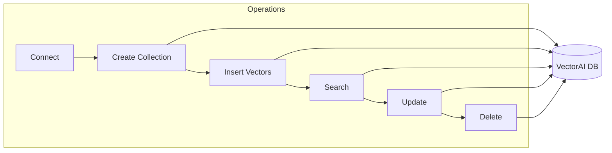

This tutorial walks you through a complete Python workflow with VectorAI DB. You connect to the server, create a collection, insert vectors with metadata, search by similarity, retrieve points by ID, update and delete records, and inspect collection statistics.

| | |
|---|---|
| **Time** | 10 minutes |
| **Difficulty** | Beginner |
| **Skills** | Connection, collection creation, CRUD operations, basic search |

## What you build

This diagram shows the operations you implement in this tutorial:



By the end of this tutorial, you can:

- Establish connections to VectorAI DB
- Create and configure collections
- Insert, update, and delete vectors
- Perform similarity searches

---

## Concepts

Before diving into the tasks, understand these key concepts:

**Async client** — The Python SDK uses `AsyncVectorAIClient` for non-blocking I/O. All SDK calls use `async/await` syntax and are run with `asyncio.run()`. There is no synchronous client; the async model keeps your application responsive while waiting on network operations.

**Points** — Points are the individual records stored in a collection. Each point contains:

- **ID**: A unique identifier (integer or UUID).
- **Vector**: A list of floats matching the collection dimension.
- **Payload**: An optional metadata dictionary for filtering and retrieval.

**Upsert** — Upsert inserts new points or updates existing ones with the same ID. It is the primary method for adding and modifying data.

---

## Prerequisites

- Python 3.8 or later
- VectorAI DB running and accessible. To start a local instance:

  ```bash
  docker run -p 50051:50051 actian/vectorai-db
  ```

  The SDK connects over gRPC on port `50051` by default. If your instance uses a different host or port, replace `localhost:50051` in the examples below.

- If your VectorAI DB instance requires authentication, see [Security and authentication](/docs/guides/security) for how to pass credentials to the client.

Install the Python SDK:

```bash
pip install actian-vectorai
```

---


## Tasks

Work through these tasks to create and manage your first collection in Python.

The Python SDK is fully asynchronous. Every operation returns a coroutine that you `await` inside an `async` function. If you are new to Python async programming, `asyncio.run()` is the standard way to execute a top-level coroutine from synchronous code — there is no separate synchronous client.

### Task 1: Connect to VectorAI DB

Establish a connection using the async client:

<CodeGroup>
```python
import asyncio
from actian_vectorai import AsyncVectorAIClient

async def connect():
    """Connect to VectorAI DB and verify connection."""
    async with AsyncVectorAIClient("localhost:50051") as client:
        # List existing collections to verify connection
        collections = await client.collections.list()
        print(f"Connected! Found {len(collections)} existing collections")
        return True

asyncio.run(connect())
```
</CodeGroup>

A successful connection prints a message such as `Connected! Found 0 existing collections`. If you see this output, your client has reached the server and is ready for the next steps. If the command raises an error instead, see the [Troubleshooting](#troubleshooting) section below.

<Tip>
Use the `AsyncVectorAIClient` context manager to ensure connections are properly closed. This prevents resource leaks in production applications.
</Tip>

### Task 2: Create a collection

Collections store vectors of a specific dimension with a distance metric:

<CodeGroup>
```python
import asyncio
from actian_vectorai import AsyncVectorAIClient, VectorParams, Distance

async def create_collection():
    """Create a new vector collection."""
    async with AsyncVectorAIClient("localhost:50051") as client:
        collection_name = "my_first_collection"
        
        # Check if collection already exists
        exists = await client.collections.exists(collection_name)
        
        if exists:
            print(f"Collection '{collection_name}' already exists")
            return
        
        # Create collection with 128-dimensional vectors
        await client.collections.create(
            collection_name,
            vectors_config=VectorParams(
                size=128,              # Vector dimension
                distance=Distance.Cosine  # Similarity metric
            )
        )
        print(f"Created collection '{collection_name}'")

asyncio.run(create_collection())
```
</CodeGroup>

### Collection parameters

The following table describes the collection configuration parameters.

| Parameter | Description | Common values |
|-----------|-------------|---------------|
| `size` | Vector dimension | 128, 384, 768, 1536 |
| `distance` | Similarity metric | Cosine, Euclidean, Dot |

### Task 3: Insert vectors

Add points containing vectors and metadata payloads:

<CodeGroup>
```python
import asyncio
from actian_vectorai import AsyncVectorAIClient, PointStruct
import random

async def insert_vectors():
    """Insert sample vectors into the collection."""
    async with AsyncVectorAIClient("localhost:50051") as client:
        collection_name = "my_first_collection"
        
        # Create sample points with random vectors
        points = []
        categories = ["electronics", "clothing", "books", "home"]
        
        for i in range(10):
            point = PointStruct(
                id=i + 1,  # Unique ID
                vector=[random.gauss(0, 1) for _ in range(128)],  # 128-dim vector
                payload={
                    "name": f"Product {i + 1}",
                    "category": random.choice(categories),
                    "price": round(random.uniform(10, 200), 2),
                    "in_stock": random.choice([True, False])
                }
            )
            points.append(point)
        
        # Insert all points
        await client.points.upsert(collection_name, points=points)
        print(f"Inserted {len(points)} points")

asyncio.run(insert_vectors())
```
</CodeGroup>

### Point structure

The following table describes the fields that comprise a point structure.

| `Field` | Required | Description |
|-------|----------|-------------|
| `id` | Yes | Unique identifier (integer or UUID) |
| `vector` | Yes | List of floats matching collection dimension |
| `payload` | No | Dictionary of metadata for filtering |

### Task 4: Search for similar vectors

Query the collection using a vector:

<CodeGroup>
```python
import asyncio
from actian_vectorai import AsyncVectorAIClient
import random

async def search_vectors():
    """Search for similar vectors."""
    async with AsyncVectorAIClient("localhost:50051") as client:
        collection_name = "my_first_collection"
        
        # Create a query vector
        query_vector = [random.gauss(0, 1) for _ in range(128)]
        
        # Search for top 5 similar vectors
        results = await client.points.search(
            collection_name,
            vector=query_vector,
            limit=5,
            with_payload=True  # Include metadata
        )
        
        print("Search results:")
        for result in results:
            print(f"  ID: {result.id}")
            print(f"  Score: {result.score:.4f}")
            print(f"  Name: {result.payload['name']}")
            print(f"  Category: {result.payload['category']}")
            print()

asyncio.run(search_vectors())
```
</CodeGroup>

### Search parameters

The following table describes the available search parameters.

| Parameter | Description | Default |
|-----------|-------------|---------|
| `vector` | Query vector | Required |
| `limit` | Maximum results | 10 |
| `with_payload` | Include metadata | False |
| `score_threshold` | Minimum score | None |

### Task 5: Retrieve points by ID

Fetch specific points directly:

<CodeGroup>
```python
import asyncio
from actian_vectorai import AsyncVectorAIClient

async def retrieve_points():
    """Retrieve specific points by ID."""
    async with AsyncVectorAIClient("localhost:50051") as client:
        collection_name = "my_first_collection"
        
        # Get specific points
        points = await client.points.get(
            collection_name,
            ids=[1, 2, 3],
            with_payload=True,
            with_vector=True
        )
        
        print("Retrieved points:")
        for point in points:
            print(f"  ID: {point.id}")
            print(f"  Payload: {point.payload}")
            print(f"  Vector length: {len(point.vector)}")
            print()

asyncio.run(retrieve_points())
```
</CodeGroup>

### Task 6: Update and delete points

Modify existing data:

<CodeGroup>
```python
import asyncio
from actian_vectorai import AsyncVectorAIClient, PointStruct
import random

async def update_and_delete():
    """Update and delete points."""
    async with AsyncVectorAIClient("localhost:50051") as client:
        collection_name = "my_first_collection"
        
        # Update a point by upserting with same ID
        updated_point = PointStruct(
            id=1,
            vector=[random.gauss(0, 1) for _ in range(128)],
            payload={
                "name": "Updated Product 1",
                "category": "electronics",
                "price": 99.99,
                "in_stock": True
            }
        )
        await client.points.upsert(collection_name, points=[updated_point])
        print("Updated point 1")
        
        # Delete specific points
        await client.points.delete(collection_name, point_ids=[5, 6])
        print("Deleted points 5 and 6")

asyncio.run(update_and_delete())
```
</CodeGroup>

### Task 7: Get collection info

Check collection statistics:

<CodeGroup>
```python
import asyncio
from actian_vectorai import AsyncVectorAIClient

async def get_info():
    """Get collection information."""
    async with AsyncVectorAIClient("localhost:50051") as client:
        collection_name = "my_first_collection"
        
        # Get collection configuration
        info = await client.collections.get(collection_name)
        print(f"Collection: {collection_name}")
        print(f"  Vector size: {info.config.params.vectors.size}")
        print(f"  Distance: {info.config.params.vectors.distance}")
        
        # Get point count
        count = await client.points.count(collection_name)
        print(f"  Points: {count.count}")

asyncio.run(get_info())
```
</CodeGroup>

---

## Complete example

The following script combines all operations from the tasks above into a single runnable workflow.

<CodeGroup>
```python
import asyncio
from actian_vectorai import AsyncVectorAIClient, VectorParams, Distance, PointStruct
import random

async def complete_workflow():
    """Complete VectorAI DB workflow demonstration."""
    async with AsyncVectorAIClient("localhost:50051") as client:
        collection_name = "demo_collection"
        
        # 1. Create collection
        exists = await client.collections.exists(collection_name)
        if exists:
            await client.collections.delete(collection_name)
        
        await client.collections.create(
            collection_name,
            vectors_config=VectorParams(size=128, distance=Distance.Cosine)
        )
        print("1. Created collection")
        
        # 2. Insert data
        points = [
            PointStruct(
                id=i,
                vector=[random.gauss(0, 1) for _ in range(128)],
                payload={"index": i, "category": f"cat_{i % 3}"}
            )
            for i in range(100)
        ]
        await client.points.upsert(collection_name, points=points)
        print("2. Inserted 100 points")
        
        # 3. Search
        query = [random.gauss(0, 1) for _ in range(128)]
        results = await client.points.search(
            collection_name,
            vector=query,
            limit=3,
            with_payload=True
        )
        print("3. Search results:")
        for r in results:
            print(f"   ID: {r.id}, Score: {r.score:.4f}")
        
        # 4. Get info
        count = await client.points.count(collection_name)
        print(f"4. Collection has {count.count} points")
        
        # 5. Cleanup (optional — uncomment to delete the collection after testing;
        #    leave it commented out if you want to keep the data for later tasks)
        # await client.collections.delete(collection_name)
        # print("5. Deleted collection")

asyncio.run(complete_workflow())
```
</CodeGroup>

---

## Troubleshooting

The following accordions cover common errors and how to resolve them.

<AccordionGroup>
 <Accordion title="Connection refused">
 **Cause**: VectorAI DB server not running.
 
 **Solution**: Start the server with `docker run -p 50051:50051 actian/vectorai-db`
 </Accordion>
 
 <Accordion title="Dimension mismatch">
 **Cause**: Vector size doesn't match collection configuration.
 
 **Solution**: Verify vectors have the same dimension as the collection's `size` parameter.
 </Accordion>
 
 <Accordion title="Collection not found">
 **Cause**: Collection name misspelled or doesn't exist.
 
 **Solution**: Check exact collection name with `client.collections.list()`.
 </Accordion>
 
 <Accordion title="Permission denied">
 **Cause**: Authentication is required by your VectorAI DB instance.

 **Solution**: Pass your credentials when initialising the client. See [Security and authentication](/docs/guides/security) for the full configuration options.
 </Accordion>
</AccordionGroup>

---

## Next steps

The following cards link to related tutorials.

<CardGroup cols={2}>
 <Card 
 title="Add filtering" 
 href="/academy/tutorials/predicate-filters"
  >
 Learn to narrow search results by metadata fields using predicate filters.
 </Card>
 <Card 
 title="Use embeddings" 
 href="/academy/tutorials/leverage-open-source-embedding-models"
  >
 Generate vectors from raw text using open-source embedding models.
 </Card>
 <Card 
 title="Build applications" 
 href="/academy/tutorials/first-application"
  >
 Combine collections, search, and embeddings into a complete search application.
 </Card>
 <Card 
 title="Similarity search" 
 href="/academy/tutorials/similarity-search"
  >
 Explore advanced search patterns including score thresholds and multivector queries.
 </Card>
</CardGroup>
