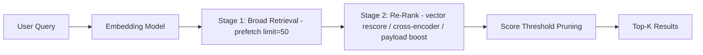

This tutorial walks through re-ranking strategies in Actian VectorAI DB that improve search relevance beyond a single-pass vector search. A single-pass search returns results ranked by embedding similarity, which is a good starting point but often not good enough. The initial ranking can miss nuance because:

- Embedding models are general-purpose. A 384-dim model captures broad semantics but may not distinguish subtle relevance differences in your domain.
- ANN search is approximate. HNSW may miss some true nearest neighbours, especially with conservative `hnsw_ef`.
- Relevance is multi-dimensional. A product search cares about semantic match, recency, popularity, and price—not just vector distance.

Re-ranking fixes this by adding a second (or third) stage that rescores a broad initial candidate set using a more precise signal. The pattern is always the same:

```text
Stage 1: Retrieve a wide candidate pool (cheap, approximate)
Stage 2: Re-score candidates with a better signal (expensive, precise)
Stage 3: Return the top-K from the re-scored list
```

This tutorial demonstrates the following re-ranking strategies in Actian VectorAI DB:

- Server-side re-ranking with `prefetch` + `query` — Retrieve broadly, then re-score with a different vector or metric.
- Quantization rescore — Search quantized vectors fast, then rescore from originals.
- Cross-encoder re-ranking — Use a dedicated cross-encoder model client-side.
- Payload-based re-ranking — Boost scores using structured metadata.
- Fusion re-ranking — Combine multiple retrieval signals and fuse.
- Cascaded multi-stage pipelines — Chain multiple re-ranking stages.
- Score threshold pruning — Cut low-confidence results after re-ranking.

---

## Architecture overview

The following diagram shows how a query flows through a multi-stage re-ranking pipeline.



---

## Environment setup

Install the Actian VectorAI Python SDK and the sentence-transformers library for embedding and cross-encoder models.

```bash
pip install actian-vectorai sentence-transformers
```

---

## Step 1: Create a test collection and ingest data

This step uses a corpus of 25 technical documents across several topics to demonstrate how re-ranking improves result ordering.

```python
import asyncio
from sentence_transformers import SentenceTransformer, CrossEncoder

from actian_vectorai import (
    AsyncVectorAIClient,
    Distance,
    Field,
    FilterBuilder,
    PointStruct,
    PrefetchQuery,
    SearchParams,
    QuantizationSearchParams,
    VectorParams,
    reciprocal_rank_fusion,
    distribution_based_score_fusion,
)
from actian_vectorai.models.collections import (
    HnswConfigDiff,
    ScalarQuantization,
    QuantizationConfig,
)
from actian_vectorai.models.enums import Fusion

# Connection and collection settings
SERVER = "localhost:50051"
COLLECTION = "Rerank-Tutorial"
EMBED_DIM = 384

# Bi-encoder for first-stage retrieval, cross-encoder for precision re-ranking
bi_encoder = SentenceTransformer("all-MiniLM-L6-v2")
cross_encoder = CrossEncoder("cross-encoder/ms-marco-MiniLM-L-6-v2")

def embed_text(text: str) -> list[float]:
    """Encode a single query or document string."""
    return bi_encoder.encode(text).tolist()

def embed_texts(texts: list[str]) -> list[list[float]]:
    """Batch-encode a list of strings."""
    return bi_encoder.encode(texts).tolist()

print(f"Bi-encoder:    all-MiniLM-L6-v2 ({EMBED_DIM}-dim)")
print(f"Cross-encoder: ms-marco-MiniLM-L-6-v2")
```

Define the corpus of 25 documents, embed them, and upsert into the collection.

```python
corpus = [
    {"text": "Python is a high-level programming language emphasizing code readability and rapid development.", "topic": "programming", "popularity": 95, "year": 2024},
    {"text": "JavaScript powers interactive web applications and runs on both client and server via Node.js.", "topic": "programming", "popularity": 92, "year": 2024},
    {"text": "Rust guarantees memory safety without garbage collection through compile-time ownership checks.", "topic": "programming", "popularity": 78, "year": 2024},
    {"text": "Go was designed at Google for building scalable network services and cloud-native infrastructure.", "topic": "programming", "popularity": 74, "year": 2023},
    {"text": "TypeScript extends JavaScript with static types, improving maintainability in large projects.", "topic": "programming", "popularity": 85, "year": 2024},
    {"text": "Supervised learning trains models on labeled examples to predict outcomes on unseen data.", "topic": "ml", "popularity": 88, "year": 2024},
    {"text": "Deep neural networks stack multiple nonlinear layers to learn hierarchical data representations.", "topic": "ml", "popularity": 90, "year": 2024},
    {"text": "Transformer models use multi-head self-attention to process sequences in parallel, enabling LLMs.", "topic": "ml", "popularity": 97, "year": 2025},
    {"text": "Gradient boosted trees combine many weak learners into a strong ensemble for tabular prediction.", "topic": "ml", "popularity": 82, "year": 2023},
    {"text": "Reinforcement learning agents learn optimal behavior by maximizing cumulative reward signals.", "topic": "ml", "popularity": 76, "year": 2023},
    {"text": "Convolutional networks detect spatial hierarchies in images through learned convolutional filters.", "topic": "ml", "popularity": 84, "year": 2023},
    {"text": "Transfer learning fine-tunes large pretrained models on small domain-specific datasets.", "topic": "ml", "popularity": 91, "year": 2025},
    {"text": "PostgreSQL provides ACID transactions, extensibility, and advanced indexing for relational data.", "topic": "databases", "popularity": 89, "year": 2024},
    {"text": "MongoDB stores data as flexible BSON documents without requiring a fixed schema upfront.", "topic": "databases", "popularity": 80, "year": 2023},
    {"text": "Redis serves as an in-memory data structure store for caching, queues, and real-time analytics.", "topic": "databases", "popularity": 86, "year": 2024},
    {"text": "Vector databases index high-dimensional embeddings for fast approximate nearest-neighbour retrieval.", "topic": "databases", "popularity": 93, "year": 2025},
    {"text": "Elasticsearch enables full-text search and aggregation analytics over structured and unstructured data.", "topic": "databases", "popularity": 81, "year": 2023},
    {"text": "Docker packages applications with dependencies into portable containers for consistent environments.", "topic": "devops", "popularity": 87, "year": 2024},
    {"text": "Kubernetes orchestrates containerized workloads across clusters with auto-scaling and self-healing.", "topic": "devops", "popularity": 90, "year": 2024},
    {"text": "CI/CD pipelines automate the build, test, and deployment workflow for every code change.", "topic": "devops", "popularity": 83, "year": 2024},
    {"text": "Terraform declares infrastructure as code so environments can be versioned and reproduced reliably.", "topic": "devops", "popularity": 79, "year": 2023},
    {"text": "Prometheus scrapes time-series metrics and Grafana renders interactive monitoring dashboards.", "topic": "devops", "popularity": 77, "year": 2023},
    {"text": "OAuth 2.0 delegates authorization using short-lived access tokens without sharing user credentials.", "topic": "security", "popularity": 85, "year": 2024},
    {"text": "Zero-trust architecture requires continuous verification of every request regardless of network origin.", "topic": "security", "popularity": 88, "year": 2025},
    {"text": "TLS encrypts data in transit between clients and servers to prevent eavesdropping and tampering.", "topic": "security", "popularity": 82, "year": 2023},
]

async def setup():
    async with AsyncVectorAIClient(url=SERVER) as client:
        # Create the collection with cosine distance and an HNSW index
        await client.collections.get_or_create(
            name=COLLECTION,
            vectors_config=VectorParams(size=EMBED_DIM, distance=Distance.Cosine),
            hnsw_config=HnswConfigDiff(m=16, ef_construct=128),
        )

        # Batch-embed all documents and upsert them with their metadata payloads
        texts = [d["text"] for d in corpus]
        vectors = embed_texts(texts)
        points = [
            PointStruct(id=i, vector=vectors[i], payload=corpus[i])
            for i in range(len(corpus))
        ]
        await client.points.upsert(COLLECTION, points=points)
        await client.vde.flush(COLLECTION)
        count = await client.vde.get_vector_count(COLLECTION)

    print(f"Collection ready with {count} vectors.")

asyncio.run(setup())
```

Running both cells prints the encoder details and confirms the collection is ready.

```text
Bi-encoder:    all-MiniLM-L6-v2 (384-dim)
Cross-encoder: ms-marco-MiniLM-L-6-v2
Collection ready with 25 vectors.
```

---

## Step 2: Baseline single-pass search

Before adding any re-ranking, establish what a single-pass vector search returns.

```python
async def single_pass_search(query: str, top_k: int = 10):
    vec = embed_text(query)
    async with AsyncVectorAIClient(url=SERVER) as client:
        # Standard single-pass HNSW search ranked by cosine similarity
        results = await client.points.search(
            COLLECTION, vector=vec, limit=top_k, with_payload=True,
        ) or []
    return results

query = "How do large language models work?"
baseline = asyncio.run(single_pass_search(query))

print(f"Query: {query}\n")
print("=== Baseline (single-pass) ===")
for i, r in enumerate(baseline):
    print(f"  {i+1}. id={r.id}  score={r.score:.4f}  {r.payload.get('text', '')[:70]}...")
```

The single-pass search ranks all 10 results by cosine similarity alone.

```text
Query: How do large language models work?

=== Baseline (single-pass) ===
  1. id=7   score=0.7234  Transformer models use multi-head self-attention to process sequences i...
  2. id=6   score=0.6512  Deep neural networks stack multiple nonlinear layers to learn hierarchi...
  3. id=5   score=0.5890  Supervised learning trains models on labeled examples to predict outcom...
  4. id=11  score=0.5678  Transfer learning fine-tunes large pretrained models on small domain-sp...
  5. id=8   score=0.5234  Gradient boosted trees combine many weak learners into a strong ensembl...
  6. id=10  score=0.5012  Convolutional networks detect spatial hierarchies in images through lea...
  7. id=9   score=0.4890  Reinforcement learning agents learn optimal behavior by maximizing cumu...
  8. id=0   score=0.3456  Python is a high-level programming language emphasizing code readabilit...
  9. id=15  score=0.3210  Vector databases index high-dimensional embeddings for fast approximate...
  10. id=1  score=0.2987  JavaScript powers interactive web applications and runs on both client...
```

The baseline puts "Transformer models" first, which is correct. But notice that "Transfer learning fine-tunes large pretrained models" ranks 4th—a cross-encoder would likely rank it higher because it directly mentions "large pretrained models" in the context of LLMs.

---

## Step 3: Server-side re-ranking with prefetch

The most powerful re-ranking pattern in Actian VectorAI DB uses the `query` endpoint with `prefetch`. The server retrieves a broad candidate pool first, then re-scores it.

```python
async def server_rerank(query: str, prefetch_limit: int = 50, top_k: int = 5):
    vec = embed_text(query)

    async with AsyncVectorAIClient(url=SERVER) as client:
        # Prefetch retrieves a broad candidate pool; the outer query re-scores them
        results = await client.points.query(
            COLLECTION,
            query=vec,
            prefetch=[
                PrefetchQuery(
                    query=vec,
                    limit=prefetch_limit,
                ),
            ],
            limit=top_k,
            with_payload=True,
        )
    return results

query = "How do large language models work?"
reranked = asyncio.run(server_rerank(query, prefetch_limit=25, top_k=5))

print(f"Query: {query}\n")
print("=== Server-Side Re-Ranked ===")
for i, r in enumerate(reranked):
    print(f"  {i+1}. id={r.id}  score={r.score:.4f}  {r.payload.get('text', '')[:70]}...")
```

#### How prefetch re-ranking works

The two-stage flow fetches a broad set of candidates and then re-scores them in the final query.

```text
Prefetch stage:
  Search with hnsw_ef=default, limit=50  →  50 candidates

Final query stage:
  Re-score the 50 candidates with the same vector  →  top 5
```

This may seem redundant when using the same vector, but the key insight is that the prefetch uses the configured HNSW `ef` while the final stage re-scores all prefetched candidates. To guarantee exact (brute-force) cosine similarity instead of another HNSW pass, set `params=SearchParams(exact=True)` on the outer `query()` call—demonstrated in Step 4.

The pattern becomes much more powerful when the prefetch and final query use different signals — explored in the next section.

---

## Step 4: Re-rank with higher accuracy (exact rescore)

Retrieve candidates with fast approximate search, then rescore them with `exact` (brute-force) computation.

```python
async def exact_rescore(query: str, prefetch_limit: int = 25, top_k: int = 5):
    vec = embed_text(query)

    async with AsyncVectorAIClient(url=SERVER) as client:
        results = await client.points.query(
            COLLECTION,
            query=vec,
            prefetch=[
                PrefetchQuery(
                    query=vec,
                    limit=prefetch_limit,
                ),
            ],
            # exact=True forces brute-force cosine over the prefetched candidates
            params=SearchParams(exact=True),
            limit=top_k,
            with_payload=True,
        )
    return results

query = "How do large language models work?"
exact_results = asyncio.run(exact_rescore(query))

print("=== Exact Rescore ===")
for i, r in enumerate(exact_results):
    print(f"  {i+1}. id={r.id}  score={r.score:.4f}  {r.payload.get('text', '')[:70]}...")
```

#### Why this matters

The prefetch retrieves 25 candidates using the HNSW index (fast, approximate). The final `params=SearchParams(exact=True)` computes exact cosine similarity over those 25 candidates. This corrects any scoring inaccuracies from the approximate index without scanning the entire collection.

---

## Step 5: Quantization rescore

When using scalar quantization for memory savings, the compressed vectors introduce scoring noise. The `rescore` parameter re-scores candidates using the original full-precision vectors.

```python
async def quantization_rescore_demo(query: str, top_k: int = 5):
    coll = "Rerank-Quant"
    vec = embed_text(query)

    async with AsyncVectorAIClient(url=SERVER) as client:
        # Note: verify that `recreate` is available in your SDK version;
        # it may be named `create` with `force=True` or require deleting first.
        await client.collections.recreate(
            name=coll,
            vectors_config=VectorParams(size=EMBED_DIM, distance=Distance.Cosine),
            hnsw_config=HnswConfigDiff(m=16, ef_construct=128),
            quantization_config=QuantizationConfig(
                scalar=ScalarQuantization(type=0, quantile=0.99, always_ram=True),
            ),
        )

        texts = [d["text"] for d in corpus]
        vectors = embed_texts(texts)
        points = [PointStruct(id=i, vector=vectors[i], payload=corpus[i]) for i in range(len(corpus))]
        await client.points.upsert(coll, points=points)
        await client.vde.flush(coll)

        # Search without rescore
        no_rescore = await client.points.search(
            coll, vector=vec, limit=top_k, with_payload=True,
            params=SearchParams(
                quantization=QuantizationSearchParams(ignore=False, rescore=False),
            ),
        ) or []

        # Search WITH rescore + oversampling
        with_rescore = await client.points.search(
            coll, vector=vec, limit=top_k, with_payload=True,
            params=SearchParams(
                quantization=QuantizationSearchParams(
                    ignore=False,
                    rescore=True,
                    oversampling=2.0,
                ),
            ),
        ) or []

        await client.collections.delete(coll)

    print("=== Quantized (no rescore) ===")
    for i, r in enumerate(no_rescore):
        print(f"  {i+1}. id={r.id}  score={r.score:.4f}  {r.payload.get('text', '')[:60]}...")

    print("\n=== Quantized + Rescore (2x oversampling) ===")
    for i, r in enumerate(with_rescore):
        print(f"  {i+1}. id={r.id}  score={r.score:.4f}  {r.payload.get('text', '')[:60]}...")

asyncio.run(quantization_rescore_demo("How do large language models work?"))
```

#### How quantization rescore works

The three parameters below control whether and how the server re-scores candidates after a quantized search.

| Parameter | Effect |
|-----------|--------|
| `rescore=False` | Rank by quantized (int8) scores only—fast but noisy |
| `rescore=True` | Re-compute scores from original float32 vectors—accurate |
| `oversampling=2.0` | Retrieve 2x more candidates from quantized index before rescoring |

The pipeline:
1. Search the int8 quantized index for `limit * oversampling = 10` candidates
2. Load the original float32 vectors for those 10 candidates
3. Recompute exact cosine similarity
4. Return the top 5 by exact score

The output compares rankings with and without rescoring.

```text
=== Quantized (no rescore) ===
  1. id=7   score=0.7198  Transformer models use multi-head self-attention to pro...
  2. id=6   score=0.6478  Deep neural networks stack multiple nonlinear layers to...
  3. id=5   score=0.5834  Supervised learning trains models on labeled examples to...
  4. id=8   score=0.5267  Gradient boosted trees combine many weak learners into a...
  5. id=11  score=0.5189  Transfer learning fine-tunes large pretrained models on ...

=== Quantized + Rescore (2x oversampling) ===
  1. id=7   score=0.7234  Transformer models use multi-head self-attention to pro...
  2. id=6   score=0.6512  Deep neural networks stack multiple nonlinear layers to...
  3. id=5   score=0.5890  Supervised learning trains models on labeled examples to...
  4. id=11  score=0.5678  Transfer learning fine-tunes large pretrained models on ...
  5. id=8   score=0.5234  Gradient boosted trees combine many weak learners into a...
```

Notice the rescore version places "Transfer learning" (id=11) above "Gradient boosted trees" (id=8)—correcting the quantization noise.

---

## Step 6: Cross-encoder re-ranking (client-side)

A cross-encoder processes the query and each candidate *together* as a pair, producing a more precise relevance score than independent embeddings. This is the gold standard for re-ranking quality, but is too slow for first-pass retrieval.

```python
async def cross_encoder_rerank(query: str, first_stage_k: int = 15, final_k: int = 5):
    # Stage 1: Retrieve candidates with bi-encoder
    vec = embed_text(query)
    async with AsyncVectorAIClient(url=SERVER) as client:
        candidates = await client.points.search(
            COLLECTION, vector=vec, limit=first_stage_k, with_payload=True,
        ) or []

    if not candidates:
        return []

    # Stage 2: Re-score with cross-encoder
    pairs = [(query, c.payload.get("text", "")) for c in candidates]
    ce_scores = cross_encoder.predict(pairs)

    scored = []
    for candidate, ce_score in zip(candidates, ce_scores):
        scored.append({
            "id": candidate.id,
            "bi_score": candidate.score,
            "ce_score": float(ce_score),
            "payload": candidate.payload,
        })

    scored.sort(key=lambda x: x["ce_score"], reverse=True)
    return scored[:final_k]

query = "How do large language models work?"
reranked = asyncio.run(cross_encoder_rerank(query, first_stage_k=15, final_k=5))

print(f"Query: {query}\n")
print(f"{'Rank':>4}  {'CE Score':>9}  {'Bi Score':>9}  Text")
print("-" * 90)
for i, item in enumerate(reranked):
    text = item["payload"].get("text", "")[:55]
    print(f"  {i+1:>2}  {item['ce_score']:>9.4f}  {item['bi_score']:>9.4f}  {text}...")
```

#### Bi-encoder vs cross-encoder

The table below contrasts the two model types used in this pipeline.

| Model type | How it scores | Speed | Quality |
|-----------|--------------|-------|---------|
| Bi-encoder | Encode query and document separately, compute cosine | Fast (index-based) | Good |
| Cross-encoder | Encode query+document as a pair, output relevance score | Slow (per-pair) | Excellent |

The cross-encoder sees both the query and the document together, so it can model fine-grained interactions like "does this document *answer* the question?" rather than just "are these texts *similar*?"

The cross-encoder output shows both scores side by side so you can see how the ranking changes.

```text
Query: How do large language models work?

Rank  CE Score  Bi Score  Text
------------------------------------------------------------------------------------------
   1    8.9234    0.7234  Transformer models use multi-head self-attention to ...
   2    7.1456    0.5678  Transfer learning fine-tunes large pretrained models...
   3    5.8901    0.6512  Deep neural networks stack multiple nonlinear layers...
   4    3.2345    0.5890  Supervised learning trains models on labeled example...
   5    2.1234    0.5234  Gradient boosted trees combine many weak learners in...
```

Notice the cross-encoder promotes "Transfer learning fine-tunes large pretrained models" to rank 2. The bi-encoder scored it lower because the embedding spaces don't overlap perfectly with "large language models"—but the cross-encoder sees "large pretrained models" directly in context and recognizes high relevance.

---

## Step 7: Payload-based re-ranking (score boosting)

Combine vector similarity with structured metadata to create a composite relevance score.

```python
async def payload_boosted_rerank(
    query: str,
    first_stage_k: int = 15,
    final_k: int = 5,
    popularity_weight: float = 0.3,
    recency_weight: float = 0.2,
    similarity_weight: float = 0.5,
):
    vec = embed_text(query)
    async with AsyncVectorAIClient(url=SERVER) as client:
        candidates = await client.points.search(
            COLLECTION, vector=vec, limit=first_stage_k, with_payload=True,
        ) or []

    if not candidates:
        return []

    # Compute normalisation bounds from the candidate set
    max_pop = max(c.payload.get("popularity", 0) for c in candidates) or 1
    max_year = max(c.payload.get("year", 2020) for c in candidates)
    min_year = min(c.payload.get("year", 2020) for c in candidates)
    year_range = max(max_year - min_year, 1)

    scored = []
    for c in candidates:
        # Normalise each signal to [0, 1] before weighting
        sim_norm = c.score
        pop_norm = c.payload.get("popularity", 0) / max_pop
        year_norm = (c.payload.get("year", min_year) - min_year) / year_range

        composite = (
            similarity_weight * sim_norm
            + popularity_weight * pop_norm
            + recency_weight * year_norm
        )

        scored.append({
            "id": c.id,
            "vector_score": c.score,
            "popularity": c.payload.get("popularity"),
            "year": c.payload.get("year"),
            "composite": composite,
            "payload": c.payload,
        })

    scored.sort(key=lambda x: x["composite"], reverse=True)
    return scored[:final_k]

query = "modern machine learning techniques"
reranked = asyncio.run(payload_boosted_rerank(query))

print(f"Query: {query}\n")
print(f"{'Rank':>4}  {'Composite':>10}  {'VecScore':>9}  {'Pop':>4}  {'Year':>5}  Text")
print("-" * 100)
for i, item in enumerate(reranked):
    text = item["payload"].get("text", "")[:45]
    print(f"  {i+1:>2}  {item['composite']:>10.4f}  {item['vector_score']:>9.4f}  {item['popularity']:>4}  {item['year']:>5}  {text}...")
```

#### How composite scoring works

The composite score blends three normalised signals into a single value.

```text
composite = 0.5 * similarity + 0.3 * popularity_normalized + 0.2 * recency_normalized
```

The weight of each signal controls how much it influences the final ranking.

| Signal | Weight | What it captures |
|--------|--------|-----------------|
| Vector similarity | 0.5 | Semantic relevance to the query |
| Popularity | 0.3 | Community consensus on importance |
| Recency | 0.2 | Freshness of the content |

Adjust the weights for your domain. An e-commerce search might weight price or rating. A news search might weight recency higher.

The output shows how popularity and recency shift the ranking relative to a pure vector search.

```text
Query: modern machine learning techniques

Rank  Composite  VecScore   Pop   Year  Text
----------------------------------------------------------------------------------------------------
   1      0.8456    0.7234    97   2025  Transformer models use multi-head self-attenti...
   2      0.7890    0.6512    91   2025  Transfer learning fine-tunes large pretrained m...
   3      0.7123    0.6890    90   2024  Deep neural networks stack multiple nonlinear l...
   4      0.6345    0.5890    88   2024  Supervised learning trains models on labeled ex...
   5      0.5678    0.5234    84   2023  Convolutional networks detect spatial hierarchi...
```

---

## Step 8: Fusion re-ranking

Run two different searches (for example, with different filters or different query formulations) and fuse the results.

```python
async def fusion_rerank(query: str, top_k: int = 5):
    vec = embed_text(query)

    # Build topic-specific filters for the second and third streams
    ml_filter = FilterBuilder().must(Field("topic").eq("ml")).build()
    db_filter = FilterBuilder().must(Field("topic").eq("databases")).build()

    async with AsyncVectorAIClient(url=SERVER) as client:
        # Three prefetch streams are fused server-side with reciprocal rank fusion
        fused_results = await client.points.query(
            COLLECTION,
            query={"fusion": Fusion.RRF},
            prefetch=[
                PrefetchQuery(query=vec, limit=15),
                PrefetchQuery(query=vec, filter=ml_filter, limit=10),
                PrefetchQuery(query=vec, filter=db_filter, limit=10),
            ],
            limit=top_k,
            with_payload=True,
        )

    return fused_results

query = "intelligent systems that learn from data and store information"
results = asyncio.run(fusion_rerank(query))

print(f"Query: {query}\n")
print("=== Fusion Re-Ranked (RRF, 3 prefetch streams) ===")
for i, r in enumerate(results):
    print(f"  {i+1}. id={r.id}  score={r.score:.4f}  topic={r.payload.get('topic')}  {r.payload.get('text', '')[:50]}...")
```

#### How multi-stream fusion works

The server runs three independent retrieval streams and then fuses their rankings with RRF.

```text
Stream 1: Unfiltered search       → 15 candidates (all topics)
Stream 2: ML-filtered search      → 10 candidates (ML only)
Stream 3: Database-filtered search → 10 candidates (databases only)

RRF fusion: merge by rank position → top 5
```

Results that appear in multiple streams rank higher after fusion. A document returned by both the unfiltered stream and one of the topic-filtered streams will accumulate rank contributions from both and rank near the top.

---

## Step 9: Client-side fusion with weighted re-ranking

For full control over how different signals are blended, use client-side fusion with weights.

```python
async def weighted_fusion_rerank(query: str, top_k: int = 5):
    vec = embed_text(query)

    async with AsyncVectorAIClient(url=SERVER) as client:
        # Broad semantic search
        semantic = await client.points.search(
            COLLECTION, vector=vec, limit=20, with_payload=True,
        ) or []

        # Topic-filtered search
        ml_filter = FilterBuilder().must(Field("topic").eq("ml")).build()
        topic_focused = await client.points.search(
            COLLECTION, vector=vec, filter=ml_filter,
            limit=20, with_payload=True,
        ) or []

    # Client-side RRF with weights
    rrf_result = reciprocal_rank_fusion(
        [semantic, topic_focused],
        limit=top_k,
        weights=[0.4, 0.6],
    )

    # Client-side DBSF
    dbsf_result = distribution_based_score_fusion(
        [semantic, topic_focused],
        limit=top_k,
    )

    return rrf_result, dbsf_result

query = "neural network training process"
rrf, dbsf = asyncio.run(weighted_fusion_rerank(query))

print(f"Query: {query}\n")

print("=== Client-Side RRF (semantic=0.4, topic=0.6) ===")
for i, r in enumerate(rrf):
    print(f"  {i+1}. id={r.id}  score={r.score:.4f}  {r.payload.get('text', '')[:55]}...")

print("\n=== Client-Side DBSF ===")
for i, r in enumerate(dbsf):
    print(f"  {i+1}. id={r.id}  score={r.score:.4f}  {r.payload.get('text', '')[:55]}...")
```

#### RRF vs DBSF for re-ranking

The two fusion methods differ in how they normalise scores before combining them.

| Method | Scoring | Best when |
|--------|---------|-----------|
| RRF | `1 / (k + rank)`, summed across lists | Score scales differ across lists |
| DBSF | Normalize by mean/std, then average | Scores are on comparable scales |

The `weights` parameter in RRF controls how much each list influences the final ranking. A weight of 0.6 on the topic-filtered list biases toward ML-specific results.

---

## Step 10: Cascaded multi-stage pipeline

Chain multiple re-ranking stages using nested prefetch. Each stage narrows and refines the candidate pool.

```python
async def cascaded_rerank(query: str, top_k: int = 5):
    vec = embed_text(query)

    async with AsyncVectorAIClient(url=SERVER) as client:
        # Stage 1 (innermost): broad retrieval with low ef
        # Stage 2 (outer prefetch): tighter re-score with higher ef
        # Stage 3 (final query): exact brute-force over the survivors
        results = await client.points.query(
            COLLECTION,
            query=vec,
            prefetch=[
                PrefetchQuery(
                    query=vec,
                    prefetch=[
                        PrefetchQuery(
                            query=vec,
                            limit=25,
                            params=SearchParams(hnsw_ef=64),
                        ),
                    ],
                    limit=15,
                    params=SearchParams(hnsw_ef=256),
                ),
            ],
            params=SearchParams(exact=True),
            limit=top_k,
            with_payload=True,
        )
    return results

query = "How do large language models work?"
cascaded = asyncio.run(cascaded_rerank(query))

print("=== Cascaded 3-Stage Re-Ranking ===")
for i, r in enumerate(cascaded):
    print(f"  {i+1}. id={r.id}  score={r.score:.4f}  {r.payload.get('text', '')[:70]}...")
```

#### How the cascade works

Each nested prefetch narrows the candidate pool while increasing scoring accuracy.

```text
Stage 1 (innermost prefetch):
  hnsw_ef=64  →  25 candidates (fast, broad)

Stage 2 (outer prefetch):
  hnsw_ef=256  →  re-score 25, keep 15 (more accurate)

Stage 3 (final query):
  exact=True  →  re-score 15, keep 5 (exact, most accurate)
```

Each stage increases accuracy at the cost of speed, but only over a shrinking candidate set. The final `exact` rescore operates on just 15 candidates—fast enough to be imperceptible.

---

## Step 11: Re-rank with score threshold pruning

After re-ranking, apply a score threshold to remove low-confidence results.

```python
async def rerank_with_threshold(query: str, threshold: float = 0.5, top_k: int = 10):
    vec = embed_text(query)

    async with AsyncVectorAIClient(url=SERVER) as client:
        # score_threshold on the outer query prunes results after re-ranking
        results = await client.points.query(
            COLLECTION,
            query=vec,
            prefetch=[
                PrefetchQuery(query=vec, limit=25),
            ],
            score_threshold=threshold,
            limit=top_k,
            with_payload=True,
        )
    return results

query = "How do large language models work?"

for threshold in [0.3, 0.5, 0.6, 0.7]:
    results = asyncio.run(rerank_with_threshold(query, threshold=threshold))
    top_score = f"{results[0].score:.4f}" if results else "N/A"
    print(f"  threshold={threshold:.1f}  returned={len(results)}  top_score={top_score}")
```

#### Threshold placement: before vs after re-ranking

Where you place the threshold determines which scores it evaluates.

| Approach | Behavior |
|----------|----------|
| `score_threshold` on the outer `query()` | Applied *after* the final rescore—recommended |
| `score_threshold` on a `PrefetchQuery` | Applied within that prefetch stage—use to pre-filter noisy candidates |

Setting the threshold on the outer query ensures it applies to the final re-ranked scores, not the initial approximate scores.

Higher thresholds progressively trim lower-confidence results from the output.

```text
  threshold=0.3  returned=10  top_score=0.7234
  threshold=0.5  returned=7   top_score=0.7234
  threshold=0.6  returned=3   top_score=0.7234
  threshold=0.7  returned=1   top_score=0.7234
```

---

## Step 12: Full re-ranking pipeline

Bring everything together: server-side prefetch for broad retrieval, cross-encoder for precision re-ranking, and payload boosting for business signals.

```python
async def full_rerank_pipeline(
    query: str,
    prefetch_limit: int = 20,
    cross_encoder_k: int = 10,
    final_k: int = 5,
    similarity_weight: float = 0.4,
    ce_weight: float = 0.4,
    popularity_weight: float = 0.2,
):
    vec = embed_text(query)

    # Stage 1: Server-side broad retrieval with prefetch
    async with AsyncVectorAIClient(url=SERVER) as client:
        candidates = await client.points.query(
            COLLECTION,
            query=vec,
            prefetch=[
                PrefetchQuery(query=vec, limit=prefetch_limit),
            ],
            limit=cross_encoder_k,
            with_payload=True,
        )

    if not candidates:
        return []

    # Stage 2: Cross-encoder re-scoring
    pairs = [(query, c.payload.get("text", "")) for c in candidates]
    ce_scores = cross_encoder.predict(pairs)

    ce_min = float(min(ce_scores))
    ce_max = float(max(ce_scores))
    ce_range = max(ce_max - ce_min, 1e-6)

    max_pop = max(c.payload.get("popularity", 0) for c in candidates) or 1

    # Stage 3: Composite scoring
    scored = []
    for candidate, ce_raw in zip(candidates, ce_scores):
        sim_norm = candidate.score
        ce_norm = (float(ce_raw) - ce_min) / ce_range
        pop_norm = candidate.payload.get("popularity", 0) / max_pop

        composite = (
            similarity_weight * sim_norm
            + ce_weight * ce_norm
            + popularity_weight * pop_norm
        )

        scored.append({
            "id": candidate.id,
            "vector_score": candidate.score,
            "ce_score": float(ce_raw),
            "ce_norm": ce_norm,
            "popularity": candidate.payload.get("popularity"),
            "composite": composite,
            "payload": candidate.payload,
        })

    scored.sort(key=lambda x: x["composite"], reverse=True)
    return scored[:final_k]

query = "How do large language models work?"
results = asyncio.run(full_rerank_pipeline(query))

print(f"Query: {query}\n")
print(f"{'Rank':>4}  {'Composite':>10}  {'VecScore':>9}  {'CE Score':>9}  {'Pop':>4}  Text")
print("-" * 105)
for i, item in enumerate(results):
    text = item["payload"].get("text", "")[:42]
    print(f"  {i+1:>2}  {item['composite']:>10.4f}  {item['vector_score']:>9.4f}  {item['ce_score']:>9.4f}  {item['popularity']:>4}  {text}...")
```

#### The full pipeline

The four stages below show how each layer refines the candidate set before the final ranking.

```text
Stage 1 — Prefetch (server-side):
  HNSW search → 20 candidates

Stage 2 — Re-score (server-side):
  Vector re-score via query() → top 10

Stage 3 — Cross-encoder (client-side):
  Score each (query, document) pair → 10 CE scores

Stage 4 — Composite (client-side):
  composite = 0.4 * vector_sim + 0.4 * CE_normalized + 0.2 * popularity
  Sort → top 5
```

The composite column reflects all three signals, producing the final ordering.

```text
Query: How do large language models work?

Rank  Composite  VecScore  CE Score   Pop  Text
---------------------------------------------------------------------------------------------------------
   1      0.9123    0.7234    8.9234    97  Transformer models use multi-head self-att...
   2      0.8456    0.5678    7.1456    91  Transfer learning fine-tunes large pretrai...
   3      0.7345    0.6512    5.8901    90  Deep neural networks stack multiple nonlin...
   4      0.5678    0.5890    3.2345    88  Supervised learning trains models on label...
   5      0.4890    0.5234    2.1234    82  Gradient boosted trees combine many weak l...
```

---

## Step 13: Collection cleanup

Flush the collection to disk and optionally delete it when you no longer need the tutorial data.

```python
async def cleanup():
    async with AsyncVectorAIClient(url=SERVER) as client:
        count = await client.vde.get_vector_count(COLLECTION)
        print(f"Collection '{COLLECTION}' contains {count} vectors.")

        await client.vde.flush(COLLECTION)
        print("Flushed to disk.")

        # Uncomment to delete:
        # await client.collections.delete(COLLECTION)
        # print("Collection deleted.")

asyncio.run(cleanup())
```

---

## Re-ranking strategies compared

The table below summarises each strategy's trade-offs to help you decide which to apply.

| Strategy | Where | Latency | Quality gain | When to use |
|----------|-------|---------|-------------|-------------|
| Prefetch + rescore | Server | Low | Moderate | Always—baseline improvement |
| Exact rescore | Server | Low | Moderate | When HNSW approximation matters |
| Quantization rescore | Server | Low | High | When using scalar/product quantization |
| Cross-encoder | Client | High | Highest | When precision is critical (RAG, QA) |
| Payload boosting | Client | Negligible | Domain-dependent | When business signals matter (popularity, recency) |
| Fusion (RRF/DBSF) | Server or Client | Moderate | High | When combining multiple retrieval strategies |
| Cascaded pipeline | Server | Moderate | High | When you need progressive refinement |
| Score threshold | Server | Negligible | Precision gain | Always—remove noise from output |

---

## Choosing your re-ranking strategy

Start with the simplest option and layer on additional stages as your relevance requirements grow.

### Start simple

Begin with a prefetch and exact rescore. This is the lowest-effort improvement over a raw HNSW search.

```python
results = await client.points.query(
    COLLECTION,
    query=vec,
    prefetch=[PrefetchQuery(query=vec, limit=50)],
    params=SearchParams(exact=True),
    limit=10,
)
```

### Add cross-encoder when quality matters

When precision is critical (RAG pipelines, question-answering), add a cross-encoder stage after the initial retrieval.

```python
candidates = await client.points.search(COLLECTION, vector=vec, limit=30)
pairs = [(query, c.payload["text"]) for c in candidates]
ce_scores = cross_encoder.predict(pairs)
```

### Add payload signals for business relevance

If your application weights non-semantic signals like popularity or recency, combine them into a composite score.

```python
composite = 0.4 * sim + 0.4 * ce_normalized + 0.2 * pop_normalized
```

### Use fusion when you have multiple retrieval paths

When you run multiple searches with different filters or query formulations, fuse the results server-side.

```python
results = await client.points.query(
    COLLECTION,
    query={"fusion": Fusion.RRF},
    prefetch=[
        PrefetchQuery(query=vec, limit=20),
        PrefetchQuery(query=vec, filter=topic_filter, limit=20),
    ],
    limit=10,
)
```

---

## Actian VectorAI features used

The table below summarises every Actian VectorAI DB API surface covered in this tutorial and its role in a re-ranking pipeline.

| Feature | API | Purpose |
|---------|-----|---------|
| Prefetch + re-rank | `PrefetchQuery(query=..., limit=...)` | Broad retrieval before re-scoring |
| Exact rescore | `SearchParams(exact=True)` on outer `query()` | Brute-force re-ranking of candidates |
| Quantization rescore | `QuantizationSearchParams(rescore=True, oversampling=2.0)` | Recover accuracy after quantized search |
| Cascaded prefetch | Nested `PrefetchQuery(prefetch=[...])` | Multi-stage progressive refinement |
| Server-side RRF | `query={"fusion": Fusion.RRF}` | Rank-based fusion of prefetch streams |
| Server-side DBSF | `query={"fusion": Fusion.DBSF}` | Score-normalized fusion |
| Client-side RRF | `reciprocal_rank_fusion(results, weights=...)` | Weighted client-side fusion |
| Client-side DBSF | `distribution_based_score_fusion(results)` | Score-aware client-side fusion |
| Score threshold | `score_threshold=0.5` on `query()` or `PrefetchQuery` | Prune low-confidence results |
| Per-stage params | `params=SearchParams(hnsw_ef=256)` in `PrefetchQuery` | Different accuracy per stage |
| Payload filtering | `FilterBuilder().must(Field(...).eq(...))` | Topic-specific retrieval streams |
| Similarity search | `points.search(limit=...)` | First-stage candidate retrieval |
| Universal query | `points.query(query=..., prefetch=...)` | Multi-stage re-ranking pipelines |
| Scalar quantization | `QuantizationConfig(scalar=ScalarQuantization(...))` | Memory-efficient vector storage |
| Collection admin | `vde.flush()`, `vde.get_vector_count()` | Persistence and monitoring |

---

## Next steps

Explore the tutorials below to put re-ranking into practice alongside other Actian VectorAI DB capabilities.

<CardGroup cols={2}>
 <Card title="Building multi-modal systems" href="/academy/tutorials/building-multimodal-systems">
 Combine text, image, and metadata embeddings with named vectors
 </Card>
 <Card title="Optimizing retrieval quality" href="/academy/tutorials/optimizing-retrieval-quality">
 Tune HNSW, quantization, and distance metrics
 </Card>
 <Card title="Predicate filters" href="/academy/tutorials/predicate-filters">
 Combine vector search with structured payload constraints
 </Card>
 <Card title="Similarity search basics" href="/academy/tutorials/semantic-search-basics">
 Learn the core retrieval workflow
 </Card>
</CardGroup>
