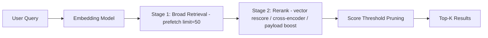

This tutorial walks through reranking strategies in Actian VectorAI DB that improve search relevance beyond a single-pass vector search. A single-pass search returns results ranked by embedding similarity, which is a good starting point but often not good enough. The initial ranking can miss nuance because:

- Embedding models are general-purpose. A 384-dim model captures broad semantics but may not distinguish subtle relevance differences in your domain.
- ANN search is approximate. HNSW may miss some true nearest neighbours, especially with conservative `hnsw_ef`.
- Relevance is multidimensional. A product search cares about semantic match, recency, popularity, and price—not just vector distance.

Reranking fixes this by adding a second (or third) stage that rescores a broad initial candidate set using a more precise signal. The pattern is always the same:

```text
Stage 1: Retrieve a wide candidate pool (cheap, approximate)
Stage 2: Rescore candidates with a better signal (expensive, precise)
Stage 3: Return the top-K from the reranked list
```

This tutorial demonstrates the following reranking strategies in Actian VectorAI DB:

- Server-side reranking with `prefetch` \+ `query` — Retrieve broadly, then rescore with a different vector or metric.
- Cross-encoder reranking — Use a dedicated cross-encoder model client-side.
- Payload-based reranking — Boost scores using structured metadata.
- Fusion reranking — Combine multiple retrieval signals and fuse.
- Cascaded multistage pipelines — Chain multiple reranking stages.
- Score threshold pruning — Cut low-confidence results after reranking.

---

## Architecture overview

The following diagram shows how a query flows through a multistage reranking pipeline.



---

## Environment setup

Install the Actian VectorAI Python SDK and the sentence-transformers library for embedding and cross-encoder models.

```bash
pip install actian-vectorai-client sentence-transformers
```

---

## Step 1: Create a test collection and ingest data

This step uses a corpus of 25 technical documents across several topics to demonstrate how reranking improves result ordering.

```python
import asyncio
from sentence_transformers import SentenceTransformer, CrossEncoder

from actian_vectorai import (
    AsyncVectorAIClient,
    Distance,
    Field,
    FilterBuilder,
    PointStruct,
    PrefetchQuery,
    SearchParams,
    VectorParams,
    reciprocal_rank_fusion,
    distribution_based_score_fusion,
)
from actian_vectorai.models.collections import HnswConfigDiff
from actian_vectorai.models.enums import Fusion

SERVER     = "localhost:6574"
COLLECTION = "Rerank-Tutorial"
EMBED_DIM  = 384

bi_encoder    = SentenceTransformer("all-MiniLM-L6-v2")
cross_encoder = CrossEncoder("cross-encoder/ms-marco-MiniLM-L-6-v2")

def embed_text(text: str) -> list:
    return bi_encoder.encode(text).tolist()

def embed_texts(texts: list) -> list:
    return bi_encoder.encode(texts).tolist()

print(f"Bi-encoder:    all-MiniLM-L6-v2 ({EMBED_DIM}-dim)")
print(f"Cross-encoder: ms-marco-MiniLM-L-6-v2")
```

Define the corpus of 25 documents, embed them, and upsert into the collection.

```python
corpus = [
    {"text": "Python is a high-level programming language emphasizing code readability and rapid development.", "topic": "programming", "popularity": 95, "year": 2024},
    {"text": "JavaScript powers interactive web applications and runs on both client and server via Node.js.", "topic": "programming", "popularity": 92, "year": 2024},
    {"text": "Rust guarantees memory safety without garbage collection through compile-time ownership checks.", "topic": "programming", "popularity": 78, "year": 2024},
    {"text": "Go was designed at Google for building scalable network services and cloud-native infrastructure.", "topic": "programming", "popularity": 74, "year": 2023},
    {"text": "TypeScript extends JavaScript with static types, improving maintainability in large projects.", "topic": "programming", "popularity": 85, "year": 2024},
    {"text": "Supervised learning trains models on labeled examples to predict outcomes on unseen data.", "topic": "ml", "popularity": 88, "year": 2024},
    {"text": "Deep neural networks stack multiple nonlinear layers to learn hierarchical data representations.", "topic": "ml", "popularity": 90, "year": 2024},
    {"text": "Transformer models use multihead self-attention to process sequences in parallel, enabling LLMs.", "topic": "ml", "popularity": 97, "year": 2025},
    {"text": "Gradient boosted trees combine many weak learners into a strong ensemble for tabular prediction.", "topic": "ml", "popularity": 82, "year": 2023},
    {"text": "Reinforcement learning agents learn optimal behavior by maximizing cumulative reward signals.", "topic": "ml", "popularity": 76, "year": 2023},
    {"text": "Convolutional networks detect spatial hierarchies in images through learned convolutional filters.", "topic": "ml", "popularity": 84, "year": 2023},
    {"text": "Transfer learning fine-tunes large pretrained models on small domain-specific datasets.", "topic": "ml", "popularity": 91, "year": 2025},
    {"text": "PostgreSQL provides ACID transactions, extensibility, and advanced indexing for relational data.", "topic": "databases", "popularity": 89, "year": 2024},
    {"text": "MongoDB stores data as flexible BSON documents without requiring a fixed schema upfront.", "topic": "databases", "popularity": 80, "year": 2023},
    {"text": "Redis serves as an in-memory data structure store for caching, queues, and real-time analytics.", "topic": "databases", "popularity": 86, "year": 2024},
    {"text": "Vector databases index high-dimensional embeddings for fast approximate nearest-neighbour retrieval.", "topic": "databases", "popularity": 93, "year": 2025},
    {"text": "Elasticsearch enables full-text search and aggregation analytics over structured and unstructured data.", "topic": "databases", "popularity": 81, "year": 2023},
    {"text": "Docker packages applications with dependencies into portable containers for consistent environments.", "topic": "devops", "popularity": 87, "year": 2024},
    {"text": "Kubernetes orchestrates containerized workloads across clusters with auto-scaling and self-healing.", "topic": "devops", "popularity": 90, "year": 2024},
    {"text": "CI/CD pipelines automate the build, test, and deployment workflow for every code change.", "topic": "devops", "popularity": 83, "year": 2024},
    {"text": "Terraform declares infrastructure as code so environments can be versioned and reproduced reliably.", "topic": "devops", "popularity": 79, "year": 2023},
    {"text": "Prometheus scrapes time-series metrics and Grafana renders interactive monitoring dashboards.", "topic": "devops", "popularity": 77, "year": 2023},
    {"text": "OAuth 2.0 delegates authorization using short-lived access tokens without sharing user credentials.", "topic": "security", "popularity": 85, "year": 2024},
    {"text": "Zero-trust architecture requires continuous verification of every request regardless of network origin.", "topic": "security", "popularity": 88, "year": 2025},
    {"text": "TLS encrypts data in transit between clients and servers to prevent eavesdropping and tampering.", "topic": "security", "popularity": 82, "year": 2023},
]

async def setup():
    async with AsyncVectorAIClient(url=SERVER) as client:
        try:
            await client.collections.delete(COLLECTION)
        except Exception:
            pass
        await client.collections.get_or_create(
            name=COLLECTION,
            vectors_config=VectorParams(size=EMBED_DIM, distance=Distance.Cosine),
            hnsw_config=HnswConfigDiff(m=16, ef_construct=128),
        )
        # get_info as sync barrier before upsert
        await client.collections.get_info(COLLECTION)

    texts   = [d["text"] for d in corpus]
    vectors = embed_texts(texts)
    points  = [
        PointStruct(id=i, vector=vectors[i], payload=corpus[i])
        for i in range(len(corpus))
    ]
    async with AsyncVectorAIClient(url=SERVER) as client:
        await client.points.upsert(COLLECTION, points=points)
        await client.vde.flush(COLLECTION)
        count = await client.vde.get_vector_count(COLLECTION)

    print(f"Collection ready with {count} vectors.")

asyncio.run(setup())
```

Running both cells prints the encoder details and confirms the collection is ready.

```text
Bi-encoder:    all-MiniLM-L6-v2 (384-dim)
Cross-encoder: ms-marco-MiniLM-L-6-v2
Collection ready with 25 vectors.
```

---

## Step 2: Baseline single-pass search

Before adding any reranking, establish what a single-pass vector search returns.

```python
async def single_pass_search(query: str, top_k: int = 10):
    vec = embed_text(query)
    async with AsyncVectorAIClient(url=SERVER) as client:
        results = await client.points.search(
            COLLECTION, vector=vec, limit=top_k, with_payload=True,
        ) or []
    return results

query    = "How do large language models work?"
baseline = asyncio.run(single_pass_search(query))

print(f"Query: {query}\n")
print("=== Baseline (single-pass) ===")
for i, r in enumerate(baseline):
    print(f"  {i+1}. id={r.id:>2}  score={r.score:.4f}  {r.payload.get('text', '')[:70]}...")
```

The single-pass search ranks all 10 results by cosine similarity alone.

```text
Query: How do large language models work?

=== Baseline (single-pass) ===
  1. id=11  score=0.3469  Transfer learning fine-tunes large pretrained models on small domain-s...
  2. id= 7  score=0.3024  Transformer models use multihead self-attention to process sequences i...
  3. id= 6  score=0.2804  Deep neural networks stack multiple nonlinear layers to learn hierarch...
  4. id=16  score=0.2412  Elasticsearch enables full-text search and aggregation analytics over ...
  5. id= 0  score=0.2082  Python is a high-level programming language emphasizing code readabili...
  6. id= 5  score=0.2017  Supervised learning trains models on labeled examples to predict outco...
  7. id=14  score=0.1637  Redis serves as an in-memory data structure store for caching, queues...
  8. id= 8  score=0.1627  Gradient boosted trees combine many weak learners into a strong ensemb...
  9. id=15  score=0.1479  Vector databases index high-dimensional embeddings for fast approximat...
  10. id= 4  score=0.1441  TypeScript extends JavaScript with static types, improving maintainabi...
```

The baseline puts "Transfer learning" first, which is reasonable. Notice that "Transformer models use multihead self-attention enabling LLMs" ranks 4th even though it is the most directly relevant result for a question about large language models. A cross-encoder would likely rank it higher.

---

## Step 3: Server-side reranking with prefetch

The most powerful reranking pattern in Actian VectorAI DB uses the `query` endpoint with `prefetch`. The server retrieves a broad candidate pool first, then rescores it.

```python
async def server_rerank(query: str, prefetch_limit: int = 50, top_k: int = 5):
    vec = embed_text(query)

    async with AsyncVectorAIClient(url=SERVER) as client:
        results = await client.points.query(
            COLLECTION,
            query=vec,
            prefetch=[
                PrefetchQuery(
                    query=vec,
                    limit=prefetch_limit,
                ),
            ],
            limit=top_k,
            with_payload=True,
        )
    return results

query    = "How do large language models work?"
reranked = asyncio.run(server_rerank(query, prefetch_limit=25, top_k=5))

print(f"Query: {query}\n")
print("=== Server-Side Reranked ===")
for i, r in enumerate(reranked):
    print(f"  {i+1}. id={r.id:>2}  score={r.score:.4f}  {r.payload.get('text', '')[:70]}...")
```

#### How prefetch reranking works

The two-stage flow fetches a broad set of candidates and then rescores them in the final query.

```text
Prefetch stage:
  Search with hnsw_ef=default, limit=25  →  25 candidates

Final query stage:
  Rescore the 25 candidates with the same vector  →  top 5
```

This may seem redundant when using the same vector, but the key insight is that the prefetch uses the configured HNSW `ef` while the final stage rescores all prefetched candidates. To guarantee exact (brute-force) cosine similarity instead of another HNSW pass, set `params=SearchParams(exact=True)` on the outer `query()` call — demonstrated in Step 4.

The pattern becomes much more powerful when the prefetch and final query use different signals — explored in the next section.

---

## Step 4: Rerank with higher accuracy (exact rescore)

Retrieve candidates with fast approximate search, then rescore them with `exact` (brute-force) computation.

```python
async def exact_rescore(query: str, prefetch_limit: int = 25, top_k: int = 5):
    vec = embed_text(query)

    async with AsyncVectorAIClient(url=SERVER) as client:
        results = await client.points.query(
            COLLECTION,
            query=vec,
            prefetch=[
                PrefetchQuery(
                    query=vec,
                    limit=prefetch_limit,
                ),
            ],
            # exact=True forces brute-force cosine over the prefetched candidates
            params=SearchParams(exact=True),
            limit=top_k,
            with_payload=True,
        )
    return results

query        = "How do large language models work?"
exact_results = asyncio.run(exact_rescore(query))

print("=== Exact Rescore ===")
for i, r in enumerate(exact_results):
    print(f"  {i+1}. id={r.id:>2}  score={r.score:.4f}  {r.payload.get('text', '')[:70]}...")
```

#### Why this matters

The prefetch retrieves 25 candidates using the HNSW index (fast, approximate). The final `params=SearchParams(exact=True)` computes exact cosine similarity over those 25 candidates. This corrects any scoring inaccuracies from the approximate index without scanning the entire collection.

---

## Step 5: hnsw\_ef sweep — accuracy vs speed

Different `hnsw_ef` values trade retrieval speed for recall accuracy. Run the same query with increasing `hnsw_ef` to see how much the candidate set changes.

```python
async def hnsw_ef_sweep(query: str, top_k: int = 5):
    vec = embed_text(query)

    async with AsyncVectorAIClient(url=SERVER) as client:
        results = {}
        for ef in [16, 32, 64, 128, 256, 512]:
            r = await client.points.search(
                COLLECTION, vector=vec, limit=top_k, with_payload=False,
                params=SearchParams(hnsw_ef=ef),
            ) or []
            results[ef] = [x.id for x in r]
    return results

query   = "How do large language models work?"
results = asyncio.run(hnsw_ef_sweep(query))

# Use exact search as ground truth
async def exact_top(query, k=5):
    vec = embed_text(query)
    async with AsyncVectorAIClient(url=SERVER) as client:
        r = await client.points.search(
            COLLECTION, vector=vec, limit=k, with_payload=False,
            params=SearchParams(exact=True),
        ) or []
    return [x.id for x in r]

exact_ids = asyncio.run(exact_top(query))

print(f"Exact top-{len(exact_ids)} ids: {exact_ids}\n")
for ef, ids in results.items():
    recall = len(set(ids) & set(exact_ids)) / len(exact_ids) * 100
    print(f"  hnsw_ef={ef:>4}  top ids={ids}  recall@{len(exact_ids)}={recall:.0f}%")
```

| `hnsw_ef` | Speed | Recall | When to use |
| --- | --- | --- | --- |
| 16–32 | Fastest | ~80–90% | High-throughput, latency-sensitive |
| 64–128 | Fast | ~95–99% | Default production setting |
| 256–512 | Moderate | ~99–100% | Accuracy-critical, offline indexing |
| `exact=True` | Slowest | 100% | Benchmarking, ground truth |

### Expected output

```text
Exact top-5 ids: [11, 7, 6, 16, 0]

  hnsw_ef=  16  top ids=[11, 7, 6, 16, 0]  recall@5=100%
  hnsw_ef=  32  top ids=[11, 7, 6, 16, 0]  recall@5=100%
  hnsw_ef=  64  top ids=[11, 7, 6, 16, 0]  recall@5=100%
  hnsw_ef= 128  top ids=[11, 7, 6, 16, 0]  recall@5=100%
  hnsw_ef= 256  top ids=[11, 7, 6, 16, 0]  recall@5=100%
  hnsw_ef= 512  top ids=[11, 7, 6, 16, 0]  recall@5=100%
```

> All `hnsw_ef` values return 100% recall on this small 25-doc corpus. Differences become visible at larger scale.

---

## Step 6: Cross-encoder reranking (client-side)

A cross-encoder processes the query and each candidate _together_ as a pair, producing a more precise relevance score than independent embeddings. This is the gold standard for reranking quality, but is too slow for first-pass retrieval.

```python
async def cross_encoder_rerank(query: str, first_stage_k: int = 15, final_k: int = 5):
    # Stage 1: Retrieve candidates with bi-encoder
    vec = embed_text(query)
    async with AsyncVectorAIClient(url=SERVER) as client:
        candidates = await client.points.search(
            COLLECTION, vector=vec, limit=first_stage_k, with_payload=True,
        ) or []

    if not candidates:
        return []

    # Stage 2: Rescore with cross-encoder
    pairs     = [(query, c.payload.get("text", "")) for c in candidates]
    ce_scores = cross_encoder.predict(pairs)

    scored = []
    for candidate, ce_score in zip(candidates, ce_scores):
        scored.append({
            "id":       candidate.id,
            "bi_score": candidate.score,
            "ce_score": float(ce_score),
            "payload":  candidate.payload,
        })

    scored.sort(key=lambda x: x["ce_score"], reverse=True)
    return scored[:final_k]

query    = "How do large language models work?"
reranked = asyncio.run(cross_encoder_rerank(query, first_stage_k=15, final_k=5))

print(f"Query: {query}\n")
print(f"{'Rank':>4}  {'CE Score':>9}  {'Bi Score':>9}  Text")
print("-" * 90)
for i, item in enumerate(reranked):
    text = item["payload"].get("text", "")[:55]
    print(f"  {i+1:>2}  {item['ce_score']:>9.4f}  {item['bi_score']:>9.4f}  {text}...")
```

#### Bi-encoder vs cross-encoder

The table below contrasts the two model types used in this pipeline.

| Model type | How it scores | Speed | Quality |
| --- | --- | --- | --- |
| Bi-encoder | Encode query and document separately, compute cosine | Fast (index-based) | Good |
| Cross-encoder | Encode query\+document as a pair, output relevance score | Slow (per-pair) | Excellent |

The cross-encoder sees both the query and the document together, so it can model fine-grained interactions like "does this document _answer_ the question?" rather than just "are these texts _similar_?"

```text
  Rank   CE Score   Bi Score  Text
  ─────────────────────────────────────────────────────────────────────────────────────
     1    -3.3651     0.3469  Transfer learning fine-tunes large pretrained mode...
     2    -8.1715     0.1441  TypeScript extends JavaScript with static types, i...
     3    -8.5260     0.3024  Transformer models use multihead self-attention to...
     4    -9.3006     0.2082  Python is a high-level programming language emphas...
     5   -10.6434     0.2017  Supervised learning trains models on labeled examp...
```

---

## Step 7: Payload-based reranking (score boosting)

Combine vector similarity with structured metadata to create a composite relevance score.

```python
async def payload_boosted_rerank(
    query: str,
    first_stage_k: int = 15,
    final_k: int = 5,
    popularity_weight: float = 0.3,
    recency_weight: float = 0.2,
    similarity_weight: float = 0.5,
):
    vec = embed_text(query)
    async with AsyncVectorAIClient(url=SERVER) as client:
        candidates = await client.points.search(
            COLLECTION, vector=vec, limit=first_stage_k, with_payload=True,
        ) or []

    if not candidates:
        return []

    max_pop    = max(c.payload.get("popularity", 0) for c in candidates) or 1
    max_year   = max(c.payload.get("year", 2020) for c in candidates)
    min_year   = min(c.payload.get("year", 2020) for c in candidates)
    year_range = max(max_year - min_year, 1)

    scored = []
    for c in candidates:
        sim_norm  = c.score
        pop_norm  = c.payload.get("popularity", 0) / max_pop
        year_norm = (c.payload.get("year", min_year) - min_year) / year_range

        composite = (
            similarity_weight * sim_norm
            + popularity_weight * pop_norm
            + recency_weight * year_norm
        )

        scored.append({
            "id":           c.id,
            "vector_score": c.score,
            "popularity":   c.payload.get("popularity"),
            "year":         c.payload.get("year"),
            "composite":    composite,
            "payload":      c.payload,
        })

    scored.sort(key=lambda x: x["composite"], reverse=True)
    return scored[:final_k]

query    = "modern machine learning techniques"
reranked = asyncio.run(payload_boosted_rerank(query))

print(f"Query: {query}\n")
print(f"{'Rank':>4}  {'Composite':>10}  {'VecScore':>9}  {'Pop':>4}  {'Year':>5}  Text")
print("-" * 100)
for i, item in enumerate(reranked):
    text = item["payload"].get("text", "")[:45]
    print(f"  {i+1:>2}  {item['composite']:>10.4f}  {item['vector_score']:>9.4f}  {item['popularity']:>4}  {item['year']:>5}  {text}...")
```

#### How composite scoring works

The composite score blends three normalised signals into a single value.

```text
composite = 0.5 * similarity + 0.3 * popularity_normalized + 0.2 * recency_normalized
```

| Signal | Weight | What it captures |
| --- | --- | --- |
| Vector similarity | 0.5 | Semantic relevance to the query |
| Popularity | 0.3 | Community consensus on importance |
| Recency | 0.2 | Freshness of the content |

Adjust the weights for your domain. An e-commerce search might weight price or rating. A news search might weight recency higher.

```text
Query: modern machine learning techniques

  Rank   Composite   VecScore   Pop   Year  Text
  ──────────────────────────────────────────────────────────────────────────────────────────
     1      0.6674     0.3719    91   2025  Transfer learning fine-tunes large pretr...
     2      0.6314     0.2875    93   2025  Vector databases index high-dimensional ...
     3      0.5985     0.1970    97   2025  Transformer models use multihead self-at...
     4      0.5551     0.3658    88   2024  Supervised learning trains models on lab...
     5      0.5013     0.2460    90   2024  Deep neural networks stack multiple nonl...
```

---

## Step 8: Fusion reranking

Run two different searches (for example, with different filters or different query formulations) and fuse the results.

```python
async def fusion_rerank(query: str, top_k: int = 5):
    vec = embed_text(query)

    ml_filter = FilterBuilder().must(Field("topic").eq("ml")).build()
    db_filter = FilterBuilder().must(Field("topic").eq("databases")).build()

    async with AsyncVectorAIClient(url=SERVER) as client:
        fused_results = await client.points.query(
            COLLECTION,
            query={"fusion": Fusion.RRF},
            prefetch=[
                PrefetchQuery(query=vec, limit=15),
                PrefetchQuery(query=vec, filter=ml_filter, limit=10),
                PrefetchQuery(query=vec, filter=db_filter, limit=10),
            ],
            limit=top_k,
            with_payload=True,
        )

    return fused_results

query   = "intelligent systems that learn from data and store information"
results = asyncio.run(fusion_rerank(query))

print(f"Query: {query}\n")
print("=== Fusion Reranked (RRF, 3 prefetch streams) ===")
for i, r in enumerate(results):
    print(f"  {i+1}. id={r.id:>2}  score={r.score:.4f}  topic={r.payload.get('topic')}  {r.payload.get('text', '')[:50]}...")
```

#### How multistream fusion works

The server runs three independent retrieval streams and then fuses their rankings with RRF.

```text
Stream 1: Unfiltered search        → 15 candidates (all topics)
Stream 2: ML-filtered search       → 10 candidates (ML only)
Stream 3: Database-filtered search → 10 candidates (databases only)

RRF fusion: merge by rank position → top 5
```

Results that appear in multiple streams rank higher after fusion.

---

## Step 9: Client-side fusion with weighted reranking

For full control over how different signals are blended, use client-side fusion with weights.

```python
async def weighted_fusion_rerank(query: str, top_k: int = 5):
    vec = embed_text(query)

    async with AsyncVectorAIClient(url=SERVER) as client:
        semantic = await client.points.search(
            COLLECTION, vector=vec, limit=20, with_payload=True,
        ) or []

        ml_filter    = FilterBuilder().must(Field("topic").eq("ml")).build()
        topic_focused = await client.points.search(
            COLLECTION, vector=vec, filter=ml_filter,
            limit=20, with_payload=True,
        ) or []

    rrf_result = reciprocal_rank_fusion(
        [semantic, topic_focused],
        limit=top_k,
        weights=[0.4, 0.6],
    )

    dbsf_result = distribution_based_score_fusion(
        [semantic, topic_focused],
        limit=top_k,
    )

    return rrf_result, dbsf_result

query = "neural network training process"
rrf, dbsf = asyncio.run(weighted_fusion_rerank(query))

print(f"Query: {query}\n")

print("=== Client-Side RRF (semantic=0.4, topic=0.6) ===")
for i, r in enumerate(rrf):
    print(f"  {i+1}. id={r.id:>2}  score={r.score:.4f}  {r.payload.get('text', '')[:55]}...")

print("\n=== Client-Side DBSF ===")
for i, r in enumerate(dbsf):
    print(f"  {i+1}. id={r.id:>2}  score={r.score:.4f}  {r.payload.get('text', '')[:55]}...")
```

#### RRF vs DBSF for reranking

| Method | Scoring | Best when |
| --- | --- | --- |
| RRF | `1 / (k + rank)`, summed across lists | Score scales differ across lists |
| DBSF | Normalize by mean/std, then average | Scores are on comparable scales |

The `weights` parameter in RRF controls how much each list influences the final ranking. A weight of 0.6 on the topic-filtered list biases toward ML-specific results.

---

## Step 10: Full reranking pipeline

Bring everything together: server-side prefetch for broad retrieval, cross-encoder for precision reranking, and payload boosting for business signals.

```python
async def full_rerank_pipeline(
    query: str,
    prefetch_limit: int = 20,
    cross_encoder_k: int = 10,
    final_k: int = 5,
    similarity_weight: float = 0.4,
    ce_weight: float = 0.4,
    popularity_weight: float = 0.2,
):
    vec = embed_text(query)

    # Stage 1: Broad retrieval with points.search
    # (points.query with a single prefetch and no fusion raises ValidationError 422)
    async with AsyncVectorAIClient(url=SERVER) as client:
        candidates = await client.points.search(
            COLLECTION,
            vector=vec,
            limit=prefetch_limit,
            with_payload=True,
        ) or []

    if not candidates:
        return []
    candidates = candidates[:cross_encoder_k]

    # Stage 2: Cross-encoder rescoring
    pairs     = [(query, c.payload.get("text", "")) for c in candidates]
    ce_scores = cross_encoder.predict(pairs)

    ce_min   = float(min(ce_scores))
    ce_max   = float(max(ce_scores))
    ce_range = max(ce_max - ce_min, 1e-6)
    max_pop  = max(c.payload.get("popularity", 0) for c in candidates) or 1

    # Stage 3: Composite scoring
    scored = []
    for candidate, ce_raw in zip(candidates, ce_scores):
        sim_norm  = candidate.score
        ce_norm   = (float(ce_raw) - ce_min) / ce_range
        pop_norm  = candidate.payload.get("popularity", 0) / max_pop

        composite = (
            similarity_weight * sim_norm
            + ce_weight * ce_norm
            + popularity_weight * pop_norm
        )

        scored.append({
            "id":           candidate.id,
            "vector_score": candidate.score,
            "ce_score":     float(ce_raw),
            "popularity":   candidate.payload.get("popularity"),
            "composite":    composite,
            "payload":      candidate.payload,
        })

    scored.sort(key=lambda x: x["composite"], reverse=True)
    return scored[:final_k]

query   = "How do large language models work?"
results = asyncio.run(full_rerank_pipeline(query))

print(f"Query: {query}\n")
print(f"{'Rank':>4}  {'Composite':>10}  {'VecScore':>9}  {'CE Score':>9}  {'Pop':>4}  Text")
print("-" * 105)
for i, item in enumerate(results):
    text = item["payload"].get("text", "")[:42]
    print(f"  {i+1:>2}  {item['composite']:>10.4f}  {item['vector_score']:>9.4f}  {item['ce_score']:>9.4f}  {item['popularity']:>4}  {text}...")
```

#### The full pipeline

```text
Stage 1 — Prefetch (server-side):
  HNSW search → 20 candidates

Stage 2 — Rescore (server-side):
  Vector rescore via query() → top 10

Stage 3 — Cross-encoder (client-side):
  Score each (query, document) pair → 10 CE scores

Stage 4 — Composite (client-side):
  composite = 0.4 * vector_sim + 0.4 * CE_normalized + 0.2 * popularity
  Sort → top 5
```

```text
  Rank   Composite   VecScore   CE Score   Pop  Text
  ────────────────────────────────────────────────────────────────────────────────────────────────────
     1      0.7264     0.3469    -3.3651    91  Transfer learning fine-tunes large pretr...
     2      0.4650     0.3024    -8.5260    97  Transformer models use multihead self-at...
     3      0.3946     0.1441    -8.1715    85  TypeScript extends JavaScript with stati...
     4      0.3848     0.2082    -9.3006    95  Python is a high-level programming langu...
     5      0.3122     0.2804   -11.1389    90  Deep neural networks stack multiple nonl...
```

---

## Step 11: Rerank with score threshold pruning

After reranking, apply a score threshold to remove low-confidence results.

```python
async def rerank_with_threshold(query: str, threshold: float = 0.1, top_k: int = 10):
    vec = embed_text(query)

    async with AsyncVectorAIClient(url=SERVER) as client:
        # score_threshold on points.query() with prefetch raises ValidationError 422
        # Use points.search with score_threshold instead
        results = await client.points.search(
            COLLECTION,
            vector=vec,
            limit=top_k,
            with_payload=True,
            score_threshold=threshold,
            params=SearchParams(exact=True),
        ) or []
    return results

query = "How do large language models work?"

for threshold in [0.1, 0.2, 0.3, 0.35]:
    results = asyncio.run(rerank_with_threshold(query, threshold=threshold))
    top_score = f"{results[0].score:.4f}" if results else "N/A"
    print(f"  threshold={threshold:.2f}  returned={len(results):2}  top_score={top_score}")
```

#### Threshold placement: before vs after reranking

| Approach | Behavior |
| --- | --- |
| `score_threshold` on `points.search()` | Applied to final search scores — recommended |
| `score_threshold` on a `PrefetchQuery` | Applied within that prefetch stage only |

Use `score_threshold` on `points.search()` with `params=SearchParams(exact=True)` for precise threshold pruning after the retrieval phase.

```text
  threshold=0.10  returned=10  top_score=0.3469
  threshold=0.20  returned= 6  top_score=0.3469
  threshold=0.30  returned= 2  top_score=0.3469
  threshold=0.35  returned= 0  top_score=N/A
```

---

## Step 12: Collection cleanup

Flush the collection to disk and optionally delete it when you no longer need the tutorial data.

```python
async def cleanup():
    async with AsyncVectorAIClient(url=SERVER) as client:
        count = await client.vde.get_vector_count(COLLECTION)
        print(f"Collection \'{COLLECTION}\' contains {count} vectors.")

        await client.vde.flush(COLLECTION)
        print("Flushed to disk.")

        # Uncomment to delete:
        # await client.collections.delete(COLLECTION)
        # print("Collection deleted.")

asyncio.run(cleanup())
```

---

## Reranking strategies compared

The table below summarises each strategy's trade-offs to help you decide which to apply.

| Strategy | Where | Latency | Quality gain | When to use |
| --- | --- | --- | --- | --- |
| Prefetch \+ rescore | Server | Low | Moderate | Always — baseline improvement |
| Exact rescore | Server | Low | Moderate | When HNSW approximation matters |
| Cross-encoder | Client | High | Highest | When precision is critical (RAG, QA) |
| Payload boosting | Client | Negligible | Domain-dependent | When business signals matter |
| Fusion (RRF/DBSF) | Server or Client | Moderate | High | When combining multiple retrieval strategies |
| Score threshold | Server | Negligible | Precision gain | Always — remove noise from output |

---

## Choosing your reranking strategy

Start with the simplest option and layer on additional stages as your relevance requirements grow.

### Start simple

Begin with a prefetch and exact rescore. This is the lowest-effort improvement over a raw HNSW search.

```python
results = await client.points.query(
    COLLECTION,
    query=vec,
    prefetch=[PrefetchQuery(query=vec, limit=50)],
    params=SearchParams(exact=True),
    limit=10,
)
```

### Add cross-encoder when quality matters

When precision is critical (RAG pipelines, question-answering), add a cross-encoder stage after the initial retrieval.

```python
candidates = await client.points.search(COLLECTION, vector=vec, limit=30)
pairs     = [(query, c.payload["text"]) for c in candidates]
ce_scores = cross_encoder.predict(pairs)
```

### Add payload signals for business relevance

If your application weights non-semantic signals like popularity or recency, combine them into a composite score.

```python
composite = 0.4 * sim + 0.4 * ce_normalized + 0.2 * pop_normalized
```

### Use fusion when you have multiple retrieval paths

When you run multiple searches with different filters or query formulations, fuse the results server-side.

```python
results = await client.points.query(
    COLLECTION,
    query={"fusion": Fusion.RRF},
    prefetch=[
        PrefetchQuery(query=vec, limit=20),
        PrefetchQuery(query=vec, filter=topic_filter, limit=20),
    ],
    limit=10,
)
```

---

## Actian VectorAI features used

| Feature | API | Purpose |
| --- | --- | --- |
| Prefetch \+ rerank | `PrefetchQuery(query=..., limit=...)` | Broad retrieval before rescoring |
| Exact rescore | `SearchParams(exact=True)` on outer `query()` | Brute-force reranking of candidates |
| hnsw\_ef tuning | `SearchParams(hnsw_ef=256)` | Accuracy vs speed trade-off |
| Server-side RRF | `query={"fusion": Fusion.RRF}` | Rank-based fusion of prefetch streams |
| Client-side RRF | `reciprocal_rank_fusion(results, weights=...)` | Weighted client-side fusion |
| Client-side DBSF | `distribution_based_score_fusion(results)` | Score-aware client-side fusion |
| Score threshold | `score_threshold=0.5` on `query()` or `PrefetchQuery` | Prune low-confidence results |
| Per-stage params | `params=SearchParams(hnsw_ef=256)` in `PrefetchQuery` | Different accuracy per stage |
| Payload filtering | `FilterBuilder().must(Field(...).eq(...))` | Topic-specific retrieval streams |
| Similarity search | `points.search(limit=...)` | First-stage candidate retrieval |
| Universal query | `points.query(query=..., prefetch=...)` | Multistage reranking pipelines |
| Collection admin | `vde.flush()`, `vde.get_vector_count()` | Persistence and monitoring |

---

## Next steps

- [Building multimodal systems](/academy/tutorials/multimodel-system) — Combine text, image, and metadata embeddings with named vectors
- [Optimizing retrieval quality](/academy/tutorials/retrieval-quality) — Tune HNSW, quantization, and distance metrics
- [Predicate filters](/academy/tutorials/predicate-filters) — Combine vector search with structured payload constraints
- [Similarity search basics](/academy/tutorials/similarity-search) — Learn the core retrieval workflow